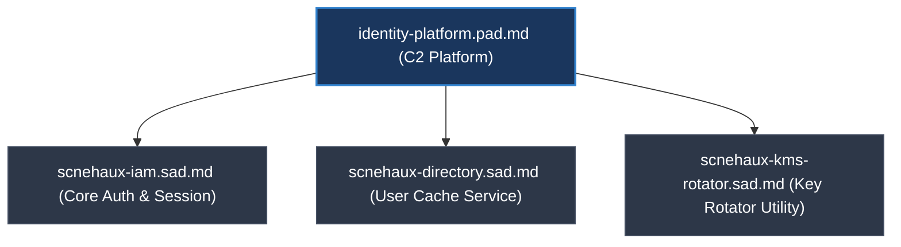
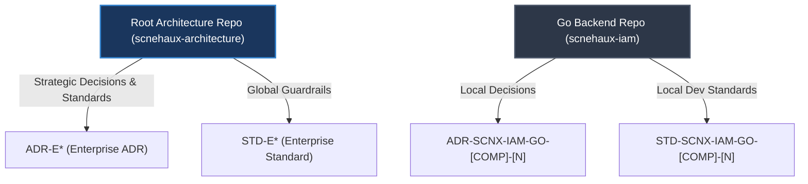

---
doc_meta:
  id: GDC-000
  title: Documentation Governance Policy
  owner: Principal Architect
  version: 1.0.0
  status: approved
  classification: public
  review_cycle_days: 180
  last_reviewed: 2026-05-22
---

# Documentation Governance Policy

## 1. Context & Scope

Scnehaux adopts a **Hybrid Federated & Automated Compliance** model for architecture description. Policies and standards are defined centrally, executed autonomously by domain teams, and validated automatically via CI/CD pipelines. 

This document defines the structural, taxonomic, and qualitative rules governing all architecture description artifacts in the Scnehaux ecosystem. Code-level comments, inline documentation, and temporary design boards are out of scope.

### 1.1 Governance Document Structure (GDC)
All meta-level governance documents (GDC, files starting with `GDC-`) must strictly adhere to the following 4-section structure:
- **Context & Scope**: Defines the boundaries, objectives, and scope of the governance policy.
- **Policy Framework**: Documents the core guidelines, philosophies, schemas, or models being established.
- **Enforcement Mechanism**: Specifies how compliance is checked (automated linter pipelines, pre-commit checks, or manual audits).
- **Severity & Exceptions**: Details risk levels, consequences of violations, and the procedure for seeking exception waivers.

---

## 2. Policy Framework

### 2.1 Governance Framework

### 2.1 The Hybrid Metamodel Philosophy
To balance strategic business alignment with engineering execution, Scnehaux rejects rigid compliance with any single architectural framework. We adopt a multi-model synthesis:
* **C4 Model**: Dictates folder navigation and system zoom levels (Meta = `00-governance/` & `05-adr/`, Context/C1 = `01-enterprise-architecture/`, Container/C2 = `03-pad/` & `04-sad/`).
* **TOGAF**: Structures strategic direction within the `01-enterprise-architecture` layer (Business, Data, Application, and Technology domains).
* **arc42 (Adapted)**: Supplies qualitative structural integrity concepts for file contents. We reject arc42's single monolithic template in favor of distributed, context-aware templates (EAD, PAD, SAD, TDD).
* **AWS Well-Architected Framework**: Enforces operational focus. Failure mode analysis, blast radius containment, and quantified Non-Functional Requirements (NFRs) are mandatory.

### 2.2 Abstraction Integrity & Document Authority Rules
To prevent architectural drift and maintain a single source of truth across the C4 metamodel, all artifacts must comply with two absolute containment principles:

1. **Document Authority Rule (Single Source of Truth)**:
   - If multiple documents cover overlapping architectural concepts, exactly one document must be designated as the authoritative source of truth.
   - All other documents may only link to or summarize the authoritative source. They are prohibited from redefining or keeping independent copies of that concept.

2. **Abstraction Leakage Rule**:
   - Documents must align with their C4-assigned boundary. Low-level execution details and strategic capability boundaries must not leak across layers:
     - **C2 Platform documents (PAD/SAD)** must not contain component-level implementation mechanics, database index names, or low-level function parameters.
     - **C3 Component documents (TDD)** must not override platform-wide integration contracts, trust boundaries, or global protocols established in C2 documents.
     - **TDD Traceability**: All TDDs must declare a direct relationship to their parent SAD using the `parent_sad` metadata and specify the section of the solution architecture they fulfill.

---

### 2.2 Structural Taxonomy & Naming Conventions

### 3.1 Logical vs. Physical Boundary Mapping
We separate logical business capabilities from physical deployment units to prevent organizational changes from corrupting the architecture description:

| Attribute | PAD (Platform Architecture Document) | SAD (Software Architecture Document) |
| :--- | :--- | :--- |
| **Focus** | **Logical Capability (Domain)** | **Physical Containment (Application)** |
| **Abstraction** | C2 - Platform Integration & Positioning | C2 - Solution Architecture & Container Topology |
| **Naming** | **Capability-Oriented** (`[domain]-platform.pad.md`) | **Deployable-Oriented** (`[repository-name].sad.md`) |
| **Nature** | Technology-agnostic & Business-centric | Operational, Runtime, & Infrastructure-centric |
| **Key Question** | *"What is the value of this platform and how does it integrate?"* | *"How is the application deployed, scaled, and secured?"* |

### 3.2 The 1-to-N Mapping Rule
A single Platform Capability (PAD) is fulfilled by multiple physical software systems (SADs):



* **Resilience to Refactoring**: Splitting a backend monolith (e.g., `scnehaux-iam` into separate microservices) requires zero changes to the PAD since the logical integration contracts, trust boundaries, and business capabilities remain identical.
* **Leakage Prevention**: Separating these layers prevents strategic capability documents from being polluted with operational details.

### 3.3 Frontend vs. Backend Separation in SADs
To prevent logical boundaries from being contaminated by client-side browser specifics or server-side data persistence mechanics, frontend and backend architectures must be documented using separate physical containers:
* **Shared Platform Capability (PAD)**: Acts as the authoritative, technology-agnostic integration contract for both frontend and backend. It specifies standard headers, JWT payload schemas, token rotators, and gateway-level handshake mechanisms.
* **Isolated Physical Containers (SADs)**: Because backend applications and frontend/client applications (such as web SPAs, mobile apps, or desktop clients) represent distinct physical deployable units, they must maintain separate SAD files (e.g., `[system-name].sad.md` for backend services and `[system-name]-[client-type].sad.md`, such as `-web`, `-mobile`, or `-desktop`, for frontend/client-facing units).

---

### 2.3 Federated Architecture Governance Model

To balance strategic consistency with engineering velocity, Scnehaux splits governance into two domains:



1. **Enterprise Level (Root Repo)**:
   - **Authority**: Macro-level architectural guardrails, split into Global (cross-cutting) and Domain-Bounded contexts (C1/C2 macro-level).
   - **Focus**: Strategic standards, platform contracts, and application container architectures.
   - **Agnosticity Rules**: Global Standards (`STD-GLB*`) and PADs must be technology-agnostic. Domain Standards (e.g., `STD-UIP*`) may specify domain-scoped technical constraints.
   - **Naming Conventions**:
     - **Global**: `ADR-GLB-[N]-[slug].md`, `STD-GLB-[N]-[slug].md`
     - **Domain**: `ADR-[DOMAIN]-[CAPABILITY]-[N]-[slug].md`, `STD-[DOMAIN]-[CAPABILITY]-[N]-[slug].md`
     - **Systems**: `[domain]-platform.pad.md`, `[system-name].sad.md`
   - **Directory Structure Variations (C4 Abstraction Law)**: The directory taxonomy changes depending on the C4 level and the nature of the document.
     - **EAD (01)**: Must remain flat or layered by TOGAF (Business, Data, Application, Tech). DDD subfolders are prohibited to preserve the holistic enterprise view.
     - **STD (02) & ADR (05)**: Must utilize **Domain-Driven Taxonomy** (`/[domain]/[capability]/`) to prevent granular rules and decisions from causing cognitive overload.
       - **Rule 1 (Max Depth)**: Directory nesting is strictly capped at Level 3 (`Root -> Domain -> Capability`). Creating further subdirectories inside a capability folder (Level 4+) is prohibited to prevent the "Russian Doll" anti-pattern and maintain flat discoverability.
       - **Rule 2 (Lexicographical Suffixing)**: To group related or multi-part documents without violating the Max Depth rule, use alphanumeric suffixing on the sequence ID (e.g., `STD-UIP-TKN-001A-core.md`, `STD-UIP-TKN-001B-semantic.md`). This keeps related files sequentially grouped in the file explorer.
     - **PAD (03) & SAD (04)**: Must utilize **Asset Container Folders** (`/[system-name]/`). The folder acts as an isolation boundary for the `.md` file and its supporting assets (diagrams, images), inherently grouping by logical domain or physical unit.

     **Example Enterprise Directory Structure:**
     ```text
     scnehaux-architecture/
     ├── 01-enterprise-architecture/      # (Flat / Holistic View)
     │   └── EAD-001-value-stream.md
     │
     ├── 02-standards/                    # (Domain-Driven Taxonomy)
     │   ├── _global/
     │   │   └── STD-GLB-001-api-design.md
     │   └── ui-platform/
     │       └── design-tokens/
     │           └── STD-UIP-TKN-001-tier1-core.md
     │
     ├── 03-pad/                          # (Asset Container Folders)
     │   └── scnehaux-ui-platform/
     │       ├── scnehaux-ui-platform.pad.md
     │       └── architecture-diagram.png
     │
     ├── 04-sad/                          # (Asset Container Folders)
     │   └── scnehaux-iam/
     │       ├── scnehaux-iam.sad.md
     │       └── deployment-topology.png
     │
     └── 05-adr/                          # (Domain-Driven Taxonomy)
         ├── _global/
         │   └── ADR-GLB-001-modular-monolith.md
         └── ui-platform/
             └── design-tokens/
                 └── ADR-UIP-TKN-001-domain-based-taxonomy.md
     ```

2. **Project/Local Level (Project Repo)**:
   - **Authority**: Local Contextualization and Code execution (C3/C4 micro-level).
   - **Focus**: Detailed execution decisions, runtime optimization, framework choices, and code-level packaging layout.
   - **Specificity Rules**: Local Standards (`STD-SCNX-*`) and TDDs must be technology-specific and framework-opinionated, mapping global standard requirements directly to concrete APIs.
   - **Naming Conventions**: `ADR-[REPO]-[COMPONENT]-[N]-[slug].md`, `STD-[REPO]-[COMPONENT]-[N]-[slug].md`, and `TDD-[REPO]-[COMPONENT]-[N]-[slug].md`.
   - **Directory Structure Variations (Module-Driven Taxonomy)**: Because a Project Repo inherently represents a single Domain or System, *Domain-Driven Taxonomy* is redundant. Local documentation must utilize **Module/Feature-Driven Taxonomy** to closely mirror the source code structure. Local linting execution files must reside parallel to the documentation folders.

     **Example Local Project Directory Structure:**
     ```text
     scnehaux-ui-platform/              # (Project Repository)
     ├── docs/                          
     │   ├── 01-standards/              # (Module-Driven Taxonomy)
     │   │   └── core-components/
     │   │       └── STD-UIP-CORE-001-button-api.md
     │   │
     │   ├── 02-designs/                # (Asset Container Folders for TDDs)
     │   │   └── auth-module/           
     │   │       ├── TDD-UIP-AUTH-001-jwt-rotation.md
     │   │       └── flow-diagram.png
     │   │
     │   ├── 03-decisions/              # (Module-Driven Taxonomy for Local ADRs)
     │   │   └── build-system/
     │   │       └── ADR-UIP-BLD-001-use-vite.md
     │   │
     │   ├── linting-rules.yaml         # (Local Linting Rules overlay)
     │   └── linter.py                  # (Local CI execution script)
     │
     └── src/                           # (Source Code matching the Taxonomy)
         ├── core-components/
         └── auth/
     ```

---

## 3. Enforcement Mechanism

### 3.1 Compliance & Enforcement

### 5.1 The Three-Gate CI Rule
To maintain high developer velocity, automated validation only triggers a **HARD BLOCK (Exit 1)** if a violation threatens:
1. **Security & Data Isolation** (e.g., bypassing PostgreSQL RLS or token signing boundaries).
2. **Structural Integrity** (e.g., CQRS Level 1 domain-isolation breach where application queries bypass application layers and load domain aggregates).
3. **Operational Stability** (e.g., missing database index or missing RLS context).

Stylistic, naming conventions, or formatting preferences are treated as **WARNINGS**; they flag in PR reviews but do not block the merge.

### 5.2 Documentation Density Law
*A document's thickness and maintenance cost must be inversely proportional to its speed of change and directly proportional to its blast radius.*

* **The Ephemeral TDD Lifecycle (TDD Fate Matrix)**:
  * **Class A (Strategic Transition)**: Designs governing core architectural shifts, major security FSMs, or schema migrations. Preserved permanently under `docs/06-designs/historical/` for forensic and audit value.
  * **Class B (Component & Feature Detail)**: Standard feature implementation layouts. Folded into the parent SAD and the physical TDD file is deleted once verified in production.
  * **Class C (Exploratory & Spike)**: Prototype or exploratory designs. Deleted immediately after the Pull Request merges.
* **The Living SAD boundary**: A SAD is a living container map (C4 Level 1/2). It must not turn into an implementation encyclopedia, API list, or code changelog. Trivial details belong in self-documenting code, Swagger-UI, or inline comments.

## 4. Severity & Exceptions

### 4.1 Document Exceptions & Waivers
- Files clearly marked as `status: draft` are exempt from scoring until submitted for approval.
- Deviations from these documentation parameters require ARB approval.
