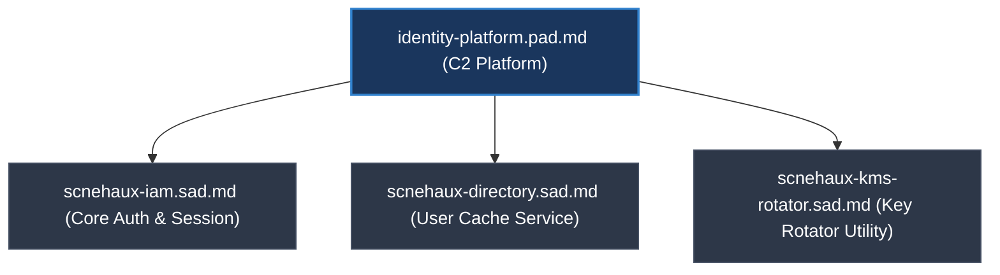
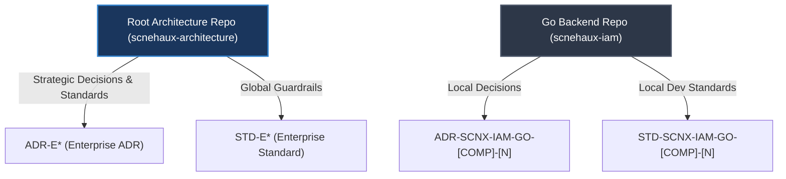

---
doc_meta:
  id: GDC-000
  title: Documentation Governance Policy
  owner: Principal Architect
  version: 1.0.0
  status: approved
  classification: public
  review_cycle_days: 180
  last_reviewed: 2026-05-22
---

# Documentation Governance Policy

## 1. Context & Scope

Scnehaux adopts a **Hybrid Federated & Automated Compliance** model for architecture description. Policies and standards are defined centrally, executed autonomously by domain teams, and validated automatically via CI/CD pipelines. 

This document defines the structural, taxonomic, and qualitative rules governing all architecture description artifacts in the Scnehaux ecosystem. Code-level comments, inline documentation, and temporary design boards are out of scope.


---

## 2. Policy Framework

### 2.1 Governance Document Structure (GDC)
All meta-level governance documents (GDC, files starting with `GDC-`) must strictly adhere to the following 4-section structure:
- **Context & Scope**: Defines the boundaries, objectives, and scope of the governance policy.
- **Policy Framework**: Documents the core guidelines, philosophies, schemas, or models being established.
- **Enforcement Mechanism**: Specifies how compliance is checked (automated linter pipelines, pre-commit checks, or manual audits).
- **Severity & Exceptions**: Details risk levels, consequences of violations, and the procedure for seeking exception waivers.

---

### 2.2 The Hybrid Metamodel Philosophy
To balance strategic business alignment with engineering execution, Scnehaux rejects rigid compliance with any single architectural framework. We adopt a multi-model synthesis:
* **C4 Model**: Dictates folder navigation and system zoom levels.
  
  | Level | C4 Name | Scnehaux Scope | Location |
  | :--- | :--- | :--- | :--- |
  | **Meta** | **Cross-Cutting** | **GDC**, **ADR**, **STD** (Governance & Rules) | Root Repo (`00`, `02`, `05`) |
  | **C1** | **Context** | **EAD** (Enterprise Strategy) | Root Repo (`01-enterprise`) |
  | **C2** | **Container** | **PAD** (Domain) & **SAD** (System) | Root Repo (`03-platform`, `04-application`) |
  | **C3** | **Component** | **TDD** (Detailed Design) | **Specific Project Repository** |
  | **C4** | **Code** | Implementation & Source | **Specific Project Repository** |
* **TOGAF**: Structures strategic direction within the `01-enterprise` layer (Business, Data, Application, and Technology domains).
* **arc42 (Adapted)**: Supplies qualitative structural integrity concepts for file contents. We reject arc42's single monolithic template in favor of distributed, context-aware templates (EAD, PAD, SAD, TDD).
* **AWS Well-Architected Framework**: Enforces operational focus. Failure mode analysis, blast radius containment, and quantified Non-Functional Requirements (NFRs) are mandatory.

### 2.3 Abstraction Integrity & Document Authority Rules
To prevent architectural drift and maintain a single source of truth across the C4 metamodel, all artifacts must comply with four absolute containment principles:

1. **Document Authority Rule (Single Source of Truth)**:
   - If multiple documents cover overlapping architectural concepts, exactly one document must be designated as the authoritative source of truth.
   - All other documents may only link to or summarize the authoritative source. They are prohibited from redefining or keeping independent copies of that concept.

2. **Abstraction Leakage Rule**:
   - Documents must align with their C4-assigned boundary. Low-level execution details and strategic capability boundaries must not leak across layers:
     - **C2 Platform documents (PAD/SAD)** must not contain component-level implementation mechanics, database index names, or low-level function parameters.
     - **C3 Component documents (TDD)** must not override platform-wide integration contracts, trust boundaries, or global protocols established in C2 documents.
     - **TDD Traceability**: All TDDs must declare a direct relationship to their parent SAD using the `parent_sad` metadata and specify the section of the solution architecture they fulfill.

3. **Design-Time vs. Consumption-Time Separation Rule**:
   - **Design-Time (Architecture Git)**: The `scnehaux-architecture` repository serves as the authoritative *Single Source of Truth* for the ARB and CI/CD linter. It defines the logical domain blueprints (PAD/SAD) and governance constraints before implementation.
   - **Consumption-Time (Web Developer Portal)**: Concrete integration manuals, API endpoints, JSON payloads, and SDKs must be published and consumed via Web Developer Portals (e.g., Swagger, ReDoc, Backstage) generated from code annotations, rather than polluting the Git architecture registry.

4. **The Cohesion Rule**:
   - Splitting PAD/SAD into separate micro-files (like `security.md` or `operations.md`) is prohibited to prevent architectural drift and maintenance waste. All aspects (including Security and Operations) are fully encapsulated within the single canonical document's mandated sections.

---

### 2.3.1 Traceability Model

Every technical decision must be traceable back to its root cause in the architecture:
- **EAD** defines strategic constraints.
- **STD** defines mandatory engineering policy.
- **PAD** defines logical domain capabilities and integration boundaries.
- **SAD** defines system-specific architecture.
- **ADR** documents decision rationale.

All layers must remain consistent. A break in this chain (e.g., SAD violating EAD without an ADR) is a governance violation.

---

### 2.4 Structural Taxonomy & Naming Conventions

#### 2.4.0 Document Types (Glossary of Truth)

The Scnehaux architecture ecosystem categorizes technical knowledge into specific, purpose-built document types to prevent overlap and ensure clear ownership. 

| Code | Full Name | Audience & Purpose |
| :--- | :--- | :--- |
| **PRD** | Product Requirements Document | Business "What" and "Why" (Non-technical). Not part of Scnehaux Architecture. |
| **GDC (Vision)** | Global Design Concept | **[DEPRECATED]** High-Level Vision (C1). Integrated into the **Application Capability** section of **PAD** and **Context** of **SAD** documents. |
| **GDC (Gov)** | Governance Document Contract | **ARB & Principal Engineers.** Automated policy definitions, quality gates, and compliance enforcement (`00-governance`). |
| **EAD** | Enterprise Architecture Document | **C-Level & Enterprise Architects.** Strategic "North Star" (C1), cross-domain rules, and enterprise capability models (`01-enterprise`). |
| **PAD** | Platform Architecture Document | **Tech Leads & Managers.** Domain Capability (C2). Defines application capabilities, integration contracts, and system positioning. |
| **SAD** | Software Architecture Document | **DevOps, SREs, SWEs.** System Solution (C2). Defines internal structure, deployment topology, observability, and resilience mechanics. |
| **ADR** | Architecture Decision Record | **Meta.** Rationale for significant technical pivots and trade-offs (`05-decisions`). |
| **STD** | Standard Document | **Meta.** Mandatory engineering policies and guardrails (`02-standards`). |
| **TRD** | Technical Requirements Document | **[NOT USED]** Scnehaux strictly rejects TRDs. Functional/Technical translations of the PRD must be integrated directly into the **PAD** and **SAD** to prevent documentation fragmentation and stale requirements. |
| **TDD (Design)** | Technical Design Document | **Implementers & QA.** Component blueprints (C3), API contracts, ERDs, Security, and Failure Handling. |
| **TDD (Testing)**| Test Driven Development | **Engineering Methodology**. The discipline used to implement the Test Strategy. |
| **ERD** | Entity Relationship Diagram | **Data Schema**. The structural foundation of the TDD (Design). |

### 2.4.0.1 The Tale of Two GDCs: Resolving the Acronym Overload
In the Scnehaux ecosystem, the acronym **GDC** historically served two different purposes. To avoid confusion, we explicitly separate them into two distinct concepts:

#### 1. GDC (General Design Concept) — *The Product Vision*
*   **Role**: Contains the overarching business vision and high-level design concept (C1 Product/System).
*   **The Scnehaux Way (Integrated)**: We no longer write standalone GDC Vision documents. To prevent "Vision Drift", the General Design Concept is now directly integrated into the **Application Capability** section of PADs, and the **Context** section of SADs.

#### 2. GDC (Governance Document Contract) — *The Quality Safeguard*
*   **Role**: Defines the absolute "Guardrails" for the entire ecosystem, ensuring all architectural artifacts meet the 10/10 FAANG-Grade maturity. These are the `GDC-XXX` files.
*   **Implementation**: Housed exclusively within the `00-governance` folder, providing the Automated Linters (`linter.py`), Review Score Sheets, and Audit Toolkits.
*   **Mandate**: No PAD or SAD is considered "Approved" without passing the GDC Governance audit.

> **[NOTE]**
> The integration of the *General Design Concept* applies to **EAD, PAD, and SAD** documents. It ensures that any developer reading the Enterprise Strategy (C1) or System Architecture (C2) immediately understands the High-Level Vision that drives it. 

### 2.4.0.2 The Redundancy of TRD (Technical Requirements Document)
At Scnehaux, we **do not use** a standalone TRD. We believe that technical requirements are inseparable from the architecture that addresses them.

*   **Reasoning**: Separate TRDs often lead to documentation fragmentation and "stale requirements" that do not reflect the actual architectural solution.
*   **The Integrated Approach**: All functional and technical translations of the PRD are integrated directly into the **PAD** and **SAD** (specifically within the **Application Capability** and **Solution Architecture** sections). Enterprise Architecture (EAD) is driven by C-Level strategy rather than product-level PRDs.
*   **Benefit**: This ensures that every technical requirement is mapped directly to an architectural decision or container structure, maintaining a single source of truth for the entire system lifecycle.

#### 2.4.1 Logical vs. Physical Boundary Mapping (PAD vs SAD)
We strictly separate logical business capabilities from physical deployment units to prevent organizational changes from corrupting the architecture description. 

In a high-maturity ecosystem, **PAD and SAD are not mutually exclusive; in fact, EVERY system in the Scnehaux ecosystem MUST have both.** We do not use PAD exclusively for "shared platforms".

1.  **PAD (Logical Application Capability & Domain Architecture)**: Defines the "Position & Connectivity". It explains **what** the application does from a business capability perspective, **why** it exists within the ecosystem, its logical domain boundaries, and its integration contracts with other systems. (It answers: *"What is the capability of this application, and Why is it needed?"*).
2.  **SAD (Physical System Architecture)**: Defines the "Internal Reality". It explains **how** the specific application is built, its internal components, deployment topology, and operational behavior. (It answers: *"How is this capability technically executed?"*).

| Attribute | PAD (Platform Architecture Document) | SAD (Software Architecture Document) |
| :--- | :--- | :--- |
| **Focus** | **Logical Capability (Domain)** | **Physical Containment (Application)** |
| **Abstraction** | C2 - Platform Integration & Positioning | C2 - Solution Architecture & Container Topology |
| **Naming** | **Capability-Oriented** (`[domain]-platform.pad.md`) | **Deployable-Oriented** (`[repository-name].sad.md`) |
| **Nature** | Technology-agnostic & Business-centric | Operational, Runtime, & Infrastructure-centric |
| **Key Question** | *"What is the value of this platform and how does it integrate?"* | *"How is the application deployed, scaled, and secured?"* |

#### 2.4.2 The 1-to-N Mapping Rule
A single Application Capability (PAD) is fulfilled by multiple physical software systems (SADs):



* **Resilience to Refactoring**: Splitting a backend monolith (e.g., `scnehaux-iam` into separate microservices) requires zero changes to the PAD since the logical integration contracts, trust boundaries, and business capabilities remain identical.
* **Leakage Prevention**: Separating these layers prevents strategic capability documents from being polluted with operational details.

#### 2.4.3 Frontend vs. Backend Separation in SADs
To prevent logical boundaries from being contaminated by client-side browser specifics or server-side data persistence mechanics, frontend and backend architectures must be documented using separate physical containers:
* **Application Capability (PAD)**: Acts as the authoritative, technology-agnostic integration contract for both frontend and backend. It specifies standard headers, JWT payload schemas, token rotators, and gateway-level handshake mechanisms.
* **Isolated Physical Containers (SADs)**: Because backend applications and frontend/client applications (such as web SPAs, mobile apps, or desktop clients) represent distinct physical deployable units, they must maintain separate SAD files (e.g., `[system-name].sad.md` for backend services and `[system-name]-[client-type].sad.md`, such as `-web`, `-mobile`, or `-desktop`, for frontend/client-facing units).

---

### 2.5 Federated Architecture Governance Model

To balance strategic consistency with engineering velocity, Scnehaux splits governance into two domains:



1. **Enterprise Level (Root Repo)**:
   - **Authority**: Macro-level architectural guardrails, split into Global (cross-cutting) and Domain-Bounded contexts (C1/C2 macro-level).
   - **Focus**: Strategic standards, platform contracts, and application container architectures.
   - **Agnosticity Rules**:
     - **EAD (Enterprise Architecture)**: Must remain conceptually agnostic (e.g., Business, Data, Application layers), except for the Technology Architecture domain (EAD-004) which must explicitly define the enterprise technology portfolio.
     - **STD (Standards)**: Global Standards (`STD-GLB*`) should be technology-agnostic until an `ADR-GLB` of type `foundational` exists. Once a platform becomes an approved enterprise baseline, technology-specific standards within the global scope are expected and encouraged. Domain Standards (e.g., `STD-UIP*`) naturally specify domain-scoped technical constraints.
     - **PAD (Platform Architecture)**: May specify technologies but must focus purely on integration boundaries and external contracts rather than internal implementation details.
     - **SAD (Software Architecture)**: Must explicitly detail the actual technologies, frameworks, and deployment topologies used for the specific software container.
     - **ADR (Architecture Decision Records)**: Inherently technology-specific. ADRs are the binding legal documents that select and authorize specific technologies, platforms, or patterns for use within their respective scopes (Global or Domain).
   - **Naming Conventions**:
     - **Global**: `ADR-GLB-[N]-[slug].md`, `STD-GLB-[N]-[slug].md`
     - **Domain**: `ADR-[DOMAIN]-[CAPABILITY]-[N]-[slug].md`, `STD-[DOMAIN]-[CAPABILITY]-[N]-[slug].md`
     - **Systems**: `[domain]-platform.pad.md`, `[system-name].sad.md`
   - **Directory Structure Variations (C4 Abstraction Law)**: The directory taxonomy changes depending on the C4 level and the nature of the document.
     - **EAD (01)**: Must remain flat or layered by TOGAF (Business, Data, Application, Tech). DDD subfolders are prohibited to preserve the holistic enterprise view.
     - **STD (02) & ADR (05)**: Must utilize **Domain-Driven Taxonomy** (`/[domain]/[capability]/`) to prevent granular rules and decisions from causing cognitive overload.
       - **Rule 1 (Max Depth)**: Directory nesting is strictly capped at Level 3 (`Root -> Domain -> Capability`). Creating further subdirectories inside a capability folder (Level 4+) is prohibited to prevent the "Russian Doll" anti-pattern and maintain flat discoverability. *Exception/Clarification*: Underscore-prefixed directories (e.g., `_global`) are treated as scoping containers and do not consume a domain-depth level. For example, `_global/frontend/` is evaluated as Level 2 (`frontend` is the capability), so files inside it are Level 3.
       - **Rule 2 (Lexicographical Suffixing)**: To group related or multi-part documents without violating the Max Depth rule, use alphanumeric suffixing on the sequence ID (e.g., `STD-UIP-TKN-001A-core.md`, `STD-UIP-TKN-001B-semantic.md`). This keeps related files sequentially grouped in the file explorer.
     - **PAD (03) & SAD (04)**: Must utilize **Asset Container Folders** (`/[system-name]/`). The folder acts as an isolation boundary for the `.md` file and its supporting assets (diagrams, images), inherently grouping by logical domain or physical unit.

     **Example Enterprise Directory Structure:**
     ```text
     scnehaux-architecture/
     ├── 01-enterprise/                   # (Flat / Holistic View)
     │   └── EAD-001-value-stream.md
     │
     ├── 02-standards/                    # (Domain-Driven Taxonomy)
     │   ├── _global/
     │   │   └── STD-GLB-001-api-design.md
     │   └── ui-platform/
     │       └── design-tokens/
     │           └── STD-UIP-TKN-001-tier1-core.md
     │
     ├── 03-platform/                     # (Asset Container Folders)
     │   └── scnehaux-ui-platform/
     │       ├── scnehaux-ui-platform.pad.md
     │       └── architecture-diagram.png
     │
     ├── 04-application/                  # (Asset Container Folders)
     │   └── scnehaux-iam/
     │       ├── scnehaux-iam.sad.md
     │       └── deployment-topology.png
     │
     └── 05-decisions/                          # (Domain-Driven Taxonomy)
         ├── _global/
         │   └── ADR-GLB-001-modular-monolith.md
         └── ui-platform/
             └── design-tokens/
                 └── ADR-UIP-TKN-001-domain-based-taxonomy.md
     ```

2. **Project/Local Level (Project Repo)**:
   - **Authority**: Local Contextualization and Code execution (C3/C4 micro-level).
   - **Focus**: Detailed execution decisions, runtime optimization, framework choices, and code-level packaging layout.
   - **Specificity Rules**: Local Standards (`STD-SCNX-*`) and TDDs must be technology-specific and framework-opinionated, mapping global standard requirements directly to concrete APIs.
   - **Naming Conventions**: `ADR-[REPO]-[COMPONENT]-[N]-[slug].md`, `STD-[REPO]-[COMPONENT]-[N]-[slug].md`, and `TDD-[REPO]-[COMPONENT]-[N]-[slug].md`.
   - **Directory Structure Variations (Module-Driven Taxonomy)**: Because a Project Repo inherently represents a single Domain or System, *Domain-Driven Taxonomy* is redundant. Local documentation must utilize **Module/Feature-Driven Taxonomy** to closely mirror the source code structure. Local linting execution files must reside parallel to the documentation folders.

     **Example Local Project Directory Structure:**
     ```text
     scnehaux-ui-platform/              # (Project Repository)
     ├── docs/                          
     │   ├── 01-standards/              # (Module-Driven Taxonomy)
     │   │   └── core-components/
     │   │       └── STD-UIP-CORE-001-button-api.md
     │   │
     │   ├── 02-designs/                # (Asset Container Folders for TDDs)
     │   │   └── auth-module/           
     │   │       ├── TDD-UIP-AUTH-001-jwt-rotation.md
     │   │       └── flow-diagram.png
     │   │
     │   ├── 03-decisions/              # (Module-Driven Taxonomy for Local ADRs)
     │   │   └── build-system/
     │   │       └── ADR-UIP-BLD-001-use-vite.md
     │   │
     │   ├── linting-rules.yaml         # (Local Linting Rules overlay)
     │   └── linter.py                  # (Local CI execution script)
     │
     └── src/                           # (Source Code matching the Taxonomy)
         ├── core-components/
         └── auth/
     ```

### 2.6 Document Mutability & Lifecycle Policy
To prevent documentation rot while preserving decision traceability, all documents must adhere to this Mutability Matrix:

| Doc Type | C4 Level | Mutability | Mutability Rule |
| :--- | :--- | :--- | :--- |
| **ADR** | Meta | **Immutable** | Represents a point-in-time decision. Once accepted, it must never be modified (except for status updates). Changes require a new replacing ADR. |
| **STD** | Meta | **Mutable (Living)** | Represents current active rules. Modified directly and versioned via SemVer when rules evolve. Major changes require an authorizing ADR. |
| **EAD** | C1 (Context) | **Mutable (Living)** | Represents the active enterprise architecture blueprint. Updated directly when strategic TOGAF domains or capabilities evolve. |
| **PAD** | C2 (Platform) | **Mutable (Living)** | Represents active domain capability boundaries and trust contracts. Updated directly when capabilities are added or when the `fulfilled_by` SAD list changes. |
| **SAD** | C2 (System) | **Mutable (Living)** | Represents active physical system topologies. Updated directly when microservices, containers, or deployment infrastructures are modified. |
| **TDD** | C3 (Component) | **Hybrid** | Component designs. Class A (strategic transition) is immutable and archived. Class B (feature details) is mutable until merged/verified, then folded into the SAD and deleted. |

---

## 3. Enforcement Mechanism

### 3.1 The Absolute Mandates
The architecture ecosystem operates under three absolute mandates. No system may:
1. Enter production without an approved SAD.
2. Deviate from standards without an ADR.
3. Introduce breaking architectural changes without a formal peer review and ARB approval.

### 3.2 Versioning & Change Management
The architecture baseline is strictly version-controlled. Architectural evolution must be **explicit, traceable, reviewed, and documented**. 

Major architectural shifts must:
- Update EAD (if it impacts enterprise strategy).
- Include a corresponding ADR.
- Be explicitly reviewed and approved by the ARB.

### 3.3 Non-Functional Discipline
All systems must define measurable targets for:
- Availability
- Performance
- Scalability
- Security
- Observability
- Resilience

Vague or non-measurable requirements (e.g., "fast" or "highly scalable") are considered governance violations and are not acceptable.


### 3.4 The Three-Gate CI Rule
To maintain high developer velocity, automated validation only triggers a **HARD BLOCK (Exit 1)** if a violation threatens:
1. **Security & Data Isolation** (e.g., bypassing PostgreSQL RLS or token signing boundaries).
2. **Structural Integrity** (e.g., CQRS Level 1 domain-isolation breach where application queries bypass application layers and load domain aggregates).
3. **Operational Stability** (e.g., missing database index or missing RLS context).

Stylistic, naming conventions, or formatting preferences are treated as **WARNINGS**; they flag in PR reviews but do not block the merge.

### 3.5 Documentation Density Law
*A document's thickness and maintenance cost must be inversely proportional to its speed of change and directly proportional to its blast radius.*

* **The Ephemeral TDD Lifecycle (TDD Fate Matrix)**:
  * **Class A (Strategic Transition)**: Designs governing core architectural shifts, major security FSMs, or schema migrations. Preserved permanently under `docs/06-designs/historical/` for forensic and audit value.
  * **Class B (Component & Feature Detail)**: Standard feature implementation layouts. Folded into the parent SAD and the physical TDD file is deleted once verified in production.
  * **Class C (Exploratory & Spike)**: Prototype or exploratory designs. Deleted immediately after the Pull Request merges.
* **The Living SAD boundary**: A SAD is a living container map (C4 Level 1/2). It must not turn into an implementation encyclopedia, API list, or code changelog. Trivial details belong in self-documenting code, Swagger-UI, or inline comments.

## 4. Severity & Exceptions

### 4.1 Document Exceptions & Waivers
- Files clearly marked as `status: draft` are exempt from scoring until submitted for approval.
- Deviations from these documentation parameters require ARB approval.
