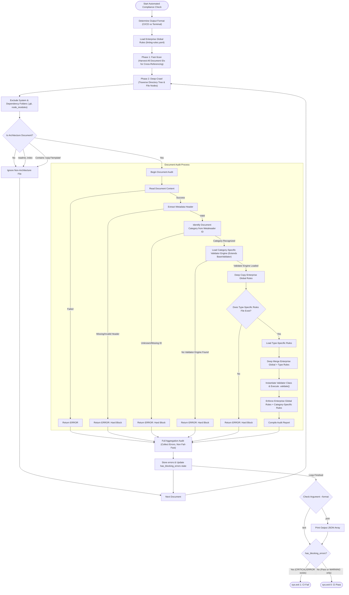

---
doc_meta:
  id: GDC-001
  title: Documentation Linter Framework
  owner: Architecture Review Board (ARB)
  version: 1.0.0
  status: approved
  classification: public
  governed_by: [GDC-000]
  review_cycle_days: 365
  last_reviewed: 2026-06-11
---

<!-- lint-disable vague_claim -->
# Scnehaux Documentation Linter Framework

## 1. Context & Scope

This document defines the **Documentation Linter Execution Framework** managed by the CI/CD pipeline (`linter.py`). 
Rather than being a simple list of global rules, this framework establishes how the linter orchestrates validation, merges distributed rulesets, and executes domain-specific schemas across the enterprise documentation tree.

The linter acts as the automated governance gatekeeper. Before any architecture document is merged into the `main` branch, the linter validates the following vectors:

1. **Metadata & Taxonomy**: Ensures the YAML frontmatter (`doc_meta`) contains all required fields, uses valid Semantic Versioning, and strictly matches the Allowed Statuses and Classifications for that specific document type.
2. **Structural Compliance**: Verifies that the Markdown body contains the exact required `##` and `###` headers dictated by the domain ruleset (e.g., ensuring a SAD has a `Runtime Flows` section).
3. **Traceability & Orphan Detection**: Enforces frontmatter dependency links (e.g., a SAD must reference a valid `parent_pad` ID) **and** validates inline ID citations in prose (e.g. `(**ADR-018**)`) against the document registry, so a renamed or deleted ID cannot rot silently inside body text.
4. **Content Constraints**: Scans the document body for prohibited vague vocabulary (e.g., "highly scalable", "very fast") and enforces mandatory quantifiable metrics with real units.
5. **Temporal Expiration (Waivers)**: Checks if time-bound exceptions (such as temporary ADR waivers) have expired against the current system clock, immediately failing the pipeline to prevent technical debt accumulation.
6. **Global Invariants (Repo-Level)**: Beyond per-file checks, the engine enforces repository-wide invariants — **globally unique document IDs** (no duplicate `doc_meta.id`) and an **acyclic traceability graph** (upward `parent_pad` / `parent_sad` / `governed_by` references must form a DAG; intentional self-references such as `GDC-000` are exempt).

> [!IMPORTANT]
> **The Docs-as-Code Philosophy**: At Scnehaux, if an architectural rule is not enforceable by the linter, it is merely a suggestion. We do not rely on humans memorizing guidelines. Therefore, **every update to architecture guidelines MUST be codified in the corresponding `linting-rules-[type].yaml`**. You cannot simply type a new rule into a Markdown document.

## 2. Policy Framework

The linter utilizes a decentralized, composable configuration model based on the Open-Closed Principle. The core engine dynamically deep-merges global baseline rules with document-specific rulesets.

### 2.1 The Ruleset Architecture (YAML Federation)

The linter evaluates YAML configuration files mapped by Document Category.

**Naming Convention Rule**: To achieve dynamic Deep-Merging, the linter automatically identifies the necessary document-specific ruleset by extracting the document type from the file's ID (e.g. `ADR-001` -> `adr`). It then resolves the specific YAML file by mapping it to the naming convention: `linting-rules-[doc_type].yaml`, where `[doc_type]` is the exact acronym in lowercase. If a specific ruleset is required but missing, the linter SHOULD trigger a Hard Block.

| Document Type | Ruleset File | Scope / Responsibilities |
| :--- | :--- | :--- |
| **Global Baseline** | `linting-rules.yaml` | The universal parent. Enforces generic syntax, minimum word counts, banned vocabulary, and overarching layout structures. |
| **Domain-Specific Rulesets** | `linting-rules-[doc_type].yaml` | To adhere to the Open-Closed Principle, domain-specific YAML rules are documented exclusively within their respective guidelines:<br>• [GDC](./GDC-000-governance-policy.md)<br>• [EAD](./GDC-007-ead-guideline.md)<br>• [STD](./GDC-008-std-guideline.md)<br>• [PAD](./GDC-009-pad-guideline.md)<br>• [SAD](./GDC-010-sad-guideline.md)<br>• [ADR](./GDC-011-adr-guideline.md)<br>• [TDD](./GDC-012-tdd-guideline.md) |

#### 2.1.1 Global Baseline Rules (`linting-rules.yaml`)

The global baseline applies universally to all architecture documents across the repository to ensure foundational quality.

> [!WARNING]
> **DO NOT EDIT THIS TABLE MANUALLY.**
> This table is automatically generated from `linting-rules.yaml` (the Single Source of Truth).
> If you need to update a rule, modify the YAML file and run:
> `python scripts/generate_rules_doc.py`

<!-- AUTO-GENERATED-RULES:START -->
| Rule Category | Parameter | Enforcement / Value |
| :--- | :--- | :--- |
| **Structure** | Min Content Length Chars | `50` |
| **Content** | Prohibited Words | <ul><li>`maybe`</li><li>`probably`</li><li>`should consider`</li><li>`TBD`</li><li>`coming soon`</li><li>`and so on`</li><li>`seamless`</li><li>`seamlessly`</li><li>`obviously`</li><li>`blazingly`</li><li>`trivially`</li></ul> |
| **Content** | Ambiguity Check | **Pattern**: `\b(highly\|very\|extremely\|super\|incredibly)\s+(scalable\|fast\|secure\|reliable\|available\|performant\|robust\|efficient)\b`<br>**Message**: `Vague claim detected. Must be quantified with metrics.` |
| **Quantification** | Required For Sections | <ul><li>`Non-Functional Requirements`</li><li>`Observability Requirements`</li></ul> |
| **Quantification** | Metric Pattern | `\d+(\.\d+)?\s*(ns\|us\|ms\|s\|m\|h\|d\|%\|req/s\|rps\|qps\|rpm\|kb\|mb\|gb\|tb\|pb\|seconds?\|milliseconds?\|minutes?\|hours?\|days?\|nines)(?!\w)` |
| **Governance** | Max Review Age Days | `365` |
| **Governance** | Max Draft Age Days | `30` |
| **Governance** | Require Adr Links | `True` |
| **Governance** | Naming Conventions | **Global Adr Pattern**: `^ADR-GLB-(?:[A-Z]{2,4}-)?\d{3}-[a-z0-9-]+\.md$`<br>**Domain Adr Pattern**: `^ADR-[A-Z]{2,4}(?:-[A-Z]{2,4})?-\d{3}-[a-z0-9-]+\.md$`<br>**Global Std Pattern**: `^STD-GLB-(?:[A-Z]{2,4}-)?\d{3}-[a-z0-9-]+\.md$`<br>**Domain Std Pattern**: `^STD-[A-Z]{2,4}(?:-[A-Z]{2,4})?-\d{3}[A-Za-z]?-[a-z0-9-]+\.md$`<br>**Pad Pattern**: `^[a-z0-9-]+\.pad\.md$`<br>**Sad Pattern**: `^[a-z0-9-]+\.sad\.md$`<br>**Gdc Pattern**: `^GDC-\d{3}-[a-z0-9-]+\.md$`<br>**Ead Pattern**: `^EAD-\d{3}-[a-z0-9-]+\.md$` |

### Severity Levels

| Error Code | Severity (CI Action) |
| :--- | :--- |
| `security_isolation_violation` | **CRITICAL** |
| `structural_integrity_violation` | **CRITICAL** |
| `technology_hold_violation` | **CRITICAL** |
| `operational_stability_violation` | **ERROR** |
| `missing_metadata` | **ERROR** |
| `missing_section` | **ERROR** |
| `missing_section_keyword` | **ERROR** |
| `exception_expired` | **ERROR** |
| `missing_exception_reason` | **ERROR** |
| `traceability_violation` | **ERROR** |
| `draft_expired` | **ERROR** |
| `duplicate_id` | **ERROR** |
| `unrecognized_section` | **WARNING** |
| `cross_reference_missing` | **WARNING** |
| `inline_reference_missing` | **WARNING** |
| `recommended_keyword_missing` | **WARNING** |
| `prohibited_word` | **WARNING** |
| `vague_claim` | **WARNING** |
| `old_review` | **WARNING** |
| `stylistic_deviation` | **WARNING** |
| `naming_style_deviation` | **WARNING** |
| `onboarding_complexity_untracked` | **WARNING** |
<!-- AUTO-GENERATED-RULES:END -->

### 2.2 Validator Federation (Polymorphic Engine)

The Validator Engine operates by consuming the deeply-merged configuration (Global Rules + Domain-Specific Rules) generated during the YAML Federation phase (2.1). While the YAML rulesets provide static declarative constraints, certain document types require dynamic, runtime validation based on their internal state or relationships. To adhere to the Open-Closed Principle (OCP), the `linter.py` core engine delegates both the execution of these YAML rules and the injection of complex domain logic to specialized Python Validator classes residing in the `validators/` directory.

**Naming Convention Rule**: The `validators/factory.py` automatically maps the document to its validator by matching the Document ID prefix (e.g., `ADR-001` -> `ADR`). It then attempts to load the validator class using the strict naming convention: `[DocType]Validator` (e.g., `ADRValidator`), which must reside in the python file `validators/[doc_type].py` (lowercase, e.g., `validators/adr.py`). If the registry fails to find a validator for an expected document type, the linter SHOULD trigger a Hard Block.

**Execution Isolation (`validate_type_specific`)**: To guarantee clean Separation of Concerns (SoC), global rules (e.g., checking mandatory sections, banned vocabulary) are handled entirely by the parent `BaseValidator`. The specialized child classes (like `ADRValidator` or `SADValidator`) are strictly prohibited from implementing global logic. They MUST isolate their custom domain-logic entirely within the overridden `validate_type_specific()` function. This function serves as the exclusive sandbox for executing document-specific rules.

The architecture of the engine is divided into two primary domains:
1. **The Validator Federation** (Sections 2.2.1 - 2.2.6): Dedicated Python classes extending the `BaseValidator` to enforce domain-specific logic.
2. **Core Framework Dependencies** (Section 2.2.7): Utility modules that provide foundational support (parsing, type-safety, and registry scanning) to the federation.

#### 2.2.1 `BaseValidator` (`validators/base.py`)
The abstract parent class. Executes the merged YAML schema, handles global errors, and dictates severity.

| Function / Property Signature | Responsibilities & Logic |
| :--- | :--- |
| **Instance Variables** | `file_path`, `content`, `doc_meta`, `rules`, `all_doc_ids`, `errors`, `rel_path`, `filename`, `disabled_rules` |
| `@property`<br>`mandatory_sections(self)` | Retrieves `rules.structure.required_sections` from the YAML rules. |
| `@property`<br>`optional_sections(self)` | Retrieves `rules.structure.optional_sections` from the YAML rules. |
| `@property`<br>`required_metadata_fields(self)` | Retrieves `rules.metadata.required_fields` from the YAML rules. |
| `__init__(self, file_path: str, content: str, doc_meta: dict, rules: dict, all_doc_ids: set)` | Instantiates the context variables. Parses `<!-- lint_disable: rule_name, rule_name -->` HTML comments in `content` to populate the `disabled_rules` set. |
| `add_error(self, category: str, message: str)` | Evaluates if `category` exists in `disabled_rules`. If not, maps the category to a severity using `severity_levels` in the YAML (defaults to `'ERROR'`), and appends `(severity, message)` to `self.errors`. |
| `validate(self) -> list[tuple[str, str]]` | Orchestrates the execution: triggers `run_common_validations(self)` from `common.py`, invokes `self.validate_type_specific()`, and returns `self.errors`. |
| `validate_type_specific(self)` | Abstract interface intended to be overridden by child classes for domain isolation (`pass` by default). |

#### 2.2.2 Domain-Specific Validators

To adhere to the Open-Closed Principle, domain-specific Python logic (the `validate_type_specific` implementation) is documented exclusively within their respective guidelines:
- [GDC](./GDC-006-gdc-guideline.md) (`validators/gdc.py`)
- [EAD](./GDC-007-ead-guideline.md) (`validators/ead.py`)
- [STD](./GDC-008-std-guideline.md) (`validators/std.py`)
- [PAD](./GDC-009-pad-guideline.md) (`validators/pad.py`)
- [SAD](./GDC-010-sad-guideline.md) (`validators/sad.py`)
- [ADR](./GDC-011-adr-guideline.md) (`validators/adr.py`)
- [TDD](./GDC-012-tdd-guideline.md) (`validators/tdd.py`)

#### 2.2.3 Core Framework Dependencies

The `validators/` directory contains critical utility modules that power the core Linter Engine, providing Type-Safety, AST parsing, and cross-reference resolutions.

| Component | File | Responsibilities & Logic |
| :--- | :--- | :--- |
| **Scanner** | `validators/scanner.py` | **Fast-Scan Phase**: Recursively walks the repository to build a global registry of all valid document IDs (by extracting `doc_meta.id`). This registry is injected into the validators to guarantee cross-reference integrity (e.g., ensuring `fulfilled_by` or `parent_pad` points to existing documents). It additionally detects **duplicate IDs** (SSOT uniqueness violations) rather than silently overwriting them. |
| **Schema** | `validators/schema.py` | **Type-Safety Enforcement**: Utilizes `Pydantic` to strictly cast and validate the `doc_meta` YAML block. Features include enforcing strict Semantic Versioning (`X.Y.Z`) on the `version` field and guaranteeing schema constraints for nested objects like `ExceptionInfo`. |
| **Utilities** | `validators/utils.py` | **AST Processing**: Uses `markdown_it` to tokenize the markdown into an Abstract Syntax Tree (AST). Provides modular functions to accurately extract section content (`extract_section_contents`), strip styling for character counts (`clean_content_for_length`), harvest `href` links (`extract_links`), strip code fences/inline code for safe directive parsing (`strip_code_fences`), harvest inline ID citations (`extract_doc_id_references`), and normalize YAML `datetime` values (`parse_date`). |
| **Traceability** | `validators/traceability.py` | **Graph Audit**: Builds the upward-reference graph (`parent_pad` / `parent_sad` / `governed_by`) across the full registry once per run and detects circular dependencies, enforcing that the C4 traceability chain remains a DAG. |

### 2.3 Inline Policy Exemptions (`lint_disable`)

A `lint_disable` directive suppresses a specific **non-blocking** finding on a document, and should carry a reason:

```html
<!-- lint_disable: vague_claim, prohibited_word (reason: ARB waiver per ADR-GLB-009) -->
```

The directive is **governed** — it is not an unconditional override:

1. **CRITICAL findings cannot be silenced.** A directive targeting a `CRITICAL`-severity category (e.g. `structural_integrity_violation`, `security_isolation_violation`, `technology_hold_violation`) is *rejected*: the finding still fires, and the attempt is recorded in the CI audit under **Rejected Disables**.
2. **Code is not a directive.** Directives inside fenced code blocks or inline code spans are ignored, so documentation *examples* of `lint_disable` are never parsed as live suppressions.
3. **Reasons are captured.** A directive lacking a `(reason: …)` clause is reported as `UNDOCUMENTED` in the audit summary for reviewer scrutiny.

All honored and rejected disables are collected and printed in the final CI audit summary.

### 2.4 Engine v1.1 — Hardened & Repo-Level Checks

| Capability | Module | Behavior |
| :--- | :--- | :--- |
| **Inline Reference Integrity** | `validators/common.py` | Validates architecture IDs cited in prose (e.g. `(**ADR-018**)`) against the registry. Reported as `inline_reference_missing` (WARNING — a citation may legitimately target an external or downstream document). |
| **Duplicate ID Detection** | `validators/scanner.py` | Two documents declaring the same `doc_meta.id` raise `duplicate_id` (ERROR, blocking). Such collisions were previously overwritten silently. |
| **Traceability Graph Audit** | `validators/traceability.py` | Detects circular `parent_pad` / `parent_sad` / `governed_by` dependencies (`traceability_violation`, blocking). Intentional self-references are exempt. |
| **SARIF Output** | `linter.py --format sarif` | Emits SARIF 2.1.0 so violations surface as inline annotations on GitHub PRs via code-scanning upload (in addition to `text` and `json`). |

> [!IMPORTANT]
> **SSOT is machine-enforced.** The reconciliation between the YAML rulesets and their generated Markdown tables is verified in CI by `python scripts/generate_rules_doc.py --check`, which fails the build on any drift. Synchronization is guaranteed by the pipeline, not by convention.

## 3. Linter Execution Flow (CI/CD Automated Gate)

The execution of the automated compliance gate is orchestrated by `linter.py`. The diagram below illustrates the complete execution flow, detailing how contextual rules are dynamically merged and evaluated:



## 4. Compliance & Enforcement

1. **Commit Hook Checks**: Pre-commit hooks must scan new architecture documents (e.g., ADRs) to verify that the YAML frontmatter contains valid fields and matches the schema defined in their respective guidelines.
2. **Conditional Schema Validation**: The CI linter dynamically shifts its validation rules based on domain-specific attributes delegated to the respective guideline validators.
3. **Domain-Specific Lifecycle Enforcement**: The CI pipeline executes lifecycle and temporal logic as explicitly defined in downstream domain guidelines (e.g., executing exception mechanisms as delegated by GDC-011).
4. **Distributed Enforcement (Remote Execution)**: Downstream project repositories (containing C3/C4 artifacts) MUST NOT maintain their own copies of `linter.py`. To ensure strict, untamperable governance, local CI/CD pipelines must validate documents by remotely executing the central linter.

### 4.1 Downstream Integration (Remote Execution)

To prevent security vulnerabilities and local tampering, downstream repositories (e.g., `scnehaux-ui-platform`) must remotely invoke this Compliance Engine during their CI/CD runs. 

**Option A: Reusable GitHub Workflow (Recommended)**
Reference the central linter directly in your local `.github/workflows/lint.yml`:
```yaml
jobs:
  architecture-lint:
    uses: scnehaux/scnehaux-architecture/.github/workflows/linter.yml@main
```

**Option B: Centralized Docker Image**
Execute the immutable, centrally-published linter image against your local directory:
```bash
docker run --rm -v $(pwd):/docs ghcr.io/scnehaux/gdc-linter:latest
```

---

## 5. Appendix: Architectural Trade-Offs

In accordance with the Quality Rubric (Trade-Offs parameter), the ARB explicitly documents the technical compromises of this Compliance Engine:

1. **Custom Python Linter vs. Spectral / Checkov**
   - *Why rejected*: Spectral is excellent for OpenAPI, and Checkov is standard for IaC, but neither natively supports complex Markdown AST parsing intertwined with dynamic YAML deep-merging based on custom ID prefixes.
   - *The Trade-Off*: We incur the ongoing maintenance burden of owning a custom Python CLI (`linter.py`). In exchange, we gain absolute control over the Open-Closed Principle (OCP) dynamic validator loading, enabling complex cross-document hyperlink resolution and federated governance.
