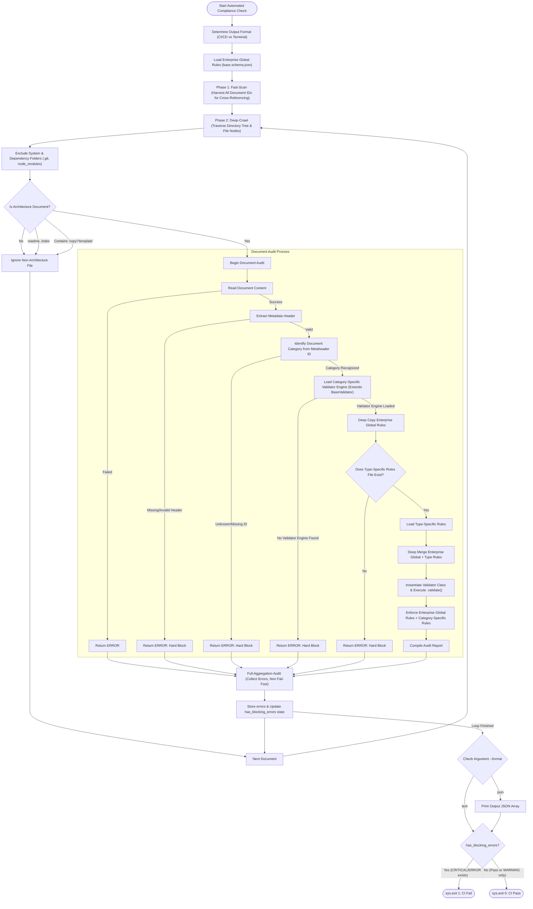
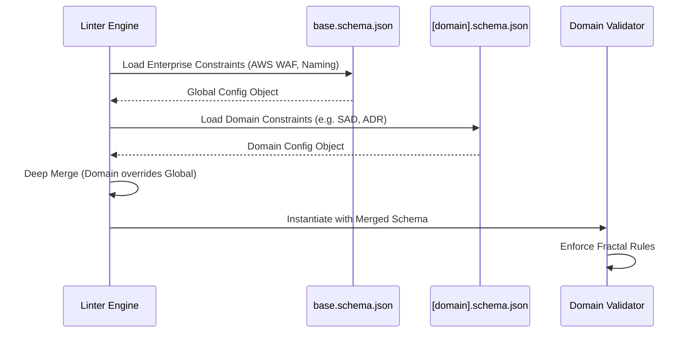
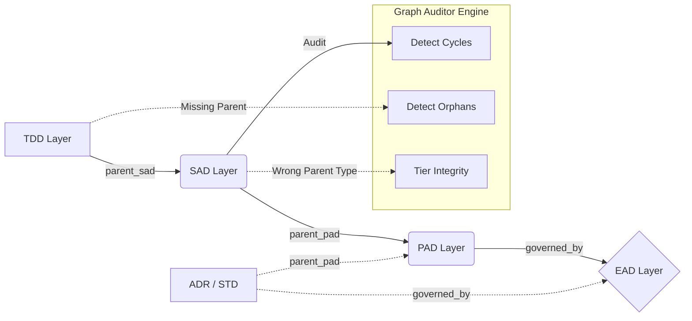
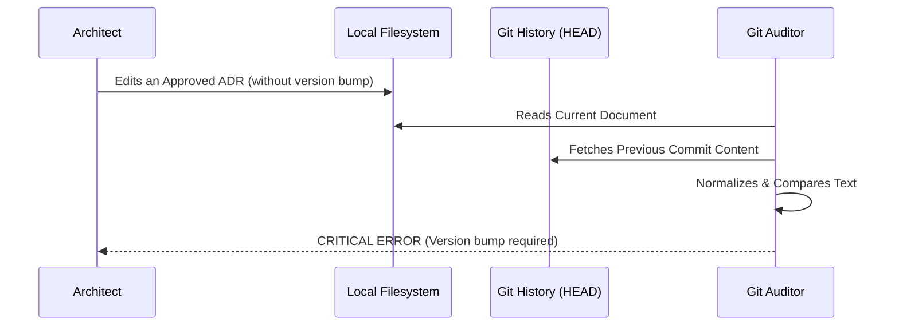

---
doc_meta:
  id: GDC-001
  title: Architecture Fitness Functions & Compliance Engine
  owner: Architecture Authority
  version: 1.0.0
  status: approved
  classification: public
  governed_by: [GDC-000]
  review_cycle_days: 365
  created_date: 2026-01-01
  last_reviewed: 2026-07-06
---

# Architecture Fitness Functions & Compliance Engine

## 1. Context & Scope

### 1.1 The Core Mandate: The Master Fitness Function

The **Master Fitness Function** is the central automated compliance engine designed to operationalize all five ecosystem goals established in the [Scnehaux Architectural Constitution](./GDC-000-governance-policy.md#11-the-ecosystem-goals).

Rather than relying on manual, bottleneck-prone reviews, we enforce these goals through the philosophy of **Separation of Concerns (SoC) Artifact Domains**. We mandate that every architectural perimeter must be fully automatable. To achieve this, we centralize critical boundaries, taxonomies, and lineages into the document's YAML Frontmatter (`doc_meta`) and structural Abstract Syntax Tree (AST).

By transforming human-readable principles into mathematically verifiable constraints, the Master Fitness Function ensures that the architectural standards are enforced deterministically at the CI/CD boundary. It acts as a continuous, automated guardrail that preserves engineering quality without sacrificing speed.

### 1.2 The Automation Scope & Domain Boundaries

To fulfill the Constitution (GDC-000), we divide the automation scope of the Master Fitness Function into five definitive architectural perimeters (The 5 Pillars). This list serves as the **strict foundational boundary** for any developer contributing to the `engine` codebase. Any new validation rule MUST fall into one of these conceptual domains:

1. **Topology & Identity Domain (Graph & Lineage)**
   Focuses on the identity of the artifact and how it connects to the ecosystem (C4 DAG). This ensures the architecture graph remains unbroken and non-overlapping.
   - **Ontology & Identity**: Enforces unique architectural IDs, preventing duplicates and floating nodes. _[Non-Leakage Policy](./GDC-000-governance-policy.md#21-the-boundary-constraints-non-leakage-policy)_
   - **Traceability & Lineage**: Automates detection of circular references, missing parent attachments, and broken lineages. _[Contractual Lineage](./GDC-000-governance-policy.md#23-contractual-lineage-the-c4-dag)_

2. **Structural Compliance Domain (Shape & Completeness)**
   Focuses on the physical shape and required completeness of the artifact, regardless of its subjective text content.
   - **Schema & Metadata Integrity**: Ensures the artifact is well-formed against its JSON/YAML schema and has complete frontmatter.
   - **Document Structure**: Enforces the existence of mandatory sections and their correct order.

3. **Semantic & Quality Domain (Meaning & Language)**
   Focuses on the editorial quality and semantic clarity of the architectural content.
   - **NFR Taxonomy Enforcement**: Enforces that non-functional requirements map strictly to AWS Well-Architected Framework pillars. _[NFR Taxonomy](./GDC-000-governance-policy.md#24-non-functional-requirements-nfr-taxonomy)_
   - **Clarity & Objectivity**: Eradicates subjective terminology (e.g., "unquantified fast") and enforces clear, unambiguous claims. _[The Quality Framework](./GDC-000-governance-policy.md#27-the-quality-framework)_

4. **Lifecycle & Environment Domain (Time, Space, & State)**
   Focuses on the artifact's status in time, its physical location, and its CI/CD lifecycle state.
   - **Temporal Governance**: Uses the system clock against dates to expire exception waivers and enforce review cycles. _[Waivers](./GDC-000-governance-policy.md#210-architecture-exceptions-waivers)_
   - **Spatial Governance**: Enforces correct file naming and repository placement.
   - **Immutability Lock**: Requires explicit semantic version bumps for any modifications. _[Artifact Lifecycle & Versioning](./GDC-000-governance-policy.md#25-artifact-lifecycle--versioning)_

5. **Architecture Constraints Domain (Hard Technical Limits)**
   Focuses on enforcing absolute enterprise technical decisions and security boundaries.
   - **Technology Boundaries**: Enforces enterprise-wide constraints against deprecated or unsafe tools.
   - **Security Boundaries**: Detects explicit violations of network and data isolation rules.

### 1.3 The Fractal Implementation Strategy

The `engine` does not hardcode domains into a monolithic linter. It implements the [**Fractal Triad**](./GDC-000-governance-policy.md#22-the-fractal-boundary-physical-vs-logical-decentralization) concept defined in the Constitution.

At runtime, the Master Fitness Function bootstraps a foundational global root policy (`schemas/base.schema.json` and `engine/validators/global_rules.py`). It then dynamically deep-merges the root policy with the specific triad requested by the artifact's `governed_by` metadata.

For example, if validating an SAD, it dynamically merges the global root with the SAD Triad:

1. **Guideline**: [`GDC-009-sad-guideline.md`](GDC-009-sad-guideline.md)
2. **Schema**: `schemas/sad.schema.json`
3. **Validator**: `engine/validators/domains/sad_validator.py`

> [!IMPORTANT]
>
> **The Docs-as-Code Philosophy**: At Scnehaux, if an architectural rule is not enforceable by the linter, it is merely a suggestion. We do not rely on humans memorizing guidelines. Therefore, **every update to architecture guidelines MUST be codified in the corresponding domain schema (`.schema.json`) or validator script**. You cannot simply type a new rule into a Markdown document.

## 2. Policy Framework

The engine utilizes a decentralized, composable architecture based on the Open-Closed Principle. To contribute effectively, developers must first understand the physical layout of the engine.

### 2.1 The Fitness Function Ecosystem Topography (Physical Structure)

The Master Fitness Function resides entirely within the `06-fitness-function/` directory. The codebase is strictly modularized according to the Separation of Concerns (SoC) domains defined in [Section 1.2: The Automation Scope & Domain Boundaries](#12-the-automation-scope--domain-boundaries):

> [!WARNING]
>
> **DO NOT EDIT THIS TREE MANUALLY.** This directory tree is automatically generated from the live physical structure of the `engine/` directory. If the codebase structure changes, regenerate this block by running: `python 06-fitness-function/generators/generate_engine_topography.py`

<!-- BEGIN_ENGINE_TOPOGRAPHY -->
```text
scnehaux-architecture/
└── 06-fitness-function/
│       ├── engine/              # (Core automated execution logic)
│       │   ├── INDEX.md
│       │   ├── auditors/         # (External environment validators)
│       │   │   ├── dependency_scanner.py
│       │   │   ├── git_auditor.py
│       │   │   ├── graph_auditor.py
│       │   │   └── waiver_auditor.py
│       │   ├── cli.py            # (The Master Fitness Function Entrypoint)
│       │   ├── config/           # (Engine configuration & environment variables)
│       │   │   ├── constants.py
│       │   │   ├── loader.py
│       │   │   └── severity.py
│       │   ├── fs/               # (File system utilities & workspace traversal)
│       │   │   └── crawler.py
│       │   ├── parsing/          # (Data extraction from raw files)
│       │   │   └── markdown_ast.py
│       │   ├── reporting/        # (CLI output formatting & CI/CD error logs)
│       │   │   └── reporter.py
│       │   └── validators/       # (The core policy sandbox)
│       │       ├── base.py
│       │       ├── domains/      # (Federated domain-specific triad scripts)
│       │       │   ├── adr_validator.py
│       │       │   ├── ead_validator.py
│       │       │   ├── gdc_validator.py
│       │       │   ├── pad_validator.py
│       │       │   ├── sad_validator.py
│       │       │   ├── std_validator.py
│       │       │   └── tdd_validator.py
│       │       ├── global_rules.py # (Foundational Python rules for all documents)
│       │       ├── metadata_rules.py
│       │       ├── registry.py
│       │       ├── schema_extensions.py
│       │       └── structure_rules.py
│       ├── generators/          # (Dynamic docs and topography autobuilders)
│       │   ├── INDEX.md
│       │   ├── generate_adr_index.py
│       │   ├── generate_engine_topography.py
│       │   ├── generate_functions_doc.py
│       │   ├── generate_maturity_dashboard.py
│       │   ├── generate_pad_sad_index.py
│       │   ├── generate_rules_doc.py
│       │   └── generate_traceability_graph.py
│       ├── scnehaux_linter.egg-info/
│       │   ├── PKG-INFO
│       │   ├── SOURCES.txt
│       │   ├── dependency_links.txt
│       │   ├── entry_points.txt
│       │   ├── requires.txt
│       │   └── top_level.txt
│       ├── scratch/
│       ├── scripts/             # (Git hooks and manual CI/CD utilities)
│       │   ├── INDEX.md
│       │   ├── codeowners-validator.py
│       │   ├── install-hooks.py
│       │   └── waiver-expiry-check.py
│       └── tests/               # (High-coverage pytest suite)
│           ├── INDEX.md
│           ├── conftest.py
│           └── engine/          # (Core automated execution logic)
│               ├── auditors/    # (External environment validators)
│               │   ├── test_dependency_scanner.py
│               │   ├── test_git_auditor.py
│               │   ├── test_graph_auditor.py
│               │   └── test_waiver_auditor.py
│               ├── config/      # (Engine configuration & environment variables)
│               │   └── test_loader.py
│               ├── fs/          # (File system utilities & workspace traversal)
│               │   └── test_crawler.py
│               ├── parsing/     # (Data extraction from raw files)
│               │   └── test_markdown_ast.py
│               ├── reporting/   # (CLI output formatting & CI/CD error logs)
│               ├── test_cli.py
│               ├── test_cli_extra.py
│               └── validators/  # (The core policy sandbox)
│                   ├── domains/ # (Federated domain-specific triad scripts)
│                   │   ├── test_adr_validator.py
│                   │   ├── test_all_domains.py
│                   │   ├── test_ead_validator.py
│                   │   ├── test_gdc_validator.py
│                   │   ├── test_pad_validator.py
│                   │   ├── test_sad_validator.py
│                   │   ├── test_std_validator.py
│                   │   └── test_tdd_validator.py
│                   ├── test_base.py
│                   ├── test_global_rules.py
│                   ├── test_metadata_rules.py
│                   ├── test_registry.py
│                   ├── test_schema_extensions.py
│                   └── test_structure_rules.py
```
<!-- END_ENGINE_TOPOGRAPHY -->

### 2.2 The Ecosystem Capabilities (Functions & Scripts)

The table below maps the core engine auditor functions directly to the architecture enforcement policies.

The detailed Python function capabilities have been decentralized into their respective components to improve readability:

- [Engine Capabilities](../06-fitness-function/engine/INDEX.md)
- [Generators Capabilities](../06-fitness-function/generators/INDEX.md)
- [Scripts Capabilities](../06-fitness-function/scripts/INDEX.md)
- [Tests Capabilities](../06-fitness-function/tests/INDEX.md)

### 2.3 The Schema Architecture (JSON Federation)

The engine evaluates JSON Schema configuration files mapped by Document Type.

> [!NOTE]
>
> All JSON Schema files intentionally reside within the `00-governance/schemas/` directory to keep them tightly coupled with the architecture documentation. This colocation makes it straightforward for contributors to edit rules side-by-side with their governing policies.

**Naming Convention Rule**: To achieve dynamic Deep-Merging of the [**Fractal Triad**](./GDC-000-governance-policy.md#222-logical-decentralization-the-fractal-triad), the engine automatically identifies the necessary document-specific schema by extracting the Document Type prefix from the artifact's `doc_meta.id` (e.g., `ADR-IAM-001` -> `ADR`). It then resolves the specific JSON schema file by mapping it to the strict naming convention: `schemas/[doc_type].schema.json` (where `[doc_type]` is the exact acronym in lowercase, e.g., `schemas/adr.schema.json`). If a specific schema is required but missing, the engine MUST trigger a Hard Block.

| Document Type | Ruleset File | Scope / Responsibilities |
| :-- | :-- | :-- |
| **Global Baseline** | `schemas/base.schema.json` | The universal parent. Enforces generic syntax, minimum word counts, banned vocabulary, and overarching layout structures. |
| **Domain-Specific Rulesets** | `schemas/[doc_type].schema.json` | To adhere to the Open-Closed Principle, domain-specific JSON schemas are documented exclusively within their respective guidelines:<br>• [GDC](GDC-005-gdc-guideline.md)<br>• [EAD](GDC-006-ead-guideline.md)<br>• [STD](GDC-007-std-guideline.md)<br>• [PAD](GDC-008-pad-guideline.md)<br>• [SAD](GDC-009-sad-guideline.md)<br>• [ADR](GDC-010-adr-guideline.md)<br>• [TDD](GDC-011-tdd-guideline.md) |

#### 2.3.1 Global Baseline Rules (`schemas/base.schema.json`)

The global baseline applies universally to all architecture documents across the repository to ensure foundational quality.

> [!WARNING]
>
> **DO NOT EDIT THIS TABLE MANUALLY.** This table is automatically generated from the JSON Schema (`schemas/base.schema.json`). If you need to update a rule, modify the schema file and run: `python 06-fitness-function/generators/generate_rules_doc.py`

<!-- lint_disable_start: prohibited_word (reason: governance engine documentation) -->
<!-- AUTO-GENERATED-RULES:START -->

| Rule Category      | Parameter                | Enforcement / Value                                                                                                                                                                                                                                                                                                                                                                                                                                                                                                           |
| :----------------- | :----------------------- | :---------------------------------------------------------------------------------------------------------------------------------------------------------------------------------------------------------------------------------------------------------------------------------------------------------------------------------------------------------------------------------------------------------------------------------------------------------------------------------------------------------------------------- |
| **Structure Rules** | Artifact Directories | **Gdc**: `00-governance`<br>**Ead**: `01-enterprise`<br>**Std**: `02-standards`<br>**Pad**: `03-domain`<br>**Sad**: `04-system`<br>**Adr**: `05-decisions`<br>**Tdd**: `docs/designs` |
| **Structure Rules** | Ignored Files | **Exact Matches**: <ul><li>`readme.md`</li><li>`index.md`</li><li>`contributing.md`</li><li>`changelog.md`</li><li>`maturity.md`</li><li>`traceability.md`</li><li>`temp.md`</li><li>`scnehaux_enterprise_architecture_refinement.md`</li></ul><br>**Patterns**: <ul><li>`\.copy\.md$`</li><li>`\.template\.md$`</li><li>`-template\.md$`</li><li>`[\\/]templates[\\/]`</li></ul> |
| **Structure Rules** | Max Directory Depth | `3` |
| **Content Rules** | Exempt Statuses | <ul><li>`{'status': 'draft', 'depend_on': 'created_date', 'max_age_days': 30, 'error_message': "Document with status '{doc_status}' has an age of {age_days} days (since {depend_on}), exceeding limit of {limit} days. Must be reviewed, finalized, or deleted."}`</li><li>`{'status': 'deprecated', 'depend_on': 'last_updated', 'max_age_days': 180, 'error_message': "Document with status '{doc_status}' has an age of {age_days} days (since {depend_on}), exceeding limit of {limit} days. Must be fully retired and deleted."}`</li></ul> |
| **Content Rules** | Max Review Age Days | **Value**: `365`<br>**Error Message**: `Document review age of {age_days} days exceeds limit of {limit} days.` |
| **Content Rules** | Min Content Length Chars | **Value**: `50`<br>**Error Message**: `Section '{section_name}' content length ({length} chars) is below minimum of {min_length} chars.` |
| **Content Rules** | Prohibited Words | **Patterns**: <ul><li>`\bmaybe\b`</li><li>`\bprobably\b`</li><li>`\bshould consider\b`</li><li>`\bTBD\b`</li><li>`\bcoming soon\b`</li><li>`\band so on\b`</li><li>`\bseamless(?:ly)?\b`</li><li>`\bobviously\b`</li><li>`\bblazingly\b`</li><li>`\btrivially\b`</li></ul><br>**Error Message**: `Prohibited boilerplate or hesitant word detected. Use definitive, professional language.` |
| **Content Rules** | Ambiguity Rules | **Patterns**: <ul><li>`\b(highly\|very\|extremely\|super\|incredibly)\s+(scalable\|fast\|secure\|reliable\|available\|performant\|robust\|efficient)\b`</li></ul><br>**Error Message**: `Vague claim detected. Must be quantified with metrics.` |
| **Severity Levels** | 0. Engine Execution Domain (System Fatality) | **Unreadable Artifact**: `CRITICAL`<br>**Corrupt Frontmatter**: `CRITICAL`<br>**Unknown Document Type**: `CRITICAL`<br>**Missing Validator**: `CRITICAL`<br>**Missing Domain Schema**: `CRITICAL` |
| **Severity Levels** | 1. Topology & Identity Domain (Graph & Lineage) | **Circular Dependency**: `CRITICAL`<br>**Cross Reference Missing**: `ERROR`<br>**Duplicate Id**: `CRITICAL`<br>**Inline Reference Missing**: `WARNING`<br>**Orphan Document**: `ERROR`<br>**Traceability Violation**: `ERROR`<br>**Broken Internal Link**: `ERROR` |
| **Severity Levels** | 2. Structural Compliance Domain (Shape & Completeness) | **Missing Metadata**: `ERROR`<br>**Missing Required Subsection**: `ERROR`<br>**Missing Section**: `ERROR`<br>**Missing Section Keyword**: `ERROR`<br>**Schema Validation Failed**: `CRITICAL`<br>**Subsection Order Violation**: `WARNING` |
| **Severity Levels** | 3. Semantic & Quality Domain (Meaning & Language) | **Ambiguity Rules**: `WARNING`<br>**Nfr Taxonomy Violation**: `ERROR`<br>**Prohibited Words**: `ERROR`<br>**Structural Integrity Violation**: `CRITICAL`<br>**Stylistic Deviation**: `WARNING`<br>**Vague Claim In Nfr**: `ERROR` |
| **Severity Levels** | 4. Lifecycle & Environment Domain (Time, Space, & State) | **Compliance Filename Match**: `ERROR`<br>**Compliance Macro Directory**: `ERROR`<br>**Draft Status Violation**: `ERROR`<br>**Exception Expired**: `ERROR`<br>**Exempt Document Skipped**: `INFO`<br>**Review Age Violation**: `WARNING`<br>**Version Bump Required**: `ERROR` |
| **Severity Levels** | 5. Architecture Constraints Domain (Hard Technical Limits) | **Operational Stability Violation**: `ERROR`<br>**Prohibited Technology Violation**: `ERROR`<br>**Security Isolation Violation**: `CRITICAL`<br>**Technology Hold Violation**: `CRITICAL`<br>**Unapproved Technology**: `ERROR` |
| **Governance** | Blocking Severities | `['CRITICAL', 'ERROR']` |

### Severity Levels

#### 0. Engine Execution Domain (System Fatality)
| Error Code | Severity (CI Action) |
| :--- | :--- |
| `unreadable_artifact` | **CRITICAL** |
| `corrupt_frontmatter` | **CRITICAL** |
| `unknown_document_type` | **CRITICAL** |
| `missing_validator` | **CRITICAL** |
| `missing_domain_schema` | **CRITICAL** |

#### 1. Topology & Identity Domain (Graph & Lineage)
| Error Code | Severity (CI Action) |
| :--- | :--- |
| `circular_dependency` | **CRITICAL** |
| `cross_reference_missing` | **ERROR** |
| `duplicate_id` | **CRITICAL** |
| `inline_reference_missing` | **WARNING** |
| `orphan_document` | **ERROR** |
| `traceability_violation` | **ERROR** |
| `broken_internal_link` | **ERROR** |

#### 2. Structural Compliance Domain (Shape & Completeness)
| Error Code | Severity (CI Action) |
| :--- | :--- |
| `missing_metadata` | **ERROR** |
| `missing_required_subsection` | **ERROR** |
| `missing_section` | **ERROR** |
| `missing_section_keyword` | **ERROR** |
| `schema_validation_failed` | **CRITICAL** |
| `subsection_order_violation` | **WARNING** |

#### 3. Semantic & Quality Domain (Meaning & Language)
| Error Code | Severity (CI Action) |
| :--- | :--- |
| `ambiguity_rules` | **WARNING** |
| `nfr_taxonomy_violation` | **ERROR** |
| `prohibited_words` | **ERROR** |
| `structural_integrity_violation` | **CRITICAL** |
| `stylistic_deviation` | **WARNING** |
| `vague_claim_in_nfr` | **ERROR** |

#### 4. Lifecycle & Environment Domain (Time, Space, & State)
| Error Code | Severity (CI Action) |
| :--- | :--- |
| `compliance_filename_match` | **ERROR** |
| `compliance_macro_directory` | **ERROR** |
| `draft_status_violation` | **ERROR** |
| `exception_expired` | **ERROR** |
| `exempt_document_skipped` | **INFO** |
| `review_age_violation` | **WARNING** |
| `version_bump_required` | **ERROR** |

#### 5. Architecture Constraints Domain (Hard Technical Limits)
| Error Code | Severity (CI Action) |
| :--- | :--- |
| `operational_stability_violation` | **ERROR** |
| `prohibited_technology_violation` | **ERROR** |
| `security_isolation_violation` | **CRITICAL** |
| `technology_hold_violation` | **CRITICAL** |
| `unapproved_technology` | **ERROR** |


| Rule Category | Parameter | Enforcement / Value |
| :--- | :--- | :--- |
| **Common Metadata Fields** | Common Metadata Fields | <ul><li>id (string)</li><li>title (string)</li><li>status (string)</li><li>created_date (string)</li></ul> |

<!-- AUTO-GENERATED-RULES:END -->
<!-- lint_disable_end: prohibited_word -->

#### 2.3.2 The Universal Schema Generator

To maintain the "Docs-as-Code" philosophy, all JSON Schema constraints are automatically mapped into human-readable Markdown tables across the GDC documents. This is handled by the Universal Schema Generator (`06-fitness-function/generators/generate_rules_doc.py`).

The generator is capable of mapping complex JSON Schema constructs:

1. **Dynamic Conditionals (`allOf` + `if`/`then`)**: Automatically detects conditional schema branches and dynamically annotates the required sections (e.g., extracting `const: EAD-001` to display conditional requirements explicitly in the tables).
2. **Title Overrides (`x-titles`)**: Uses the `x-titles` metadata to override raw JSON property keys with highly descriptive, human-readable column parameters.
3. **Regex Extraction (`pattern`)**: Strips down complex regex string enforcements into clean, readable keywords.
4. **Soft vs Hard Enforcement (`recommended` vs `required`)**: Explicitly partitions and tags keywords that are strictly required (`required`) versus those that are best-practice (`recommended`).

### 2.4 Validator Federation (Polymorphic Engine)

The Validator Engine operates by consuming the deeply-merged configuration (Global Rules + Domain-Specific Rules) generated during the JSON Federation phase (2.3). While the JSON schemas provide static declarative constraints, certain document types require dynamic, runtime validation based on their internal state or relationships. To adhere to the Open-Closed Principle (OCP), the `engine/cli.py` core engine delegates both the execution of these JSON schemas and the injection of complex domain logic to specialized Python Validator classes residing in the `engine/validators/` directory.

**Naming Convention Rule**: To enforce the [**Fractal Triad**](./GDC-000-governance-policy.md#222-logical-decentralization-the-fractal-triad), the `engine/validators/registry.py` automatically maps the artifact to its validator by extracting the Document Type prefix from the artifact's `doc_meta.id` (e.g., `ADR-IAM-001` -> `ADR`). It then attempts to load the validator class using the strict naming convention: `[DocType]Validator` (e.g., `ADRValidator`), which must reside in the python file `engine/validators/domains/[doc_type]_validator.py` (lowercase, e.g., `engine/validators/domains/adr_validator.py`). If the registry fails to find a validator for an expected Document Type, the engine MUST trigger a Hard Block.

**Execution Isolation (`validate_type_specific`)**: To guarantee clean Separation of Concerns (SoC), global rules (e.g., checking mandatory sections, banned vocabulary) are handled entirely by the parent `BaseValidator`. The specialized child classes (like `ADRValidator` or `SADValidator`) are strictly prohibited from implementing global logic. They MUST isolate their custom domain-logic entirely within the overridden `validate_type_specific()` function. This function serves as the exclusive sandbox for executing document-specific rules.

The architecture of the engine is divided into two primary domains:

1. **The Validator Federation** (Sections 2.4.1 - 2.4.2): Dedicated Python classes extending the `BaseValidator` to enforce domain-specific logic.
2. **Core Framework Dependencies** (Section 2.4.3): Utility modules that provide foundational support (parsing, type-safety, and registry scanning) to the federation.

#### 2.4.1 `BaseValidator` (`engine/validators/base.py`)

The abstract parent class. Executes the merged JSON schema, handles global errors, and dictates severity.

| Function / Property Signature | Responsibilities & Logic |
| :-- | :-- |
| **Instance Variables** | `file_path`, `content`, `doc_meta`, `rules`, `all_doc_ids`, `errors`, `rel_path`, `filename`, `disabled_rules` |
| `@property`<br>`mandatory_sections(self)` | Retrieves `rules.structure.required_sections` from the JSON rules. |
| `@property`<br>`optional_sections(self)` | Retrieves `rules.structure.optional_sections` from the JSON rules. |
| `@property`<br>`required_metadata_fields(self)` | Retrieves `rules.metadata.required_fields` from the JSON rules. |
| `__init__(self, file_path: str, content: str, doc_meta: dict, rules: dict, all_doc_ids: set)` | Instantiates the context variables. Parses `<!-- lint_disable: rule_name, rule_name -->` HTML comments in `content` to populate the `disabled_rules` set. |
| `add_error(self, category: str, message: str)` | Evaluates if `category` exists in `disabled_rules`. If not, maps the category to a severity using `severity_levels` in the schema (defaults to `'ERROR'`), and appends `(severity, message)` to `self.errors`. |
| `validate(self) -> list[tuple[str, str]]` | Orchestrates the execution: triggers `run_common_validations(self)` from `global_rules.py`, invokes `self.validate_type_specific()`, and returns `self.errors`. |
| `validate_type_specific(self)` | Abstract interface intended to be overridden by child classes for domain isolation (`pass` by default). |

#### 2.4.2 Domain-Specific Validators

To adhere to the Open-Closed Principle, domain-specific Python logic (the `validate_type_specific` implementation) is documented exclusively within their respective guidelines:

- [GDC](GDC-005-gdc-guideline.md) (`engine/validators/domains/gdc_validator.py`)
- [EAD](GDC-006-ead-guideline.md) (`engine/validators/domains/ead_validator.py`)
- [STD](GDC-007-std-guideline.md) (`engine/validators/domains/std_validator.py`)
- [PAD](GDC-008-pad-guideline.md) (`engine/validators/domains/pad_validator.py`)
- [SAD](GDC-009-sad-guideline.md) (`engine/validators/domains/sad_validator.py`)
- [ADR](GDC-010-adr-guideline.md) (`engine/validators/domains/adr_validator.py`)
- [TDD](GDC-011-tdd-guideline.md) (`engine/validators/domains/tdd_validator.py`)

#### 2.4.3 Core Framework Dependencies

The `engine/` directory contains critical utility modules that power the core Engine, providing AST parsing, global schema validation, and cross-reference resolutions.

| Component | File | Responsibilities & Logic |
| :-- | :-- | :-- |
| **Crawler** | `engine/fs/crawler.py` | **Fast-Scan Phase**: Recursively walks the repository to build a global registry of all valid document IDs (by extracting `doc_meta.id`). This registry is injected into the validators to guarantee cross-reference integrity (e.g., ensuring `fulfilled_by` or `parent_pad` points to existing documents). It additionally detects **duplicate IDs** (SSOT uniqueness violations) rather than silently overwriting them. |
| **Config Loader** | `engine/config/loader.py` | **Type-Safety Enforcement**: Utilizes `jsonschema` to strictly cast and validate the `doc_meta` block against the deep-merged `.schema.json` configurations. Features include enforcing strict Semantic Versioning (`X.Y.Z`) on the `version` field and guaranteeing schema constraints for nested objects. |
| **AST Parser** | `engine/parsing/markdown_ast.py` | **AST Processing**: Uses `markdown_it` to tokenize the markdown into an Abstract Syntax Tree (AST). Provides modular functions to accurately extract section content, strip styling for character counts, harvest `href` links, strip code fences/inline code for safe directive parsing, harvest inline ID citations, and normalize YAML `datetime` values. |
| **Graph Auditor** | `engine/auditors/graph_auditor.py` | **Graph Audit**: Builds the upward-reference graph (`parent_pad` / `parent_sad` / `governed_by`) across the full registry once per run. It detects circular dependencies and enforces C4-tier strict attachments (e.g., TDD must attach to SAD). |
| **Git Auditor** | `engine/auditors/git_auditor.py` | **Immutability Lock**: Interfaces directly with `git HEAD` to extract the historical status of a document. Enforces that any document that has already achieved `approved` status cannot be modified structurally without a mandatory `version` bump. |

### 2.3 Inline Policy Exemptions (`lint_disable`)

A `lint_disable` directive suppresses a specific **non-blocking** finding on a document, and should carry a reason:

```html
<!-- lint_disable: vague_claim, prohibited_word (reason: ARB waiver per ADR-GLB-009) -->
```

The directive is **governed** — it is not an unconditional override:

1. **CRITICAL findings cannot be silenced.** A directive targeting a `CRITICAL`-severity category (e.g. `structural_integrity_violation`, `security_isolation_violation`, `technology_hold_violation`) is _rejected_: the finding still fires, and the attempt is recorded in the CI audit under **Rejected Disables**.
2. **Code is not a directive.** Directives inside fenced code blocks or inline code spans are ignored, so documentation _examples_ of `lint_disable` are never parsed as live suppressions.
3. **Reasons are captured.** A directive lacking a `(reason: …)` clause is reported as `UNDOCUMENTED` in the audit summary for reviewer scrutiny.

All honored and rejected disables are collected and printed in the final CI audit summary.

### 2.4 NFR Taxonomy Enforcement (AWS WAF)

To ensure non-functional requirements are structured uniformly across all systems, the engine enforces strict mapping to the AWS Well-Architected Framework. Any NFRs declared in architecture documents must be categorized under one of the 6 pillars (e.g., `### Security`, `### Reliability`). The `engine/validators/global_rules.py` module evaluates the headers under the "Non-Functional Requirements" section to guarantee alignment with `aws_waf_pillars` defined in the global schema.

### 2.5 Artifact Lifecycle & Immutability Lock

Once an architectural decision (such as an ADR) reaches the `approved` status, it enters an immutable state. The `engine/auditors/git_auditor.py` intercepts any modifications to approved documents by comparing the local file against `git HEAD`. If structural or content modifications are detected, the engine raises a `CRITICAL` violation unless the `version` metadata is explicitly incremented, establishing a verifiable chain of custody for all historical decisions.

> [!IMPORTANT]
>
> **SSOT is machine-enforced.** The reconciliation between the JSON schemas and their generated Markdown tables is verified in CI by `python scripts/generate_rules_doc.py --check`, which fails the build on any drift. Synchronization is guaranteed by the pipeline, not by convention.

## 3. Technology Lifecycle Governance

The compliance engine enforces the enterprise **Technology Radar** (`tech-radar.yaml`) and **Standards Maturity Model**. The authoritative policies — maturity phases, sunset strategy, applicability criteria, and exception waiver procedures — are defined and maintained in **[GDC-004 — Technology Lifecycle & Standards Governance](GDC-004-tech-lifecycle.md)**.

This section documents only the **automated enforcement mechanics** that GDC-001 provides to execute those policies:

### 3.1 Automated Hold Enforcement

The linter automatically rejects any Pull Request containing references to technologies that have reached the `Hold` phase and exceeded their grace window. This triggers a `technology_hold_violation` at `CRITICAL` severity, producing a Hard CI Block (Exit 1). The 3-Stage Sunset Strategy (recommendation → grace window → hard block) is defined in [GDC-004 §2.2](GDC-004-tech-lifecycle.md).

### 3.2 Automated Waiver Expiration

The CI engine performs temporal validation on Exception ADRs. If an `accepted` waiver ADR reaches its `expiry_date`, the linter triggers a Hard CI Block with an `exception_expired` ERROR. The procedural resolution paths (resolve debt, evolve standard, or renew waiver) are defined in [GDC-004 §4.2](GDC-004-tech-lifecycle.md) and [GDC-010 §2.4.3](GDC-010-adr-guideline.md).

## 4. Severity & Exception Waivers

The authoritative definitions for applicability criteria and the exception waiver procedure are maintained in **[GDC-004 §4](GDC-004-tech-lifecycle.md)**. The approval authority matrix, time-bound review commitments, and auditing rules live there as the single source of truth.

GDC-001's role is enforcement: the engine validates waiver metadata (`approved_by`, `expiry_date`, `risk_classification`) against the schema defined in `schemas/adr.schema.json` and executes the temporal checks described in §3.2 above.

## 5. Linter Execution Flow (CI/CD Automated Gate)

The execution of the automated compliance gate is orchestrated by `engine/cli.py`. The diagram below illustrates the complete execution flow, detailing how contextual rules are dynamically merged and evaluated:



### 5.1 Zoom-In: Deep-Merge Configuration Workflow

The linter utilizes a fractal schema strategy. To maintain OCP (Open-Closed Principle), domain-specific rules are not hardcoded into the global engine.



### 5.2 Zoom-In: Traceability Graph & Orphan Audit

Traceability is not verified locally per-file; it requires a repository-wide C4-tier graph resolution.



### 5.3 Zoom-In: Git-Aware Version Bump Mandate

Once an architectural decision is approved, it becomes immutable. Any further modifications require an explicit version bump to ensure downstream dependents are aware of the change.



## 6. Compliance & Enforcement

1. **Commit Hook Checks**: Pre-commit hooks must scan new architecture documents (e.g., ADRs) to verify that the YAML frontmatter contains valid fields and matches the schema defined in their respective guidelines.
2. **Conditional Schema Validation**: The CI linter dynamically shifts its validation rules based on domain-specific attributes delegated to the respective guideline validators.
3. **Domain-Specific Lifecycle Enforcement**: The CI pipeline executes lifecycle and temporal logic as explicitly defined in downstream domain guidelines (e.g., executing exception mechanisms as delegated by GDC-010).
4. **Distributed Enforcement (Remote Execution)**: Downstream project repositories (containing C3/C4 artifacts) MUST NOT maintain their own copies of `engine/cli.py`. To ensure strict, untamperable governance, local CI/CD pipelines must validate documents by remotely executing the central linter.

### 6.1 Execution Boundary & Path Sterilization (Fail-Closed Security)

To prevent Path Traversal vulnerabilities and ensure absolute validation integrity, the Master Fitness Function implements strict execution boundaries:

1. **CWD Anchoring (`TARGET_REPO_ROOT`)**: The execution root is strictly defined by the Current Working Directory (CWD). The linter will automatically reject execution if the CWD is not a valid repository root (lacking a `.git` marker).
2. **Path Boundary Enforcement**: Any target path explicitly provided to the linter (e.g., via CLI arguments) MUST resolve within the `TARGET_REPO_ROOT`. Attempts to traverse outside the repository (e.g., using `..` or targeting a different drive volume) will trigger an immediate **Hard Crash (`sys.exit(1)`)**.
3. **Directory Sterilization**: When traversing the repository, the crawler strictly sterilizes the filesystem tree. It will aggressively prune any directories that do not explicitly match the `artifact_directories` schema defined in `base.schema.json`.
4. **Fail-Closed Execution**: The linter is strictly a "Fail-Closed" security system. Boundary violations DO NOT result in skipped files with a passing (`0`) exit code. All violations result in a fatal `CRITICAL` error to prevent unvalidated files from silently bypassing CI/CD checks.

### 6.2 Downstream Integration (Remote Execution)

To prevent security vulnerabilities and local tampering, downstream repositories (e.g., `scnehaux-ui-platform`) must remotely invoke this Compliance Engine during their CI/CD runs.

**Option A: Reusable GitHub Workflow (Recommended)** Reference the central linter directly in your local `.github/workflows/lint.yml`:

```yaml
jobs:
  architecture-lint:
    uses: scnehaux/scnehaux-architecture/.github/workflows/linter.yml@main
```

> [!TIP] **Testing Linter Upgrades in Downstream Repositories** By default, the workflow executes the linter script from the `main` branch. If you are developing a new linter rule in a branch (e.g., `feature/strict-nfr`) inside the governance repository and need to test it against your downstream application code, you must override the `governance_ref` input:
>
> ```yaml
> jobs:
>   architecture-lint:
>     uses: scnehaux/scnehaux-architecture/.github/workflows/linter.yml@feature/strict-nfr
>     with:
>       governance_ref: 'feature/strict-nfr'
> ```

**Option B: Centralized Docker Image** Execute the immutable, centrally-published linter image against your local directory:

```bash
docker run --rm -v $(pwd):/docs ghcr.io/scnehaux/gdc-linter:latest
```

---

## 7. Appendix: Architectural Trade-Offs

In accordance with the Quality Rubric (Trade-Offs parameter), the ARB explicitly documents the technical compromises of this Fitness Function & Compliance Engine:

1. **Custom Python Linter vs. Spectral / Checkov**
   - _Why rejected_: Spectral is excellent for OpenAPI, and Checkov is standard for IaC, but neither natively supports complex Markdown AST parsing intertwined with dynamic YAML deep-merging based on custom ID prefixes.
   - _The Trade-Off_: We incur the ongoing maintenance burden of owning a custom Python CLI (`engine/cli.py`). In exchange, we gain absolute control over the Open-Closed Principle (OCP) dynamic validator loading, enabling complex cross-document hyperlink resolution and federated governance.
2. **180-Day Sunset Grace Period vs. Immediate Deprecation**
   - _Why rejected_: Immediate deprecation halts all product delivery, forcing teams into unplanned emergency migrations and jeopardizing business roadmaps.
   - _The Trade-Off_: We consciously accept the security and maintenance risk of running obsolete technology for up to 180 days. In exchange, we provide engineering teams a predictable, humane runway to schedule their technical debt payoff without halting feature velocity.
