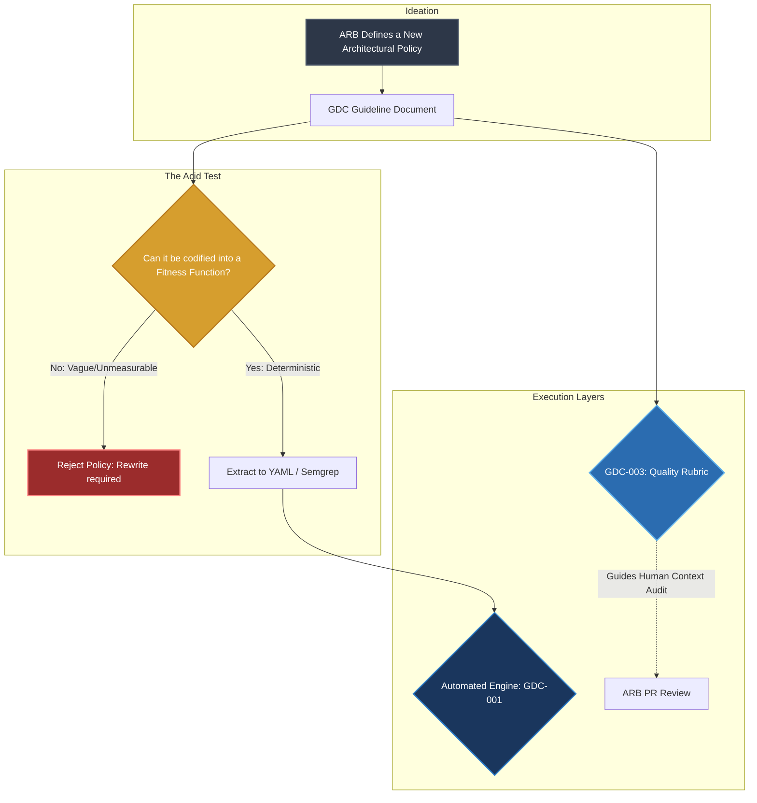
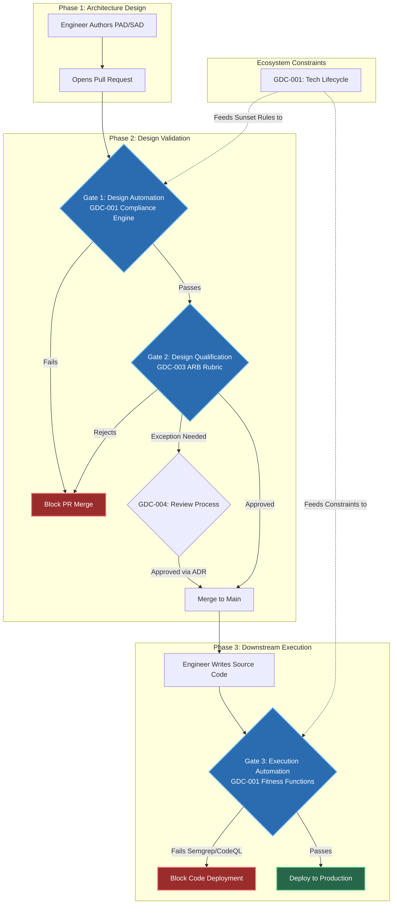

### 3.2 The Metaprogramming Flow (Authoring Governance)

This is the conceptual flow used by the Architecture Review Board (ARB) when creating or modifying the framework itself (e.g., adding a new PAD rule). It strictly follows the "Policy-as-Code" Acid Test: **A policy that cannot be translated into a Fitness Function is a failure of governance.**

1. **Policy Ideation**: The ARB debates and defines the new architectural standard (e.g., updating a GDC Guideline).
2. **The Acid Test (Fitness Function Extraction)**: The policy is immediately forced to be codified into measurable Fitness Functions (YAML rules for the Linter, or Semgrep rules for Code).
   - _If it cannot be automated_, the policy is rejected as "hand-wavy" or vague.
3. **Engine Integration**: The automated engine (`GDC-001`) executes the new Fitness Functions.
4. **Human Qualification (`GDC-003`)**: For the qualitative nuances of the policy that machines cannot mathematically judge (e.g., the context of a trade-off), the ARB updates the Quality Rubric for human PR reviews.

> **Rule Reconciliation**: Because adding a rule is fundamentally an act of modifying a Governance Document Contract, the exact 4-step execution flow for updating YAML rules and synchronizing rubrics is defined in **[GDC-006 §3 — The Reconciliation Flow](./GDC-006-gdc-guideline.md#3-the-reconciliation-flow-adding-or-modifying-rules)**.

### 3.3 The Execution Flow (Consuming Governance)

This is the CI/CD pull request lifecycle used by downstream engineers when proposing an architectural change (e.g., submitting a new SAD or TDD). Because machines are faster than humans, the execution flow is the inverse of the metaprogramming flow: **Automation runs before Qualification.**

### 3.3 The Policy Layer (The Artifact-Specific Guidelines)

At Scnehaux, **Policy resides entirely in the Guidelines**. These documents define the explicit rules, schemas, and expectations for every artifact produced by the enterprise. They act as the "mothers" of the Fitness Functions.

- **[GDC-006 — GDC Guideline (Governance Rules)](./GDC-006-gdc-guideline.md)**: Rules for writing a GDC itself.
- **[GDC-007 — EAD Guideline (Enterprise Strategy)](./GDC-007-ead-guideline.md)**
- **[GDC-008 — STD Guideline (Engineering Policy)](./GDC-008-std-guideline.md)**
- **[GDC-009 — PAD Guideline (Logical Domain)](./GDC-009-pad-guideline.md)**
- **[GDC-010 — SAD Guideline (Physical System)](./GDC-010-sad-guideline.md)**
- **[GDC-011 — ADR Guideline (Decision Records)](./GDC-011-adr-guideline.md)**
- **[GDC-012 — TDD Guideline (Component Design)](./GDC-012-tdd-guideline.md)**

### 3.4 The Enforcement Layer (The GDC Pillars)

If the Guidelines are the Law, the 3 Core Pillars are the Police. They act universally across all Policies. If one component is missing, the ecosystem's identity collapses:

- **[GDC-001 — Architecture Fitness Functions](./GDC-001-fitness-functions.md)** (The Machine Police): The CI/CD linter. It acts as the automated gatekeeper, deterministically validating structural layout, metadata, and the enterprise technology radar.
- **[GDC-003 — Quality Rubric](./GDC-003-quality-rubric.md)** (The Human Brain): Defines the 10 deep architectural parameters used by reviewers to judge subjective trade-offs.
- **[GDC-004 — Review Process](./GDC-004-review-process.md)** (The Supreme Court): Defines how the ARB scores PRs and grants exception waivers.

## 4. Severity & Exceptions (The Enforcement Pipeline)

To understand how the Scnehaux ecosystem operates, one must differentiate between how the governance framework is **built** (Metaprogramming) and how it is **consumed** (Execution).

### 4.1 The Metaprogramming Flow (Authoring Governance)

This is the conceptual flow used by the Architecture Review Board (ARB) when creating or modifying the framework itself (e.g., adding a new PAD rule). It strictly follows the "Policy-as-Code" Acid Test: **A policy that cannot be translated into a Fitness Function is a failure of governance.**

1. **Policy Ideation**: The ARB debates and defines the new architectural standard (e.g., updating a GDC Guideline).
2. **The Acid Test (Fitness Function Extraction)**: The policy is immediately forced to be codified into measurable Fitness Functions (YAML rules for the Linter, or Semgrep rules for Code).
   - _If it cannot be automated_, the policy is rejected as "hand-wavy" or vague.
3. **Engine Integration**: The automated engine (`GDC-001`) executes the new Fitness Functions.
4. **Human Qualification (`GDC-003`)**: For the qualitative nuances of the policy that machines cannot mathematically judge (e.g., the context of a trade-off), the ARB updates the Quality Rubric for human PR reviews.

> **Rule Reconciliation**: Because adding a rule is fundamentally an act of modifying a Governance Document Contract, the exact 4-step execution flow for updating YAML rules and synchronizing rubrics is defined in **[GDC-006 §3 — The Reconciliation Flow](./GDC-006-gdc-guideline.md#3-the-reconciliation-flow-adding-or-modifying-rules)**.

### 4.2 The Execution Flow (Consuming Governance)

This is the CI/CD pull request lifecycle used by downstream engineers when proposing an architectural change (e.g., submitting a new SAD or TDD). Because machines are faster than humans, the execution flow is the inverse of the metaprogramming flow: **Automation runs before Qualification.**

### 4.3 Deprecation and Exception Request Workflow

Architecture is not static. However, bypassing standards is a high-risk operation. Any deviation from the execution flow requires:

1. An ADR justifying the technical necessity for the exception.
2. Formal sign-off from the ARB.
3. Documentation of the waiver in the project's local `linting-rules.yaml`.

### 4.4 The Absolute Mandates

The architecture ecosystem operates under three absolute mandates. No system may:

1. Enter production without an approved SAD.
2. Deviate from standards without an ADR.
3. Introduce breaking architectural changes without a formal peer review and ARB approval.

### 4.5 The Three-Gate CI Rule

To maintain high developer velocity, automated validation (Gate 1 & Gate 3) only triggers a **HARD BLOCK (Exit 1)** if a violation threatens:

1. **Security & Data Isolation** (e.g., bypassing PostgreSQL RLS).
2. **Structural Integrity** (e.g., CQRS Level 1 domain-isolation breach).
3. **Operational Stability** (e.g., missing mandatory SLAs).

Stylistic, naming conventions, or formatting preferences are treated as **WARNINGS**; they flag in PR reviews but do not block the merge.

### 4.6 Non-Functional Discipline

All systems must define measurable targets for Availability, Performance, Scalability, Security, Observability, and Resilience. Vague or non-measurable requirements (e.g., "fast" or "highly scalable") are considered governance violations and are not acceptable.

### 4.7 The Fitness Function Orchestration

The execution of the automated fitness function gate is orchestrated by `06-fitness-function/engine/cli.py`. The CI/CD engine utilizes a dynamic YAML federation where global rules (`linting-rules.yaml`) are deeply merged with domain-specific rules. Crucially, all specifications regarding the Fitness Function Execution Flow, Modular Ruleset Configurations, and linting enforcement are strictly maintained in the global framework: 👉 **[GDC-001 - Architecture Fitness Functions](./GDC-001-fitness-functions.md)**

### 4.8 The Reconciliation Flow (Adding or Modifying Rules)

At Scnehaux, **if an architectural rule is not enforceable by the fitness function, it is merely a suggestion.** You cannot directly type a new rule (e.g., "Do not use X format") into a Markdown document. Every new rule MUST be reconciled with the automated fitness function engine.

Because the process of adding or modifying a rule is fundamentally an act of modifying a Governance Document Contract (GDC), the exact 4-step execution flow for updating YAML rules, regenerating documentation, and synchronizing qualitative rubrics is defined strictly within its authoritative guideline: 👉 **[GDC-006 §3 — The Reconciliation Flow](./GDC-006-gdc-guideline.md#3-the-reconciliation-flow-adding-or-modifying-rules)**

---

