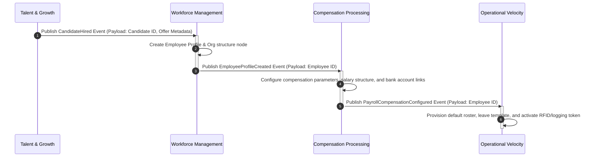

---
doc_meta:
  governed_by: GDC-007
  id: EAD-001
  title: Enterprise Business Architecture
  owner: Chief Enterprise Architect
  version: 1.0.0
  status: approved
  classification: public
  review_cycle_days: 180
  last_reviewed: 2026-05-18
---

# Enterprise Business Architecture (EAD-001)

---

## 1. Vision

The Scnehaux Foundation Business Architecture defines the capability-centric blueprint of the organization. It establishes the "North Star" for all domain models, ensuring that software boundaries map strictly to business capabilities rather than organizational charts.

## 2. Mission

To direct the structural decomposition of the enterprise into strictly encapsulated, cohesive domains that enable independent scaling, autonomous product evolution, and aligned strategic delivery.

## 3. Strategic Objectives

The business architecture is driven by the following strategic objectives and principles:

### 3.1 Zero Trust by Default
Every transaction must be cryptographically verified and authorized, regardless of network origin. Downstream systems must validate user contexts and platform credentials on every call.

### 3.2 API-First Contracts
Every platform capability must expose its functionalities via strict, versioned API contracts. Integration complexity is minimized by decoupling consumer integration details from internal system evolution.

### 3.3 Domain-Driven Decoupling
Service boundaries must map strictly to business capabilities. Cross-domain data dependencies must be asynchronous (e.g., event-driven message backbones) wherever feasible to prevent runtime coupling.

### 3.4 Production-Ready Baseline
Observability and operational predictability are non-negotiable for enterprise stability. Deployable units must emit structured logs to STDOUT and propagate standard trace headers.

## 4. Business Capability Map

The Scnehaux Super Platform is partitioned into the following primary Capability Domains:

### 4.1 Identity Management (Platform Foundation)
- **Authentication & Federation**: Single Sign-On (SSO), MFA enforcement, and external IdP brokering.
- **Tenant Governance**: Multi-tenant isolation enforcement and lifecycle management.
- **Session Operations**: Token issuance and global revocation capabilities.

### 4.2 Workforce Management (Core Domain)
- **Employee Lifecycle**: Onboarding, offboarding, and profile state transitions.
- **Organizational Structure**: Position management and hierarchy definitions.

### 4.3 Compensation Processing (Financial Domain)
- **Compensation Modeling**: Salary structuring and benefits calculation.
- **Tax & Compliance Engine**: Regulatory deduction modeling.
- **Disbursement Orchestration**: Financial gateway integration.

### 4.4 Operational Velocity (Work Management)
- **Time & Attendance**: Real-time tracking and leave processing.
- **Capacity Allocation**: Project resourcing and rostering.

### 4.5 Talent & Growth Management
- **Recruitment**: Sourcing and hiring pipelines.
- **Performance Evaluation**: Goal tracking and feedback loops.

## 5. Value Stream

The primary enterprise value streams must execute as asynchronous event-driven choreographies. Below is the sequence layout for the **Hire-to-Retire** value stream:

## 6. Operating Model

To maintain absolute logical isolation and clear ownership of business concepts, the operating model enforces that each domain aggregate is mapped to exactly one authoritative logical bounded context. Any deviation from the mandated capability boundaries requires formal approval via an Architecture Decision Record (ADR).

| Domain | Strategic Aggregate | Authoritative Bounded Context | Storage Pattern |
| :--- | :--- | :--- | :--- |
| **Identity Management** | User Credentials, Active Sessions, Tenant Metadata | Identity & Access Context | Relational |
| **Workforce Management** | Employee Profile, Org Hierarchy Node, Position | Workforce Registry Context | Relational |
| **Compensation Processing**| Salary Structure, Tax Configurations, Ledger Accounts | Payroll & Compensation Context | Relational |
| **Operational Velocity** | Time Sheets, Rostering Schedules, Leave Records | Work Tracking Context | Relational |
| **Talent & Growth** | Candidate Profile, Evaluation Sheets, Career Plans | Talent & Sourcing Context | Relational |

## 7. Team Topology Principles

Teams are organized around autonomous business capabilities (stream-aligned teams), not horizontal technical layers — maximizing decoupling, ownership, and resilience. As capabilities mature, the enterprise shifts from monolithic capability grouping toward event-driven choreography between these domains. High-leverage shared capabilities (e.g. identity, observability, the developer platform) are owned by platform teams that expose them as internal products.

This is a durable *topology principle*, not an org chart: specific team names and reporting lines are intentionally out of scope, because they change far faster than the enterprise architecture itself.

## 8. Stakeholder

The primary stakeholders for the Enterprise Business Architecture include:
- **Chief Enterprise Architect**: Ultimate owner of the capability map.
- **Architecture Review Board (ARB)**: Responsible for gatekeeping exceptions and ensuring cross-domain alignment.
- **Domain Leads / Product Managers**: Responsible for aligning their specific system roadmaps (SADs) with the overarching capability model.
