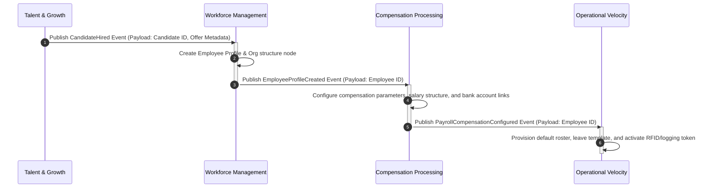

---
doc_meta:
  id: EAD-001
  title: Enterprise Business Architecture
  owner: Chief Enterprise Architect
  version: 1.0.0
  status: approved
  classification: public
  review_cycle_days: 180
  last_reviewed: 2026-05-18
---

# Enterprise Business Architecture (EAD-001)

---

## 1. Context & Business Drivers

The Scnehaux Foundation Business Architecture defines the capability-centric blueprint of the organization. It establishes the "North Star" for all domain models, ensuring that software boundaries map strictly to business capabilities rather than organizational charts.

This document directs the structural decomposition of the enterprise into strictly encapsulated, cohesive domains that enable independent scaling and autonomous product evolution.

## 2. Enterprise Principles

### 2.1 Zero Trust by Default
* **Statement**: Every transaction must be cryptographically verified and authorized, regardless of network origin.
* **Rationale**: The traditional network perimeter is hostile, and IP-based authentication is insufficient.
* **Implication**: Downstream systems must validate user contexts and platform credentials on every call. IP whitelisting is prohibited as a primary security perimeter.

### 2.2 API-First Contracts
* **Statement**: Every platform capability must expose its functionalities via strict, versioned API contracts.
* **Rationale**: Integration complexity is minimized by decoupling consumer integration details from internal system evolution.
* **Implication**: Directly querying databases or using unexposed/proprietary protocols between domains is prohibited. APIs must be documented using OpenAPI/gRPC schemas.

### 2.3 Domain-Driven Decoupling
* **Statement**: Service boundaries must map strictly to business capabilities rather than organizational charts.
* **Rationale**: Encapsulated domains enable independent scaling and autonomous product evolution.
* **Implication**: Cross-domain data dependencies must be asynchronous (e.g., event-driven message backbones) wherever feasible to prevent runtime coupling.

### 2.4 Production-Ready Baseline
* **Statement**: Every deployed container must instantly expose health checks, trace context, and baseline telemetry.
* **Rationale**: Observability and operational predictability are non-negotiable for enterprise stability.
* **Implication**: Deployable units must emit structured logs to STDOUT and propagate standard trace headers (`X-Trace-Id`) upon initialization.

## 3. Strategic Architecture

The Scnehaux Super Platform is partitioned into the following primary Capability Domains. These domains dictate the bounded contexts for all downstream software architecture (PADs and SADs).

### 3.1 Identity Management (Platform Foundation)
- **Authentication & Federation**: Single Sign-On (SSO), MFA enforcement, and external IdP brokering.
- **Tenant Governance**: Multi-tenant isolation enforcement and lifecycle management.
- **Session Operations**: Token issuance and global revocation capabilities.

### 3.2 Workforce Management (Core Domain)
- **Employee Lifecycle**: Onboarding, offboarding, and profile state transitions.
- **Organizational Structure**: Position management and hierarchy definitions.

### 3.3 Compensation Processing (Financial Domain)
- **Compensation Modeling**: Salary structuring and benefits calculation.
- **Tax & Compliance Engine**: Regulatory deduction modeling.
- **Disbursement Orchestration**: Financial gateway integration.

### 3.4 Operational Velocity (Work Management)
- **Time & Attendance**: Real-time tracking and leave processing.
- **Capacity Allocation**: Project resourcing and rostering.

### 3.5 Talent & Growth Management
- **Recruitment**: Sourcing and hiring pipelines.
- **Performance Evaluation**: Goal tracking and feedback loops.

### 3.6 Domain Aggregate Matrix
To maintain absolute logical isolation and clear ownership of business concepts, each domain aggregate is mapped to exactly one authoritative logical bounded context:

| Domain | Strategic Aggregate | Authoritative Bounded Context | Storage Pattern |
| :--- | :--- | :--- | :--- |
| **Identity Management** | User Credentials, Active Sessions, Tenant Metadata | Identity & Access Context | Relational |
| **Workforce Management** | Employee Profile, Org Hierarchy Node, Position | Workforce Registry Context | Relational |
| **Compensation Processing**| Salary Structure, Tax Configurations, Ledger Accounts | Payroll & Compensation Context | Relational |
| **Operational Velocity** | Time Sheets, Rostering Schedules, Leave Records | Work Tracking Context | Relational |
| **Talent & Growth** | Candidate Profile, Evaluation Sheets, Career Plans | Talent & Sourcing Context | Relational |

### 3.7 End-to-End Value Stream Choreography
The primary enterprise value streams must execute as asynchronous event-driven choreographies. Below is the sequence layout for the **Hire-to-Retire** value stream, ensuring decoupled service states:

## 4. Cross-Cutting Standards

### Exception Governance
Any deviation from the mandated capability boundaries (e.g., merging two distinct capabilities into a single database for performance reasons) requires formal approval.
- **Requirement**: Must submit an Architecture Decision Record (ADR).
- **Approval Gate**: Requires explicit sign-off from the Architecture Review Board (ARB).

### Evolution Strategy
- **Current State**: Monolithic capability grouping.
- **Target State**: Event-Driven Capability choreography. As capabilities mature, synchronous REST calls across domains will transition to asynchronous event streams to maximize decoupling and resilience.

### Metric Baselines
The business architecture mandates the following macro-level service level agreements across all capability domains:
- **Availability**: All tier-0 capability endpoints must achieve >=99.95% availability measured over a rolling 30-day window.
- **Fault Isolation**: Failure in one capability domain must result in zero degraded availability for unrelated capability domains.

## 5. Decision Log

| ID | Decision | Status | Rationale |
| :--- | :--- | :--- | :--- |
| **TOG-01** | TOGAF Alignment | Approved | Aligns with TOGAF Phase B (Business Architecture) requirements. |
