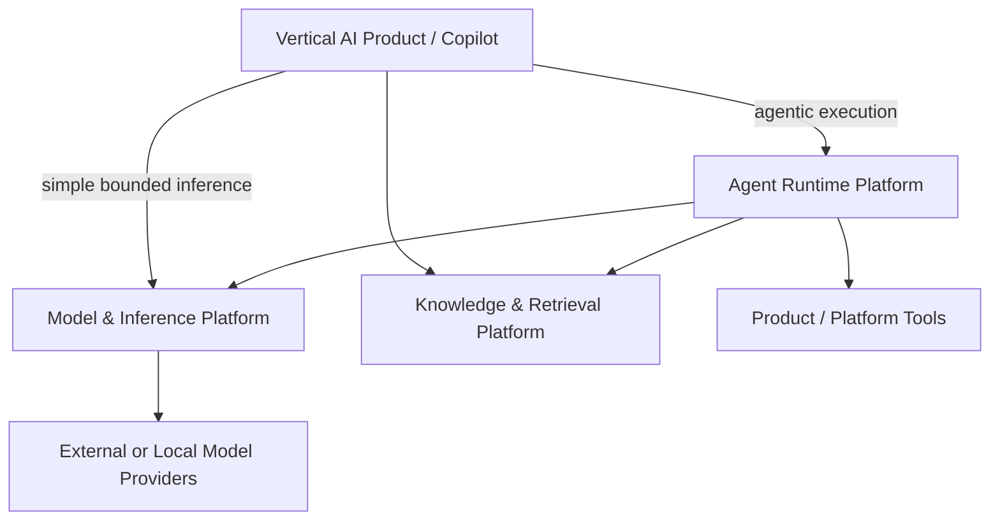

---
doc_meta:
  id: EAD-001
  title: Enterprise Capability & Domain Map
  owner: Architecture Authority
  version: 2.2.0
  status: approved
  classification: internal
  governed_by: [GDC-006]
  review_cycle_days: 180
  created_date: 2026-08-06
  last_reviewed: 2026-08-23
---

# Enterprise Capability & Domain Map

## 1. Purpose

Establish the authoritative enterprise capability model for the **Scnehaux Enterprise Cloud**, separate Business Plane value ownership from Platform Plane reusable capability, and define the Governance & Assurance overlay that constrains both.

**Decision question:** _What capabilities must the enterprise own, which domain is accountable for each capability, and what is only a target capability rather than a build commitment?_

This EAD defines enterprise intent and authority. It does not define systems, APIs, databases, deployment topology, implementation phases, or component design.

## 2. Scope

**In scope**

- Business Plane capability families and Product authority
- Platform Plane concern families and reusable capability ownership
- Governance & Assurance as a cross-cutting overlay
- Canonical distinctions between Product, Platform, capability, system, deployable, and team
- Platform qualification and capability-lifecycle principles
- Canonical enterprise terms whose ownership crosses Product boundaries

**Out of scope**

- Physical system landscape and runtime relationships — EAD-002
- Data authority and movement — EAD-003
- API, event, file, AI-tool, and external-integration patterns — EAD-004
- Runtime, platform engineering, technology portfolio, and reliability strategy — EAD-005
- Trust and security architecture — EAD-006
- Enterprise governance and assurance operating model — EAD-007
- Detailed domain contracts and NFRs — PADs
- Physical systems and implementation — SADs and TDDs

This document binds every enterprise Product, Platform, and architecture lineage within Scnehaux.

## 3. Enterprise Context

Scnehaux is ATI Business Group's enterprise technology ecosystem for internal operations, travel and BPO service delivery, shared Platforms, and future managed or selectively commercialized Products.

```text
Internal Operating Platform
    → Software-Enabled Managed Service
        → Managed Platform / BPaaS
            → Selective SaaS Products
```

ATI differentiates through operational execution, domain knowledge, workflow, evidence, reconciliation, Product experience, and governed intelligence while continuing to integrate with client and industry authorities.

The enterprise model separates three questions:

```text
BUSINESS PLANE
What business value, meaning, state, and outcome do we own?

PLATFORM PLANE
What reusable capability should many Products consume?

GOVERNANCE & ASSURANCE
What must remain constrained, accountable, evidenced, and provable?
```

The Platform Plane remains grouped into five enduring concern families. These roots are a stable taxonomy, not a catalog of mandatory systems or teams.

## 4. Architectural Drivers & Lessons

### 4.1 Business Goals

| ID | Business Goal | Architectural Consequence |
| :-- | :-- | :-- |
| G1 | Transform Travel Operations first while supporting HCM, ERP, and adjacent enterprise Products | Business Plane remains value-stream and authority driven |
| G2 | Reuse trusted capability without creating a god-platform | Shared Platforms own bounded Platform semantics, never consuming Product business outcomes |
| G3 | Support organizations, tenants, workspaces, Products, applications, people, workloads, and agents | Identity, Organization, application trust, entitlement, workforce business data, and authorization remain distinct |
| G4 | Build durable vertical AI Products without locking Product logic to one model/provider | Model & Inference, Agent Runtime, Knowledge & Retrieval, and Product semantics are separate authorities |
| G5 | Reduce repeated engineering friction without platform sprawl | Platformization requires structural need, friction/reuse evidence, runtime economics, or material risk reduction |
| G6 | Preserve external client and industry systems of record | External authority remains explicit; ATI owns execution and reconciliation where appropriate |
| G7 | Keep architecture implementable and evolvable | PAD approval locks logical boundary; physical design remains a SAD decision |

### 4.2 Value Streams to Capability Families

| Value Stream | Primary Capability Families |
| :-- | :-- |
| Travel servicing and operations | Travel Products, Work Management, Workflow, Rules, Artifact, Notification, Integration, Knowledge, AI |
| Workforce lifecycle | HCM, Identity, Organization, Work Management, Workflow, Workspace Experience, Knowledge, AI |
| Finance and enterprise resource operations | ERP target Products, Workflow, Rules, Artifact, Integration, Audit |
| Client/service onboarding and BPO operations | BPO Products, Organization, Work Management, Workflow, Notification |
| Knowledge-assisted operations | Product domains, Knowledge & Retrieval, AI Enablement, Workspace Experience |
| Software delivery and runtime | Engineering & Runtime |
| Enterprise control and assurance | Foundation & Control plus Governance & Assurance |

### 4.3 Lessons Incorporated

| Lesson | Enterprise Response |
| :-- | :-- |
| Application and team inventories were mistaken for domain architecture | Plane roots and domain boundaries derive from enduring responsibility and authority |
| "Platform provides mechanism, Product provides meaning" was too absolute | Platforms own meaningful semantics within their bounded capability; Products retain authoritative Product semantics and outcomes |
| Top-down capability mapping alone can over-platformize | Platform discovery combines structural need with bottom-up friction, measured reuse, and runtime evidence |
| Developer experience was treated as secondary | Platform Products measure adoption, lead time, cognitive load, support burden, reliability, and cost |
| Resilience was confused with overlapping authority | Projections, caches, replicas, and local enforcement may duplicate representation; canonical authority does not silently duplicate |
| HCM workforce meaning was conflated with technical Organization/Workspace context | HCM owns employee/workforce business truth; Organization owns Tenant/Workspace/Membership operating context |
| AI, RAG, knowledge, agents, and Product workflow were treated as one platform | Model & Inference, Agent Runtime, Knowledge & Retrieval, Workflow, and Product semantics are distinct bounded capabilities |

## 5. Architecture Model

### 5.1 Macro Capability Map

```mermaid
graph TB
    SEC([Scnehaux Enterprise Cloud])

    SEC --> BUS[Business Plane]
    SEC --> PLAT[Platform Plane]
    GOV[Governance & Assurance Overlay] -. constrains / verifies .-> BUS
    GOV -. constrains / verifies .-> PLAT

    BUS --> TRAVEL[Travel Operations]
    BUS --> BPO[Adjacent / BPO Service Domains]
    BUS --> ENT[Enterprise Enablement Products]

    ENT --> HCM[HCM]
    ENT --> ERP[ERP - Target]
    ENT --> WFM[Workforce Management - Candidate Business Product]

    PLAT --> FC[Foundation & Control]
    PLAT --> BEE[Business Execution & Enablement]
    PLAT --> DKI[Data, Knowledge & Intelligence]
    PLAT --> EI[Experience & Interaction]
    PLAT --> ER[Engineering & Runtime]

    FC --> IAM[Identity & Access]
    FC --> ORG[Organization & Tenancy]
    FC --> APPTRUST[Application & Service Trust]
    FC --> POLICY[Security Policy & Authorization]
    FC --> ENTITLE[Subscription & Entitlement]
    FC --> BILL[Usage Metering & Billing]
    FC --> CONFIG[Configuration & Variation]
    FC --> REG[Product / Capability Registry]
    FC --> AUDIT[Audit & Evidence]
    FC --> TRUST[Trust Services]

    BEE --> WORK[Work Management]
    BEE --> WF[Workflow & Orchestration]
    BEE --> RULES[Rules & Decisioning]
    BEE --> APPROVAL[Approval & Review]
    BEE --> SLA[SLA & Escalation]
    BEE --> DOC[Artifact & Document]
    BEE --> NOTIF[Notification & Communication]
    BEE --> INT[Integration Enablement]

    DKI --> DATA[Data Foundation]
    DKI --> KNOW[Knowledge Foundation]
    DKI --> SEARCH[Search & Retrieval]
    DKI --> MODEL[Model & Inference]
    DKI --> AGENT[Agent Runtime]
    DKI --> ANALYTICS[Analytics]
    DKI --> OI[Operational Intelligence]

    EI --> UI[UI Platform & Design System]
    EI --> WSX[Workspace Experience & Application Composition]
    EI --> ACCESS[Accessibility & Localization]
    EI --> CHANNEL[Channel Foundations]

    ER --> DEV[Developer Platform]
    ER --> CATALOG[Software Catalog]
    ER --> DELIVERY[Source Build & Delivery]
    ER --> INFRA[Infrastructure Automation]
    ER --> RUN[Application Runtime]
    ER --> JOB[Background Job & Task Execution]
    ER --> SCHED[Temporal Scheduling & Trigger Dispatch]
    ER --> CONN[API & Service Connectivity]
    ER --> MSG[Event & Messaging]
    ER --> OBS[Observability]
    ER --> REL[Reliability & Resilience]
    ER --> TEST[Testing & Quality]
```



The capability map is logical. A box does not imply an independent service, database, repository, Product team, or build commitment.

### 5.2 Business Plane

| Business Family | Authoritative Responsibility | Posture |
| :-- | :-- | :-- |
| Travel Operations | Travel-domain operational state, decisions, rules, exceptions, reconciliation, and outcomes | Primary transformation family |
| Adjacent / BPO Service Domains | Client-service operational outcomes, quality, service-delivery state, and domain-specific execution | Adjacent business family |
| HCM | Employee, Employment, HR organization, position, attendance, leave, talent, workforce business truth | Approved supporting Product |
| ERP | Finance, accounting, procurement, inventory, and related enterprise-resource business truth as bounded through future PADs | Target supporting Product family |
| Workforce Management | Staffing, roster, capacity, shift, adherence, and operational workforce-management semantics if separately justified | Candidate Business Product, not horizontal Platform |
| Product Experience | Domain-specific journey and business interaction semantics | Product-owned |

A work function, department, screen, database, or existing application does not automatically become a Business Product.

### 5.3 Platform Plane

#### Foundation & Control

Owns reusable cross-product authority, trust, context, commercial grants, configuration, evidence, and cryptographic foundations.

#### Business Execution & Enablement

Owns reusable operational machinery:

- **Work Management** — Work Item, Case, Queue, Assignment, Claim, Priority, ownership, work history
- **Workflow & Orchestration** — durable process definition, instance, transition, task coordination, compensation, process timeout/deadline semantics
- **Rules & Decisioning** — versioned deterministic rule lifecycle, evaluation, trace, simulation, promotion, rollback
- **Approval & Review** — reusable maker-checker/review decision mechanics; initially realized through Work Management and Workflow contracts rather than an independent Platform Product
- **SLA & Escalation** — reusable objective, threshold, breach, and escalation semantics; remains distinct from generic Scheduling time authority
- **Artifact & Document** — governed file/document/media/artifact lifecycle, immutable versions, metadata, provenance, conversion, rendering, scanning
- **Notification & Communication** — accepted communication, template/channel semantics, delivery lifecycle
- **Integration Enablement** — reusable connector/protocol/transformation machinery where shared use is justified

#### Data, Knowledge & Intelligence

- **Data Foundation** — governed analytical data products, contracts, metadata, and shared data mechanics
- **Knowledge Foundation** — knowledge assets, provenance, ontology lifecycle, entities, relationships, claims, publication
- **Search & Retrieval** — lexical, vector, metadata, graph, hybrid, authorization-aware retrieval and evidence assembly
- **AI Enablement** is a capability family realized through separate Platform authorities rather than one owning Platform Product
- **Model & Inference** — provider access, model catalog, Capability Profiles, bounded inference, routing, model evaluation/release, guardrails, usage/cost, provider health, and inference telemetry
- **Agent Runtime** — Agent Definition/runtime lifecycle mechanics, durable Agent Run execution, harness semantics, context assembly, run/session memory, Tool Binding/mediation, Skill Runtime, delegation/handoff, agent evaluation, and Agent telemetry
- **Analytics & Operational Intelligence** — derived measurement, signals, forecasting, recommendations, and operational insight

Knowledge Graph is a first-class knowledge representation and graph retrieval is a first-class retrieval mode. Neither graph nor vector indexes become Product transactional authority.

#### Experience & Interaction

- **UI Platform & Design System** owns reusable visual and interaction primitives
- **Workspace Experience Platform** owns application shell, navigation, composition, context switch, "My Work" surfaces, shared search/notification/copilot slots, and cross-Product experience foundations
- **Organization Platform** remains authority for the canonical `Workspace` operating-context entity
- Product domains own Product pages, journeys, and business interaction meaning

#### Engineering & Runtime

- Developer Platform and Software Catalog
- Source, Build, Delivery, and Infrastructure Automation
- Application Runtime
- **Background Job & Task Execution** — bounded technical execution semantics, not business work authority
- **Temporal Scheduling & Trigger Dispatch** — durable future time authority
- API & Service Connectivity
- Event & Messaging
- Observability
- Reliability & Resilience
- Testing & Quality

### 5.4 Canonical Work and Execution Taxonomy

| Term | Meaning | Primary Authority |
| :-- | :-- | :-- |
| Work Item | Business/operational work requiring ownership or action | Work Management when shared; otherwise owning Product |
| Case | Durable grouping of related operational work | Work Management when shared; otherwise owning Product |
| Workflow | Durable multi-step process coordination | Workflow Platform |
| Job | Bounded technical unit of background execution | Owning runtime/job-execution capability; business meaning remains Product-owned |
| Schedule | Durable temporal registration and occurrence lifecycle | Scheduling Platform |
| Worker | Runtime process executing a registered handler | System/runtime, never business authority by itself |
| Queue | Buffering, ordering, assignment, or dispatch mechanism whose semantics depend on context | Owning capability |
| Workspace | Canonical Tenant operating context | Organization Platform |
| Workspace Experience | Human work environment and cross-Product composition | Workspace Experience Platform |
| Workforce | People/employment/staffing business concept | HCM or future Workforce Management Product |

### 5.5 AI, Knowledge, and Vertical Product Boundary



- Vertical AI Products own business workflow, Product UX, domain prompt/skill meaning, business tools, validation, and final outcomes
- Model & Inference owns provider/model access, Capability Profiles, bounded inference execution, routing, model-level evaluation/release, usage/cost, and provider health
- Agent Runtime owns generic durable Agent execution semantics, Agent Run state, Harness/context/memory mechanics, Tool Binding/mediation state, delegation/handoff, and agent-runtime evaluation
- Knowledge & Retrieval owns governed knowledge representation, graph/index lifecycle, retrieval, and provenance
- Product/Platform Tool owners own Tool semantics, protected-resource authorization, and side effects
- Agent Runtime is not Workflow, Work Management, Knowledge authority, Tool authority, or a Vertical AI Product
- Simple Product inference may bypass Agent Runtime; Agent Runtime is not a universal AI hop
- Provider/model switching is governed portability through capability matching and evaluation, not assumed equivalence

### 5.6 Platform Qualification

Platform discovery is dual-directional:

```text
TOP-DOWN STRUCTURAL NEED
authority / security / compliance / enterprise constraint
                    +
BOTTOM-UP EVIDENCE
friction / duplicate machinery / incidents / consumer demand
                    +
RUNTIME ECONOMICS
scale / operability / reliability / support
                    ↓
            Platform Qualification
```

Three common paths are valid:

1. Constitutional / authority driven
2. Friction / reuse driven
3. Runtime economics driven

A capability becomes shared only when doing so reduces **total system complexity** more than the shared dependency, cognitive load, blast radius, migration burden, and operating cost it introduces.

### 5.7 Capability Evolution

```text
Identified Capability
      ↓
Candidate
      ↓
Approved PAD
      ↓
SAD chartered       = logical Platform/Product approved, no physical design yet
      ↓
SAD draft           = physical system design is active
      ↓
SAD approved        = physical architecture is locked
      ↓
Runtime evidence
      ↓
Invest / Refine / Split / Merge / Retire
```

PAD approval is not physical-system design approval.

### 5.8 Domain Ownership Matrix

| Concern | Primary Authority |
| :-- | :-- |
| Business Product semantics and outcomes | Owning Business Product/domain |
| Principal and authentication trust | Identity & Access |
| Organization, Tenant, Workspace, Membership | Organization |
| Shared work lifecycle | Work Management |
| Durable multi-step process state | Workflow |
| Deterministic rule runtime lifecycle | Rules & Decisioning |
| Durable future temporal state | Scheduling |
| Knowledge Asset/retrieval lifecycle | Knowledge & Retrieval |
| Model/provider access and bounded inference execution | Model & Inference |
| Durable Agent execution, Harness, context assembly, Tool Binding, and run/session memory mechanics | Agent Runtime |
| Artifact content/version lifecycle | Artifact & Document |
| Evidence lifecycle | Audit & Evidence |
| Cross-cutting governance requirement | Named Governance Authority |

A fact or responsibility has one primary authority even when representations, projections, enforcement, or operational participation are distributed.

### 5.9 Strategic Domain Classification

| Classification | Default Posture |
| :-- | :-- |
| Core Business Product | Build/evolve from domain and operational evidence |
| Foundational Control Capability | Own architecture; adopt mature substrate/kernels where safer |
| Shared Execution Capability | Approve logical Platform only when authority/reuse/friction justifies |
| Shared Knowledge/AI Capability | Share governed substrate while preserving Product/source authority |
| Shared Experience Capability | Optimize reusable interaction/composition without Product-journey ownership |
| Shared Engineering Capability | Standardize/pave where operational economics justify |
| Commodity Substrate | Prefer proven/managed technology behind Scnehaux contracts |

Classification determines investment posture, not deployment topology.

### 5.10 Capability Evolution

```text
Identified
  → Candidate
  → PAD Approved
  → SAD Chartered
  → SAD Draft
  → SAD Approved
  → Active / Measured
  → Refine / Split / Merge / Deprecate / Retire
```

Platform status is not permanent. Adoption, runtime evidence, authority clarity, total-system complexity, and lifecycle economics can justify refinement or return to Product-local realization.

## 6. Principles & Rules

### 6.1 One Canonical Authority per Fact

Canonical authority is singular even when projections, caches, replicas, or local enforcement are duplicated.

- **Fitness function:** architecture/data review reports zero silently multiply-authoritative critical facts

### 6.2 Platform Owns Platform Semantics; Product Owns Product Semantics

A Platform owns meaningful models and lifecycle inside its bounded capability but does not absorb consuming Product business semantics or outcomes.

- **Fitness function:** Platform PAD review reports zero unapproved Product-specific authoritative aggregates

### 6.3 Distinct Primary Concerns

Plane roots and Platform boundaries require clear primary responsibility, not mathematically perfect conceptual isolation.

- **Fitness function:** every approved PAD has explicit authority and non-authority boundaries with no conflicting canonical authority

### 6.4 Reusable Does Not Mean Shared

Reuse alone does not justify a shared service or Platform Product.

- **Fitness function:** new shared Platform PAD records consumer, authority, risk, or runtime-economics justification

### 6.5 Shared Does Not Mean Centralized Deployment

Logical shared authority may be realized through libraries, projections, managed services, modules, or independent systems.

- **Fitness function:** every independent deployable has a SAD rationale

### 6.6 Platform as a Product

Shared Platforms have consumers, owner, lifecycle, support, adoption, reliability, cognitive-load, and unit-cost measures.

- **Fitness function:** active Platform catalog entries expose owner, consumers, adoption metric, SLO, and support path

### 6.7 Product Authorization Remains Near Product Resources

Identity, Membership, Entitlement, AI output, Workflow state, or Platform policy does not by itself authorize an irreversible Product action.

- **Fitness function:** high-impact Product PADs identify the final business authorization owner

### 6.8 Knowledge and AI Do Not Become Transactional Authority

Knowledge Graphs, indexes, embeddings, AI output, prompts, and agent state remain derived/supporting unless explicitly accepted into an owning Product domain.

- **Fitness function:** AI/Knowledge PADs contain zero direct authority over Product transactional aggregates

### 6.9 Target Capability Is Not Build Commitment

A target capability may exist in EAD without an approved PAD or system in build.

- **Fitness function:** every deployed system traces to an approved PAD and non-chartered SAD

### 6.10 Governance Is an Overlay, Not a Universal Runtime Hop

Governance defines constraints and evidence; Products and Platforms execute their own responsibilities.

- **Fitness function:** runtime dependency review reports zero mandatory Governance service calls justified solely by policy centralization

## 7. Alternatives Considered

| Alternative | Why Rejected | Debt Accepted |
| :-- | :-- | :-- |
| Organization chart as architecture | Team structure changes faster than authority | Architecture-to-team alignment requires deliberate ownership work |
| One Platform per reusable idea | Creates Platform sprawl and shared dependency cost | Some duplication is accepted until qualification is met |
| Central Business Execution god-platform | Absorbs Product semantics and creates universal blast radius | Multiple bounded Platforms and local mechanisms coexist |
| AI god-platform owning knowledge, workflow, and Product actions | Creates ambiguous authority and provider lock-in | Cross-platform contracts and additional integration discipline |
| Central Data team owns all Product data | Breaks domain ownership and creates distributed monolith | Domain data products and shared self-service data capability |
| Workforce as horizontal Platform | Workforce is business meaning, not generic machinery | HCM and future Workforce Management remain Business Products |

## 8. Single Points of Failure & Graceful Degradation

| Dependency | Potential Blast Radius | Enterprise Posture |
| :-- | :-- | :-- |
| Identity / trust control | Authentication and trust establishment | Local validation, bounded sessions, tested recovery |
| Organization control | New context changes | Locally usable context/projections where safe |
| Event & Messaging | Delayed asynchronous work | Durable source state, replay, backpressure |
| Scheduling | Delayed future triggers | Persisted occurrences and bounded misfire recovery |
| Work Management / Workflow | Delayed shared operational coordination | Product authority remains intact; manual/local fallback where designed |
| Knowledge & Retrieval | Search/RAG degradation | Product transactional operation remains independent where safe |
| Model provider / Model & Inference | Bounded inference degradation | Evaluated provider fallback, explicit unavailability, or Product non-AI fallback |
| Agent Runtime | Agentic execution degradation | Durable Agent Run state survives restart; Product/Workflow authority remains intact and unsafe automation fails closed |
| Workspace Experience | Cross-Product shell degradation | Direct Product access or bounded degraded experience where designed |
| Governance tooling | Delayed assurance/admin activity | Existing compliant runtime continues; policy enforcement is not a universal runtime dependency |

## 9. Ownership

| Responsibility | Accountable |
| :-- | :-- |
| Enterprise capability taxonomy | Architecture Authority |
| Business meaning and outcome | Product domain owner |
| Shared Platform semantics and lifecycle | Platform Product owner |
| Technology/runtime realization | System owner |
| Cross-cutting governance requirements | Authorities defined by EAD-007 |
| Team alignment | Engineering/Business leadership informed by architecture boundaries |

## 10. Dependencies

- This C1 architecture artifact has no synchronous runtime dependency on another architecture artifact
- Its inputs are enterprise strategy, accountable domain ownership, legal or contractual obligations, and validated operational evidence appropriate to its subject
- Cross-artifact architectural lineage is recorded in the Traceability section and MUST NOT be interpreted as a runtime dependency graph

## 11. Traceability

- EAD-002 — system landscape
- EAD-003 — data ownership and topology
- EAD-004 — integration architecture
- EAD-005 — platform and runtime architecture
- EAD-006 — security architecture
- EAD-007 — governance and assurance architecture
- ADR-GLB-011 — durable scheduling boundary
- ADR-GLB-012 — AI, Knowledge, and Product authority separation
- ADR-GLB-015 — Model & Inference and Agent Runtime authority separation
- PAD-PLT-008 — Model & Inference Platform
- PAD-PLT-016 — Agent Runtime Platform
- ADR-GLB-013 — work, workflow, job, schedule, worker, and queue boundary
- STD-GLB-010 — durable scheduled work
- STD-GLB-011 — background job execution

## 12. Future Direction

The five Platform Plane roots remain stable until evidence shows that multiple major capabilities cannot be classified without repeated authority ambiguity. Platform Products beneath them may be promoted, split, merged, returned local, or retired based on adoption and total-system economics.
