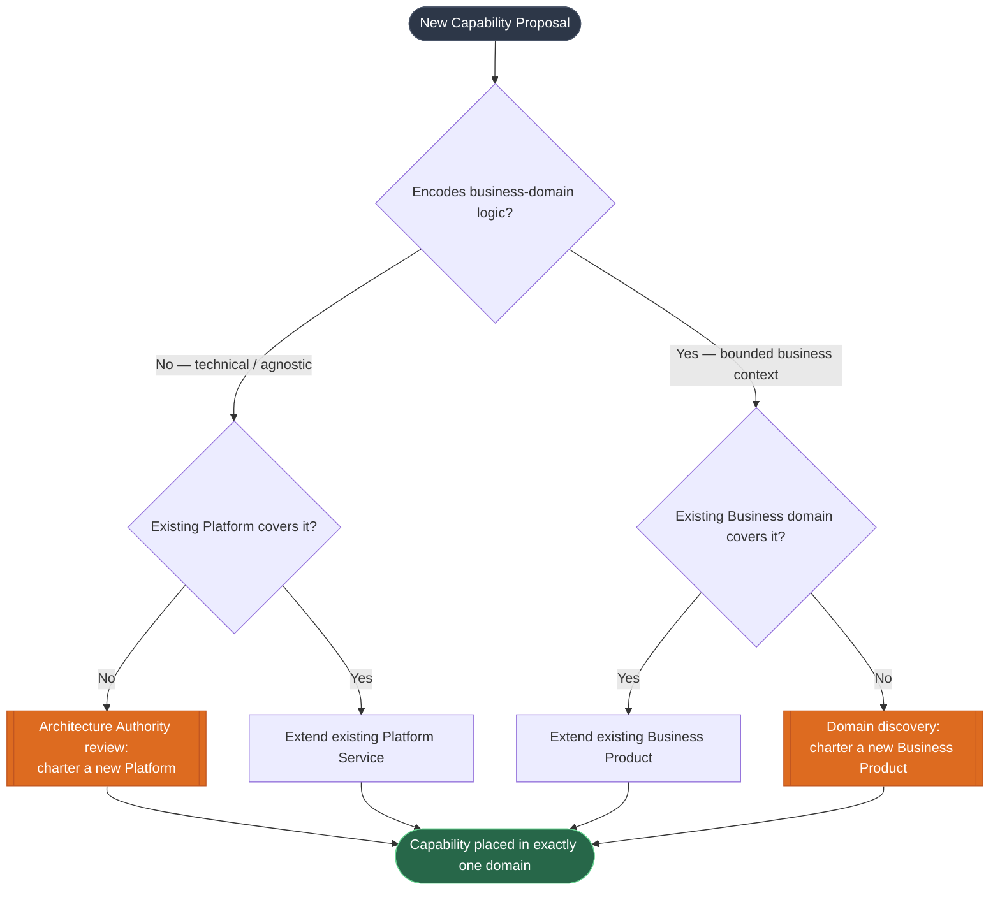

---
doc_meta:
  id: EAD-001
  title: Enterprise Capability & Domain Map
  owner: Architecture Authority
  version: 1.0.0
  status: approved
  classification: internal
  governed_by: [GDC-006]
  review_cycle_days: 180
  last_reviewed: 2026-07-05
---

# Enterprise Capability & Domain Map

## 1. Purpose

Establish the authoritative decomposition of the Scnehaux Cloud Service into business capabilities, bind each capability to exactly one owning domain, and classify every domain by strategic value. This artifact is the root node of the C4 Contractual Lineage: every Platform, Business Product, PAD, SAD, and TDD traces its right to exist upward to a capability defined here.

**Decision question this document answers:** _"What capabilities must the enterprise own, who owns each one, and which are strategic differentiators versus commodities?"_

This document states enterprise **capability boundaries and ownership**. It does not describe systems, runtimes, or code. The moment a statement names a container, API, database, or deployment, it has leaked into a PAD or SAD.

---

## 2. Scope

**In scope:**

- Decomposition of the enterprise into a Mutually Exclusive, Collectively Exhaustive (MECE) capability map.
- Assignment of every capability to exactly one owning domain (Conway alignment).
- Strategic classification of each domain (Wardley evolution stage and build/buy posture).
- The lifecycle rules governing how new capabilities enter, evolve, and retire.

**Out of scope:**

- Runtime implementation, deployment topology, container boundaries (owned by SAD).
- API and event contract signatures (owned by EAD-004 and downstream PAD/SAD).
- Physical data schemas and storage engines (owned by EAD-003 and SAD).
- Organizational headcount and reporting lines (durable team-topology principle only; no org chart).

---

## 3. Enterprise Context

Scnehaux operates as a **Platform-first, multi-tenant Cloud Service Ecosystem**. The enterprise is partitioned into two irreducible architectural planes, separated to decouple the rate of change of reusable engineering substrate from the rate of change of market-facing business logic:

- **Platform Services** — reusable, business-agnostic enterprise capabilities. They are consumed by many products, evolve on their own cadence, and expose their value exclusively through published contracts. Platform Services never encode business-domain rules.
- **Business Products** — domain-driven, customer-facing applications that compose Platform Services to deliver a bounded business capability. Business Products never re-implement a shared capability; they consume it.

This split is the enterprise expression of the C4 boundary (C1 Context) and Team Topologies (Platform teams enabling Stream-aligned teams). The invariant that makes the entire architecture tractable is singular: **every capability belongs to exactly one domain, and every domain has exactly one accountable owner.**

---

## 4. Architectural Drivers & Lessons

### 4.1. Business Goals

The capability map exists to serve four enterprise business goals; every classification and ownership decision in this document traces to one of them.

| # | Business Goal | Architectural Consequence |
| :-- | :-- | :-- |
| G1 | Ship many market-facing products from one shared substrate | Platform/Business plane split; reuse-by-contract |
| G2 | Let each product evolve without cross-team release trains | One owner per capability; independent evolution |
| G3 | Present a single tenant and identity experience ecosystem-wide | Identity & Workspace as universal Tier-0 capabilities |
| G4 | Contain the blast radius of any single failure or breach | Domain isolation; database-per-domain; tiered reliability |

### 4.2. Value Streams → Capabilities

Capabilities are not an abstract taxonomy; each realizes a concrete enterprise value stream. This mapping is the "why" a capability is owned at all.

| Value Stream | Primary Capabilities (owning domains) |
| :-- | :-- |
| Tenant onboarding & access | Identity, Workspace |
| Hire-to-Retire | HCM (+ Workflow, Notification, Document) |
| Order-to-Cash | ERP, Billing (+ Integration, Audit) |
| Lead-to-Customer | CRM (+ AI, Notification) |
| Issue-to-Resolution | ITSM (+ Workflow, Notification) |
| Procure-to-Pay | Procurement, ERP (+ Billing) |
| Content-to-Consumption | CMS, LMS (+ Document, AI) |

### 4.3. Lessons Incorporated

This map is a deliberate reaction to failure modes recorded in enterprise COE (Correction-of-Error) themes, not a greenfield ideal chosen for elegance.

| COE-class lesson | Design response in this document |
| :-- | :-- |
| A shared operational database silently re-fused decomposed services into a distributed monolith | Database-per-Domain rule + zero cross-schema-grant fitness function |
| Duplicated "shared" capabilities (multiple notification stacks) diverged and multiplied cost | Platform First + duplication-count-`0` fitness function |
| Product-local identity implementations became the weakest security link | Identity centralized as a Tier-0 capability (see EAD-006) |
| Co-owned capabilities produced no accountable owner during incidents | Single Domain Authority; co-ownership structurally prohibited |

---

## 5. Architecture Model

### 5.1. Macro Capability Map

```mermaid
graph TD
    A([Scnehaux Cloud Service])

    A --> P[["Platform Plane<br/>(business-agnostic substrate)"]]
    A --> B[["Business Plane<br/>(market-facing products)"]]

    P --> IAM[Identity Platform]
    P --> UI[UI Platform]
    P --> WS[Workspace Platform]
    P --> WF[Workflow Platform]
    P --> NT[Notification Platform]
    P --> DOC[Document Platform]
    P --> BILL[Billing Platform]
    P --> INT[Integration Platform]
    P --> AUDIT[Audit Platform]
    P --> AI[AI Platform]

    B --> HCM[HCM]
    B --> ERP[ERP]
    B --> CRM[CRM]
    B --> CMS[CMS]
    B --> ITSM[ITSM]
    B --> LMS[LMS]
    B --> PM[Project Management]
    B --> PROC[Procurement]

    style A fill:#1a365d,stroke:#3182ce,stroke-width:2px,color:#fff
    style P fill:#2b6cb0,stroke:#63b3ed,stroke-width:2px,color:#fff
    style B fill:#805ad5,stroke:#553c9a,stroke-width:2px,color:#fff
```

The map is deliberately shallow (two planes, one level of domains). Depth is delegated downstream: a domain's internal capability tree lives in its PAD, never here. This keeps the enterprise map stable across years while products churn beneath it.

### 5.2. Domain Ownership Matrix

Every domain declares a single accountable owner, a strategic classification, an availability tier (the enterprise contract for how much downtime the domain may incur), and its core responsibility. Availability tiers are defined in the Strategic Domain Classification below.

| Domain | Classification | Owning Team | Availability Tier | Core Responsibility |
| :-- | :-- | :-- | :-- | :-- |
| Identity Platform | Core Platform | Identity Team | Tier-0 | Authentication, Authorization, IAM, federation |
| Workspace Platform | Core Platform | Workspace Team | Tier-0 | Tenant, organization, workspace, membership |
| UI Platform | Shared Platform | UI Platform Team | Tier-1 | Design system, component and token foundation |
| Workflow Platform | Shared Platform | Workflow Team | Tier-1 | Business process orchestration and automation |
| Notification Platform | Shared Platform | Notification Team | Tier-1 | Email, SMS, push, and webhook delivery |
| Integration Platform | Shared Platform | Integration Team | Tier-1 | API gateway, external connectivity, transformation |
| Audit Platform | Shared Platform | Audit Team | Tier-1 | Immutable audit trail and compliance evidence |
| AI Platform | Shared Platform † | AI Team | Tier-2 † | Inference, retrieval, and intelligent services |
| Document Platform | Generic Platform | Document Team | Tier-1 | File storage, document lifecycle, rendering |
| Billing Platform | Generic Platform | Billing Team | Tier-1 | Subscription, metering, invoicing |
| HCM | Core Business | HCM Team | Tier-1 | Human capital management |
| ERP | Core Business | ERP Team | Tier-1 | Enterprise resource planning |
| CRM | Supporting Business | CRM Team | Tier-2 | Customer relationship management |
| ITSM | Supporting Business | ITSM Team | Tier-2 | IT service management |
| Procurement | Supporting Business | Procurement Team | Tier-2 | Sourcing and procurement |
| Project Management | Supporting Business | PM Team | Tier-2 | Project and portfolio management |
| CMS | Supporting Business | CMS Team | Tier-2 | Content management |
| LMS | Supporting Business | LMS Team | Tier-2 | Learning management |

### 5.3. Strategic Domain Classification

Classification drives investment posture. It fuses a **Wardley evolution axis** (how commoditized a capability is) with a **build/buy/adopt directive** and a concrete **availability tier**, so that funding and reliability engineering are allocated by strategic weight rather than by team volume.

| Classification | Definition & Strategic Posture | Wardley Stage | Availability Tier (annual budget) |
| :-- | :-- | :-- | :-- |
| **Core Platform** | Foundational substrate that nearly every product depends on. Failure here is enterprise-wide. Build in-house; invest in depth. | Product → Commodity, but strategically load-bearing | Tier-0: ≥ 99.99% (≤ 52.6 min/yr) |
| **Shared Platform** | Reusable capability consumed by multiple products. Build once; optimize for reuse and contract stability. | Product | Tier-1: ≥ 99.95% (≤ 4.4 h/yr) |
| **Generic Platform** | Standardized capability with no competitive advantage. Prefer buy/adopt over build; wrap behind an Anti-Corruption Layer. | Commodity | Tier-1: ≥ 99.95% (≤ 4.4 h/yr) |
| **Core Business** | Primary value proposition and revenue driver. Build in-house; treat as a strategic bet. | Genesis → Custom | Tier-1: ≥ 99.95% (≤ 4.4 h/yr) |
| **Supporting Business** | Complementary product that extends the ecosystem. Build pragmatically; fold into a Core Business domain when synergy is proven. | Custom → Product | Tier-2: ≥ 99.9% (≤ 8.8 h/yr) |

**† Tier is a default floor, not a rigid mapping.** A domain may be assigned a _lower_ availability tier by ADR when its interactions are off the critical path. The **AI Platform** is the sole standing exception: it is a Shared Platform by reuse, but is assigned **Tier-2** because inference and retrieval are best-effort and asynchronous — a product degrades gracefully (falls back to non-AI behavior) rather than fails when AI is unavailable. No consumer places the AI Platform on a synchronous critical path.

### 5.4. Capability Evolution

Every proposed capability passes through a deterministic placement decision before any team writes code. This prevents the two most expensive enterprise failure modes: capability duplication (a distributed monolith) and capability leakage (a platform absorbing business logic).

**Evolution rules (invariant):**

1. Every capability resolves to exactly one owning domain. No capability may be co-owned.
2. Business-agnostic capabilities are placed in the Platform plane; business-bounded capabilities in the Business plane.
3. Business Products consume Platform Services; they never duplicate a shared capability.
4. Cross-domain ownership is prohibited. A capability crossing a boundary is decomposed, not shared.
5. Platform Services evolve on an independent cadence from the Business Products that consume them.
6. Chartering a new Platform, or promoting a Supporting Business domain to Core, requires Architecture Authority approval via ADR.
7. Domain ownership follows Conway's Law: the boundary and the owning team are defined together or not at all.

---

## 6. Principles & Rules

Each principle is paired with a machine-verifiable or audit-verifiable **fitness function**, upholding the GDC-000 maxim that a rule without an enforcement mechanism is only a suggestion.

### 6.1. Platform First

Shared enterprise capabilities are implemented once as a Platform Service and consumed by contract.

- **Rationale:** Duplication of a shared capability across products produces divergent behavior, multiplied maintenance cost, and a distributed monolith.
- **Fitness function:** Zero capabilities appear in more than one domain's capability tree (validated against the Domain Ownership Matrix during PAD review). Duplication count target: `0`.

### 6.2. Single Domain Authority

Every capability has exactly one accountable owning domain.

- **Rationale:** Shared accountability collapses to no accountability; incident response requires an unambiguous owner.
- **Fitness function:** Every PAD declares a `governed_by` link resolving to a capability in this map; capabilities without a resolvable owner fail governance.

### 6.3. Database per Domain

Each domain owns its persistence; cross-domain database access is prohibited.

- **Rationale:** A shared database is the strongest form of coupling and silently destroys independent evolvability.
- **Fitness function:** Cross-schema database grants across domain boundaries = `0` (enforced downstream in EAD-003 and SAD review).

### 6.4. API / Event First

Cross-domain communication occurs only through published APIs or events owned by the provider.

- **Rationale:** Contract-mediated interaction is the only interaction that can be versioned, tested, and evolved independently.
- **Fitness function:** Zero direct cross-domain code or database dependencies detected in downstream dependency audits.

### 6.5. Independent Evolution

Business Products and Platform Services deploy and version on independent cadences.

- **Rationale:** Coupled release trains reintroduce the monolith at the process layer even when the code is decomposed.
- **Fitness function:** No shared release train spanning two domains; each domain sustains DORA deployment frequency ≥ daily without cross-domain coordination.

### 6.6. Conway Alignment

Organizational boundaries mirror architectural boundaries.

- **Rationale:** Architecture and org structure converge regardless of intent; designing them together prevents accidental coupling.
- **Fitness function:** Every domain in the Ownership Matrix maps to exactly one owning team in CODEOWNERS.

---

## 7. Alternatives Considered

The plane/domain model was chosen against rejected alternatives. Each rejection is a consciously accepted trade-off, not an oversight.

| Alternative | Why Rejected | Debt Consciously Accepted |
| :-- | :-- | :-- |
| **Modular monolith** (one deployable, module boundaries only) | Module boundaries are unenforced at runtime and erode under delivery pressure; a single release train recouples every team | Higher operational and integration cost (many deployables, network hops) in exchange for enforceable isolation |
| **Deeper enterprise capability tree** (model sub-capabilities here) | Sub-capabilities churn at product cadence; encoding them here forces an enterprise-map revision on every product change | A coarse enterprise map that defers depth to PADs, at the cost of some navigability |
| **Capability co-ownership** for genuinely shared concerns | Shared accountability collapses to none during incidents; change authority becomes ambiguous | A boundary-crossing capability must be _decomposed_ (more upfront modeling) rather than shared |
| **Buy a COTS suite** (e.g., packaged ERP) for Core Business domains | Core Business is the revenue differentiator; COTS commoditizes the one thing we must own | Build cost and time for Core Business; Generic Platform domains still prefer buy/adopt |

## 13. Appendix: Architectural Trade-Offs & Lessons

- **Trade-off Analysis:** We prioritize independent deployability over operational simplicity. This forces domains to own their own cross-domain integration, which is complex, but avoids the systemic failure of a "distributed monolith" where one team's release can destabilize the entire platform.
- **Learning from Failure:** We accept that initial domain boundaries will be imperfect. Instead of creating a monolithic, "perfect" map, we use the `Capability Evolution` gate (Section 5.4) to adjust boundaries iteratively as the business matures.

---

## 8. Single Points of Failure & Graceful Degradation

At the capability level, two capabilities are universal dependencies and therefore enterprise-wide single points of failure by construction. This is an accepted consequence of goals G3/G4 and it obligates a defined degradation contract, enforced downstream (EAD-002, EAD-005, EAD-006).

| Universal dependency | Blast radius if unavailable | Required degradation posture (enforced in PAD/SAD) |
| :-- | :-- | :-- |
| Identity (authN/authZ) | Enterprise-wide — every request | Fail-closed for writes; short-lived cached token validation permits read/degraded operation during an Identity outage rather than a full estate outage |
| Workspace (tenant context) | Enterprise-wide — every tenant-scoped call | Cached tenant context with bounded TTL; deny new provisioning, preserve existing-tenant reads |
| Single owning team per domain | That domain — keyman / ownership risk | CODEOWNERS + a documented secondary owner; an ownership vacancy blocks merges, never runtime |

The universal-dependency risk is mitigated, never eliminated: Identity and Workspace are the **only** capabilities permitted an enterprise-wide synchronous fan-in, both are Tier-0, and both MUST publish a graceful-degradation mode in their PAD/SAD.

- **Identity Provider Dependency**: All domains rely on the central identity platform. In the event of IAM failure, Edge Gateways MUST degrade gracefully by caching JWTs, allowing read-only access for 15 minutes.
- **Enterprise Message Bus**: All asynchronous inter-domain events rely on the core message bus. If unavailable, domains MUST employ local outbox patterns to queue events until service restoration.

## 9. Ownership

| Responsibility | Accountable | Consulted |
| :-- | :-- | :-- |
| Enterprise Capability Map (this artifact) | Architecture Authority | Domain Leads, Platform Leads |
| Platform capability definitions | Platform Teams | Architecture Authority |
| Business capability definitions | Product Teams | Architecture Authority |
| Capability placement disputes | Architecture Review Board | Affected Domain Leads |
| MECE integrity and classification review | Architecture Authority | Enterprise stakeholders |

---

## 10. Dependencies

**Upstream:** None. This is the supreme root of the C4 Contractual Lineage; it attaches to no parent.

**Downstream (this document governs):**

- EAD-002 Enterprise System Landscape — realizes capabilities as systems.
- EAD-003 Enterprise Data Ownership & Topology — binds data to the domains defined here.
- EAD-004 Enterprise Integration Architecture — governs contracts between these domains.
- EAD-005 Enterprise Platform Architecture — provides the substrate the Platform plane runs on.
- EAD-006 Enterprise Security Architecture — secures the trust boundaries between these domains.

---

## 11. Traceability

- **Realized by:** every Platform PAD and Business Product PAD (each PAD's capability MUST trace upward to a capability in this map).
- **Cascades to:** every SAD and TDD indirectly, via their governing PAD.
- **Root anchor for:** the enterprise traceability graph; an orphan PAD (one that cannot reach this map) fails the DAG integrity audit.

---

## 12. Assumptions

- Scnehaux operates as a multi-tenant cloud ecosystem with logical tenant isolation as a baseline requirement.
- Domain boundaries are strategically stable, changing only on genuine business-strategy shifts (multi-year horizon).
- Every Platform Service is genuinely reusable across at least two Business Products; single-consumer "platforms" are reclassified as product-internal.

---

## 13. Constraints

- A capability belongs to one and only one domain; co-ownership is structurally prohibited.
- Cross-domain capability duplication is prohibited.
- Changes to enterprise capability boundaries require Architecture Authority approval recorded as an ADR.
- The map remains MECE at all times; introducing overlap or a gap is a rejected pull request.

---

## 14. Risks

| Risk | Likelihood | Impact | Mitigation |
| :-- | :-- | :-- | :-- |
| Capability duplication across domains | Medium | High — distributed monolith | Platform First rule + duplication fitness function at PAD review |
| Incorrect or contested ownership | Medium | Medium — Conway mismatch, slow incident response | Single Domain Authority + CODEOWNERS enforcement |
| Shared persistence between domains | Low | High — irreversible coupling | Database per Domain rule + zero cross-schema grant audit |
| Platform capability leaking into a product | Medium | Medium — reuse erosion | Capability Evolution placement gate before code |
| Supporting Business sprawl | Medium | Medium — maintenance cost | Classification review; fold into Core when synergy proven |

---

## 15. Future Direction

The capability map evolves by refining domain boundaries as bounded contexts mature, not by adding depth. Anticipated moves: promotion of proven Supporting Business domains into Core Business, and graduation of internally-reused capabilities into chartered Shared Platforms. Any boundary change is a Major version bump and requires an ADR documenting the strategic trigger and the migration of affected downstream PADs.

---

## 16. References

- Domain-Driven Design — Eric Evans
- Team Topologies — Matthew Skelton & Manuel Pais
- Wardley Mapping — Simon Wardley
- Data Mesh — Zhamak Dehghani
- Platform Engineering: paved-road principles
- Accelerate — Nicole Forsgren, Jez Humble, Gene Kim (DORA metrics)
