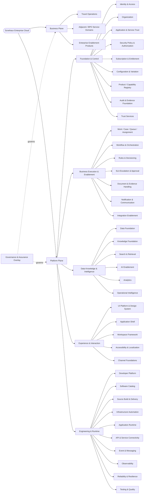
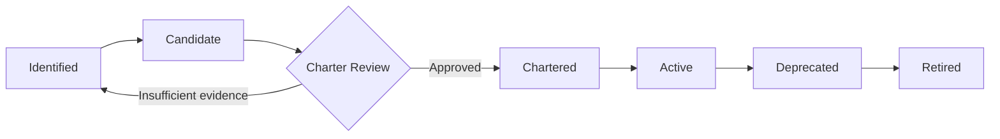

---
doc_meta:
  id: EAD-001
  title: Enterprise Capability & Domain Map
  owner: Architecture Authority
  version: 2.0.0
  status: approved
  classification: internal
  governed_by: [GDC-006]
  review_cycle_days: 180
  created_date: 2026-08-06
  last_reviewed: 2026-08-10
---

# Enterprise Capability & Domain Map

## 1. Purpose

Establish the authoritative enterprise capability model for the **Scnehaux Enterprise Cloud**, assign every capability to one accountable domain, and define the strategic boundaries that govern all downstream Product Architecture Documents (PADs), System Architecture Documents (SADs), standards, and decisions.

**Decision question:** _What capabilities must the enterprise own, and which domain is accountable for each capability?_

This document defines enterprise intent and ownership. It does not define systems, APIs, databases, deployment topology, implementation phases, or component design.

## 2. Scope

**In scope:**

- Enterprise architectural planes and capability families.
- Single-domain authority for enterprise capabilities.
- Strategic classification and build/adopt posture.
- Capability-chartering and evolution principles.
- Canonical enterprise terms whose ownership crosses product boundaries.

**Out of scope:**

- System inventory and runtime relationships — EAD-002.
- Data authority and movement — EAD-003.
- API, event, file, and external-integration patterns — EAD-004.
- Technology portfolio, runtime, and reliability strategy — EAD-005.
- Trust boundaries and enterprise security strategy — EAD-006.
- Detailed domain capabilities, contracts, and NFRs — PADs.
- Physical systems, containers, infrastructure, and code — SADs and TDDs.

This document binds every enterprise and product team operating within the Scnehaux Enterprise Cloud architecture lineage.

## 3. Enterprise Context

Scnehaux Enterprise Cloud is ATI Business Group's enterprise technology ecosystem for internal enterprise applications, BPO service delivery, travel operations, shared platforms, and future commercial cloud products.

The strategic progression is:

```text
Internal Operating Platform
    → Software-Enabled Managed Service
        → Managed Platform / BPaaS
            → Selective SaaS Products
```

ATI does not replace every client or industry system of record. The enterprise differentiates through execution, coordination, evidence, reconciliation, knowledge, and intelligence while integrating with client-owned and industry-owned authorities.

The architecture therefore separates direct business outcome ownership from reusable platform capability and governance. The Platform Plane is grouped by five enduring concerns: foundational control, business execution, data/knowledge/intelligence, experience/interaction, and engineering/runtime.

## 4. Architectural Drivers & Lessons

### 4.1 Business Goals

| ID | Business Goal | Architectural Consequence |
| :-- | :-- | :-- |
| G1 | Improve ATI operational quality, capacity, and traceability | Travel and BPO products remain the primary business focus |
| G2 | Reuse trusted capabilities across products | Shared capabilities receive explicit domain ownership and contracts |
| G3 | Support multiple organizations, tenants, products, and applications | Identity, tenancy, application ownership, and entitlement remain distinct authorities |
| G4 | Preserve client and industry systems of record | ATI owns execution state and projections without claiming external canonical authority |
| G5 | Deliver urgent foundations without approving an imaginary product suite | Target capabilities are separated from formally chartered domains |
| G6 | Prevent platform and microservice sprawl | A named capability does not automatically become a platform, team, database, or deployable |

### 4.2 Value Streams to Capability Families

| Value Stream | Primary Capability Families |
| :-- | :-- |
| Workforce administration | HCM, Foundation & Control, Experience & Interaction |
| Client and service onboarding | BPO Service Management, Foundation & Control, Business Execution & Enablement |
| Work intake to operational outcome | Travel/BPO Product domains, Business Execution & Enablement |
| Travel servicing and reconciliation | Travel Operations, Business Execution & Enablement, Data Knowledge & Intelligence |
| Product and tenant onboarding | Foundation & Control, Business Execution & Enablement |
| Knowledge-assisted operations | Data Knowledge & Intelligence, Product domains |
| Software delivery | Experience & Interaction, Engineering & Runtime |

### 4.3 Lessons Incorporated

| Lesson | Enterprise Response |
| :-- | :-- |
| Generic enterprise products were treated as strategic commitments without evidence | Product families remain hypotheses until chartered through discovery and ownership |
| Tenant, membership, identity, and entitlement were compressed into one platform | Each concept receives a distinct authority |
| Every reusable idea was prematurely called a platform | Capability, domain, system, and deployable are separate concepts |
| Client-system data was treated as ATI-owned truth | External authority is explicit and local projections remain non-authoritative |
| Shared capabilities accumulated business-specific logic | Product domains own business meaning and outcomes |
| Co-owned capabilities created ambiguous accountability | One capability has one accountable domain |

## 5. Architecture Model

### 5.1 Macro Capability Map



The top-level groups are logical capability boundaries. They do not imply one deployable, database, platform product, or team for every box.

The Platform Plane groups reusable capability by enduring concern rather than current technology or organization structure:

- **Foundation & Control** — authority, identity, context, trust, policy, configuration, and evidence
- **Business Execution & Enablement** — reusable machinery for moving and coordinating operational work
- **Data, Knowledge & Intelligence** — governed facts, knowledge, retrieval, analysis, and intelligence
- **Experience & Interaction** — reusable human-interaction foundations without owning product-specific journeys
- **Engineering & Runtime** — developer, delivery, runtime, connectivity, observability, reliability, and quality substrate

A capability shown here may remain local to a product until reuse, authority, risk, or lifecycle evidence justifies shared ownership.

### 5.2 Domain Ownership Matrix

| Plane / Group | Domain or Capability Family | Authoritative Responsibility | Strategic Posture |
| :-- | :-- | :-- | :-- |
| Business Plane | Human Capital Management | Employee, employment, HR organization, attendance, leave, payroll, talent | Supporting enterprise product |
| Business Plane | BPO Service Management | Client/service lifecycle, workforce operations, quality, SLA, and operational commercial outcomes | Adjacent business family |
| Business Plane | Travel Operations | Air, land/sea, travel-finance, and customer/consultant operational outcomes | Primary business transformation family |
| Business Plane | Product Experience | Domain-specific journey, workspace semantics, and business interaction | Product-owned experience |
| Foundation & Control | Identity & Access | Principal, authentication, federation, sessions, protocol trust, workload identity | Foundational control capability |
| Foundation & Control | Organization | Organization, tenant, workspace, membership, operating context | Foundational control capability |
| Foundation & Control | Application & Service Trust | Application/client registration, service identity, and trust relationships | Foundational control capability |
| Foundation & Control | Security Policy & Authorization | Cross-product security policy definition, policy distribution, contextual authorization support, and authorization decision evidence | Foundational control capability |
| Foundation & Control | Subscription & Entitlement | Subscriber account, subscription, commercial grants, quotas, and shared capability grants where chartered | Foundational control capability |
| Foundation & Control | Configuration & Variation | Governed shared, tenant-aware, environment-aware, and feature configuration | Foundational control capability |
| Foundation & Control | Product / Capability Registry | Product/capability definitions, lifecycle metadata, and consumer relationships where required | Candidate control capability |
| Foundation & Control | Audit & Evidence Foundation | Enterprise evidence references, retention metadata, and chain of custody | Assurance capability |
| Foundation & Control | Trust Services | Keys, secrets, certificates, signing, and verification services | Prefer proven/managed substrate |
| Business Execution & Enablement | Work / Case / Queue / Assignment | Reusable operational work coordination machinery | Shared execution candidate |
| Business Execution & Enablement | Workflow & Orchestration | Reusable long-running human/system coordination | Shared execution candidate |
| Business Execution & Enablement | Rules & Decisioning | Reusable deterministic decision and validation machinery | Shared execution candidate |
| Business Execution & Enablement | SLA / Escalation / Approval | Reusable timers, thresholds, review, maker-checker, and escalation machinery | Shared execution candidate |
| Business Execution & Enablement | Document / Evidence Handling | Reusable document, attachment, version, and evidence handling | Shared enabling candidate |
| Business Execution & Enablement | Notification & Communication | Reusable notification, template, delivery-channel, and message context | Shared enabling candidate |
| Business Execution & Enablement | Integration Enablement | Reusable internal, client, and industry connectivity mechanisms | Shared enabling candidate |
| Data, Knowledge & Intelligence | Data Foundation | Governed analytical data, data products, contracts, metadata, and semantic models | Shared data capability |
| Data, Knowledge & Intelligence | Knowledge Foundation | Governed knowledge, ontology/taxonomy, provenance, effective dates, and access | Shared knowledge capability |
| Data, Knowledge & Intelligence | Search & Retrieval | Lexical, metadata, semantic, hybrid, and evidence-driven advanced retrieval | Shared intelligence capability |
| Data, Knowledge & Intelligence | AI Enablement | Governed model access, context, tools, agents, guardrails, evaluation, and telemetry | Shared intelligence capability |
| Data, Knowledge & Intelligence | Analytics & Operational Intelligence | Metrics, reporting, signals, recommendations, risk and operational insight | Shared intelligence capability |
| Experience & Interaction | UI Platform & Design System | Design tokens, primitives, components, accessibility foundations, visual language | Shared experience capability |
| Experience & Interaction | Application Shell & Workspace Framework | Reusable navigation, shell, layout, composition, and role/context-aware workspace primitives | Shared experience capability |
| Experience & Interaction | Accessibility / Localization / Channel Foundations | Reusable interaction requirements and channel foundations | Shared experience capability |
| Engineering & Runtime | Developer Platform & Software Catalog | Developer experience, ownership metadata, templates, paved roads, and discoverability | Shared engineering platform |
| Engineering & Runtime | Source, Delivery & Infrastructure Automation | Build, test, release, artifact, infrastructure, and environment automation | Shared engineering platform |
| Engineering & Runtime | Runtime / Connectivity / Messaging | Governed application execution and communication substrate | Adopt/build as justified |
| Engineering & Runtime | Observability / Reliability / Testing / Supply Chain | Telemetry, resilience, quality, provenance, integrity, and engineering guardrails | Shared engineering capability |

Detailed capability trees and authority contracts belong in PADs after a capability is chartered. A row in this matrix does not authorize an independent service or platform product.

### 5.3 Strategic Domain Classification

| Classification | Definition | Default Posture |
| :-- | :-- | :-- |
| Foundational Control Capability | Cross-product authority or trust capability whose failure or compromise affects enterprise safety or isolation | Own architecture; adopt mature kernels/substrate where safer |
| Core Business Product | Directly differentiates ATI service delivery and commercial outcomes | Build from operational evidence |
| Supporting Enterprise Product | Supports ATI internal operations without defining primary market differentiation | Build pragmatically or integrate |
| Shared Execution Capability | Reusable business machinery with multiple justified consumers | Charter only after reuse or constitutional need is proven |
| Shared Intelligence Capability | Reusable data, knowledge, retrieval, AI, analytics, or intelligence capability | Build or adopt from measured consumer value |
| Shared Experience Capability | Reusable interaction foundation that accelerates multiple products without owning domain journeys | Build/adopt based on leverage and consistency |
| Shared Engineering Capability | Reusable developer, delivery, runtime, reliability, or quality substrate | Build/adopt based on leverage, risk, and lifecycle |
| Commodity Substrate | Standard capability with high implementation risk and low differentiation | Prefer managed or proven technology |

Classification determines investment posture, not physical topology.

### 5.4 Capability Evolution



A domain charter requires:

- one accountable owner;
- explicit authority and non-authority boundaries;
- justified consumers or a constitutional control need;
- defined enterprise relationships;
- build/adopt rationale;
- reliability and governance posture;
- migration implications for existing authorities.

A target capability is not implementation authorization.

### 5.5 Enterprise Glossary

| Term | Enterprise Meaning | Owning Domain |
| :-- | :-- | :-- |
| Organization | Legal or business party participating in the ecosystem | Organization |
| Subscriber Account | Commercial account purchasing an offering | Subscription & Entitlement |
| Client Account | BPO service-delivery relationship | BPO Client & Contract domain |
| Tenant | Technical isolation and operating boundary | Organization |
| Workspace | Collaboration or operating context within a tenant | Organization |
| Membership | Relationship between a Principal and a Tenant or Workspace | Organization |
| Principal | Stable human, service, workload, or agent security subject | Identity & Access |
| Product | Coherent business capability offered to users or customers | Product-owning domain |
| Product Offering | Packageable or commercial form of a Product | Product & Offering Catalog |
| Application | Software realization of a Product | Software Catalog |
| Entitlement | Effective commercial Product, module, feature, or quota grant | Subscription & Entitlement |
| Permission | Authorization grant concerning an action and resource | Product domain or Security Policy & Authorization |
| Evidence | Immutable or tamper-evident record supporting accountability | Audit & Evidence |

## 6. Principles & Rules

### 6.1 Single Domain Authority

Every capability and enterprise fact has one accountable authority, including facts whose authority is external to ATI.

- **Fitness function:** PAD ownership review reports zero duplicate authoritative capability claims.

### 6.2 Product Owns Business Meaning

Product domains own business state, business rules, and irreversible business outcomes. Shared platforms provide reusable machinery without absorbing domain meaning.

- **Fitness function:** platform PAD review reports zero unapproved product-specific authoritative aggregates.

### 6.3 Identity, Tenancy, Entitlement, and Permission Are Distinct

Authentication identity, operating membership, commercial grant, and business authorization remain separate authorities.

- **Fitness function:** domain-model audit reports zero cross-authority aggregate ownership.

### 6.4 Organization, Subscriber Account, Client Account, and Tenant Are Distinct

Legal, commercial, service-delivery, and technical-isolation boundaries are modeled explicitly.

- **Fitness function:** canonical data models require explicit references rather than inferred equivalence.

### 6.5 Capability Is Not a Deployable

A capability or domain does not automatically imply a microservice, database, team, or independent platform.

- **Fitness function:** every new system boundary traces to an approved PAD and SAD rationale.

### 6.6 Target Landscape Is Not Build Authorization

Identified capabilities require a charter before independent implementation.

- **Fitness function:** every PAD traces to a chartered capability and accountable owner.

### 6.7 External Authority Remains Explicit

ATI-owned projections and execution state do not silently replace client or industry systems of record.

- **Fitness function:** EAD-003 and affected PADs identify authority for every externally sourced critical fact.

### 6.8 No Universal Synchronous Control-Plane Fan-In

Cross-product control capabilities distribute trusted artifacts or bounded projections where feasible rather than requiring every product request to call a central service.

- **Fitness function:** EAD-002 dependency graph contains no unapproved universal per-request control dependency.

### 6.9 Platform First, Not Platform Prematurely

A reusable capability is centralized only when constitutional need, reuse, ownership, and lifecycle justify the cost.

- **Fitness function:** platform charter contains named consumers, owner, contracts, and adoption measure.

### 6.10 Governance Is an Overlay

Governance defines policy, decision rights, evidence, and lifecycle across all planes; it does not become a runtime business domain.

- **Fitness function:** governance artifacts own no business transaction state.

## 7. Alternatives Considered

| Alternative | Why Rejected | Debt Accepted |
| :-- | :-- | :-- |
| Preserve a generic SaaS-suite map | It overstates unvalidated ERP/CRM/ITSM-style product commitments | Product map remains intentionally coarse until discovery matures |
| Treat Travel Operations as the enterprise root | It excludes enterprise applications, control capabilities, and future verticals | Travel remains a major product family under a broader enterprise cloud |
| Put all cross-product concerns in IAM or one Workspace platform | It creates a control-plane god domain | Additional authority boundaries and contracts are required |
| Charter every target capability immediately | It creates platform, team, and runtime sprawl before value is proven | Some capabilities remain identified or candidate |
| One microservice per domain | It confuses logical ownership with physical deployment | Modular realizations may host multiple bounded contexts initially |

## 8. Single Points of Failure & Graceful Degradation

| Universal Capability | Enterprise Blast Radius | Required Direction |
| :-- | :-- | :-- |
| Identity trust | New authentication and credential lifecycle | Existing valid artifacts remain locally verifiable; new trust establishment fails closed |
| Tenant and membership context | New context and membership changes | Existing bounded context projections continue within declared freshness |
| Cryptographic trust | New signing, encryption, and credential operations | Verification remains available; unsafe fallback is prohibited |
| Messaging and evidence propagation | Delayed cross-domain state and evidence | Authoritative domains retain durable local facts for later delivery |
| External systems of record | Affected travel or financial journeys | Unsafe irreversible actions pause; safe local work continues where declared |

Universal dependency is minimized; enterprise importance does not justify synchronous fan-in on every request.

## 9. Ownership

| Responsibility                 | Accountable               | Consulted                                               |
| :----------------------------- | :------------------------ | :------------------------------------------------------ |
| Enterprise capability map      | Architecture Authority    | Product, Platform, Security, Data, and Operations leads |
| Domain charter                 | Architecture Review Board | Proposed owner and consumers                            |
| Product capability definition  | Product Domain Owner      | Operations SMEs and Architecture Authority              |
| Platform capability definition | Platform Owner            | Consumer teams and Architecture Authority               |
| Capability placement dispute   | Architecture Review Board | Affected owners                                         |
| MECE and glossary integrity    | Architecture Authority    | Domain owners                                           |

## 10. Dependencies

**Strategic inputs:** enterprise strategy, ATI operational discovery, and the governance constitution.

**Governed outputs:** the enterprise system landscape, data architecture, integration architecture, platform strategy, security strategy, and every downstream domain charter.

## 11. Traceability

- Root capability anchor for all PADs.
- Domain ownership changes require an enterprise ADR and major version change.
- EAD-002 through EAD-006 must use the same Business Plane, five-group Platform Plane, Governance Overlay, and enterprise glossary.
- Every PAD must resolve to one domain in the ownership matrix.

## 12. Assumptions

- ATI initially operates the ecosystem for internal and managed-service use.
- Client and industry systems of record remain present through multiple phases.
- Product discovery will refine the detailed BPO and Travel capability map.
- Logical domains may initially share physical runtimes while preserving authority boundaries.

## 13. Constraints

- Co-ownership of an authoritative capability is prohibited.
- Cross-domain database access is prohibited.
- A target capability cannot bypass the domain-charter process.
- Business-specific state cannot move into a shared platform without a boundary decision.
- Identity cannot own Tenant, Membership, Entitlement, Product, or business Permission.

## 14. Risks

| Risk | Likelihood | Impact | Mitigation |
| :-- | :-- | :-- | :-- |
| Capability inventory becomes an implementation backlog | High | High | Charter gate and accountable ownership |
| Control domains overlap | Medium | Critical | Glossary, authority matrix, PAD review |
| Product boundaries remain hypothetical | Medium | High | Discovery evidence before charter |
| Shared platforms absorb business logic | Medium | High | Product-authority principle and review |
| External projections become treated as canonical | Medium | Critical | EAD-003 authority classification |
| Logical domains cause premature microservices | High | Medium | SAD evidence required for physical separation |

## 15. Future Direction

The enterprise map evolves through strategic boundary changes, not through implementation detail. Product families will be refined after operational discovery, and shared capabilities will be chartered only when constitutional need or proven reuse justifies enterprise ownership.

## 16. References

- GDC-000 — Governance Policy.
- GDC-006 — EAD Guideline.
- Domain-Driven Design — Eric Evans.
- Team Topologies — Matthew Skelton and Manuel Pais.
- Wardley Mapping — Simon Wardley.
- Platform engineering and SaaS control-plane patterns.
