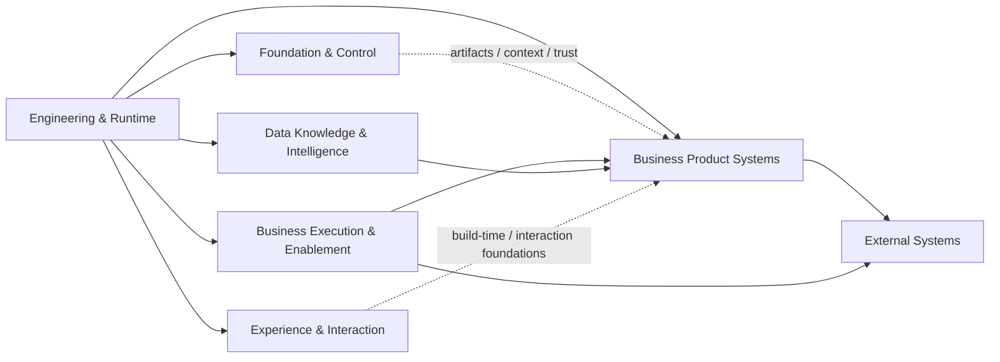

---
doc_meta:
  id: EAD-002
  title: Enterprise System Landscape
  owner: Architecture Authority
  version: 2.0.0
  status: draft
  classification: internal
  governed_by: [GDC-006]
  review_cycle_days: 180
  created_date: 2026-08-06
  last_reviewed: 2026-08-10
---

# Enterprise System Landscape

## 1. Purpose

Define the macro system landscape of the **Scnehaux Enterprise Cloud**, distinguish product systems from control and shared platform systems, establish the allowed direction of enterprise dependencies, and position external client and industry systems within the ecosystem.

**Decision question:** _Which major systems participate in the enterprise, what role does each play, and how may they depend on one another?_

This document is a C0 city map. It does not define containers, endpoints, databases, deployment units, detailed message contracts, or implementation roadmaps.

## 2. Scope

**In scope:**

- Major business-product and reusable-platform system categories.
- System roles and accountable domains.
- Macro dependency directions and relationship types.
- External-system categories and authority position.
- Coexistence between ATI systems and client/industry systems.

**Out of scope:**

- Domain capability detail — PADs.
- System/container topology — SADs.
- Data ownership and projection contracts — EAD-003 and downstream artifacts.
- Detailed API/event/file contracts — EAD-004 and standards.
- Runtime technology and deployment topology — EAD-005 and SADs.
- Security implementation — EAD-006, standards, and SADs.

This landscape governs every product, platform, and major external integration represented in the Scnehaux Enterprise Cloud architecture lineage.

## 3. Enterprise Context

Scnehaux Enterprise Cloud operates across three system realities:

1. **ATI-owned systems** that own enterprise control, execution, evidence, or intelligence.
2. **Client and industry systems** that remain authoritative for travel, financial, identity, or operational facts.
3. **Coexistence systems** through which legacy ATI processes and new digital products operate together during transition.

The landscape must remain understandable without assuming that every logical domain is an independent service. A domain may be realized by a module, a shared system, a managed service, or an independently deployed system according to PAD and SAD decisions.

## 4. Architectural Drivers & Lessons

### 4.1 Drivers

| ID | Driver | Landscape Consequence |
| :-- | :-- | :-- |
| D1 | Urgent Identity and UI delivery | Foundation and experience capabilities may progress independently of unresolved business-product detail |
| D2 | Multi-tenant and multi-product evolution | Control systems are separated from product systems |
| D3 | Client systems of record remain present | External systems are first-class landscape participants |
| D4 | Travel operations require multiple protocol ecosystems | Product-owned integration capabilities isolate external variation |
| D5 | Platform sprawl must be prevented | Domain, system, and deployable remain distinct |
| D6 | Enterprise-wide outages must be contained | Products prefer local validation and bounded projections over synchronous control lookups |

### 4.2 Lessons Incorporated

| Lesson | Landscape Response |
| :-- | :-- |
| Identity and tenancy were modeled with circular runtime dependency | They are peer authorities exchanging bounded lifecycle information |
| Generic integration was treated as mandatory hop for every external system | Natural business owner retains the external relationship; shared integration remains optional machinery |
| Capability maps were read as deployed-system inventories | Target capability, logical system, and deployed realization are explicitly separated |
| Client PSS/GDS/ERP data was treated as internal system truth | External systems retain their authority role |
| Central services became per-request bottlenecks | Signed artifacts and local projections support normal product operation |
| UI packages were treated like runtime services | UI Platform is a build-time capability by default |

## 5. Architecture Model

### 5.1 Global System Landscape

```mermaid
graph TB
    USERS[Employees, Operators, Supervisors, Clients, Partners]

    subgraph BUSINESS[Business Plane Systems]
        HCM[HCM Product System]
        BPO[BPO / Adjacent Service Systems]
        TRAVEL[Travel Operations Systems]
        PRODUCTUX[Domain-Specific Product Experiences]
    end

    subgraph PLATFORM[Platform Plane Systems]
        subgraph FC[Foundation & Control]
            IAM[Identity & Access]
            TEN[Organization Workspace & Tenancy]
            TRUST[Application / Service Trust]
            POLICY[Security Policy & Authorization]
            ENTITLE[Subscription & Entitlement]
            CONFIG[Configuration & Variation]
            AUDIT[Audit & Evidence Foundation]
        end

        subgraph BEE[Business Execution & Enablement]
            EXEC[Work / Case / Queue / Assignment]
            FLOW[Workflow / Rules / SLA / Approval]
            DOC[Document & Evidence Handling]
            NOTIF[Notification & Communication]
            INTEGRATION[Integration Enablement]
        end

        subgraph DKI[Data Knowledge & Intelligence]
            DATA[Data Foundation]
            KNOW[Knowledge / Search / Retrieval]
            AI[AI Enablement]
            OI[Analytics & Operational Intelligence]
        end

        subgraph EI[Experience & Interaction]
            UI[UI Platform & Design System]
            SHELL[Application Shell & Workspace Framework]
            ACCESS[Accessibility / Localization / Channels]
        end

        subgraph ER[Engineering & Runtime]
            DEV[Developer Platform & Software Catalog]
            DELIVERY[Source Build Delivery & Infrastructure Automation]
            RUNTIME[Application Runtime]
            CONNECT[API / Service Connectivity & Messaging]
            OBS[Observability / Reliability / Testing]
        end
    end

    subgraph EXTERNAL[Client and Industry Ecosystem]
        IDP[External Identity Providers]
        PSS[PSS / GDS / NDC / ATPCO]
        FIN[Client ERP / Payment / Settlement / Revenue Accounting]
        COMMEXT[Communication and Other Providers]
    end

    USERS --> PRODUCTUX
    PRODUCTUX --> HCM
    PRODUCTUX --> BPO
    PRODUCTUX --> TRAVEL

    BUSINESS -. consumes trust and reusable capability .-> PLATFORM
    PLATFORM -. engineering and runtime support .-> BUSINESS

    IAM -. federation .-> IDP
    TRAVEL -. business integration .-> PSS
    BPO -. business integration .-> FIN
    INTEGRATION -. provider connectivity .-> COMMEXT
```



The diagram represents system roles and capability grouping, not deployment topology. One system may realize multiple logical capabilities when authority, lifecycle, and coupling remain explicit.

### 5.2 Business vs Platform Topology

| System Category | Primary Responsibility | Ownership Rule |
| :-- | :-- | :-- |
| Business Product System | Business state, business outcome, and domain-specific journey | Owned by the corresponding business/product domain |
| Foundation & Control System | Cross-product identity, trust, tenancy/context, policy, configuration, or evidence authority | Owned by one accountable foundational domain/capability |
| Business Execution & Enablement System | Reusable work, workflow, rules, document, notification, or integration machinery without product-specific authority | Owned by a chartered shared capability when reuse is justified |
| Data, Knowledge & Intelligence System | Governed data, knowledge, retrieval, AI, analytics, or operational-intelligence capability | Owns derived/shared capability, not product transaction truth |
| Experience & Interaction System | Reusable UI, design, shell, workspace, accessibility, localization, or channel foundation | Owns interaction primitives, not domain-specific journeys |
| Engineering & Runtime System | Developer experience, software catalog, delivery, runtime, connectivity, messaging, observability, reliability, and quality | Owned by an engineering/platform capability |
| External System of Record | Canonical state owned by a client, partner, or industry provider | Authority remains external |
| Legacy / Coexistence System | Existing ATI or client system used during transition | Authority and retirement path are explicit |

A logical capability may be realized by one or more systems, and one system may initially realize multiple bounded contexts when authority and lifecycle remain explicit.

#### Target, Chartered, and Deployed Views

- **Target landscape:** major system roles and candidate shared capabilities required by enterprise direction
- **Chartered landscape:** responsibilities backed by an approved PAD and accountable owner
- **Deployed landscape:** systems and managed services represented by SADs and operational evidence

These views must not be conflated.

### 5.3 System Dependency

#### Relationship Types

| Relationship | Meaning | Dependency Implication |
| :-- | :-- | :-- |
| Synchronous Runtime Dependency | Caller cannot complete the current journey without an immediate response | Creates a directed runtime edge |
| Asynchronous Publication / Subscription | State is exchanged through durable events | Depends on messaging substrate, not directly on the other domain's availability |
| Local Artifact Validation | Consumer validates a signed or versioned artifact locally | No runtime edge to issuing system during normal use |
| Bounded Projection Consumption | Consumer uses locally held, reconciled control data | No per-request runtime edge to authority |
| Build-Time Dependency | Consumer uses a package, schema, or generated artifact during build | No production runtime edge |
| Administrative Dependency | Human or control-plane operation invokes another system | Not part of normal product request path unless declared |

#### Macro Dependency Direction



The diagram expresses stable responsibility direction, not mandatory network hops. Runtime edges remain journey-specific and must be declared downstream.

#### Identity and Tenancy

Identity & Access and Organization & Tenancy are peer authorities:

- Identity owns Principal and authentication trust.
- Tenancy owns Tenant, Workspace, Membership, and operating context.
- They exchange lifecycle facts through bounded contracts.
- Neither requires a synchronous call to the other on every authentication or product request.

#### Dependency Rules

1. Synchronous runtime dependencies remain acyclic.
2. Product systems do not depend directly on another Product's database or code.
3. Normal token validation does not call Identity synchronously.
4. Normal tenant-context validation does not call Tenancy synchronously when a bounded projection is sufficient.
5. UI/design packages are build-time dependencies by default; runtime experience services require explicit PAD/SAD justification.
6. Shared Integration is not a universal gateway for every external interaction.
7. External-provider failure is isolated to the affected journey where possible.
8. Dependency criticality is measured by business journey, not by system label alone.

### 5.4 External Ecosystem

| External Category | Examples | Canonical Role | Natural ATI Owner |
| :-- | :-- | :-- | :-- |
| Enterprise Identity Provider | Customer or partner identity authority | External authentication assertion | Identity & Access |
| Passenger Service / Distribution | PSS, GDS, NDC | Booking, ticket, offer, or servicing authority as contracted | Travel Product domain |
| Fare Distribution | ATPCO and airline fare systems | Fare and rule authority as contracted | Air Operations domain |
| Financial System | Client ERP, revenue accounting, settlement, payment | Financial posting, settlement, or payment authority | Product/finance operation domain |
| Communication Provider | Email, SMS, push, chat | Delivery authority | Communication capability |
| Regulatory / Reference Provider | Travel, currency, tax, compliance reference sources | External reference authority | Owning Product/Data domain |
| Legacy ATI System | Existing operational tools and manual channels | Transitional authority or coexistence participant | Named business owner |

External-system details, protocols, and connector topology belong in PADs, SADs, and standards.

### 5.5 System Roles and Authority Boundaries

| Role                   | Meaning                                                                            |
| :--------------------- | :--------------------------------------------------------------------------------- |
| System of Record       | Authoritative keeper of a defined fact set                                         |
| System of Execution    | Owns work, decision, command, and outcome state for an operational process         |
| System of Engagement   | Provides user or partner interaction without necessarily owning business truth     |
| System of Evidence     | Preserves immutable or tamper-evident accountability records                       |
| System of Intelligence | Produces derived analytical, knowledge, or AI outputs                              |
| Foundation / Control   | Manages cross-product trust, context, policy, configuration, or evidence lifecycle |
| Application Plane      | Executes product journeys using locally enforceable trust and context              |

A single system may play multiple roles only when each authority is explicit in its PAD and SAD.

### 5.6 Coexistence Direction

The enterprise permits controlled coexistence while new products replace fragmented operational processes:

```text
Existing Operational or Client System
    ↔ governed integration and reconciliation
New Scnehaux Product or Control System
    → progressive authority transfer only when formally approved
```

No authority transfers merely because data has been copied or a new UI has been introduced.

## 6. Principles & Rules

### 6.1 System Landscape Reflects Reality

Target, chartered, and deployed systems are represented as separate views.

- **Fitness function:** every deployed system resolves to a SAD and one accountable domain.

### 6.2 One System Has One Accountable Owner

A system may serve multiple domains, but operational accountability remains unambiguous.

- **Fitness function:** Software Catalog reports exactly one accountable team per system.

### 6.3 Domain, System, and Deployable Are Distinct

Logical ownership does not dictate physical topology.

- **Fitness function:** new deployables require SAD rationale and owner.

### 6.4 Synchronous Dependencies Are Acyclic

Runtime request dependencies must not form cycles.

- **Fitness function:** declarative dependency graph has zero cycles.

### 6.5 Foundation & Control Is Not a Per-Request Bottleneck

Products use locally validated artifacts and bounded projections where appropriate.

- **Fitness function:** architecture review reports zero unapproved universal Foundation & Control lookups.

### 6.6 External Authority Is Explicit

Every external system identifies the facts it owns and the ATI domain accountable for the relationship.

- **Fitness function:** external-system inventory has authority and owner for every critical integration.

### 6.7 Natural Owner Retains Business Integration

The Product domain owns business intent and outcome even when shared integration machinery is used.

- **Fitness function:** every external business integration maps to one Product or control owner.

### 6.8 Build-Time Dependencies Stay Out of Runtime

Packages, schemas, and design assets do not become production service dependencies without explicit justification.

- **Fitness function:** runtime graph excludes unapproved package/catalog dependencies.

### 6.9 Coexistence Is Governed

Legacy and new systems declare authority, synchronization, and retirement direction.

- **Fitness function:** coexistence systems have an owner and transition ADR.

## 7. Alternatives Considered

| Alternative | Why Rejected | Debt Accepted |
| :-- | :-- | :-- |
| One enterprise monolith | It centralizes unrelated lifecycles and blast radius | More explicit contracts and operational boundaries |
| One microservice per capability | It creates premature distributed-system complexity | Some systems initially realize multiple bounded contexts |
| Universal ESB or integration gateway | It obscures business ownership and creates a systemic bottleneck | Multiple approved integration paths remain possible |
| Synchronous lookup for all trust and context | It couples every Product to shared foundation availability | Bounded projection and reconciliation complexity |
| Replace all external systems of record | It exceeds ATI's strategic scope and client authority | Coexistence and reconciliation remain first-class |

## 8. Single Points of Failure & Graceful Degradation

| System Role | Blast Radius | Required Posture |
| :-- | :-- | :-- |
| Identity issuance | New login, refresh, federation | Existing valid artifacts continue locally; new trust establishment fails closed |
| Tenant-control administration | New Tenant and Membership changes | Existing projections continue within freshness policy |
| Messaging substrate | Delayed asynchronous propagation | Authorities retain durable facts and reconcile after recovery |
| Audit evidence system | Delayed enterprise evidence consolidation | Source systems retain local evidence until delivered |
| External system of record | Affected business journey | Unsafe commands pause; safe local work continues where defined |
| Software Catalog | New onboarding and ownership administration | Existing systems continue with cached registration metadata |

## 9. Ownership

| Responsibility               | Accountable                   | Consulted                   |
| :--------------------------- | :---------------------------- | :-------------------------- |
| Enterprise system landscape  | Architecture Authority        | Domain and Platform owners  |
| System ownership record      | Software Catalog owner        | Accountable system team     |
| External system relationship | Natural Product/control owner | Integration, Security, Data |
| Runtime dependency graph     | Architecture Authority        | System owners               |
| Coexistence and retirement   | Business and system owner     | Architecture Authority      |

## 10. Dependencies

**Strategic inputs:** the enterprise capability model and approved domain ownership.

**Governed outputs:** data authority, interaction, runtime, security, domain, and system architecture artifacts.

## 11. Traceability

- Every major system traces to one EAD-001 domain.
- Every deployed system traces to one or more SADs.
- Every external system has a natural ATI owner and authority statement.
- Dependency changes with enterprise-wide blast radius require an ADR and EAD review.

## 12. Assumptions

- Existing ATI and client systems remain during transition.
- Logical domains may share a physical system initially.
- Products can consume locally validated trust and control data.
- External providers expose varied protocols and operational characteristics.

## 13. Constraints

- Cross-domain database access is prohibited.
- Synchronous runtime dependency cycles are prohibited.
- No platform is a mandatory hop solely for architectural uniformity.
- A copied external fact does not transfer authority.
- System ownership must remain explicit during coexistence.

## 14. Risks

| Risk | Likelihood | Impact | Mitigation |
| :-- | :-- | :-- | :-- |
| Target systems are mistaken for deployed reality | High | High | Separate views and SAD traceability |
| Control systems become universal bottlenecks | Medium | Critical | Local artifacts and projections |
| External authority is obscured | Medium | Critical | External inventory and EAD-003 authority model |
| Logical domains cause system sprawl | High | Medium | SAD evidence for physical boundaries |
| Legacy systems persist without retirement ownership | Medium | High | Coexistence ADR and accountable owner |
| Shared integration absorbs Product responsibility | Medium | High | Natural-owner rule |

## 15. Future Direction

The landscape will evolve from fragmented coexistence toward governed product and platform systems. New systems enter only through a chartered domain and SAD, while external-system authority remains explicit until a formally governed transfer occurs.

## 16. References

- EAD-001 — Enterprise Capability & Domain Map.
- GDC-000 — Governance Policy.
- GDC-006 — EAD Guideline.
- C4 System Landscape concepts.
- Domain-Driven Design context mapping.
- Team Topologies.
