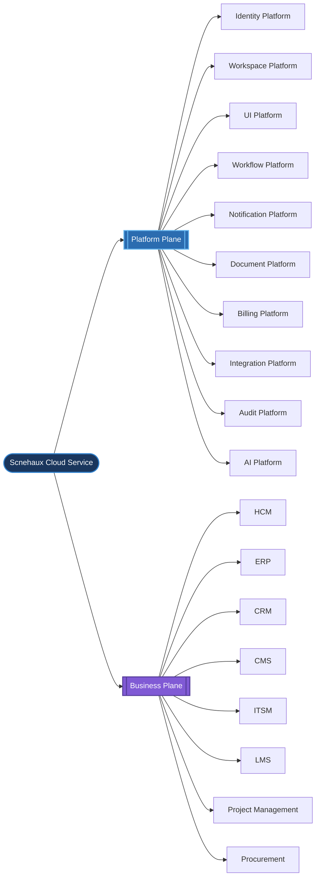
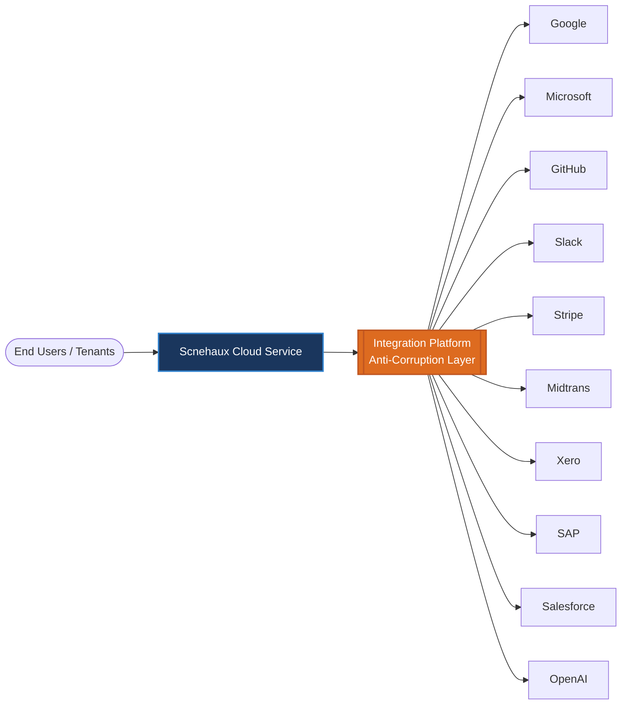

---
doc_meta:
  id: EAD-002
  title: Enterprise System Landscape
  owner: Architecture Authority
  version: 1.0.0
  status: approved
  classification: internal
  governed_by: [GDC-006]
  review_cycle_days: 180
  last_reviewed: 2026-07-05
---

# Enterprise System Landscape

## 1. Purpose

Provide the enterprise "city map": the inventory of deployable systems, their placement in the Platform or Business plane, the direction of allowed dependencies between them, and the boundary with the external vendor ecosystem. Where EAD-001 defines _what capabilities exist_, this document defines _which systems realize them_ and _how those systems are permitted to depend on one another_.

**Decision question this document answers:** _"What systems exist, who owns each, and in which direction may dependencies flow?"_

This document states the macro system topology and dependency direction. It does not define runtime deployment, container internals, API signatures, or messaging protocols; those are owned by EAD-004 and downstream SADs.

---

## 2. Scope

**In scope:**

- The enterprise inventory of deployable Platform Services and Business Products.
- The plane placement (Platform vs Business) of every system, inherited from EAD-001 ownership.
- The permitted direction of runtime dependencies (the acyclic dependency rule).
- The boundary and integration categories for external third-party systems.

**Out of scope:**

- Deployment topology, replicas, regions, and infrastructure (owned by EAD-005 and SAD).
- API and event contract definitions (owned by EAD-004).
- Data ownership and persistence (owned by EAD-003).
- Internal container decomposition of any single system (owned by SAD).

---

## 3. Enterprise Context

The Scnehaux Cloud Service is a constellation of independently deployable systems that compose into one product experience. Every system belongs to exactly one domain as defined in **EAD-001**, and therefore inherits that domain's owner and availability tier.

The landscape is governed by one structural invariant: **dependencies point inward and downward, toward stable substrate, and never form a cycle.** Business Products depend on Platform Services; Platform Services depend on infrastructure; nothing depends back up the stack. This is the Stable Dependencies Principle applied at enterprise scale, and it is what allows any single system to be deployed, scaled, or replaced without a coordinated enterprise release.

---

## 4. Architectural Drivers & Lessons

### 4.1. Drivers

The system inventory and its dependency direction are shaped by the enterprise business goals in EAD-001 (G1–G4) and realize the value streams defined there. The landscape's specific drivers:

| Driver | Landscape Consequence |
| :-- | :-- |
| Independent deployability per domain | Each system owns its pipeline; no coordinated enterprise release |
| Contain blast radius of a failed or breached system | Strictly layered, acyclic dependency direction (inward/downward) |
| Localize vendor change | All external systems mediated by the Integration Platform ACL |
| Stable enterprise map across product churn | Systems added inside existing domains before chartering new ones |

### 4.2. Lessons Incorporated

This landscape reacts to failure modes recorded in enterprise COE (Correction-of-Error) themes, not a greenfield ideal.

| COE-class lesson | Design response in this document |
| :-- | :-- |
| Product-to-product point-to-point calls silently produced a distributed monolith | Business Products MUST NOT depend directly on each other; collaboration is mediated |
| A dependency cycle removed the ability to release any system independently | Enterprise dependency graph MUST remain a DAG (topological-sort fitness function) |
| A vendor SDK leaking into a domain turned a vendor swap into a multi-quarter rewrite | Vendor Isolation via the Integration Platform Anti-Corruption Layer |

---

## 5. Architecture Model

### 5.1. Global System Landscape



The landscape enumerates **10 Platform Services** and **8 Business Products**. This inventory is authoritative: a system that does not appear here does not officially exist, and introducing one requires an Architecture Authority-approved update to this map plus a governing PAD.

### 5.2. Platform vs Product Topology

| #   | Platform Service      | Realizes Capability (EAD-001)      | Availability Tier |
| :-- | :-------------------- | :--------------------------------- | :---------------- |
| 1   | Identity Platform     | Authentication, Authorization, IAM | Tier-0            |
| 2   | Workspace Platform    | Tenant, organization, workspace    | Tier-0            |
| 3   | UI Platform           | Design system foundation           | Tier-1            |
| 4   | Workflow Platform     | Process orchestration              | Tier-1            |
| 5   | Notification Platform | Multi-channel delivery             | Tier-1            |
| 6   | Document Platform     | File and document services         | Tier-1            |
| 7   | Billing Platform      | Subscription and metering          | Tier-1            |
| 8   | Integration Platform  | External connectivity              | Tier-1            |
| 9   | Audit Platform        | Audit trail and compliance         | Tier-1            |
| 10  | AI Platform           | Intelligent services               | Tier-2            |

| #   | Business Product   | Classification      | Availability Tier |
| :-- | :----------------- | :------------------ | :---------------- |
| 1   | HCM                | Core Business       | Tier-1            |
| 2   | ERP                | Core Business       | Tier-1            |
| 3   | CRM                | Supporting Business | Tier-2            |
| 4   | CMS                | Supporting Business | Tier-2            |
| 5   | ITSM               | Supporting Business | Tier-2            |
| 6   | LMS                | Supporting Business | Tier-2            |
| 7   | Project Management | Supporting Business | Tier-2            |
| 8   | Procurement        | Supporting Business | Tier-2            |

Platform Services expose reusable enterprise capabilities: identity and access, tenant and workspace, billing and subscription, workflow automation, notification delivery, document services, enterprise integration, audit and compliance, UI foundation, and AI services. Business Products compose these to deliver market-facing outcomes.

### 5.3. System Dependency

The permitted dependency direction is strictly layered and acyclic:

```text
   Business Products
          │  (may depend on)
          ▼
   Platform Services
          │  (may depend on)
          ▼
     Infrastructure
```

**Dependency matrix (consumer → provider):**

| Consumer                 | Provider              | Interaction                                |
| :----------------------- | :-------------------- | :----------------------------------------- |
| All systems              | Identity Platform     | Asynchronous local JWT validation          |
| All systems              | Workspace Platform    | Synchronous tenant context                 |
| All systems (UI surface) | UI Platform           | Build-time / runtime component consumption |
| Business Products        | Workflow Platform     | Asynchronous orchestration                 |
| Business Products        | Notification Platform | Asynchronous delivery                      |
| Business Products        | Document Platform     | Synchronous + asynchronous                 |
| Business Products        | Integration Platform  | Synchronous egress / ingress               |
| Business Products        | Audit Platform        | Asynchronous, fire-and-forget              |
| Business Products        | Billing Platform      | Event-driven metering                      |
| Business Products        | AI Platform           | Synchronous inference / async batch        |

**Dependency rules (invariant):**

- Platform Services MUST NOT depend on Business Products (inversion is prohibited).
- Business Products MUST NOT depend directly on other Business Products; collaboration is mediated by a Platform Service or a published contract.
- Cross-system communication occurs only through published contracts (EAD-004).
- Only **Synchronous Runtime Dependencies** (per the relationship semantics in EAD-001 §5.5) form edges in this graph; asynchronous event publication/subscription and locally-validated platform-capability consumption are decoupled through the Event Broker and therefore create no dependency edge.
- Circular dependencies are prohibited; the enterprise dependency graph MUST remain a DAG.

### 5.4. External Ecosystem



Every external dependency is mediated by the Integration Platform acting as an Anti-Corruption Layer, so that no vendor data model penetrates an internal domain.

| Category          | Representative Vendors    | Mediation                             |
| :---------------- | :------------------------ | :------------------------------------ |
| Identity Provider | Google, Microsoft, GitHub | Federated via Identity Platform       |
| Payment Provider  | Stripe, Midtrans          | Isolated behind Billing + Integration |
| AI Provider       | OpenAI                    | Wrapped by AI Platform                |
| ERP Integration   | SAP                       | Anti-Corruption Layer in Integration  |
| Accounting        | Xero                      | Anti-Corruption Layer in Integration  |
| CRM Integration   | Salesforce                | Anti-Corruption Layer in Integration  |
| Collaboration     | Slack                     | Outbound via Notification Platform    |

**External integration rules:**

- External systems are never part of the Scnehaux domain model.
- Every external integration transits an enterprise contract through the Integration Platform.
- Vendor-specific SDKs and payloads are isolated inside the Anti-Corruption Layer and never leak into a domain.
- Business Products MUST NOT communicate directly with an external vendor.

---

## 6. Principles & Rules

Each principle is paired with a machine-verifiable or audit-verifiable **fitness function**, upholding the GDC-000 maxim that a rule without an enforcement mechanism is only a suggestion.

### 6.1. Platform-Centric Composition

Every Business Product is composed from reusable Platform Services rather than bespoke re-implementation.

- **Rationale:** Composition over reimplementation is the entire economic case for the Platform plane.
- **Fitness function:** Zero Business Product implements a capability owned by a Platform Service (verified against EAD-001 at PAD review).

### 6.2. Independently Deployable Systems

Every system in the landscape deploys on its own pipeline without a coordinated enterprise release.

- **Rationale:** Independent deployability is the operational proof that boundaries are real.
- **Fitness function:** No release requires simultaneous deployment of two systems owned by different domains.

### 6.3. Stable, Acyclic Dependencies

Dependencies point toward more stable substrate and never form a cycle.

- **Rationale:** A cycle in the dependency graph reintroduces the monolith and makes independent release impossible.
- **Fitness function:** The enterprise dependency graph passes a topological sort with `0` back-edges.

### 6.4. Vendor Isolation

External vendors are wrapped by an Anti-Corruption Layer and never leak into a domain model.

- **Rationale:** Direct vendor coupling makes migration a multi-quarter rewrite and creates lock-in.
- **Fitness function:** Zero references to vendor SDKs or vendor DTOs outside the Integration Platform boundary.

### 6.5. Contract-Mediated Coupling

Cross-system interaction occurs only through published contracts.

- **Rationale:** Only a versioned contract can be evolved without breaking an unknown set of consumers.
- **Fitness function:** No point-to-point database or in-process dependency between systems in different domains.

---

## 7. Alternatives Considered

This layered, contract-mediated landscape was chosen against rejected alternatives. Each rejection is a consciously accepted trade-off.

| Alternative | Why Rejected | Debt Consciously Accepted |
| :-- | :-- | :-- |
| **Point-to-point product integration** (products call each other directly) | Reintroduces the distributed monolith; every product becomes coupled to another's uptime and internal model | Extra hop and latency through a mediating Platform Service or broker |
| **Single shared platform runtime** (all systems in one deployable) | Eliminates independent deployability — the entire economic case for the split | Operational overhead of many independently deployed systems |
| **Direct per-product vendor integration** (no central ACL) | Vendor coupling spreads across every product; migration cost multiplies; lock-in | Integration Platform is on the path for all egress/ingress (a shared dependency) |
| **Bidirectional platform↔product dependencies** (allow inversion for convenience) | Platform stability is destroyed the moment it depends on a churning product | Some product needs must be met by events/callbacks rather than a platform reaching upward |

---

## 8. Single Points of Failure & Graceful Degradation

The layered model contains most failures within a domain, but two synchronous fan-in dependencies are enterprise-wide SPOFs by construction. Their degradation posture is mandatory in the owning system's SAD.

| SPOF | Blast radius | Graceful degradation strategy |
| :-- | :-- | :-- |
| Identity Platform | Enterprise-wide | Consumers validate short-lived cached tokens locally during an Identity outage: existing sessions continue read/degraded operation, new logins and writes fail-closed — the estate degrades, it does not stop |
| Workspace Platform (synchronous tenant context) | Enterprise-wide | Cached tenant context with bounded TTL; new tenant provisioning is denied while existing-tenant reads continue |
| API Gateway (single synchronous ingress) | All external synchronous traffic | Multi-instance, health-checked, regionally redundant; async event paths through the broker are unaffected by a gateway degradation |
| Enterprise Event Broker | All asynchronous propagation | Replication factor ≥ 3, at-least-once with durable retention; producers buffer and consumers replay after recovery — delivery is delayed, not lost |

Identity and Workspace are the only systems permitted an enterprise-wide synchronous fan-in; both are Tier-0 and both MUST publish a degraded-mode contract in their SAD.

---

## 9. Ownership

| Responsibility                              | Accountable               | Consulted                             |
| :------------------------------------------ | :------------------------ | :------------------------------------ |
| Enterprise System Landscape (this artifact) | Architecture Authority    | Platform Leads, Product Leads         |
| Platform system inventory and boundaries    | Platform Teams            | Architecture Authority                |
| Business system inventory and boundaries    | Product Teams             | Architecture Authority                |
| External ecosystem and vendor mediation     | Integration Team          | Security Team, Architecture Authority |
| Dependency-direction enforcement            | Architecture Review Board | All Domain Leads                      |

---

## 10. Dependencies

**Upstream (this document depends on):**

- EAD-001 Enterprise Capability & Domain Map — supplies domain ownership and classification.

**Downstream (this document governs):**

- EAD-003 Enterprise Data Ownership & Topology.
- EAD-004 Enterprise Integration Architecture.
- Every Platform PAD and Business Product PAD (each system's PAD realizes an entry in this landscape).

---

## 11. Traceability

- **Realized by:** every Platform PAD and Business Product PAD.
- **Referenced by:** every SAD (a system's SAD MUST correspond to a system enumerated here) and, transitively, every TDD.
- **Consistency rule:** the system inventory here MUST stay in lockstep with the capability map in EAD-001; a system with no capability, or a capability with no realizing system, is a governance defect.

---

## 12. Assumptions

- Every deployable system maps to exactly one domain and therefore one owner.
- Systems are independently deployable and independently scalable.
- Platform Services remain reusable across at least two Business Products.

---

## 13. Constraints

- Platform Services cannot depend on Business Products.
- Business Products cannot depend directly on other Business Products.
- The enterprise dependency graph MUST remain acyclic.
- Every system has exactly one owning domain.
- Vendor SDKs remain isolated inside the Integration Platform.

---

## 14. Risks

| Risk | Likelihood | Impact | Mitigation |
| :-- | :-- | :-- | :-- |
| Product-to-product direct dependency | Medium | High — distributed monolith | Contract-Mediated Coupling rule + dependency audit |
| Dependency cycle introduced | Low | High — loss of independent release | Acyclic DAG fitness function in CI |
| Vendor lock-in via direct integration | Medium | Medium — costly migration | Vendor Isolation via Integration ACL |
| Platform capability duplicated per product | Medium | Medium — maintenance cost | Platform-Centric Composition rule |
| Landscape drift from capability map | Medium | Medium — governance blind spots | EAD-001/EAD-002 consistency review each cycle |

---

## 15. Future Direction

The landscape evolves by adding systems inside existing domains before ever chartering a new domain. New Platform Services are introduced only when a capability is proven reusable by two or more products. Vendor relationships are expected to change; the Anti-Corruption Layer ensures such changes remain localized to the Integration Platform rather than rippling across products.

---

## 16. References

- Domain-Driven Design — Eric Evans
- Team Topologies — Matthew Skelton & Manuel Pais
- C4 Model — System Landscape diagram (Simon Brown)
- Microservices Patterns — Chris Richardson
- Enterprise Integration Patterns — Gregor Hohpe
- Wardley Mapping — Simon Wardley
