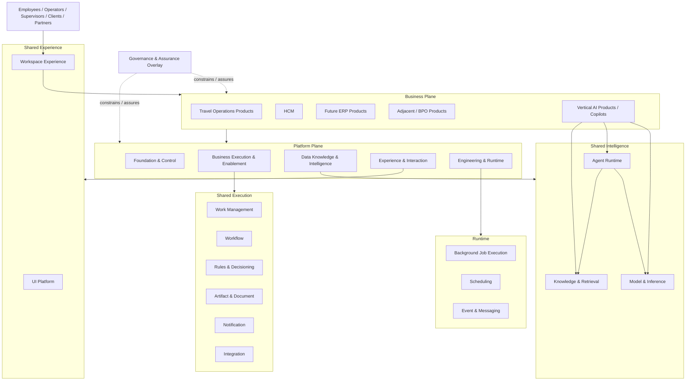
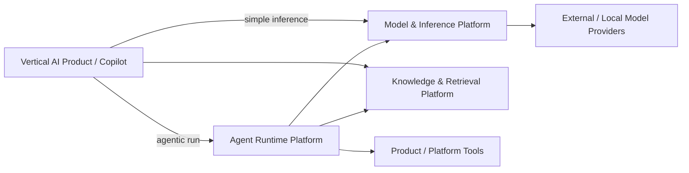

---
doc_meta:
  id: EAD-002
  title: Enterprise System Landscape
  owner: Architecture Authority
  version: 2.2.0
  status: approved
  classification: internal
  governed_by: [GDC-006]
  review_cycle_days: 180
  created_date: 2026-08-06
  last_reviewed: 2026-08-23
---

# Enterprise System Landscape

## 1. Purpose

Define the macro system landscape of the **Scnehaux Enterprise Cloud**, distinguish Business Product systems from reusable Platform systems, position Governance & Assurance as an overlay, and establish allowed dependency directions.

**Decision question:** _Which major system roles participate in the enterprise, what authority does each role hold, and how may they depend on one another without creating hidden coupling or duplicate authority?_

This EAD is a city map. It does not define containers, endpoints, databases, deployment units, or detailed integration contracts.

## 2. Scope

**In scope**

- Business Product and Platform system categories
- Governance & Assurance relationship to runtime systems
- Macro dependency direction and relationship types
- External systems and external authority
- Target, chartered, and deployed landscape distinctions
- Vertical AI Products and shared AI/Knowledge substrate
- Experience composition and Workspace Experience
- Background jobs, scheduling, workflow, and work-management system roles

**Out of scope**

- Detailed capability boundaries — PADs
- Container/deployment topology — SADs
- Data model and storage design — EAD-003 and downstream artifacts
- Detailed API/event/file contracts — EAD-004 and standards
- Technology selection — EAD-005, ADRs, standards, and SADs
- Security implementation — EAD-006 and downstream artifacts

## 3. Enterprise Context

Scnehaux serves Travel Operations, adjacent BPO services, HCM and future enterprise products such as ERP while preserving client and industry systems of record.

The target landscape is intentionally not a one-box-per-service diagram. A logical capability can be realized by a library, a module, a shared internal service, a managed service, or an independently deployed Platform Product.

AI-enabled Products are treated as Business Products or Product features when they own domain workflow and outcomes. Shared bounded model execution, durable Agent execution, knowledge/retrieval, Tool mediation, evaluation, and governance remain separate Platform capabilities.

## 4. Architectural Drivers & Lessons

### 4.1 Drivers

| ID | Driver | Landscape Consequence |
| :-- | :-- | :-- |
| D1 | Travel, HCM, and future ERP require common foundations | Shared capabilities are explicit but do not absorb Product meaning |
| D2 | ATI operates across multiple tenants, clients, providers, and applications | Identity, Organization, Application Trust, Entitlement, and Product authorization remain separate |
| D3 | Long-running work exists in multiple forms | Work Item, Workflow, Job, Schedule, Worker, and Queue are modeled separately |
| D4 | AI Products must survive model/provider and agent-runtime change | Vertical Products depend on stable Model & Inference, Agent Runtime, and Knowledge contracts rather than provider SDKs or agent frameworks |
| D5 | Human work spans Products | Workspace Experience composes Products without becoming the authority for Tenant/Workspace context |
| D6 | Shared systems create blast radius | Local validation, projections, asynchronous contracts, and graceful degradation are preferred where correctness permits |

### 4.2 Lessons Incorporated

| Lesson | Enterprise Response |
| :-- | :-- |
| Workspace was used both for operating context and user experience | Organization owns canonical Workspace context; Workspace Experience owns digital work composition |
| Worker, queue, workflow, and scheduler were treated as synonyms | Each receives a distinct architectural role |
| AI Platform was allowed to absorb knowledge and Product semantics | Model & Inference, Agent Runtime, Knowledge & Retrieval, and Product authority are separated |
| Data/knowledge copies were mistaken for Product truth | Derived representations preserve source authority and provenance |
| Shared Integration became a candidate universal hop | Natural owner retains external relationship; shared Integration is optional machinery |
| Platform taxonomies were read as deployment maps | Target capability, approved PAD, SAD, and runtime evidence are separate views |

## 5. Architecture Model

### 5.1 Global System Landscape



The diagram expresses roles and dependency direction, not deployment topology.

### 5.2 Platform vs Product Topology

| System Role | Primary Responsibility |
| :-- | :-- |
| Business Product System | Owns business state, business decisions, business workflow meaning, and outcomes |
| Foundation & Control System | Owns cross-product authority or trust capability |
| Shared Execution System | Owns reusable operational machinery without Product-specific authority |
| Knowledge & Retrieval System | Owns governed knowledge representation, provenance, indexes, and retrieval capability |
| Model & Inference System | Owns model/provider access, Capability Profiles, bounded inference, routing, model evaluation/release, usage, and inference telemetry |
| Agent Runtime System | Owns generic durable Agent execution, Agent Run state, Harness/context/memory mechanics, Tool Binding/mediation state, delegation/handoff, and agent-runtime evaluation |
| Experience System | Owns reusable interaction/composition foundations without Product business state |
| Engineering & Runtime System | Owns reusable execution/delivery/operability substrate |
| Governance & Assurance | Defines constraints, decision rights, evidence requirements, conformance, and exceptions |
| External System of Record | Owns facts explicitly retained outside ATI |
| Coexistence System | Transitional ATI/client system with explicit authority and retirement path |

### 5.3 Workspace Distinction

```text
Organization Platform
  Workspace
  = canonical operating context / membership scope

Workspace Experience Platform
  Workspace Experience
  = human digital work environment / composition shell
```

Workspace Experience may consume Organization context but SHALL NOT become authority for Organization, Tenant, Workspace, or Membership.

### 5.4 Work Execution Distinction

```text
Work Item
  business work requiring ownership/action

Workflow
  durable multi-step coordination

Job
  bounded technical unit of execution

Schedule
  durable future trigger

Worker
  runtime process executing a handler

Queue
  buffering / ordering / dispatch mechanism
```

These roles may interact but are not interchangeable.

### 5.5 AI Product and Platform Topology



Products own domain workflow, Product UX, domain prompt/skill meaning, business authorization, and final business outcome. Agent Runtime is optional for non-agentic Product inference and never becomes a universal request hop.

### 5.6 Target, Approved, Chartered, and Deployed Views

- **Target** — EAD capability appears in the enterprise direction
- **Approved logical domain** — PAD defines authority, boundaries, contracts, and NFR
- **Chartered physical system** — SAD placeholder exists but no physical design is approved
- **Draft physical system** — concrete design is under review
- **Approved physical system** — SAD is the active blueprint
- **Deployed** — runtime and operational evidence exist

An approved PAD is not implementation evidence.

### 5.7 System Dependency

Dependency direction is based on contract and business timing, not plane hierarchy alone.

- synchronous runtime dependencies remain acyclic
- local verification/projection is preferred for control facts where freshness permits
- asynchronous commands/events depend on messaging substrate rather than peer runtime availability
- Workspace Experience may compose Products without becoming their runtime gateway
- Model & Inference, Agent Runtime, and Knowledge & Retrieval are optional/declared Product dependencies, not universal request hops
- Workflow, Work Management, Scheduling, and Job execution may collaborate while retaining separate state authority

### 5.8 External Ecosystem

External systems include identity providers, client/industry travel systems, financial/ERP systems, communication providers, AI/model providers, regulatory/reference sources, and legacy/coexistence systems.

For every critical external relationship:

- canonical fact authority is explicit
- one ATI Product/Platform is the Natural Owner
- provider access/credentials are scoped and governed
- failure/degradation and reconciliation are declared
- shared Integration is used only where reusable machinery adds value

## 6. Principles & Rules

### 6.1 Business Products Own Business Outcomes

Platform systems SHALL NOT absorb Product-specific authoritative state or irreversible business decisions.

- **Fitness function:** platform PAD review finds zero Product-specific authoritative business aggregates

### 6.2 Canonical Authority Is Singular

Resilience may duplicate projections, caches, enforcement, and physical copies, but SHALL NOT silently create a second canonical authority for the same fact.

- **Fitness function:** authority catalog reports zero multiply-authoritative critical facts

### 6.3 Workspace Context and Workspace Experience Are Distinct

Organization owns Workspace context; Workspace Experience owns interaction composition only.

- **Fitness function:** domain model audit finds zero Organization/Tenant/Membership authority in Workspace Experience

### 6.4 Runtime Roles Are Explicit

Work Item, Workflow, Job, Schedule, Worker, and Queue SHALL be classified by responsibility rather than implementation vocabulary.

- **Fitness function:** new SADs using these concepts identify the corresponding authoritative capability

### 6.5 AI Is Not a Peer Plane

AI remains a reusable capability under Data, Knowledge & Intelligence. Vertical AI Products remain Business Products or Product features.

- **Fitness function:** enterprise capability map contains no separate AI Plane

### 6.6 Knowledge, Model Invocation, and Agent Execution Are Distinct

Knowledge & Retrieval owns governed knowledge representation and retrieval. Model & Inference owns bounded model execution. Agent Runtime owns durable Agent execution semantics.

- **Fitness function:** no one Platform PAD owns authoritative Knowledge, bounded model routing/inference, and durable Agent Run lifecycle together

### 6.7 Synchronous Dependencies Remain Acyclic

Runtime request dependencies SHALL NOT form cycles.

- **Fitness function:** declared runtime dependency graph reports zero cycles

### 6.8 No Universal Shared Hop

A shared Platform is not introduced into every journey merely for uniformity.

- **Fitness function:** architecture review finds zero mandatory shared hops justified solely by centralization

## 7. Alternatives Considered

| Alternative | Why Rejected |
| :-- | :-- |
| One shared mega-platform for all execution | Conflates work, workflow, scheduling, jobs, rules, and business semantics |
| One AI runtime owns model gateway, durable agents, knowledge, and vertical workflows | Conflates distinct execution models, creates a god-platform, and makes Product authority ambiguous |
| Workspace Platform owns tenant/workspace context | Duplicates Organization authority |
| Every target capability becomes a service | Creates premature distributed-system complexity |
| Central Integration mediates all providers | Obscures natural ownership and enlarges blast radius |

## 8. Single Points of Failure & Graceful Degradation

| Dependency | Blast Radius | Required Posture |
| :-- | :-- | :-- |
| Identity / Organization control | New authentication/context changes | Existing locally verifiable artifacts/projections continue where safe |
| Messaging substrate | Delayed async processing | Durable producers retain/replay accepted work |
| Scheduling | Delayed future triggers | Accepted schedules recover using durable state and misfire semantics |
| Workflow | Delayed long-running coordination | Process state remains durable/resumable |
| Model provider / Model & Inference | Bounded inference degradation | Evaluated route/fallback or explicit unavailable state; non-AI Product path where required |
| Agent Runtime | Agentic execution degradation | Durable run state and resumability; Product/Workflow truth remains outside the runtime |
| Knowledge & Retrieval | Reduced grounded intelligence/search | Product degrades explicitly; no fabricated knowledge truth |
| Workspace Experience | Shared navigation/composition unavailable | Product-specific direct entry remains possible where operationally required |

## 9. Ownership

| Responsibility | Accountable |
| :-- | :-- |
| Enterprise landscape and dependency model | Architecture Authority |
| Product business outcome | Product Domain Owner |
| Shared Platform capability | Platform Product Owner |
| Physical system availability | System Owner |
| Governance requirement | Named Governance Authority |
| External relationship | Natural Product/Platform Owner |

## 10. Dependencies

- This C1 architecture artifact has no synchronous runtime dependency on another architecture artifact
- Its inputs are enterprise strategy, accountable domain ownership, legal or contractual obligations, and validated operational evidence appropriate to its subject
- Cross-artifact architectural lineage is recorded in the Traceability section and MUST NOT be interpreted as a runtime dependency graph

## 11. Traceability

- Governed by GDC-006
- Refines EAD-001 capability roles without changing the five Platform Plane roots
- PAD-PLT-012 through PAD-PLT-015 establish logical boundaries for newly approved Platform Products
- ADR-GLB-012 defines AI, Knowledge, and Product authority separation
- ADR-GLB-015 refines AI execution into Model & Inference and Agent Runtime authorities
- PAD-PLT-008 defines Model & Inference
- PAD-PLT-016 defines Agent Runtime
- ADR-GLB-013 defines Work Item, Workflow, Job, Schedule, Worker, and Queue boundaries
