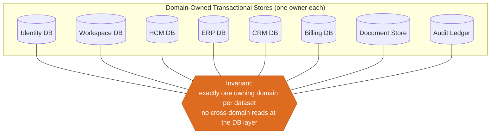
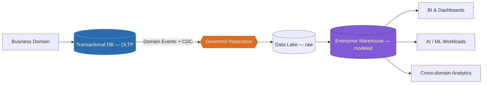
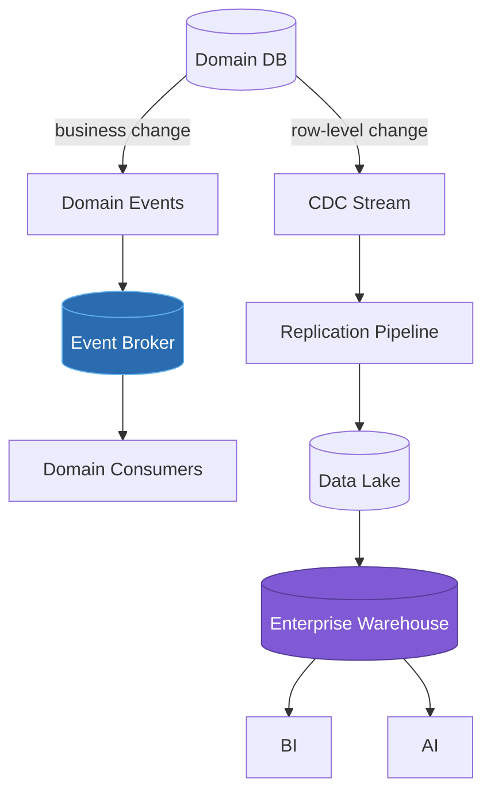

---
doc_meta:
  id: EAD-003
  title: Enterprise Data Ownership & Topology
  owner: Architecture Authority
  version: 1.0.0
  status: approved
  classification: internal
  governed_by: [GDC-006]
  review_cycle_days: 180
  last_reviewed: 2026-07-05
---

# Enterprise Data Ownership & Topology

## 1. Purpose

Establish enterprise data sovereignty: which domain owns which data, where the transactional boundary ends and the analytical boundary begins, how data legitimately moves between them, and the governance controls that keep the whole estate auditable. This document eliminates the shared operational database as an enterprise anti-pattern while enabling enterprise-wide analytics through governed replication.

**Decision question this document answers:** _"Who owns each dataset, and how may data cross a domain boundary without creating coupling?"_

This document states data ownership and movement policy. It does not define physical schemas, database engines, ETL code, or reporting tools; those are owned downstream by SAD and TDD.

---

## 2. Scope

**In scope:**

- Assignment of every dataset to exactly one owning domain (data sovereignty).
- The separation of transactional (OLTP) from analytical (OLAP) estates.
- The sanctioned mechanisms for moving data across boundaries (events, Change Data Capture).
- Enterprise data classification and the governance rules attached to each class.

**Out of scope:**

- Physical table design, indexing, partitioning, and storage engines (owned by SAD/TDD).
- Concrete ETL/ELT pipeline implementations and orchestration tools.
- Reporting and dashboard products (consumers of the analytical estate).
- Domain-internal data models (owned by each domain's PAD/SAD).

---

## 3. Enterprise Context

Scnehaux adopts a **Domain-Owned Data** architecture, the data-plane expression of the domain boundaries in **EAD-001**. Every domain is the sole authoritative source for the data it owns. No two domains share an operational database, and no domain reaches into another's store.

Enterprise analytics are built from **replicated, read-only data products**, not from queries against operational systems. This is the Data Mesh principle applied pragmatically: the operational estate optimizes for transactional correctness and isolation, while a separate analytical estate optimizes for cross-domain insight, and a governed, asynchronous replication path connects the two. The transactional estate is never coupled to, nor slowed by, analytical demand.

---

## 4. Architectural Drivers & Lessons

### 4.1. Drivers

Data topology is shaped by the enterprise goals in EAD-001 and by one dominant constraint: enterprise analytics must never be paid for in operational reliability.

| Driver | Topology Consequence |
| :-- | :-- |
| Data ownership is the physical proof of a bounded context | One owning domain per dataset; no shared operational DB |
| Analytics must not couple to or slow the transactional estate | Separate OLAP estate fed by asynchronous, governed replication |
| Privacy and residency are non-negotiable | PII stays domain-owned; analytical copies masked/tokenized; residency-bound |
| Every dataset must be discoverable and auditable | Cataloged ownership + end-to-end lineage |

### 4.2. Lessons Incorporated

Recorded from enterprise COE (Correction-of-Error) themes, not a greenfield ideal.

| COE-class lesson | Design response in this document |
| :-- | :-- |
| A reporting query run directly against an OLTP database degraded production | Reporting/BI MUST NOT query transactional stores; read only the replicated analytical estate |
| A shared operational database became irreversible coupling between domains | No Shared Persistence rule + zero cross-domain-grant fitness function |
| Unmasked PII replicated into a warehouse became a privacy incident | Masking/tokenization enforced at replication; PII cannot leave its domain unmasked |
| An unowned "temporary" dataset became an ungoverned data swamp | Data-as-a-Product: every analytical dataset has a registered owner, schema, and freshness SLA |

---

## 5. Architecture Model

### 5.1. Data Ownership

The diagram shows representative transactional stores. The invariant is exhaustive: **every domain in the EAD-001 Ownership Matrix maps to exactly one operational store, or is explicitly stateless.** The complete ownership assignment:

| Domain | Operational Store | Notes |
| :-- | :-- | :-- |
| Identity | Identity DB | Credentials, sessions, policy |
| Workspace | Workspace DB | Tenant, org, membership |
| Workflow | Workflow DB | Process/instance state |
| Notification | Notification DB | Delivery state, templates |
| Integration | Integration DB | Connector config, mapping state |
| Audit | Audit Ledger | Append-only, tamper-evident |
| AI | AI Store + Vector Index | Embeddings, retrieval index |
| Document | Document Store | Blobs + metadata |
| Billing | Billing DB | Subscription, metering, invoices |
| HCM | HCM DB | Human capital records |
| ERP | ERP DB | Resource-planning records |
| CRM | CRM DB | Customer records |
| ITSM | ITSM DB | Tickets, service records |
| Procurement | Procurement DB | Sourcing, purchase orders |
| Project Management | PM DB | Projects, portfolios |
| CMS | CMS DB | Content entities |
| LMS | LMS DB | Courses, enrollments |
| UI Platform | _none — stateless_ | Design-system assets are build-time artifacts, not operational data |

No two rows share a store; the single stateless domain (UI Platform) owns no operational data, so the map remains MECE.

**Ownership rules:**

| Rule | Description |
| :-- | :-- |
| Single Ownership | Every dataset has exactly one owning domain. |
| No Shared Database | Domains never share an operational database instance or schema. |
| Authoritative Source | The owning domain is the sole source of truth for its data. |
| Read Isolation | Other domains obtain data only through the owner's API or published events, never by direct query. |

### 5.2. Transactional & Analytical Boundary

| Layer | Optimized For | Access Pattern |
| :-- | :-- | :-- |
| Transactional (OLTP) | Correctness, low-latency writes, domain isolation | Owning domain only |
| Analytical (OLAP) | Cross-domain read, aggregation, ML | Read-only, replicated |

**Boundary rules:**

- Transactional databases remain private to their owning domain.
- Analytical systems are read-only and MUST NOT write back into transactional systems.
- Reporting and BI MUST NOT query transactional databases directly.
- The analytical estate consumes replicated data products, and its freshness is a governed target (analytical replication freshness P95 ≤ 15 minutes).

### 5.3. Data Movement Strategy

| Principle | Description | Target |
| :-- | :-- | :-- |
| Event First | Business state changes are published as domain events. | At-least-once; P99 propagation ≤ 5 s |
| CDC for Analytics | Change Data Capture replicates data to the analytical estate. | Freshness P95 ≤ 15 min |
| Asynchronous by Default | Cross-domain synchronization is eventually consistent. | Convergence within replication SLA |
| Immutable History | Historical records remain traceable and auditable. | Audit retention ≥ 400 days |

### 5.4. Data Governance

| Classification | Description | Baseline Control |
| :-- | :-- | :-- |
| Master Data | Enterprise reference data owned by one domain | Single-writer, published read model |
| Transactional Data | Operational business records | Domain-private, encrypted at rest |
| Reference Data | Shared lookup values | Versioned, read-only distribution |
| Analytical Data | Read-only reporting datasets | Replicated, no write-back |
| Audit Data | Immutable compliance records | Append-only, tamper-evident, ≥ 400-day retention |
| PII / Sensitive | Personally identifiable information | Domain-owned, encrypted, access-audited, residency-bound |

**Governance rules:**

- Every dataset has an identified owner recorded in a data catalog.
- Sensitive data follows the enterprise security policy defined in EAD-006.
- Data duplication is permitted only through governed replication, never ad-hoc copies.
- PII remains under its owning domain; replicated analytical copies are masked or tokenized.
- Analytical datasets are read-only.
- Data lineage from source to consumer is traceable end to end.

---

## 6. Principles & Rules

Each principle is paired with a machine-verifiable or audit-verifiable **fitness function**, upholding the GDC-000 maxim that a rule without an enforcement mechanism is only a suggestion.

### 6.1. Domain-Owned Data
Each business domain owns and governs its operational data.

- **Rationale:** Data ownership is the physical proof of a bounded context; shared data dissolves the boundary.
- **Fitness function:** Every dataset in the catalog resolves to exactly one owning domain; unowned datasets fail governance.

### 6.2. Database per Domain

Each domain owns its persistence; cross-domain database access is prohibited.

- **Rationale:** A shared database is the strongest and least reversible form of coupling.
- **Fitness function:** Cross-domain database grants = `0` (audited on every SAD).

### 6.3. Eventual Consistency Across Domains

Cross-domain data converges asynchronously through events and CDC.

- **Rationale:** Synchronous cross-domain consistency couples availability and destroys independent evolution.
- **Fitness function:** No cross-domain distributed transaction (two-phase commit) exists in the estate.

### 6.4. Data as a Product

Analytical datasets are curated, documented, discoverable data products.

- **Rationale:** Treating analytics output as a product with an owner and SLA prevents an ungoverned data swamp.
- **Fitness function:** Every analytical data product has a registered owner, schema, and freshness SLA.

### 6.5. No Shared Persistence

No two domains share an operational database.

- **Rationale:** Shared persistence is the precise mechanism by which decomposed services re-fuse into a monolith.
- **Fitness function:** Zero operational database instances mapped to more than one domain.

---

## 7. Alternatives Considered

The domain-owned data topology was chosen against rejected alternatives. Each rejection is a consciously accepted trade-off.

| Alternative | Why Rejected | Debt Consciously Accepted |
| :-- | :-- | :-- |
| **Shared enterprise operational database** | The strongest, least reversible form of coupling; dissolves every bounded context | Data duplication across domains and eventual consistency to reconcile |
| **Federated queries across domain databases** (query other domains' stores directly) | Recreates read-time coupling and couples availability; a slow domain slows its callers | Consumers must obtain data via the owner's API/events, adding latency and denormalization |
| **Synchronous cross-domain transactions (2PC)** for strong consistency | Couples the availability of every participant; a distributed monolith at the data layer | Cross-domain state is eventually consistent; workflows must tolerate convergence windows |
| **Reporting on OLTP read-replicas** (skip a separate analytical estate) | Analytical query shapes still contend with and constrain the transactional schema | A separate lake/warehouse and replication pipeline to build and operate |

---

## 8. Single Points of Failure & Graceful Degradation

Per-domain operational stores are isolated by design, so no single operational store is an enterprise SPOF. The shared risk is the replication path feeding analytics.

| SPOF | Blast radius | Graceful degradation strategy |
| :-- | :-- | :-- |
| Event Broker / CDC pipeline | Analytical freshness across all domains | At-least-once with durable retention; on outage the transactional estate is unaffected and events are buffered and replayed — analytics goes stale (bounded by SLA), it does not corrupt |
| Data Lake / Enterprise Warehouse | BI, AI/ML, cross-domain analytics | Read-only consumers serve last-successful data; dashboards degrade to a visible staleness marker rather than failing; no write-back path can affect OLTP |
| A single domain's transactional store | That domain only | Contained by database-per-domain; other domains continue on cached/replicated read models of that domain's published data |

The transactional/analytical separation is the core degradation guarantee: an analytical-estate failure can never degrade transactional correctness or availability.

---

## 9. Ownership

| Responsibility | Accountable | Consulted |
| :-- | :-- | :-- |
| Enterprise data governance (this artifact) | Architecture Authority | Data Platform Team, Security Team |
| Domain transactional data | Domain Teams | Architecture Authority |
| Analytical estate (lake, warehouse, products) | Data Platform Team | Domain Teams |
| Data classification and compliance | Security & Governance | Architecture Authority, Legal |
| Data catalog and lineage | Data Platform Team | Domain Teams |

---

## 10. Dependencies

**Upstream (this document depends on):**

- EAD-001 Enterprise Capability & Domain Map — supplies domain boundaries and ownership.
- EAD-002 Enterprise System Landscape — supplies the systems that own the stores.

**Downstream (this document governs):**

- EAD-004 Enterprise Integration Architecture — event and CDC movement conform to integration contracts.
- Every Platform PAD and Business Product PAD that owns data.
- Every SAD that defines persistence.

---

## 11. Traceability

- **Referenced by:** every PAD and every SAD involving persistence; the Data Platform, Analytics, and AI Platform.
- **Constraint enforced downstream:** a SAD that declares a database shared across domains, or a direct cross-domain query, is rejected against this policy.
- **Lineage anchor:** the enterprise data catalog traces every analytical product back to its owning transactional source defined here.

---

## 12. Assumptions

- Every domain owns and can independently operate its transactional store.
- Enterprise analytics is decentralized at the source and integrated at the warehouse.
- Replication between transactional and analytical estates is asynchronous.

---

## 13. Constraints

- Cross-domain joins against transactional databases are prohibited.
- Shared operational databases are prohibited.
- Data ownership cannot be shared or transferred without an ADR.
- Analytical systems cannot write into transactional systems.
- PII cannot leave its owning domain unmasked.

---

## 14. Risks

| Risk | Likelihood | Impact | Mitigation |
| :-- | :-- | :-- | :-- |
| Shared operational database emerges | Low | High — irreversible coupling | No Shared Persistence rule + grant audit |
| Multiple claimed owners for one dataset | Medium | Medium — data inconsistency | Single Ownership rule + data catalog |
| Direct reporting queries on OLTP | Medium | High — production degradation | Boundary rule + replicated analytical estate |
| Missing or broken lineage | Medium | High — compliance failure | Mandatory lineage in catalog |
| Unmasked PII in analytical estate | Low | High — privacy breach | Masking/tokenization at replication |

---

## 15. Future Direction

The data topology evolves by adding domain-owned datasets and governed data products, never by widening operational access. Analytical capability expands through additional replication and modeling rather than tighter operational coupling. Real-time analytical use cases are served by streaming materialized views fed from the event backbone, preserving the transactional/analytical separation.

---

## 16. References

- Domain-Driven Design — Eric Evans
- Data Mesh — Zhamak Dehghani
- Designing Data-Intensive Applications — Martin Kleppmann
- Enterprise Integration Patterns — Gregor Hohpe
- Change Data Capture (CDC) patterns
- Event-Driven Architecture
