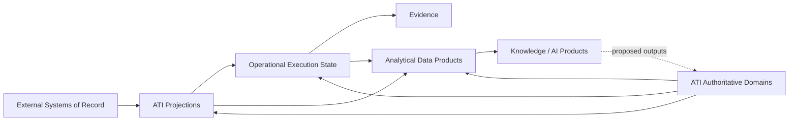

---
doc_meta:
  id: EAD-003
  title: Enterprise Data Ownership & Topology
  owner: Architecture Authority
  version: 1.0.0
  status: approved
  classification: internal
  governed_by: [GDC-006]
  review_cycle_days: 180
  created_date: 2026-08-06
  last_reviewed: 2026-08-06
---

# Enterprise Data Ownership & Topology

## 1. Purpose

Define enterprise data authority, ownership, movement, and governance for the **Scnehaux Enterprise Cloud**, including data whose canonical authority remains with client or industry systems.

**Decision question:** _Who is authoritative for each class of data, how may that data move, and what obligations apply when ATI stores a copy, projection, derivative, or execution record?_

This document defines enterprise data principles and macro topology. It does not define database schemas, table structures, storage indexes, field-level contracts, retention schedules, or implementation-specific pipelines.

## 2. Scope

**In scope:**

- Enterprise data-authority classes.
- Domain ownership of strategic data families.
- Transactional, operational, analytical, knowledge, and evidence boundaries.
- Macro movement and projection patterns.
- External-authority, freshness, reconciliation, and lineage principles.
- Enterprise data governance, classification, privacy, residency, and retention direction.

**Out of scope:**

- Physical schemas and storage engines — SADs and TDDs.
- API/event/file contract shape — EAD-004 and standards.
- Product-specific data models — PADs.
- Detailed security controls — EAD-006 and standards.
- Analytical model, ontology, vector-index, or pipeline implementation — PADs and SADs.

This document binds every system that creates, stores, transforms, exports, analyzes, or deletes enterprise or client data.

## 3. Enterprise Context

Scnehaux Enterprise Cloud is both:

- an owner of internal enterprise, control, operational-execution, and evidence data; and
- a processor of client and industry data whose canonical authority remains external.

Travel operations make this distinction critical. PNR, ticket, fare, inventory, payment, settlement, and financial posting may remain authoritative in client or industry systems, while ATI owns local work, decision, command, exception, reconciliation, and evidence state.

The data architecture therefore treats authority as an explicit property of every critical fact rather than assuming that the system holding a copy owns the truth.

## 4. Architectural Drivers & Lessons

### 4.1 Drivers

| ID | Driver | Data Consequence |
| :-- | :-- | :-- |
| D1 | Multi-tenant enterprise operation | Tenant, classification, purpose, and residency context accompany governed data |
| D2 | External travel and financial systems remain authoritative | External canonical data and local projections are distinct classes |
| D3 | Cross-product analytics and AI require reusable data | Analytical and knowledge products are derived without mutating source transactions |
| D4 | Operational actions may have financial impact | Freshness, revalidation, idempotency, evidence, and reconciliation are correctness concerns |
| D5 | Identity and tenancy authorities are being separated | Principal, Membership, Entitlement, and Product permission have distinct owners |
| D6 | Physical platform maturity will evolve | Logical data authority is independent of physical database consolidation or separation |

### 4.2 Lessons Incorporated

| Lesson | Data Response |
| :-- | :-- |
| Shared persistence recreated a distributed monolith | Domains own private logical persistence boundaries |
| Cached external data was treated as current truth | Projections remain non-authoritative and expose freshness |
| CDC was treated as a business contract | Business contracts remain owned APIs/events; CDC is an implementation mechanism |
| Analytical and AI stores became shadow authorities | Derived systems cannot directly mutate transactional truth |
| Tenant scope was lost during movement | Scope and classification travel with data |
| Deletion was treated as a single database operation | Retention, evidence, legal hold, external authority, and downstream copies are coordinated |

## 5. Architecture Model

### 5.1 Data Ownership

#### Data Authority Classes

| Class | Meaning | Authority Rule |
| :-- | :-- | :-- |
| ATI Authoritative Data | Facts created and governed by an ATI domain | One ATI domain is the source of truth |
| Externally Authoritative Data | Facts whose canonical owner is a client, partner, or industry system | External authority is named explicitly |
| Operational Execution State | Work, decision, command, exception, and outcome state created by ATI | Owned by the executing Product domain |
| Non-Authoritative Projection | Local copy used for performance, resilience, or product needs | Source authority, version, freshness, and reconciliation are declared |
| Evidence Data | Tamper-evident accountability record | Enterprise evidence authority owns the durable record |
| Derived / Analytical Data | Metrics, aggregates, features, models, or reports derived from source facts | Derived product owner is accountable; source lineage remains intact |
| Proposed / AI-Generated Data | Suggested classification, extraction, decision, or content | Never authoritative until accepted by the owning domain |
| Reference Data | Governed codes, classifications, and shared reference values | One named authority or external source owns the reference |

#### Canonical Ownership Matrix

| Data Family | Canonical Authority |
| :-- | :-- |
| Principal, Identifier, Authenticator, Session, Protocol Trust | Identity & Access |
| Organization, Tenant, Workspace, Membership | Organization |
| Product and Offering | Product-owning domain / Product & Offering Catalog |
| Application and Application Owner | Software Catalog |
| Subscription and Entitlement | Subscription & Entitlement |
| Employee, Employment, HR Organization, Payroll | HCM |
| BPO Client Account, Contract, SOW, Commercial Terms | BPO Client & Contract domain |
| Operational Team, Workstream Assignment, Shift, Capacity | Workforce Operations / Service Catalog domains |
| Work Item, Case, Task, Decision, Product Outcome | Owning Product domain |
| Enterprise Evidence | Audit & Evidence |
| PNR, Ticket, Offer, Inventory | Client or industry system defined by contract |
| Fare and Fare Rule | Airline, ATPCO, GDS, or contracted source |
| Financial Posting and Settlement | Client ERP, revenue accounting, payment, or settlement authority |
| Analytical Product | Named Data or Product owner |
| Knowledge Asset | Named Knowledge or Product owner with source provenance |

A copied fact does not change the authority listed above.

#### Logical Persistence Boundary

Each authoritative domain controls:

- its write model and integrity rules;
- access to its authoritative records;
- publication of its contracts;
- retention and correction obligations;
- restoration and reconciliation responsibility.

Multiple domains may temporarily share infrastructure, but direct cross-domain persistence access remains prohibited.

#### Authority Topology

The final arrow requires authoritative acceptance; derived systems cannot promote themselves.

### 5.2 Transactional & Analytical Boundary

| Data Plane | Purpose | Mutation Rule |
| :-- | :-- | :-- |
| Authoritative Transactional | Enforce business and control invariants | Only owning domain commands mutate state |
| Operational Projection | Support local product execution or resilience | Updated from declared authority; never independent truth |
| Evidence | Preserve accountability and chain of custody | Append and govern according to evidence policy |
| Analytical | Produce metrics, reports, forecasting, and data products | Read/derive from governed sources; no direct source mutation |
| Knowledge | Organize documents, claims, entities, relationships, and provenance | Source authority and access controls are preserved |
| AI / ML | Train, evaluate, infer, and recommend | Outputs remain derived or proposed until accepted |

Transactional workloads prioritize correctness and domain invariants. Analytical and AI workloads prioritize governed reuse, lineage, and appropriate freshness without coupling operational availability to analytical systems.

#### Data Product Boundary

A data product has:

- an accountable owner;
- defined consumers and purpose;
- source lineage;
- quality and freshness expectations;
- classification and access policy;
- lifecycle and deprecation rules.

A database table, dashboard, or copied dataset is not automatically a data product.

### 5.3 Data Movement Strategy

Sanctioned enterprise movement patterns include:

| Pattern               | Appropriate Use                                                                |
| :-------------------- | :----------------------------------------------------------------------------- |
| Provider-Owned API    | Current authoritative query or command requiring immediate response            |
| Domain Event          | Publication of an accepted fact to independent consumers                       |
| Bounded Projection    | Resilient local enforcement or read needs                                      |
| Batch / File Exchange | External or high-volume processes where synchronous contracts are unsuitable   |
| Change Data Capture   | Governed replication or analytical ingestion, not business semantics           |
| Data Export / Import  | Migration, portability, contractual delivery, or offboarding                   |
| Reconciliation        | Detect and repair divergence between authority and copies or external outcomes |

#### Projection Requirements

Every critical projection identifies:

- source authority;
- consuming purpose;
- scope and classification;
- acceptable freshness;
- stale-state behavior;
- conflict rule;
- replay/bootstrap approach;
- reconciliation owner;
- retention and deletion behavior.

The detailed contract format belongs in standards and PAD/SAD artifacts.

#### External Authority Requirements

Every critical external dataset identifies:

- the external authority and contracted scope;
- the ATI domain accountable for the relationship;
- whether ATI is read-only, command-through, propose-only, or approved write-back;
- the freshness required before an irreversible action;
- the expected reconciliation and exception process.

#### Conflict Direction

By default:

- external authority wins for externally authoritative facts;
- ATI authority wins for ATI-owned facts;
- local execution and evidence remain ATI-owned even when the external business outcome differs;
- conflicts produce an explicit exception rather than silent overwrite.

### 5.4 Data Governance

#### Governance Responsibilities

| Responsibility                                | Accountable Role                        |
| :-------------------------------------------- | :-------------------------------------- |
| Enterprise data principles and classification | Data Governance Authority               |
| Authoritative domain model                    | Domain Owner                            |
| Data Product quality and lifecycle            | Data Product Owner                      |
| External-authority contract                   | Product Domain Owner                    |
| Tenant isolation and residency policy         | Security, Data, and Tenancy authorities |
| Evidence retention                            | Audit & Compliance authority            |
| Analytical and AI usage                       | Data/AI Governance plus source owner    |

#### Classification Direction

Enterprise data uses classification appropriate to business and regulatory impact, including:

- public;
- internal;
- restricted;
- confidential or regulated where required.

Classification applies to source records, projections, events, logs, exports, backups, analytics, knowledge indexes, and AI context.

#### Tenant and Purpose Context

Tenant-scoped or client-scoped data preserves:

- owning or source context;
- allowed purpose;
- consumer authorization;
- residency and retention obligations;
- lineage to the authoritative source.

Cross-tenant aggregation requires explicit authorization and purpose.

#### Residency and Sovereignty

Residency applies to:

- authoritative storage;
- projections and caches;
- messages and files;
- backups and recovery copies;
- analytical and AI datasets;
- support access and exports.

Unsupported residency requirements block use rather than silently violating policy.

#### Retention and Disposal

Retention is determined by purpose, contract, regulation, security evidence, and legal hold. Deletion of authoritative data must account for projections, derived products, backups, evidence, and external authority obligations.

#### Data Quality and Lineage

Critical data products and projections expose:

- source and owner;
- timeliness and completeness;
- validity and reconciliation status;
- transformation lineage;
- known limitations.

AI-generated and extracted claims retain source provenance and confidence; they are not promoted to authoritative facts without domain acceptance.

## 6. Principles & Rules

### 6.1 One Authority per Fact

Every critical fact has one named ATI or external authority.

- **Fitness function:** authority catalog reports zero unowned or multiply-authoritative critical datasets.

### 6.2 Projection Is Not Authority

A copy used for performance or resilience retains source lineage and freshness semantics.

- **Fitness function:** critical projection registry has source, freshness, stale behavior, and reconciliation owner.

### 6.3 Private Domain Persistence

Only the owning domain mutates authoritative data.

- **Fitness function:** cross-domain database grants and direct write paths equal zero.

### 6.4 External Authority Is Explicit

Client and industry systems remain canonical where contractually defined.

- **Fitness function:** external data inventory identifies authority and ATI relationship owner.

### 6.5 Revalidate Irreversible Actions

High-impact actions use sufficiently current authoritative state.

- **Fitness function:** affected PADs declare freshness and revalidation policy.

### 6.6 Reconciliation Is Correctness

Divergence between authority, projection, command, and external outcome is detected and resolved.

- **Fitness function:** critical integrations report reconciliation objective and unresolved exceptions.

### 6.7 Analytical and AI Systems Do Not Mutate Source Truth Directly

Derived outputs enter authoritative domains only through governed commands and acceptance.

- **Fitness function:** direct analytical/AI write paths into authoritative stores equal zero.

### 6.8 Scope, Classification, Purpose, and Lineage Travel with Data

Governance context is preserved through every copy and transformation.

- **Fitness function:** critical data contracts include governance context.

### 6.9 CDC Is an Implementation Mechanism

Business consumers depend on owned contracts, not database change semantics.

- **Fitness function:** no Product contract is defined solely by a source table change stream.

### 6.10 Retention Is Purpose-Bound

Data is retained only while business, legal, contractual, security, or evidence purpose requires it.

- **Fitness function:** critical data families have approved retention and disposal ownership.

## 7. Alternatives Considered

| Alternative | Why Rejected | Debt Accepted |
| :-- | :-- | :-- |
| Treat every ATI copy as source of truth | It creates stale and conflicting authority | Projection and reconciliation governance |
| Shared enterprise operational database | It destroys domain autonomy and security boundaries | Contract-mediated movement and duplicated projections |
| CDC as universal integration | It leaks physical schemas and business ambiguity | Owned events/APIs plus selected CDC for replication |
| One analytical store for all use cases | It creates classification, residency, and ownership risk | Multiple governed data products may exist |
| AI-generated facts become canonical automatically | Probabilistic outputs cannot own business truth | Human/domain acceptance introduces additional workflow |

## 8. Single Points of Failure & Graceful Degradation

| Dependency | Data Impact | Required Posture |
| :-- | :-- | :-- |
| Authoritative domain unavailable | New authoritative reads/writes may pause | Approved projections may continue within freshness; unsafe writes fail closed |
| Projection pipeline unavailable | Copies become stale | Freshness is visible; consumers apply declared stale behavior |
| Analytical platform unavailable | Reports and intelligence degrade | Operational systems continue independently |
| Evidence platform unavailable | Central evidence consolidation delays | Source domains retain durable local facts |
| External authority unavailable | External state cannot be confirmed | Unsafe actions pause; local execution records remain durable |
| Data catalog unavailable | Discovery and governance administration degrade | Existing systems continue with versioned contracts |

## 9. Ownership

| Responsibility                    | Accountable                           | Consulted                             |
| :-------------------------------- | :------------------------------------ | :------------------------------------ |
| Enterprise data architecture      | Data Architecture Authority           | Domain, Security, Privacy, Compliance |
| Authoritative data family         | Owning Domain Team                    | Data Governance                       |
| External data relationship        | Natural Product Owner                 | Integration, Security, Client owner   |
| Data Product                      | Named Data Product Owner              | Source owners and consumers           |
| Classification and privacy policy | Security/Privacy Authority            | Data and Domain owners                |
| Residency and retention           | Data Governance plus Legal/Compliance | Domain and Runtime owners             |

## 10. Dependencies

**Strategic inputs:** enterprise domain ownership and the macro system landscape.

**Governed outputs:** integration contracts, runtime data design, security controls, domain data models, and physical data topology.

## 11. Traceability

- Every critical data family traces to one authority in EAD-001/EAD-002.
- Every PAD declares authoritative data, external authorities, and projections.
- Data movement and projection details trace to standards and SADs.
- Authority changes require an ADR and migration plan.

## 12. Assumptions

- External systems remain authoritative for significant travel and financial data.
- Products can operate with bounded local projections.
- Physical infrastructure may be consolidated while logical authority remains private.
- Data and product discovery will refine quality, freshness, and retention targets.

## 13. Constraints

- Direct cross-domain persistence access is prohibited.
- A projection cannot silently become canonical.
- Analytical and AI stores cannot bypass owning-domain commands.
- Tenant and classification context cannot be discarded during movement.
- Irreversible external actions require declared authority and freshness policy.

## 14. Risks

| Risk | Likelihood | Impact | Mitigation |
| :-- | :-- | :-- | :-- |
| External projection treated as current truth | High | Critical | Authority, freshness, revalidation, reconciliation |
| Shared infrastructure becomes shared authority | Medium | High | Logical private persistence and access controls |
| Analytical platform becomes shadow system of record | Medium | High | No direct source mutation |
| Tenant scope is lost in downstream copies | Medium | Critical | Governance context in contracts and tests |
| Retention/deletion is inconsistent across copies | Medium | High | Data inventory, lineage, and coordinated disposal |
| AI output is promoted without domain acceptance | Medium | Critical | Proposed-output classification and acceptance gate |

## 15. Future Direction

The enterprise will progressively formalize authority catalogs, data products, projection standards, and reconciliation objectives as operational evidence grows. Physical data-platform investment follows proven consumers and governance requirements rather than preceding them.

## 16. References

- EAD-001 — Enterprise Capability & Domain Map.
- EAD-002 — Enterprise System Landscape.
- GDC-000 — Governance Policy.
- GDC-006 — EAD Guideline.
- Domain-Driven Design.
- Data Mesh principles.
- Privacy, residency, and records-management practices.
