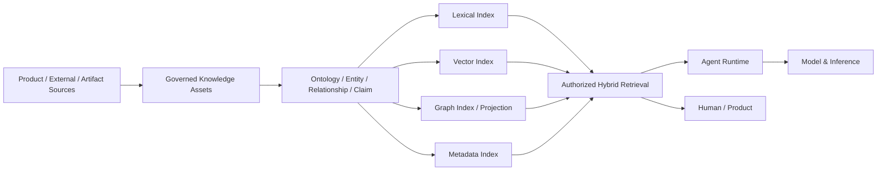

---
doc_meta:
  id: EAD-003
  title: Enterprise Data Ownership & Topology
  owner: Architecture Authority
  version: 1.2.0
  status: approved
  classification: internal
  governed_by: [GDC-006]
  review_cycle_days: 180
  created_date: 2026-08-06
  last_reviewed: 2026-08-23
---

# Enterprise Data Ownership & Topology

## 1. Purpose

Define enterprise data, knowledge, evidence, and derived-intelligence authority for the **Scnehaux Enterprise Cloud**.

**Decision question:** _Who is authoritative for each class of data or knowledge, how may derived representations move, and what must remain true when ATI creates projections, indexes, embeddings, graph representations, evidence, or AI outputs?_

## 2. Scope

**In scope**

- Transactional, operational, evidence, analytical, knowledge, retrieval-index, and AI-output authority
- External systems of record and ATI projections
- Knowledge assets, claims, provenance, ontology, graph representation, and retrieval indexes
- Model inference inputs/outputs, Agent Run/context/memory state, and acceptance into Product authority
- Tenant, purpose, classification, residency, lineage, and reconciliation
- Artifact and document provenance

**Out of scope**

- Physical database/index/graph technologies
- Table schemas and DDL
- Product-specific domain models
- API/event payload shape
- Model-provider or embedding-model selection
- Detailed retention schedules

## 3. Enterprise Context

ATI owns Product execution state and enterprise control facts while frequently processing client/industry facts whose canonical authority remains external.

Data, Knowledge, and AI are deliberately separated:

```text
Authoritative Fact
    ↓
Governed Projection / Artifact
    ↓
Knowledge Asset / Claim
    ↓
Graph / Vector / Lexical / Metadata Index
    ↓
Retrieval Context
    ↓
Agent Context Assembly or Direct Inference
    ↓
Model Output / Agent Result
    ↓
Product Acceptance
    ↓
Authoritative Product Mutation
```

No downward derived representation silently promotes itself into Product truth.

## 4. Architectural Drivers & Lessons

### 4.1 Drivers

| ID | Driver | Data Consequence |
| :-- | :-- | :-- |
| D1 | Enterprise AI Products require reusable grounded context | Knowledge assets and retrieval indexes have explicit authority and provenance |
| D2 | Graph RAG is a strategic retrieval capability | Graph representation is first-class but not the sole retrieval model |
| D3 | HCM, Travel, and future ERP hold sensitive authoritative facts | Product transactional authority remains local to the owning domain |
| D4 | External client/industry systems remain authoritative | Projection freshness and reconciliation are mandatory |
| D5 | Multi-tenant AI and search cross data boundaries | Retrieval authorization occurs before context disclosure |
| D6 | Artifacts become sources for knowledge | Artifact identity/version/checksum/provenance survive ingestion |

### 4.2 Lessons Incorporated

| Lesson | Data Response |
| :-- | :-- |
| Vector stores were treated as knowledge truth | Indexes are derived retrieval structures |
| Knowledge Graph was treated as a master database | Graph facts preserve source/provenance and do not replace Product authority |
| AI extraction was accepted as fact automatically | Proposed data requires owning-domain acceptance |
| Retrieval filters happened after model context assembly | Authorization is applied before context reaches a model |
| Document copy implied document ownership | Artifact storage and business meaning are separate |
| Data platformization implied central ownership | Domain-oriented authoritative ownership remains explicit |

## 5. Architecture Model

### 5.1 Data Ownership

| Class | Meaning | Authority Rule |
| :-- | :-- | :-- |
| ATI Authoritative Transactional Data | Product/control facts created and governed by ATI | One owning domain |
| Externally Authoritative Data | Client/partner/industry canonical facts | External authority named explicitly |
| Operational Execution State | Work, command, outcome, exception, reconciliation | Owning Product domain |
| Platform Operational State | Schedule, Workflow, Notification, Job-attempt or other Platform-owned state | Owning Platform capability |
| Non-Authoritative Projection | Copy for local reads/resilience | Source, freshness, conflict, reconciliation declared |
| Artifact Content | Managed binary/textual payload and immutable versions | Artifact Platform owns lifecycle, Product owns business meaning |
| Evidence Data | Tamper-evident accountability record | Audit & Evidence owns evidence lifecycle |
| Analytical / Derived Data | Metrics/features/aggregates | Named Data/Product owner with source lineage |
| Knowledge Asset | Governed knowledge unit with source/provenance/version | Knowledge/Product owner according to source semantics |
| Knowledge Claim | Governed claim about an entity/relation | Provenance and confidence required |
| Ontology | Governed vocabulary/schema for knowledge representation | Core owned by Knowledge; domain extensions owned with domain stewardship |
| Knowledge Graph Projection | Derived entity/relationship/claim representation | Never silently becomes Product transactional authority |
| Retrieval Index | Lexical/vector/graph/metadata acceleration structure | Derived and rebuildable from governed source |
| Embedding | Derived model-specific representation | Not knowledge authority |
| Inference Run | Bounded model invocation state, route, usage, and result metadata | Model & Inference Platform operational record |
| Agent Run / Turn | Durable agent execution and turn state | Agent Runtime Platform operational record |
| Agent Context Snapshot | Bounded assembled execution context or references required for reproducibility/recovery | Agent Runtime operational record; source facts retain original authority |
| Run / Session Memory | Agent execution continuity state | Agent Runtime within declared lifetime; never enterprise Knowledge authority by itself |
| Proposed / AI-Generated Output | Suggested content/classification/decision | Never authoritative until accepted by owning Product/domain |

### 5.2 Canonical Ownership Matrix

| Data Family | Canonical Authority |
| :-- | :-- |
| Principal, authenticator, session, protocol trust | Identity & Access |
| Organization, Tenant, Workspace, Membership | Organization |
| Employee, Employment, HR Organization, Position, Leave | HCM |
| Future ERP financial operational facts | Owning ERP Product/domain when chartered |
| Work Item / Case business state | Owning Product for domain-specific meaning; Work Management for generic work lifecycle when consumed |
| Workflow definition/instance/task coordination | Workflow Platform |
| Schedule/Occurrence/dispatch | Scheduling Platform |
| Rule definition/runtime lifecycle | Rules & Decisioning Platform; domain rule meaning remains Product-owned |
| Artifact binary/version/checksum | Artifact & Document Platform |
| Notification/delivery state | Notification Platform |
| Accepted Usage Meter / Rating / Charge / Bill state | Usage Metering & Billing Platform |
| Enterprise evidence | Audit & Evidence Platform |
| Knowledge asset/ontology/index lifecycle | Knowledge & Retrieval Platform within declared scope |
| Product business facts represented in knowledge | Original Product/external authority remains canonical |
| Model/provider access, Capability Profile, and Inference Run state | Model & Inference Platform |
| Agent Definition runtime registration, Agent Run/Turn, Context Snapshot, and run/session memory mechanics | Agent Runtime Platform |

### 5.3 Knowledge Topology



Graph is first-class, not exclusive. Retrieval selection follows query, evidence, authorization, latency, and quality requirements.

### 5.4 Ontology Model

The enterprise uses:

```text
Small Enterprise Core Ontology
+
Domain-Owned Extensions
```

The core defines only durable cross-domain concepts. Domain ontology extensions preserve the Product/domain ubiquitous language and do not centralize business authority.

### 5.5 Retrieval Authorization

```text
Identity
+ Application Trust
+ Tenant / Workspace Context
+ Product Authorization
+ Data Classification / Purpose
        ↓
Authorized Knowledge Scope
        ↓
Retrieval
        ↓
Context Assembly
        ↓
Model / Human Consumer
```

Unauthorized knowledge SHALL NOT be retrieved and then merely hidden from the final response.

### 5.6 Artifact-to-Knowledge Lineage

Every knowledge unit derived from a managed artifact can resolve, where applicable, to:

- source artifact identifier and immutable version
- source authority
- transformation lineage
- extraction method
- effective period
- classification and tenant/purpose scope
- confidence where derived
- evidence/citation reference

### 5.7 Transactional & Analytical Boundary

| Plane | Mutation Rule |
| :-- | :-- |
| Authoritative Transactional | Only owning Product/control commands mutate authoritative state |
| Operational Projection | Updated from declared authority; never independent truth |
| Evidence | Append/integrity lifecycle under Audit & Evidence |
| Analytical | Derives from governed source; no direct source mutation |
| Knowledge | Organizes provenanced assets/claims/relations without stealing source authority |
| Model / Agent Execution | Produces derived/proposed output and execution state until owning Product accepts any resulting business fact/effect |

### 5.8 Data Movement Strategy

Approved macro patterns include provider-owned API, domain event, asynchronous command, bounded projection, governed batch/file exchange, CDC for replication/analytics, Artifact references, Knowledge ingestion, and reconciliation.

Every critical movement declares source authority, purpose, Tenant/classification, freshness, stale behavior, lineage, retention, and reconciliation ownership.

### 5.9 Data Governance

Data Governance defines classification, lineage, quality, residency, retention, privacy, and purpose obligations. Product/domain owners remain accountable for authoritative domain data. Knowledge, model-input/output, Agent Context, and Agent Memory representations inherit source restrictions.

## 6. Principles & Rules

### 6.1 One Canonical Authority per Critical Fact

- **Fitness function:** authority catalog reports zero multiply-authoritative critical facts

### 6.2 Projection, Graph, Index, and Embedding Are Not Product Truth

- **Fitness function:** knowledge/retrieval PADs declare source authority and rebuild/reconciliation behavior

### 6.3 AI Output Requires Product Acceptance

- **Fitness function:** high-impact AI mutation paths identify deterministic validation/authorization and approval where required

### 6.4 Retrieval Authorization Precedes Disclosure

- **Fitness function:** security tests verify unauthorized data is excluded before context assembly

### 6.5 Knowledge Is Provenanced

- **Fitness function:** governed Knowledge Claims expose source/provenance/version and scope

### 6.6 Domain Knowledge Semantics Stay Domain-Owned

- **Fitness function:** enterprise ontology review finds no unapproved replacement of Product ubiquitous language

### 6.7 Private Domain Persistence

- **Fitness function:** direct cross-domain database grants/write paths equal zero

### 6.8 External Authority Remains Explicit

- **Fitness function:** critical external datasets name authority, freshness, and reconciliation owner

## 7. Alternatives Considered

| Alternative | Why Rejected |
| :-- | :-- |
| One central enterprise database | Destroys bounded authority and independent lifecycle |
| Knowledge Graph as enterprise master database | Converts a derived representation into hidden transactional authority |
| Vector-only RAG | Insufficient for all query/evidence/relationship needs |
| Graph-only RAG | Overfits one retrieval shape and increases complexity |
| Model or Agent runtime owns all knowledge | Couples knowledge lifecycle to execution and creates hidden authority |
| Filter after LLM context assembly | Discloses data before authorization is applied |

## 8. Single Points of Failure & Graceful Degradation

| Dependency | Blast Radius | Required Posture |
| :-- | :-- | :-- |
| Authoritative Product store | Product-specific | Derived systems never override unavailable truth |
| Knowledge ingestion | Stale knowledge | Existing version remains queryable with freshness visible |
| Vector/graph/lexical index | Retrieval mode degradation | Other evaluated retrieval modes may continue |
| Knowledge & Retrieval control | Search/RAG degradation | Product fails explicitly or uses approved fallback |
| Model provider / Model & Inference | AI-output degradation | Knowledge remains independently queryable; evaluated alternate route or explicit failure |
| Agent Runtime | Agentic execution degradation | Durable run state may resume; Product truth and Knowledge authority remain outside Agent state |

## 9. Ownership

| Responsibility | Accountable |
| :-- | :-- |
| Product transactional facts | Product Domain Owner |
| External facts | External authority + ATI Natural Owner |
| Knowledge capability | Knowledge & Retrieval Platform Owner |
| Domain knowledge semantics | Source Product/domain |
| Artifact lifecycle | Artifact & Document Platform Owner |
| Model/inference execution data | Model & Inference Platform Owner |
| Agent execution/context/run-memory data | Agent Runtime Platform Owner |
| Data governance principles | Data Governance Authority |

## 10. Dependencies

- This C1 architecture artifact has no synchronous runtime dependency on another architecture artifact
- Its inputs are enterprise strategy, accountable domain ownership, legal or contractual obligations, and validated operational evidence appropriate to its subject
- Cross-artifact architectural lineage is recorded in the Traceability section and MUST NOT be interpreted as a runtime dependency graph

## 11. Traceability

- PAD-PLT-015 defines Knowledge & Retrieval logical contracts
- PAD-PLT-008 Model & Inference owns bounded model/provider execution without owning Knowledge
- PAD-PLT-016 Agent Runtime consumes Knowledge & Retrieval for governed context without owning source truth
- PAD-PLT-009 manages artifact lifecycle feeding knowledge ingestion
- ADR-GLB-012 records AI/Knowledge/Product authority separation
- ADR-GLB-015 refines AI execution into Model & Inference and Agent Runtime authorities
