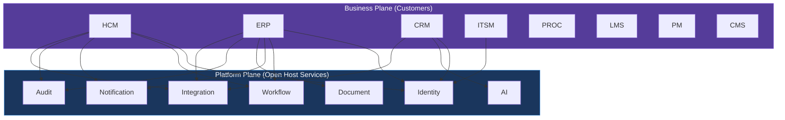
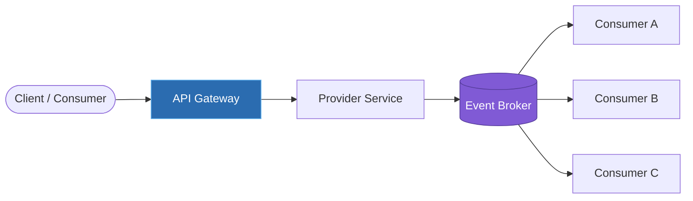
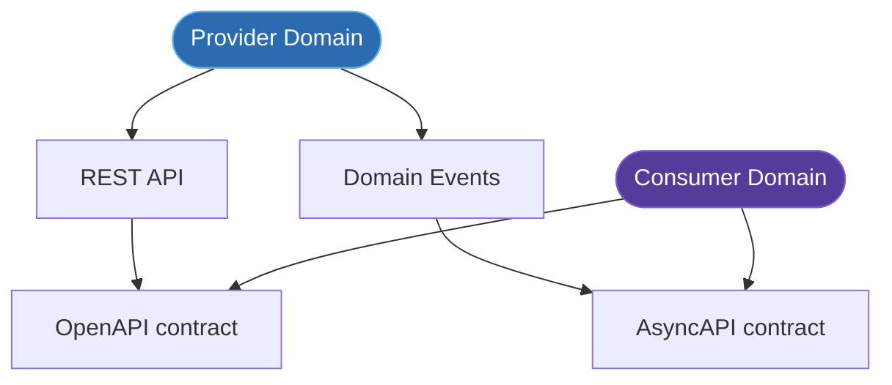
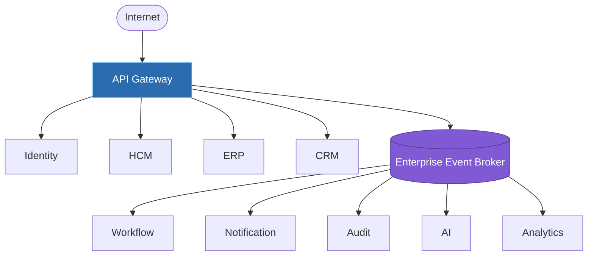

---
doc_meta:
  id: EAD-004
  title: Enterprise Integration Architecture
  owner: Architecture Authority
  version: 1.0.0
  status: approved
  classification: internal
  governed_by: [GDC-006]
  review_cycle_days: 180
  last_reviewed: 2026-07-05
---

# Enterprise Integration Architecture

## 1. Purpose

Define how independently owned domains collaborate without fusing into a distributed monolith: the strategic context relationships between domains, the communication patterns permitted for each interaction type, the governance of the contracts that carry those interactions, and the gateway/broker topology that physically routes them. This document is the connective tissue between the domain boundaries of EAD-001 and the data sovereignty of EAD-003.

**Decision question this document answers:** _"When two domains must interact, which pattern and contract do they use, and who owns it?"_

This document states integration patterns and contract governance. It does not define concrete service implementations, API endpoint signatures, event payload schemas, or infrastructure deployment; those are owned downstream by PAD and SAD.

---

## 2. Scope

**In scope:**

- The enterprise context map: strategic DDD relationships between domains.
- The communication strategy: which pattern (synchronous, event, workflow) fits which interaction.
- Contract governance: ownership, versioning, and backward-compatibility rules for APIs and events.
- The gateway and broker topology and the enterprise integration standards.

**Out of scope:**

- Endpoint-level API specifications and event payload schemas (owned by provider PAD/SAD).
- Service implementation and internal orchestration logic.
- Infrastructure sizing, broker cluster topology, and deployment (owned by EAD-005/SAD).
- Data ownership and replication mechanics (owned by EAD-003).

---

## 3. Enterprise Context

Scnehaux adopts a **Contract-Driven Integration** architecture. Domains evolve independently and collaborate exclusively through stable, versioned contracts owned by the provider. Integration expresses Domain-Driven Design strategic patterns explicitly, so that every cross-domain relationship carries a known coupling posture rather than an accidental one.

The governing invariant: **every cross-domain interaction flows through a published contract owned by the provider domain; there are no private back-channels.** Synchronous calls are reserved for genuine request-response needs on the critical path; everything else defaults to events, which decouple availability and let producers and consumers scale and fail independently.

---

## 4. Architectural Drivers & Lessons

### 4.1. Drivers

Integration exists to let the domains of EAD-001 collaborate on the value streams defined there without fusing into a distributed monolith.

| Driver | Integration Consequence |
| :-- | :-- |
| Domains must evolve on independent cadences | Provider-owned, versioned contracts; consumers never touch internal models |
| Availability must not be coupled across domains | Events are the default; synchronous calls reserved for the critical path |
| Breaking a consumer must never be silent | Backward-compatibility rule + CI contract-diff gate + deprecation window |
| Vendor change must stay localized | External systems integrate only through the Integration Platform ACL |

### 4.2. Lessons Incorporated

From enterprise COE (Correction-of-Error) themes, not a greenfield ideal.

| COE-class lesson | Design response in this document |
| :-- | :-- |
| Implementation-first APIs leaked internal models and broke consumers on refactor | Contract First: contract designed and reviewed before implementation |
| A silent breaking change caused untraceable, cascading consumer outages | Breaking changes require a new major version + published deprecation window |
| A chain of synchronous cross-domain calls became a distributed monolith on the critical path | Event First default; long-running work on the Workflow Platform, not call chains |

---

## 5. Architecture Model

### 5.1. Enterprise Context Map

> The context map shows the primary strategic edges for readability. It is deliberately not exhaustive: every Business Product also depends on Identity, Workspace, UI, Audit, and Billing (event-driven metering) per the EAD-002 dependency matrix. The **authoritative, complete** cross-domain edge set is that matrix; the consistency rule below requires each of its edges to be realized by a contract governed here.

**Strategic relationship patterns (DDD):**

| Relationship | When It Applies | Coupling Posture |
| :-- | :-- | :-- |
| Open Host Service | A Platform Service exposes a shared capability to many consumers | Provider publishes a stable, public contract |
| Customer / Supplier | Default relationship between a consuming and providing domain | Provider prioritizes consumer needs by agreement |
| Published Language | APIs and events act as the shared enterprise language | Contract is the only shared artifact |
| Anti-Corruption Layer | Integrating an external vendor or legacy system | Consumer isolates itself from the foreign model |
| Partnership | Two strategically aligned domains evolving together | Bidirectional, coordinated change (used sparingly) |

### 5.2. Communication Strategy

| Interaction | Preferred Pattern | Rationale & Target |
| :-- | :-- | :-- |
| User request (read/command) | REST / GraphQL via gateway | Synchronous; cross-domain P99 ≤ 300 ms |
| Cross-domain command | REST (synchronous) | Only when a response is required on the critical path |
| Business notification | Event (asynchronous) | Decouples availability; at-least-once delivery |
| Data synchronization | Event / CDC | Eventually consistent; conforms to EAD-003 |
| Long-running process | Workflow Platform | Orchestrated, durable, resumable |
| External partner | API Gateway + Integration ACL | Vendor isolated behind Anti-Corruption Layer |

**Communication rules:**

- Synchronous communication is reserved for request-response on the critical path.
- Events are the default for domain notifications and cross-domain propagation.
- Long-running business processes run on the Workflow Platform, not chained synchronous calls.
- Cross-domain database communication is prohibited (enforced by EAD-003).

### 5.3. Contract Governance

| Principle | Description |
| :-- | :-- |
| Provider Owns Contract | Only the provider domain publishes and versions a contract. |
| Backward Compatibility | Non-breaking changes only within a major version; breaking changes require a new major version and a deprecation window. |
| Consumer Independence | Consumers depend on the contract, never on the provider's internal implementation. |
| Versioned Contracts | Every API and event carries an explicit version. |
| Contract First | The contract is designed and reviewed before implementation begins. |

**Enterprise contract standards:**

| Contract Type | Mandated Standard |
| :-- | :-- |
| REST API | OpenAPI 3.1 |
| Event | AsyncAPI 3.0 |
| Authentication | OAuth 2.1 / OpenID Connect |
| Authorization | JWT claims validated at the edge |
| Error model | RFC 9457 Problem Details |
| Deprecation window | ≥ 2 consumer release cycles or 90 days, whichever is longer |

### 5.4. Gateway & Broker Topology

| Component | Responsibility | Enterprise Target |
| :-- | :-- | :-- |
| API Gateway | Single ingress for synchronous traffic; authN, rate limiting, routing | Added overhead P99 ≤ 50 ms |
| Event Broker | Durable enterprise event distribution | Replication factor ≥ 3; at-least-once |
| Integration Platform | External connectors and payload transformation | Anti-Corruption Layer per vendor |
| Workflow Platform | Durable business orchestration | Resumable, idempotent steps |
| Identity Platform | AuthN/authZ enforcement at the edge | Token validation on every request |

**Topology rules:**

- Every external synchronous request enters through the API Gateway.
- Internal domain events flow through the Event Broker, not point-to-point.
- External vendors integrate only through the Integration Platform.
- Platform Services never communicate through database sharing.

---

## 6. Principles & Rules

Each principle is paired with a machine-verifiable or audit-verifiable **fitness function**, upholding the GDC-000 maxim that a rule without an enforcement mechanism is only a suggestion.

### 6.1. API First

Every synchronous cross-domain capability is exposed as a governed, versioned API.

- **Rationale:** An explicit API is the contract that makes a capability consumable and evolvable.
- **Fitness function:** Every provider capability consumed across a domain boundary has a published OpenAPI contract.

### 6.2. Event First

Significant domain state changes are published as events.

- **Rationale:** Events decouple availability and enable consumers unknown at design time.
- **Fitness function:** Cross-domain notifications use the Event Broker; count of point-to-point notification calls = `0`.

### 6.3. Contract First

The contract is designed and reviewed before implementation.

- **Rationale:** Implementation-first integration leaks internal models into the contract and breaks consumers.
- **Fitness function:** Every contract has a reviewed OpenAPI/AsyncAPI artifact committed before the providing service ships.

### 6.4. Loose Coupling

Domains interact only through published contracts.

- **Rationale:** Contract-only coupling is the sole coupling that can be versioned and evolved safely.
- **Fitness function:** Zero cross-domain in-process or database dependencies in downstream audits.

### 6.5. Provider Authority

Only the provider domain owns and versions its contracts.

- **Rationale:** Consumer-owned or shared contracts create ambiguous change authority and coordination deadlock.
- **Fitness function:** Every contract maps to exactly one owning provider domain in the contract registry.

### 6.6. Backward Compatibility

Breaking changes require a new major version and a published deprecation window.

- **Rationale:** Silent breaking changes cause unbounded, untraceable consumer failures.
- **Fitness function:** Contract diff checks in CI block breaking changes within a major version; deprecation window ≥ 90 days.

---

## 7. Alternatives Considered

Contract-driven, event-default integration was chosen against rejected alternatives. Each rejection is a consciously accepted trade-off.

| Alternative | Why Rejected | Debt Consciously Accepted |
| :-- | :-- | :-- |
| **Synchronous request/response as the default** | Couples the availability of every domain in a call chain; one slow domain degrades all callers | Eventual consistency and the complexity of asynchronous reasoning (idempotency, ordering) |
| **Central ESB with a canonical enterprise data model** | A shared model becomes a change-coordination bottleneck owned by no domain; the ESB is a SPOF and a monolith | Some translation logic is duplicated at domain edges rather than centralized |
| **Consumer-owned or shared contracts** | Ambiguous change authority produces coordination deadlock and finger-pointing | Providers must design for consumer needs deliberately (Customer/Supplier discipline) |
| **Point-to-point event subscriptions** (no central broker) | An O(n²) mesh of couplings with no durable, replayable, governed backbone | A shared Event Broker dependency that must itself be highly available |

---

## 8. Single Points of Failure & Graceful Degradation

The two shared integration surfaces are enterprise SPOFs by construction; their degradation posture is mandatory in the owning system's SAD.

| SPOF | Blast radius | Graceful degradation strategy |
| :-- | :-- | :-- |
| API Gateway (single synchronous ingress) | All external synchronous traffic | Multi-instance, health-checked, regionally redundant; on partial failure it sheds load with RFC 9457 errors and honors cached routing rather than blocking; asynchronous event paths are unaffected |
| Enterprise Event Broker | All cross-domain asynchronous propagation | Replication factor ≥ 3, at-least-once, durable retention with dead-letter queues; producers buffer and consumers replay on recovery — propagation is delayed, never lost |
| Integration Platform ACL (per external vendor) | Only the affected vendor integration | Circuit-breaker per vendor with cached last-known-good responses; a failing vendor is isolated and does not cascade into the calling domain |

Synchronous cross-domain calls carry a mandatory timeout, retry-with-backoff, and circuit breaker so that a slow provider degrades the caller into a fallback path rather than exhausting it.

---

## 9. Ownership

| Responsibility | Accountable | Consulted |
| :-- | :-- | :-- |
| Enterprise integration architecture (this artifact) | Architecture Authority | Integration Team, Domain Leads |
| API governance and standards | Integration Team | Architecture Authority |
| Event governance and the broker | Integration Team | Platform Engineering |
| Provider contracts | Provider Domain | Consumer Domains |
| Consumer conformance | Consumer Domain | Provider Domain |
| External vendor mediation | Integration Team | Security Team |

---

## 10. Dependencies

**Upstream (this document depends on):**

- EAD-001 Enterprise Capability & Domain Map — supplies the domains that interact.
- EAD-002 Enterprise System Landscape — supplies the systems and dependency direction.
- EAD-003 Enterprise Data Ownership & Topology — event and CDC movement conform to data policy.

**Downstream (this document governs):**

- Platform PADs and Business Product PADs (integration sections conform here).
- Global API and Event Standards (STD).
- Every SAD that defines external or cross-domain communication.

---

## 11. Traceability

- **Referenced by:** Integration Platform PAD, Identity Platform PAD, Workflow Platform PAD, Notification Platform PAD, and every SAD defining external communication.
- **Governs:** the API Design and Event-Driven standards in the STD layer.
- **Consistency rule:** every cross-domain edge in EAD-002's dependency matrix MUST be realized by a contract governed under this document.

---

## 12. Assumptions

- Every domain can expose and version stable contracts.
- Enterprise communication is contract-driven end to end.
- Events are asynchronous and idempotently consumable by default.

---

## 13. Constraints

- Direct database integration across domains is prohibited.
- Point-to-point integrations bypassing the gateway or broker are prohibited.
- Every API and every event is versioned.
- Every event has exactly one owning provider domain.
- Breaking contract changes require a major version and a deprecation window.

---

## 14. Risks

| Risk | Likelihood | Impact | Mitigation |
| :-- | :-- | :-- | :-- |
| Tight synchronous coupling across domains | Medium | High — distributed monolith | Event First default + synchronous only on critical path |
| Duplicated integration logic per product | Medium | Medium — maintenance cost | Integration Platform as the single egress/ingress |
| Contract instability | Medium | High — consumer outages | Backward Compatibility rule + CI contract diff |
| Event schema divergence | Medium | Medium — data divergence | AsyncAPI governance + provider authority |
| Vendor coupling bypassing the ACL | Low | Medium — lock-in | Topology rule: vendors only via Integration Platform |

---

## 15. Future Direction

Integration evolves by adding contracts and patterns while preserving backward compatibility. New integration technologies conform to this architecture rather than redefine it. The event backbone is expected to expand toward richer streaming and event-sourcing use cases; the gateway toward finer-grained policy and progressive delivery. In all cases, the provider-owned, versioned-contract invariant remains fixed.

---

## 16. References

- Domain-Driven Design — Eric Evans
- Enterprise Integration Patterns — Gregor Hohpe
- OpenAPI Specification 3.1
- AsyncAPI Specification 3.0
- OAuth 2.1 / OpenID Connect
- RFC 9457 Problem Details for HTTP APIs
- Building Event-Driven Microservices — Adam Bellemare
