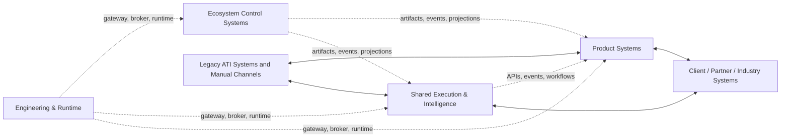
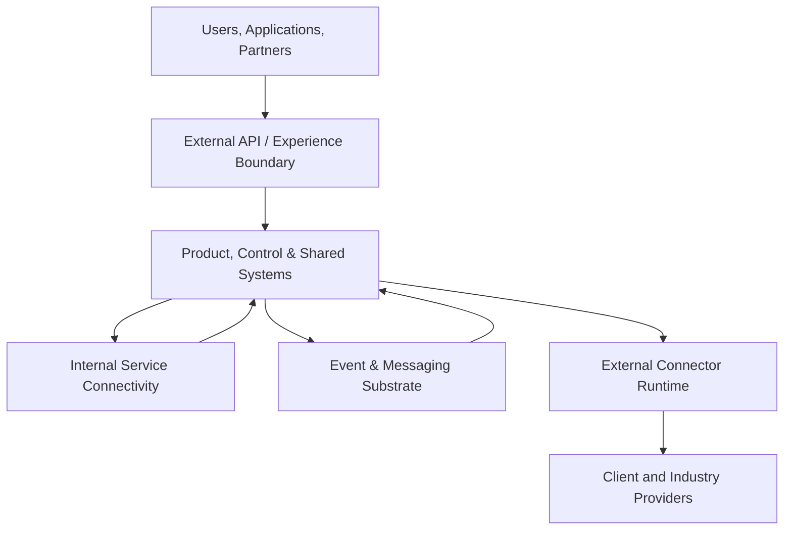

---
doc_meta:
  id: EAD-004
  title: Enterprise Integration Architecture
  owner: Architecture Authority
  version: 1.0.0
  status: draft
  classification: internal
  governed_by: [GDC-006]
  review_cycle_days: 180
  created_date: 2026-08-06
  last_reviewed: 2026-08-06
---

# Enterprise Integration Architecture

## 1. Purpose

Define the enterprise integration strategy for the **Scnehaux Enterprise Cloud**, including how product, control, shared, legacy, client, and industry systems exchange commands, facts, files, projections, and outcomes.

**Decision question:** _Which integration relationship is appropriate for each enterprise interaction, who owns the contract, and how are failure, duplication, ambiguity, and reconciliation governed?_

This document establishes macro patterns and ownership. It does not define endpoint paths, payload schemas, retry intervals, connector implementations, workflow steps, protocol libraries, or deployment topology.

## 2. Scope

**In scope:**

- Enterprise context map and relationship ownership.
- Synchronous, asynchronous, batch/file, projection, and workflow patterns.
- Internal versus external integration direction.
- API, event, contract, gateway, broker, and connector governance principles.
- Idempotency, compatibility, outcome ambiguity, and reconciliation direction.
- Coexistence with legacy and client systems.

**Out of scope:**

- Field-level contracts and schemas — standards, PADs, and SADs.
- Product-specific process flow — Product PADs and workflow designs.
- Connector, gateway, broker, and adapter topology — SADs.
- Technology selection — EAD-005 and standards.
- Credential and protocol security detail — EAD-006 and standards.

This document binds every system interaction represented in the enterprise landscape.

## 3. Enterprise Context

Scnehaux Enterprise Cloud integrates two fundamentally different worlds:

- **internal domain relationships**, where ATI controls both sides and can publish stable contracts; and
- **external operational relationships**, where client or industry protocols, availability, session semantics, files, manual channels, and reconciliation obligations shape the interaction.

Integration must preserve business ownership. Shared integration capabilities may provide connectivity and operational machinery, but the domain that owns the business intent remains accountable for commands, acceptance criteria, and outcomes.

## 4. Architectural Drivers & Lessons

### 4.1 Drivers

| ID | Driver | Integration Consequence |
| :-- | :-- | :-- |
| D1 | Independent domain evolution | Provider-owned, versioned contracts mediate interaction |
| D2 | Travel ecosystems use APIs, files, queues, terminals, and proprietary protocols | The enterprise supports multiple governed interaction modes |
| D3 | External outcomes may be delayed or ambiguous | Command status and reconciliation are first-class concerns |
| D4 | Multi-tenant operation | Tenant, purpose, classification, and correlation context cross boundaries |
| D5 | Control-plane resilience | Products consume local artifacts/projections where feasible |
| D6 | Product ownership must remain explicit | Shared Integration is machinery, not business authority |

### 4.2 Lessons Incorporated

| Lesson | Integration Response |
| :-- | :-- |
| API-first was interpreted as synchronous HTTP everywhere | Pattern selection follows business timing and coupling needs |
| Event-first was interpreted as publishing commands as facts | Commands, facts, acknowledgements, and outcomes remain distinct |
| Transport success was treated as business success | Provider acceptance and final outcome are separately modeled |
| Retry created duplicate business effects | Idempotency is an enterprise contract property |
| A universal gateway obscured Product ownership | Natural owner remains accountable for each relationship |
| External state divergence surfaced only during incidents | Reconciliation is part of normal operation |

## 5. Architecture Model

### 5.1 Enterprise Context Map

#### Strategic Relationship Types

| Relationship          | Appropriate Meaning                                                           |
| :-------------------- | :---------------------------------------------------------------------------- |
| Customer–Supplier     | Downstream depends on a provider-owned contract                               |
| Published Language    | Provider exposes a stable model to multiple consumers                         |
| Anti-Corruption Layer | Consumer protects its domain from an external or legacy model                 |
| Partnership           | Coordinated evolution is accepted explicitly                                  |
| Conformist            | Consumer accepts an external standard where adaptation adds no value          |
| Open Host Service     | Provider exposes a stable integration service for many consumers              |
| Separate Ways         | No direct integration; duplication or manual exchange is consciously accepted |

#### Natural Ownership Rule

- The **Product or control domain** owns business intent, acceptance, and outcome.
- The **provider domain** owns its published contract.
- A **shared Integration capability** may own connector runtime, transformation, transport operations, and provider observability.
- External-system authority remains defined by EAD-003.

### 5.2 Communication Strategy

| Pattern | Use When | Primary Trade-Off |
| :-- | :-- | :-- |
| Synchronous Request/Response | Immediate authoritative answer is required to complete the current journey | Availability and latency coupling |
| Asynchronous Event | An accepted fact must be published to independent consumers | Eventual consistency and consumer reconciliation |
| Asynchronous Command | Work is requested without requiring immediate completion | Outcome tracking and duplicate protection |
| Durable Workflow | Multi-step, long-running, human, or compensating process requires persisted coordination | Workflow ownership and operational complexity |
| Bounded Projection | Local enforcement or reads must survive authority unavailability | Freshness and reconciliation |
| Batch / File Exchange | Volume, partner capability, or contractual process makes online integration unsuitable | Delay, partial failure, and operational control |
| Webhook / Callback | External provider notifies ATI of a change or outcome | Authentication, duplication, and ordering |
| Human / Assisted Integration | A system lacks reliable machine interface or policy requires human control | Throughput, evidence, and error risk |

#### Pattern Selection Principles

1. Use synchronous interaction only when the current response is required.
2. Publish events only after the provider has accepted the fact.
3. Use commands for requested action, not events disguised as intent.
4. Use durable workflow for long-running coordination and compensation.
5. Use projections when local resilience is more important than immediate global consistency.
6. Treat files and manual channels as governed contracts, not exceptions outside architecture.
7. Separate transport acknowledgement, provider acceptance, and final business outcome.

#### Internal and External Integration

Internal interactions favor provider-owned APIs, events, projections, and durable workflows.

External interactions additionally account for:

- protocol and provider constraints;
- rate and session limits;
- file and batch windows;
- uncertain or delayed outcomes;
- command revalidation;
- reconciliation and exception handling;
- client-specific credentials and contractual obligations.

Detailed external profiles belong in Product PADs, integration standards, and SADs.

### 5.3 Contract Governance

Every critical contract has:

- one provider owner;
- named consumers or consumer class;
- business purpose and authority boundary;
- version and compatibility policy;
- tenant, classification, and purpose context;
- error and outcome semantics;
- idempotency expectation where mutation occurs;
- reliability and support ownership;
- lifecycle, deprecation, and migration policy;
- evidence and observability expectations.

#### Contract Types

| Contract Type    | Owner                                                           |
| :--------------- | :-------------------------------------------------------------- |
| API              | Provider domain                                                 |
| Event            | Domain that owns the published fact                             |
| Command          | Domain that accepts responsibility for requested work           |
| Projection       | Source authority plus consumer-specific contract ownership      |
| File / Batch     | Business relationship owner and technical provider              |
| External Adapter | Natural ATI business owner; integration machinery may be shared |
| Signed Artifact  | Issuing control authority                                       |

#### Compatibility Direction

- Backward-compatible evolution is preferred for active consumers.
- Breaking changes require a new version, migration window, and consumer inventory.
- Consumer-specific hidden behavior is prohibited.
- External incompatibility is isolated behind an anti-corruption boundary where appropriate.
- Contract retirement requires evidence that active consumers have migrated.

#### Idempotency and Outcome

Mutation contracts identify how duplicate requests are recognized and which business effect must remain unique. When an external outcome is unknown, the state remains explicitly unresolved until reconciled; transport timeout does not prove failure.

#### Reconciliation

Critical integrations define:

- which states are compared;
- which authority wins for each fact;
- how often reconciliation occurs;
- who owns exceptions;
- how correction and evidence are recorded.

The detailed reconciliation contract belongs downstream.

### 5.4 Gateway & Broker Topology

The topology defines enterprise roles, not a requirement for one gateway, broker, mesh, or connector product.

#### Gateway Direction

Gateway capabilities may provide authentication enforcement, traffic policy, routing, request protection, and external exposure. They do not replace Product authorization or provider contract ownership.

#### Broker Direction

Messaging capabilities provide durable delivery, partitioning, replay, and failure isolation. They do not provide business-level exactly-once semantics by themselves.

#### Connector Direction

Connector capabilities isolate provider protocol and operational variation. They do not own Product intent, external authority, or final business acceptance.

## 6. Principles & Rules

### 6.1 Contract First

Cross-system interaction uses an explicit provider-owned contract.

- **Fitness function:** every production integration resolves to a registered owner and contract.

### 6.2 Pattern Follows Business Need

Synchronous, event, command, projection, batch, and workflow patterns are selected by timing, coupling, and correctness needs.

- **Fitness function:** architecture review identifies rationale for each critical relationship type.

### 6.3 Provider Owns the Contract

The domain owning the fact or operation owns its published contract.

- **Fitness function:** contract registry reports exactly one provider owner.

### 6.4 Shared Integration Does Not Own Business Intent

Shared machinery handles connectivity and operations without absorbing Product decisions.

- **Fitness function:** shared Integration PAD contains zero Product-specific authoritative outcomes.

### 6.5 Commands, Facts, and Outcomes Are Distinct

A request, transport acknowledgement, accepted fact, and final outcome are not interchangeable.

- **Fitness function:** critical mutation contracts define outcome semantics and unresolved state.

### 6.6 Mutations Are Duplicate-Safe

Critical mutation contracts define idempotency at the business boundary.

- **Fitness function:** critical command inventory identifies duplicate-protection ownership.

### 6.7 Compatibility Is Governed

Breaking changes require version, migration, and consumer evidence.

- **Fitness function:** deprecated contracts have a consumer migration record.

### 6.8 Reconciliation Is Mandatory for External Critical Outcomes

External ambiguity and divergence are detected as part of normal operation.

- **Fitness function:** critical external integrations have a reconciliation owner and objective.

### 6.9 Tenant and Security Context Cross Boundaries Explicitly

Scope, classification, actor, purpose, and correlation are preserved.

- **Fitness function:** critical contracts carry required governance context.

### 6.10 No Universal Integration Hop

A shared gateway or integration system is used only when it adds governed capability.

- **Fitness function:** landscape review reports zero mandatory hops justified solely by uniformity.

## 7. Alternatives Considered

| Alternative | Why Rejected | Debt Accepted |
| :-- | :-- | :-- |
| Synchronous REST everywhere | It couples availability and mishandles long-running work | Multiple interaction patterns and operational complexity |
| Event-driven everything | It obscures commands, current queries, and user journeys | Synchronous and workflow patterns remain |
| Universal ESB | It centralizes business coupling and ownership | Domains may operate direct governed contracts |
| Product-specific connector code everywhere | It duplicates provider handling and security | Shared connector machinery may be chartered |
| Retry until success | It creates duplicates and hides unknown outcomes | Idempotency, state tracking, and reconciliation |

## 8. Single Points of Failure & Graceful Degradation

| Dependency | Blast Radius | Required Posture |
| :-- | :-- | :-- |
| External API boundary | External access | Internal processing and queued work continue where safe |
| Messaging substrate | Delayed events and commands | Authoritative systems retain durable work and replay after recovery |
| Connector runtime | Affected provider journeys | Other providers and local operations remain isolated |
| External provider | Affected business outcome | Unsafe commands pause; unresolved outcomes reconcile |
| Contract registry/catalog | New integration administration | Existing versioned contracts continue |
| Workflow coordination | Long-running processes | State remains durable and resumable |

## 9. Ownership

| Responsibility                    | Accountable                   | Consulted                            |
| :-------------------------------- | :---------------------------- | :----------------------------------- |
| Enterprise integration principles | Architecture Authority        | Integration, Product, Security, Data |
| Business contract                 | Provider Domain Owner         | Consumers and Integration            |
| External provider relationship    | Natural Product/Control Owner | Integration, Security, Client owner  |
| Shared integration capability     | Integration Platform Owner    | Product consumers                    |
| Gateway and broker substrate      | Engineering Platform Owner    | System owners and Security           |
| Reconciliation outcome            | Product Domain Owner          | Integration, Data, Operations        |

## 10. Dependencies

**Strategic inputs:** domain ownership, system roles, and data authority.

**Governed outputs:** runtime integration substrate, security controls, domain contracts, standards, and system topology.

## 11. Traceability

- Every integration traces to provider and consumer domains.
- Every critical external integration traces to an external-authority statement in EAD-003.
- Every gateway, broker, connector, and workflow system traces to a SAD.
- Enterprise pattern changes require an ADR and EAD review.

## 12. Assumptions

- External systems expose varied protocols and operational behavior.
- Products can hold bounded projections and durable local work.
- Shared integration capabilities will be chartered incrementally.
- Some legacy and manual channels remain during transition.

## 13. Constraints

- Direct cross-domain database interaction is prohibited.
- A transport acknowledgement cannot be treated as final business success.
- Shared Integration cannot own Product business outcomes.
- Critical mutations require duplicate-protection ownership.
- External critical outcomes require reconciliation.
- Contract detail belongs downstream, not in this EAD.

## 14. Risks

| Risk | Likelihood | Impact | Mitigation |
| :-- | :-- | :-- | :-- |
| Universal integration layer becomes bottleneck | Medium | High | Natural-owner and no-universal-hop principles |
| Commands are published as misleading facts | Medium | High | Explicit interaction taxonomy |
| Retry creates duplicate financial or travel effects | Medium | Critical | Idempotency and reconciliation |
| External timeout is treated as failure | High | Critical | Unresolved outcome state and verification |
| Contract versions drift across consumers | Medium | High | Registry, compatibility, and migration governance |
| Manual/file channels remain unaudited | Medium | High | Govern them as first-class contracts |

## 15. Future Direction

The enterprise will evolve from fragmented point integrations toward registered contracts, reusable connector capabilities, durable workflows, and measurable reconciliation. Standardization follows proven integration families rather than forcing every interaction through one platform.

## 16. References

- EAD-001 — Enterprise Capability & Domain Map.
- EAD-002 — Enterprise System Landscape.
- EAD-003 — Enterprise Data Ownership & Topology.
- GDC-000 — Governance Policy.
- GDC-006 — EAD Guideline.
- Domain-Driven Design context mapping.
- Enterprise integration and event-driven architecture patterns.
