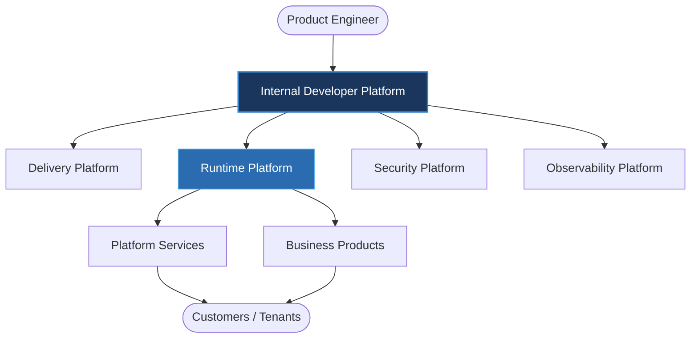
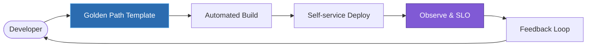
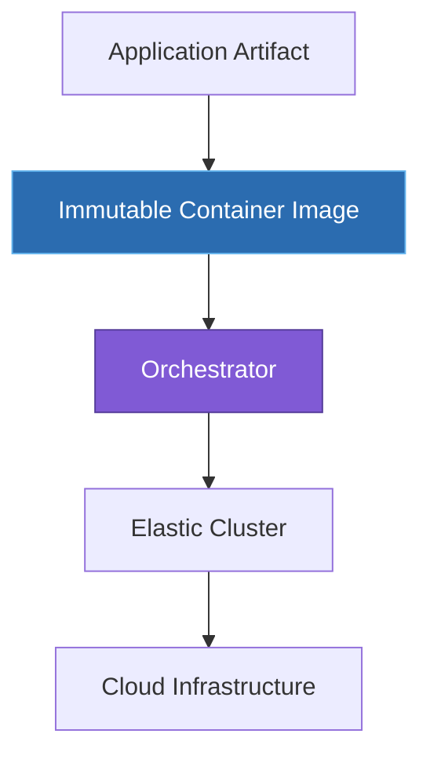
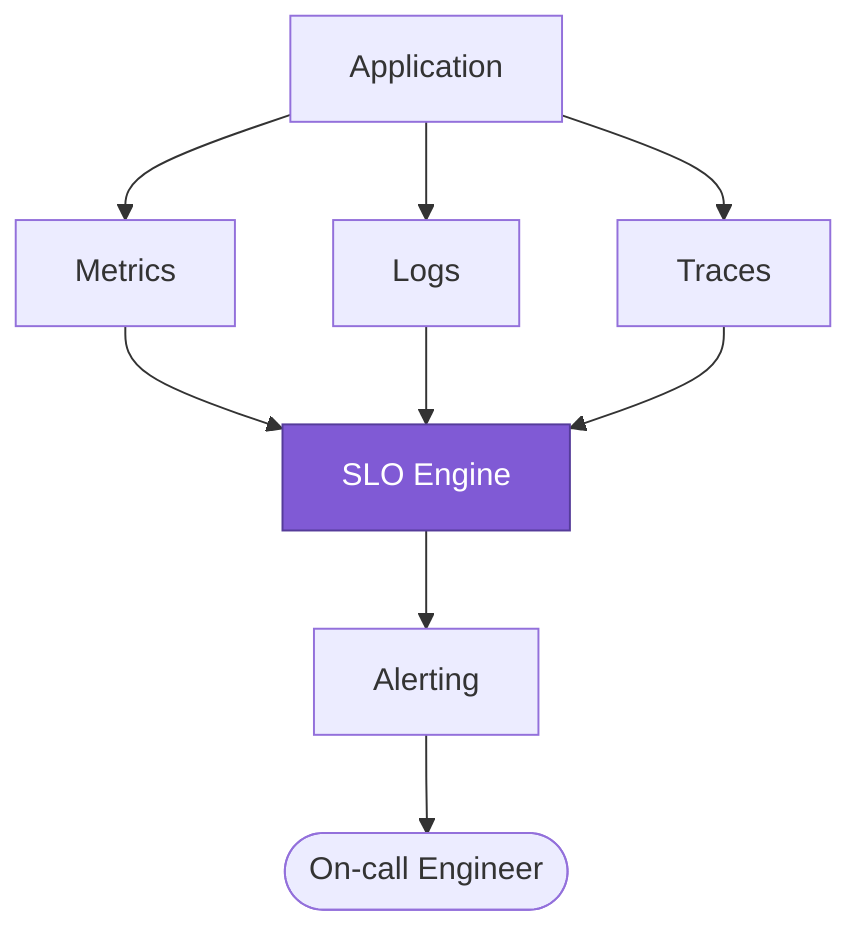

---
doc_meta:
  id: EAD-005
  title: Enterprise Platform Architecture
  owner: Architecture Authority
  version: 1.0.0
  status: approved
  classification: internal
  governed_by: [GDC-006]
  review_cycle_days: 180
  last_reviewed: 2026-07-05
---

# Enterprise Platform Architecture

## 1. Purpose

Define the engineering substrate that lets every Platform Service and Business Product be built, shipped, and operated to a consistent enterprise standard: the platform layering, the Internal Developer Platform (IDP) that delivers capabilities as self-service, the runtime strategy for executing workloads, and the operational model that governs reliability and delivery. This is the paved road that turns the domain boundaries of EAD-001 into shippable, operable software.

**Decision question this document answers:** _"On what standardized substrate does every team build, deploy, and operate, and to what reliability and delivery targets?"_

This document states platform strategy and operational targets. It does not define application architecture, specific CI/CD pipeline code, cloud vendor configuration, or infrastructure-as-code; those are owned downstream by SAD, TDD, and platform implementation repositories.

---

## 2. Scope

**In scope:**

- The enterprise platform layering and the boundary between platform and product responsibility.
- The Internal Developer Platform: the self-service capabilities offered to product teams.
- The runtime strategy for executing and scaling workloads.
- The operational model: reliability tiers, delivery targets (DORA), and observability baseline.

**Out of scope:**

- Application-internal architecture and code (owned by SAD/TDD).
- Concrete CI/CD pipeline definitions and infrastructure-as-code.
- Cloud vendor account structure and network configuration.
- Domain-specific operational runbooks (owned by each system's SAD).

---

## 3. Enterprise Context

Scnehaux adopts a **Platform Engineering** operating model. A dedicated Platform Engineering function builds and runs the enterprise platform as an internal product; product teams consume it as self-service rather than assembling infrastructure independently. This applies Team Topologies directly: the platform team is an enabling/platform team that reduces the cognitive load of stream-aligned product teams.

The governing invariant: **the platform is a product with a paved road (Golden Path) that is the default, and any deviation is an explicit, justified exception.** Consistency, security, and operability are properties the platform provides by default, so that individual teams inherit them rather than re-earn them. Infrastructure technology is expected to change; the platform contract and developer workflow are engineered to remain stable across those changes.

---

## 4. Architectural Drivers & Lessons

### 4.1. Drivers

The platform topology is driven by the enterprise goals in EAD-001 (specifically G1 and G4) and the need to scale the estate without scaling operational cognitive load linearly.

| Driver | Platform Consequence |
| :-- | :-- |
| Standardized capability delivery | Platform exposed as versioned, self-service products, not tickets |
| Cognitive load reduction for feature teams | Platform owns the underlying complexity (k8s, networks, CI/CD runners) |
| Polyglot runtime | The platform provides container abstraction, decoupled from languages |
| High availability foundation | Platform runtime guarantees Tier-0 availability for critical workloads |

### 4.2. Lessons Incorporated

From enterprise COE (Correction-of-Error) themes, not a greenfield ideal.

| COE-class lesson | Design response in this document |
| :-- | :-- |
| A platform funded as a time-boxed project decayed and lost trust | Platform as a Product: dedicated ownership, roadmap, and its own SLO |
| Manual, ticket-driven operations were the dominant source of incident variance | Self-Service and Automation First; zero-touch Golden Path deploys |
| Divergent bespoke runtimes multiplied operational cost and eroded portability | Standardized Runtime fitness function (100% on the standard runtime) |
| Uniform reliability spend over-invested some services and starved others | Reliability by Tier with an enforced error-budget policy |

---

## 5. Architecture Model

### 5.1. Platform Topology

| Layer | Responsibility | Consumed As |
| :-- | :-- | :-- |
| Internal Developer Platform | Developer self-service surface and Golden Path | Portal, templates, CLI, API |
| Delivery Platform | Build, test, package, deploy, progressive rollout | Pipelines as a service |
| Runtime Platform | Execute, schedule, and scale workloads | Managed runtime |
| Security Platform | Identity, secrets, policy, supply-chain integrity | Secure-by-default controls |
| Observability Platform | Metrics, logs, traces, alerting, SLO tracking | Telemetry as a service |

### 5.2. Internal Developer Platform Strategy

| Self-service Capability | Description |
| :-- | :-- |
| Project Bootstrap | Golden Path templates that scaffold a compliant service in minutes |
| Build Automation | Standardized, cached, reproducible build pipelines |
| Deployment | Self-service progressive delivery (canary / blue-green) |
| Secret Management | Brokered, rotated secrets; zero secrets in source |
| Configuration | Centralized, environment-scoped configuration |
| Service Discovery | Runtime discovery and routing |
| Environment Provisioning | On-demand standardized environments |
| Developer Portal | Single catalog and entry point for platform capabilities |

**IDP principles:** Everything as a Service; Self-Service by Default; Golden Path over bespoke path; Platform as a Product with its own roadmap and SLOs. Target: a new compliant service reaches its first production deploy on the Golden Path within one working day.

### 5.3. Runtime Strategy

| Principle | Description | Target |
| :-- | :-- | :-- |
| Stateless First | State is externalized to backing services | Horizontal scale without sticky sessions |
| Immutable Deployments | Runtime artifacts are immutable, versioned images | Rebuild, never patch in place |
| Horizontal Scaling | Services scale out under load | Auto-scale within defined bounds |
| Independent Deployment | Each system deploys on its own pipeline | Zero cross-domain release coordination |
| Runtime Isolation | Domains are operationally isolated | Fault in one domain contained |

Runtime characteristics: containerized workloads, elastic scaling, rolling and progressive updates, fault isolation between domains, and rollback of any deployment within ≤ 5 minutes.

### 5.4. Operational Model

The operational model binds every workload to a **reliability tier** (inherited from EAD-001) and a **delivery standard** (DORA). Reliability is engineered against an error budget derived from the tier's availability target; when the budget is exhausted, feature delivery yields to reliability work.

**Reliability targets by tier:**

| Tier | Availability | Error Budget (monthly) | RTO | RPO |
| :-- | :-- | :-- | :-- | :-- |
| Tier-0 (Core Platform) | ≥ 99.99% | ≤ 4.3 min | ≤ 15 min | ≤ 1 min |
| Tier-1 (Shared / Core Business) | ≥ 99.95% | ≤ 21.6 min | ≤ 1 h | ≤ 5 min |
| Tier-2 (Supporting / AI) | ≥ 99.9% | ≤ 43.2 min | ≤ 4 h | ≤ 1 h |

**Delivery targets (DORA — enterprise baseline):**

| Metric | Target |
| :-- | :-- |
| Deployment frequency | ≥ daily per system |
| Lead time for change | ≤ 1 day |
| Change failure rate | ≤ 15% |
| Mean time to restore | ≤ 1 hour |

**Observability baseline:**

| Capability | Requirement |
| :-- | :-- |
| Metrics, Logs, Traces | 100% of production services emit all three |
| Distributed tracing | End-to-end trace correlation across domains |
| Alerting | SLO-based, symptom-first, actionable |
| Deployment | Zero-downtime, mandatory |
| Disaster recovery | Tested per tier RTO/RPO at least quarterly |

---

## 6. Principles & Rules

Each principle is paired with a machine-verifiable or audit-verifiable **fitness function**, upholding the GDC-000 maxim that a rule without an enforcement mechanism is only a suggestion.

### 6.1. Platform as a Product

The platform is an internal product with dedicated ownership, a roadmap, and its own SLOs.

- **Rationale:** Platforms funded as projects decay; platforms run as products compound in value.
- **Fitness function:** The IDP publishes a roadmap and meets its own availability SLO ≥ 99.95%.

### 6.2. Self-Service First

Product teams provision, build, and deploy without a human ticket in the loop.

- **Rationale:** Manual gates reintroduce the central bottleneck the platform exists to remove.
- **Fitness function:** Golden Path onboarding to first production deploy ≤ 1 working day; zero manual tickets required.

### 6.3. Standardized Runtime

Every workload runs on the standardized, containerized runtime.

- **Rationale:** Runtime divergence multiplies operational cost and erodes portability.
- **Fitness function:** 100% of production workloads execute on the standard runtime; exceptions carry an ADR.

### 6.4. Automation First

Manual operational steps are engineered out.

- **Rationale:** Manual operations are the dominant source of variance and incident risk.
- **Fitness function:** Zero-touch deployment for Golden Path services; change failure rate ≤ 15%.

### 6.5. Observable by Default

Every service emits metrics, logs, and traces without extra effort.

- **Rationale:** Un-instrumented services are un-operable and extend mean time to restore.
- **Fitness function:** 100% production observability coverage; MTTR ≤ 1 hour.

### 6.6. Reliability by Tier

Every system is engineered to its assigned reliability tier and error budget.

- **Rationale:** Uniform reliability over- or under-invests; tiering allocates reliability effort by strategic weight.
- **Fitness function:** Each system meets its tier availability target; error-budget policy gates feature work when exhausted.

---

## 7. Alternatives Considered

The Platform-Engineering / Golden-Path model was chosen against rejected alternatives. Each rejection is a consciously accepted trade-off.

| Alternative | Why Rejected | Debt Consciously Accepted |
| :-- | :-- | :-- |
| **Team-provisioned infrastructure** (every team assembles its own) | Multiplies inconsistency, cost, and security variance; no inherited posture | The platform must invest continuously to keep the paved road better than the bespoke path |
| **Central ops team with ticket-based provisioning** | Reintroduces the human bottleneck the platform exists to remove; kills deploy frequency | Building and running self-service tooling is a larger up-front investment |
| **Free choice of multiple runtimes** (VMs + serverless + containers, no standard) | Runtime divergence multiplies operational surface and breaks portability | A standardized runtime constrains edge cases; genuine exceptions need an ADR |
| **Buy a turnkey PaaS as the platform** | Ties the developer contract to a vendor's roadmap and lock-in; hard to differentiate | Build/assemble effort for the IDP, traded for a stable, portable internal contract |

---

## 8. Single Points of Failure & Graceful Degradation

The platform separates the **control plane** (IDP, delivery, provisioning) from the **data plane** (running workloads), so a control-plane outage never takes running services down.

| SPOF | Blast radius | Graceful degradation strategy |
| :-- | :-- | :-- |
| Internal Developer Platform / control plane | Ability to deploy and provision | Data plane is unaffected — running workloads keep serving; deploys and new provisioning pause until the control plane recovers |
| Delivery pipeline (build/deploy) | New releases only | Last-deployed immutable images keep running; rollback to a prior image remains available within ≤ 5 minutes |
| Observability platform | Visibility and alerting, not serving | Services continue to serve; telemetry buffers locally and backfills; a secondary alerting path guards the primary's own availability |
| Shared runtime orchestrator (per region) | Workloads in that region | Multi-AZ scheduling and cross-region redundancy for Tier-0/Tier-1; fault isolation contains a domain's failure to that domain |

Control-plane/data-plane separation is the core guarantee: losing the platform's build-and-deploy surface degrades change velocity, not production availability.

---

## 9. Ownership

| Responsibility | Accountable | Consulted |
| :-- | :-- | :-- |
| Enterprise platform strategy (this artifact) | Architecture Authority | Platform Engineering, SRE |
| Internal Developer Platform | Platform Engineering | Product Teams |
| Runtime and delivery platform | Platform Engineering | SRE |
| Observability platform | SRE Team | Platform Engineering |
| Reliability tiers and error-budget policy | SRE Team | Architecture Authority, Domain Leads |

---

## 10. Dependencies

**Upstream (this document depends on):**

- EAD-001 Enterprise Capability & Domain Map — supplies domains and reliability tiers.
- EAD-002 Enterprise System Landscape — supplies the systems to be operated.
- EAD-004 Enterprise Integration Architecture — gateway and broker run on this substrate.

**Downstream (this document governs):**

- Platform PADs and Business Product PADs (operational conformance).
- Runtime, Deployment, and Observability standards (STD).
- Every SAD that defines deployment and operations.

---

## 11. Traceability

- **Referenced by:** every Platform PAD, every Business Product PAD, every SAD requiring deployment, and the Infrastructure/Observability standards.
- **Governs:** the platform-engineering and observability standards in the STD layer.
- **Consistency rule:** every system's SAD MUST declare a reliability tier that resolves to a tier defined here, with matching RTO/RPO commitments.

---

## 12. Assumptions

- Product teams adopt the Internal Developer Platform as the default path.
- Platform capabilities evolve independently of the products that consume them.
- Runtime environments remain standardized and portable across cloud regions.

---

## 13. Constraints

- Direct, unmediated infrastructure management by product teams is prohibited on the Golden Path.
- Platform runtime and security standards are mandatory; deviations require an ADR.
- Runtime artifacts are immutable.
- Every production service meets its assigned reliability tier and observability baseline.

---

## 14. Risks

| Risk | Likelihood | Impact | Mitigation |
| :-- | :-- | :-- | :-- |
| Platform fragmentation (many bespoke paths) | Medium | High — inconsistent practice, cost | Golden Path default + Standardized Runtime rule |
| Manual operations persist | Medium | Medium — reduced reliability | Automation First + zero-touch deploy target |
| Runtime divergence | Low | Medium — operational complexity | Standardized Runtime fitness function |
| Low platform adoption | Medium | High — platform ROI erosion | Platform as a Product + measured adoption |
| Reliability under-investment in a tier | Medium | High — SLA breach | Reliability by Tier + error-budget policy |

---

## 15. Future Direction

The platform evolves by expanding reusable engineering capabilities while holding the developer workflow stable. Infrastructure technologies will change; the Golden Path, platform contracts, and reliability model are engineered to absorb those changes without forcing product teams to re-learn or re-platform. Anticipated moves: deeper progressive-delivery automation, policy-as-code across the supply chain, and self-service reliability tooling (error-budget dashboards, automated chaos verification).

---

## 16. References

- Team Topologies — Matthew Skelton & Manuel Pais
- Accelerate — Nicole Forsgren, Jez Humble, Gene Kim (DORA)
- Site Reliability Engineering — Google
- The Twelve-Factor App
- CNCF Platform Engineering Whitepaper
- Internal Developer Platform reference model
