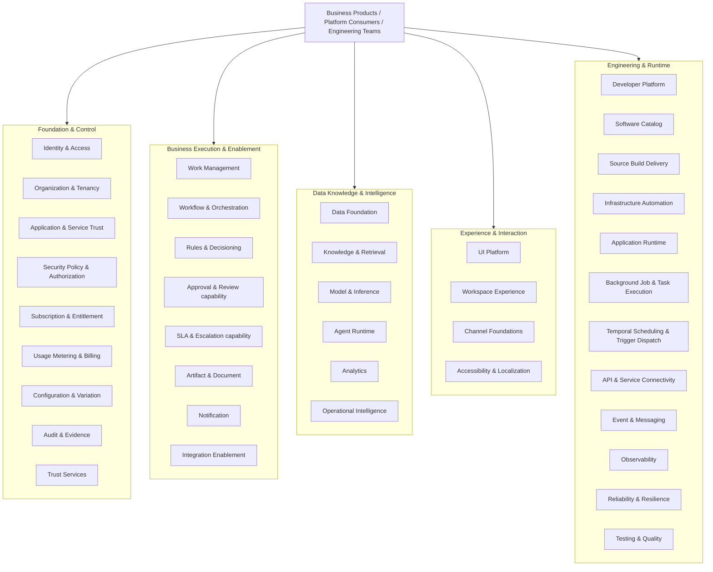

---
doc_meta:
  id: EAD-005
  title: Enterprise Platform Architecture
  owner: Architecture Authority
  version: 2.2.0
  status: approved
  classification: internal
  governed_by: [GDC-006]
  review_cycle_days: 180
  created_date: 2026-08-06
  last_reviewed: 2026-08-23
---

# Enterprise Platform Architecture

## 1. Purpose

Define how reusable Platform capabilities are grouped, qualified, product-managed, realized, operated, and evolved across the **Scnehaux Enterprise Cloud**.

**Decision question:** _Which reusable responsibilities belong in the Platform Plane, when should they become shared Platform Products, and what platform/runtime posture minimizes total system complexity?_

## 2. Scope

**In scope**

- Five Platform Plane concern families
- Platform qualification and Platform-as-a-Product doctrine
- Workspace Experience, Work Management, Rules, Knowledge & Retrieval, Model & Inference, Agent Runtime, Artifact, Scheduling, and Background Job capability posture
- Runtime/workload profiles
- Technology portfolio at macro level
- Reliability, observability, resilience, capacity, and FinOps direction

**Out of scope**

- Product-specific business semantics
- System/container topology
- Concrete graph/vector/model/provider technology choice
- Exact framework/library versions
- Product-specific SLO/runbook
- Detailed security policy

## 3. Enterprise Context

Platform architecture exists to reduce total enterprise complexity and repeated friction while preserving clear authority.

The enterprise deliberately avoids both extremes:

```text
top-down platform catalog without demand
and
duplicate foundational capability everywhere until extraction hurts
```

Platform discovery is dual-directional:

```text
Enterprise structural / constitutional need
              +
Product friction / repeated machinery / runtime evidence
              ↓
Capability candidate
              ↓
Authority boundary
              ↓
Platform qualification
              ↓
Platform Product
              ↓
Adoption / runtime evidence / feedback
              ↺
```

## 4. Architectural Drivers & Lessons

### 4.1 Drivers

| ID | Driver | Platform Consequence |
| :-- | :-- | :-- |
| D1 | HCM, Travel, future ERP, and vertical AI Products need shared foundations | Cross-product capabilities have stable logical contracts |
| D2 | Models/providers change faster than Product semantics | Model/provider abstraction and evaluation are first-class |
| D7 | Durable agent execution has different state, failure, security, and scaling economics from bounded model invocation | Agent Runtime is a separate Platform Product from Model & Inference |
| D3 | Enterprise knowledge is strategic and cross-product | Knowledge & Retrieval is separate from AI execution |
| D4 | Human operational work spans Products | Work Management and Workspace Experience are explicit capabilities |
| D5 | Durable background execution recurs everywhere | Background Job Execution receives a standard/paved road before an independent Platform Product |
| D6 | Shared services add dependency and blast radius | Platformization must lower total system complexity |

### 4.2 Lessons Incorporated

| Lesson | Platform Response |
| :-- | :-- |
| Platform root was mistaken for a Platform Product | Root, capability, Platform Product, system, deployable, and team remain distinct |
| Mechanism vs meaning was framed too absolutely | Platform owns its own bounded semantics; Product owns Product semantics/outcomes |
| Platform discovery looked waterfall/top-down | Structural need and bottom-up evidence converge |
| Cognitive load was secondary | DevEx/adoption are first-class Platform Product metrics |
| Canonical authority overlap was justified as resilience | Projections/replicas may overlap; canonical authority remains singular |
| AI gateway threatened to become a god-platform | Knowledge, Model & Inference, Agent Runtime, Product workflow, and Product authorization remain separate |

## 5. Architecture Model

### 5.1 Platform Topology



The five roots are stable concern families, not mandatory deployables.

### 5.2 Platform Doctrine

```text
Platform Plane Root
!= Capability
!= Shared Platform Product
!= System
!= Deployable
!= Team
```

A Platform owns meaningful semantics within its own bounded capability. Consuming Products retain their authoritative business semantics and outcomes.

### 5.3 Three Paths to Platformization

1. **Constitutional / Authority Driven**
   - Identity
   - Organization
   - Trust
   - Audit/Evidence

2. **Friction / Reuse Driven**
   - Work Management
   - Workflow
   - Rules
   - Artifact
   - Notification
   - Integration
   - Knowledge & Retrieval

3. **Runtime Economics Driven**
   - Event & Messaging
   - Observability
   - CI/CD
   - Runtime
   - Scheduling
   - Background Job execution patterns

A capability may have multiple drivers.

### 5.4 Platform Qualification

```text
Shared Platform Justification
=
Enterprise Responsibility
+ Authority Need
+ Consumer Friction
+ Reuse Evidence
+ Lifecycle Independence
+ Operational Economics
+ Risk Reduction

-

Shared Dependency Cost
- Cognitive Load Introduced
- Platform Operating Cost
- Blast Radius
- Migration Cost
```

A capability becomes shared only when the total system becomes simpler/safer to operate.

### 5.5 Workspace Experience

Workspace Experience is a reusable **human digital work environment**, not the Organization-owned Workspace operating context.

It may provide:

- application shell and navigation
- Product composition and deep-linking
- active context presentation/switching through Organization contracts
- My Work and work surfaces through Work Management contracts
- notification/search/knowledge/copilot composition slots
- shared chrome and experience policies

It does not own Organization/Tenant/Workspace/Membership facts.

### 5.6 Work Management

Work Management owns reusable work-management semantics such as Work Item, Case, Queue, Assignment, Claim, Priority, generic review state, and work history.

Workflow owns durable multi-step process position/coordination. Product owns what the work means and the final business outcome.

### 5.7 Rules & Decisioning

Rules & Decisioning owns reusable rule-definition/evaluation/version/testing/explanation lifecycle. Product domains own domain rule meaning and resulting business decision.

### 5.8 Knowledge & Retrieval

Knowledge & Retrieval owns governed Knowledge Asset lifecycle, provenance, ontology mechanics, graph/vector/lexical/metadata index lifecycle, authorized retrieval, and evidence/citation assembly.

Graph is first-class but not mandatory for every query. The Platform supports lexical, vector, metadata, graph, and hybrid retrieval selected by profile and evidence.

### 5.9 AI Enablement Capability Family

AI Enablement is a capability family, not one mandatory Platform Product. It is realized through **Model & Inference** and **Agent Runtime**, which may evolve independently.

#### 5.9.1 Model & Inference Platform

Model & Inference owns:

- Model & Provider Gateway
- Provider Access Profiles
- Model Catalog and Capability Profiles
- bounded synchronous, streaming, batch, structured-output, and embedding inference
- routing and provider/model policy
- provider/model evaluation, promotion, canary, rollback, and evaluated fallback
- model-level guardrails
- usage/quota/cost
- provider health and inference telemetry

A Product may consume Model & Inference directly when it needs bounded model execution and owns its own surrounding control flow.

Interactive human access and unattended machine workload access are distinct authority classes. Provider/model switching is based on Capability Profile compatibility plus current evaluation evidence; semantic equivalence is never assumed.

#### 5.9.2 Agent Runtime Platform

Agent Runtime owns generic durable agent-execution semantics:

- Agent Definition registration/version/runtime lifecycle mechanics
- Agent Run and Turn state
- Agent Runtime / Harness execution loop
- Context Assembly and Context Snapshot
- Run/Session Memory mechanics
- Tool Binding, invocation mediation, and unknown-outcome state
- Skill Binding/runtime mechanics
- parent/child Agent Runs, delegation, handoff, and agent-as-tool composition
- Agent Budget and Stop Policy
- pause/resume and waiting-for-human execution state without owning the human business decision
- agent-runtime evaluation/release mechanics
- agent trace and telemetry

Agent Runtime consumes Model & Inference for model turns and Knowledge & Retrieval for governed context. Product/Platform Tool owners retain Tool semantics, final authorization, invariants, and side effects.

Agent Runtime is not Workflow, Work Management, Knowledge authority, Tool authority, or a Vertical AI Product. Simple inference does not require Agent Runtime.

Run/session memory remains Agent execution state. Reusable factual knowledge requires governed publication into Knowledge & Retrieval; Product preferences and Product state remain Product authority.

Sandboxed code/browser/computer execution remains an Engineering & Runtime capability consumed through governed Tool contracts when justified; it is not silently absorbed into Agent Runtime authority.

### 5.10 Artifact & Document

Artifact is the broader reusable abstraction covering file/document/image/video/audio/spreadsheet/generated outputs.

Artifact Platform owns content/version/checksum/provenance/lifecycle/conversion/rendering/scan/archive mechanics. Product owns business meaning.

### 5.11 Background Job & Task Execution

Background Job Execution is an **Engineering & Runtime capability**, not yet an independent Platform Product.

The enterprise first standardizes:

- Job identity
- durable acceptance when required
- attempt/lease/claim
- retry/backoff
- timeout/cancellation
- progress
- dead-letter/replay
- bounded concurrency
- tenant/workload context
- telemetry

Product/Platform handler code remains with the owner. Scheduling owns future time. Workflow owns multi-step process state.

### 5.12 Runtime Strategy

Enterprise workload profiles include:

- request/response
- background job/worker
- scheduled/batch
- durable workflow
- integration connector
- event/stream processing
- data/knowledge indexing
- retrieval
- AI inference
- agent execution
- evaluation batch
- sandboxed tool execution
- frontend/static
- build-time library/package

### 5.13 Technology Portfolio

| Concern | Direction |
| :-- | :-- |
| Transactional/control server | Go as primary default where fit |
| Web/BFF | TypeScript |
| Data/AI/scientific workloads | Python where ecosystem leverage justifies |
| Adopted vendor kernels | Vendor runtime scoped to adopted product |
| Transactional persistence | Managed relational, PostgreSQL-compatible preferred |
| Object/artifact storage | Managed object storage |
| Messaging | Managed broker/stream |
| Cryptographic custody | Managed KMS/HSM and secret management |
| Telemetry | OpenTelemetry-compatible |
| Infrastructure | Declarative/version-controlled |
| Graph/vector/search/model provider | **Not selected at EAD level; selected downstream based on PAD/SAD evidence** |

### 5.14 Reliability Classes

| Class | Meaning | Target Availability Direction | Default RTO | Default RPO |
| :-- | :-- | :-- | :-- | :-- |
| C0 | Trust / safety critical | >=99.99% | <=15m | <=1m |
| C1 | Mission-critical operations | >=99.95% | <=1h | <=15m |
| C2 | Business important | >=99.9% | <=4h | <=1h |
| C3 | Assistive / best effort | Consumer-journey defined | <=24h | By data class |

AI Products may require a higher reliability profile than an assistive copilot. Criticality is declared by consumer journey, not “AI” as a blanket label.

### 5.15 Internal Developer Platform Strategy

The Internal Developer Platform is a Platform Product for engineering teams. It provides discoverable, measured paved roads for:

- software/catalog ownership
- project/service templates
- build/test/security/delivery
- environment/configuration provisioning
- API/event/data/AI contract discovery
- observability/readiness metadata
- background Job reference patterns
- documentation/support

Teams may leave paved roads through governed decisions. Platform success is measured through adoption, lead time, failure rate, support burden, cognitive load, and consumer satisfaction.

### 5.16 Operational Model

Every active Platform Product declares:

- accountable owner and consumers
- reliability/service profile and current SLO
- capacity/backpressure and Tenant isolation
- incident/on-call/support model appropriate to criticality
- adoption and consumer-friction metrics
- unit cost/FinOps attribution where meaningful
- recovery/reconciliation evidence
- lifecycle/deprecation/exit conditions

A shared Platform that persistently increases total-system complexity more than the value it creates is refined, split, merged, retired, or returned local.

## 6. Principles & Rules

### 6.1 Platform Is a Product
- **Fitness function:** every approved shared Platform PAD identifies owner, consumers, NFR, support/lifecycle, and adoption outcome

### 6.2 Shared Capability Must Lower Total System Complexity
- **Fitness function:** new independent Platform PAD includes reuse/authority/economics justification and negative externalities

### 6.3 Platform Owns Platform Semantics, Product Owns Product Semantics
- **Fitness function:** platform PAD review finds zero Product-specific authoritative outcome ownership

### 6.4 Distinct Primary Concerns
- **Fitness function:** every critical fact and primary responsibility has one accountable authority

### 6.5 Platform Discovery Is Evolutionary
- **Fitness function:** Platform roadmap includes consumer/runtime feedback and explicit refine/retire path

### 6.6 Simplest Sufficient Runtime
- **Fitness function:** independent distributed runtime choices carry SAD/ADR evidence

### 6.7 Background Job Is Not a Universal Worker Platform
- **Fitness function:** background-job standard prohibits arbitrary central Product code ownership

### 6.8 Knowledge, Model & Inference, and Agent Runtime Remain Separate Authorities
- **Fitness function:** Knowledge PAD owns no model/agent execution; Model & Inference PAD owns no Knowledge or durable Agent Run authority; Agent Runtime PAD owns no Knowledge source truth or Product business outcome

### 6.11 Model Invocation and Agent Execution Are Different Runtime Models
- **Fitness function:** bounded inference contracts do not require Agent Runtime, and Agent Runtime durable state/control-loop semantics are not implemented inside Model & Inference

### 6.9 Human SSO Is Not Machine Authority
- **Fitness function:** provider access profile inventory distinguishes interactive and workload identities

### 6.10 Model Portability Is Evaluated
- **Fitness function:** model/provider promotions resolve to evaluation/release evidence

## 7. Alternatives Considered

| Alternative | Why Rejected |
| :-- | :-- |
| Platformize every reusable idea | Creates support and dependency cost without leverage |
| Keep every repeated mechanism Product-local | Multiplies correctness/operational burden |
| Central Worker Platform now | Prematurely centralizes arbitrary Product execution |
| One AI Platform owns graph/RAG truth | Conflates knowledge authority with execution |
| One AI runtime owns both bounded model invocation and durable Agent execution | Couples latency-oriented provider routing to stateful agent lifecycle, Tool side effects, memory, delegation, and resumability |
| Graph-only retrieval | Makes one representation mandatory |
| Provider-specific Product integration | Prevents governed portability and multiplies security/cost controls |

## 8. Single Points of Failure & Graceful Degradation

| Capability | Blast Radius | Posture |
| :-- | :-- | :-- |
| Identity / Organization | Trust/context changes | Local artifacts/projections where permitted |
| Event & Messaging | Async ecosystem | Durable producers/replay |
| Scheduling | Future work | Durable state/misfire |
| Workspace Experience | Shared work surface | Direct Product entry where required |
| Knowledge & Retrieval | Search/RAG | Explicit degraded mode |
| Model & Inference | Bounded model execution | Evaluated provider fallback or explicit unavailable state according to Capability Profile |
| Agent Runtime | Agentic execution | Durable run-state recovery; Product/Workflow state remains outside the runtime; safe failure does not bypass authorization |
| Shared Work/Workflow | Operational coordination | Durable state and bounded isolation |

## 9. Ownership

- Architecture Authority owns Platform Plane taxonomy and qualification doctrine
- Platform Product owners own approved PAD capability outcomes
- Product teams own Product business semantics
- Engineering Platform owns common runtime/paved-road capabilities
- Governance authorities define non-negotiable controls and evidence requirements

## 10. Dependencies

- This C1 architecture artifact has no synchronous runtime dependency on another architecture artifact
- Its inputs are enterprise strategy, accountable domain ownership, legal or contractual obligations, and validated operational evidence appropriate to its subject
- Cross-artifact architectural lineage is recorded in the Traceability section and MUST NOT be interpreted as a runtime dependency graph

## 11. Traceability

- PAD-PLT-012 Workspace Experience
- PAD-PLT-013 Work Management
- PAD-PLT-014 Rules & Decisioning
- PAD-PLT-015 Knowledge & Retrieval
- PAD-PLT-008 Model & Inference rebaseline
- PAD-PLT-016 Agent Runtime
- ADR-GLB-015 Model & Inference / Agent Runtime split
- PAD-PLT-009 Artifact & Document rebaseline
- ADR-GLB-012 and ADR-GLB-013
- STD-GLB-011 Background Job Execution
