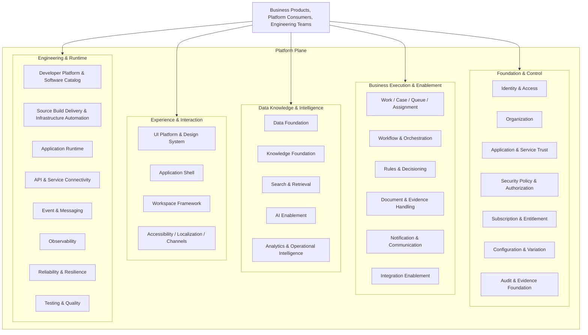

---
doc_meta:
  id: EAD-005
  title: Enterprise Platform Architecture
  owner: Architecture Authority
  version: 2.0.0
  status: approved
  classification: internal
  governed_by: [GDC-006]
  review_cycle_days: 180
  created_date: 2026-08-06
  last_reviewed: 2026-08-10
---

# Enterprise Platform Architecture

## 1. Purpose

Define the enterprise platform strategy for the **Scnehaux Enterprise Cloud**, including the five Platform Plane capability groups and the runtime, delivery, reliability, operational, and technology posture used to realize them.

**Decision question:** _How are reusable platform capabilities grouped, and what paved road, technology posture, runtime model, reliability classes, and operational principles govern how they are realized?_

EAD-005 is the sole EAD permitted to define the enterprise technology portfolio at macro level. It does not define application containers, exact infrastructure topology, library versions, pipeline steps, or system-specific production runbooks.

## 2. Scope

**In scope:**

- Platform Plane capability grouping at macro level.
- Platform-as-product and internal developer platform direction.
- Engineering-platform and runtime topology.
- Enterprise technology and runtime portfolio.
- Workload and tenant-deployment profiles at macro level.
- Reliability, resilience, observability, operational, and FinOps strategy.
- Environment, artifact, and delivery principles.

**Out of scope:**

- Detailed business-domain or platform-capability design — PADs.
- System/container topology — SADs.
- Detailed CI/CD pipeline, infrastructure code, and deployment manifests — SADs/TDDs.
- Exact library/framework versions — standards and technology lifecycle artifacts.
- System-specific SLOs, scaling, and recovery procedures — PADs/SADs.
- Security policy detail — EAD-006 and standards.

This document binds every reusable platform capability and system within the Scnehaux Enterprise Cloud at the macro platform-strategy level.

## 3. Enterprise Context

ATI must deliver urgent platform foundations without adopting prestige architecture or premature distributed-system complexity. The enterprise therefore uses the **simplest sufficient runtime**, managed commodity services where appropriate, and explicit extraction criteria for independent platforms and services.

Platform architecture serves both:

- current internal and managed-service delivery; and
- future multi-product, multi-tenant, and selective SaaS growth.

Target reliability, current service objectives, and external commercial commitments remain separate concepts.

## 4. Architectural Drivers & Lessons

### 4.1 Drivers

| ID | Driver | Platform Consequence |
| :-- | :-- | :-- |
| D1 | Rapid delivery with limited platform capacity | Managed services and modular realizations are preferred initially |
| D2 | Multiple product teams need consistent foundations | Paved roads, software catalog, UI platform, and reusable delivery capabilities |
| D3 | Identity and tenancy are trust-critical | Reliability and recovery are defined by business journey and criticality |
| D4 | Multi-tenant maturity will vary by customer | Pooled, bridge, silo, and regional profiles remain governed options |
| D5 | Travel integrations and AI create variable workload | Workload isolation, backpressure, observability, and cost controls are required |
| D6 | Architecture documents previously overclaimed maturity | Current SLO and evidence remain distinct from target reliability |

### 4.2 Lessons Incorporated

| Lesson | Platform Response |
| :-- | :-- |
| Kubernetes and microservices were treated as maturity goals | Runtime complexity requires operational evidence |
| Logical domains were mapped one-to-one to deployables | Multiple realization forms are allowed |
| Backup existence was treated as recoverability | Recovery is proven through restore exercises |
| CPU and logs were treated as sufficient observability | Business journey, freshness, reconciliation, and cost are observed |
| Platform teams built without measuring adoption | Platform capabilities are managed as products |
| CI validated documents but not executable systems | Software supply-chain and code gates are mandatory downstream |

## 5. Architecture Model

### 5.1 Platform Topology



The topology represents reusable capability responsibilities, not five mandatory platform products and not one implementation per box.

The five groups answer different architectural questions:

- **Foundation & Control** — who or what may exist, act, trust, and operate in what context
- **Business Execution & Enablement** — how operational work moves, coordinates, validates, and executes
- **Data, Knowledge & Intelligence** — what the ecosystem knows, retrieves, measures, analyzes, and infers
- **Experience & Interaction** — how people interact consistently with products without moving domain semantics into the platform
- **Engineering & Runtime** — how the ecosystem is built, delivered, connected, operated, observed, and evolved

A capability may remain product-local until reuse, cross-product authority, risk, lifecycle, or operational evidence justifies shared ownership.

#### Realization Forms

A capability may be realized as:

- a versioned library or package
- a module inside a cohesive system
- a managed cloud service
- a shared internal service
- an independently deployed platform
- an external SaaS product behind an enterprise contract

Physical extraction requires evidence of independent lifecycle, scale, security isolation, compliance, ownership, or reuse.

The following structural laws apply:

```text
Capability Group != Team
Capability != Service
Target Capability != Build Commitment
Shared Platform != Centralized Deployment
Reusable != Must Be Shared
```

### 5.2 Internal Developer Platform Strategy

The Internal Developer Platform is a product for engineering teams. It provides discoverable, supported, and measurable paved roads rather than hiding every infrastructure choice.

Minimum enterprise capabilities include:

- Software Catalog and accountable ownership.
- Project/service templates and reference implementations.
- Build, test, security, and delivery integration.
- Environment and configuration provisioning.
- API, event, and data-contract discovery.
- operational readiness and service metadata.
- documentation and support.

#### Platform Product Principles

- Teams may leave the paved road through an approved decision, not silent divergence.
- Platform adoption, lead time, failure rate, support burden, and consumer satisfaction are measured.
- A single-consumer capability remains product-internal unless constitutional need justifies centralization.
- Self-service does not remove ownership, approval, security, or cost controls.

### 5.3 Runtime Strategy

#### Technology Portfolio

| Concern | Enterprise Direction |
| :-- | :-- |
| Server-side transactional and control systems | Go as the primary default where team capability and workload fit |
| Adopted vendor kernels | The runtime required by the adopted product, scoped to that product and operated by its owning team. JVM/Quarkus is in portfolio solely as the runtime of the adopted identity kernel and does not become a general server-side option |
| Web applications, frontend tooling, and BFFs | TypeScript as the primary default |
| Data, AI, scientific, and automation workloads | Python where ecosystem leverage justifies it |
| Server packaging | OCI-compatible containers or managed runtime artifacts |
| Transactional persistence | Managed relational database as the default; PostgreSQL-compatible capability preferred |
| Ephemeral acceleration | Managed cache; never the sole durable authority |
| Object and document storage | Managed object storage with classification and lifecycle controls |
| Messaging | Managed broker/stream capability selected by workload and delivery requirements |
| Cryptographic custody | Managed KMS/HSM and secret-management capability |
| Telemetry | OpenTelemetry-compatible instrumentation and vendor-neutral export |
| Infrastructure provisioning | Declarative, version-controlled infrastructure automation |

Exact technologies, versions, exceptions, and lifecycle status belong in standards and the technology radar.

#### Workload Profiles

Enterprise runtime supports distinct profiles:

- request/response services;
- background and queue workers;
- scheduled and batch workloads;
- durable workflow/orchestration;
- integration connectors;
- event and stream processing;
- data and analytical pipelines;
- AI inference and agent workloads;
- static/frontend applications;
- shared libraries and build-time artifacts.

Each system selects the smallest sufficient profile in its SAD.

#### Environment and Artifact Direction

- Source, configuration, infrastructure, and architecture contracts are version controlled.
- A built artifact is promoted between environments rather than rebuilt for production.
- Production secrets and configuration remain external to artifacts.
- Environments have explicit purpose, access, data policy, and lifecycle.
- Preview and test environments do not silently receive production-sensitive data.

#### Multi-Tenant Deployment Profiles

| Profile  | Direction                                                              |
| :------- | :--------------------------------------------------------------------- |
| Pooled   | Shared runtime and data infrastructure with logical isolation          |
| Bridge   | Shared runtime with selected dedicated resources or data boundaries    |
| Silo     | Dedicated runtime/data boundary for one tenant or customer profile     |
| Regional | Placement constrained by residency, latency, or regulatory requirement |

Profile selection follows risk, commercial commitment, scale, and residency. Client-specific code forks are not an isolation strategy.

### 5.4 Operational Model

#### Reliability Classes

| Class | Meaning | Target Availability Direction | Default RTO | Default RPO |
| :-- | :-- | :-- | :-- | :-- |
| C0 Trust / Safety Critical | Failure compromises identity, isolation, security, or irreversible correctness | ≥ 99.99% for the relevant mature journey | ≤ 15 min | ≤ 1 min |
| C1 Mission-Critical Operations | Failure blocks core service delivery or material client operations | ≥ 99.95% | ≤ 1 h | ≤ 15 min |
| C2 Business Important | Failure degrades important business capability | ≥ 99.9% | ≤ 4 h | ≤ 1 h |
| C3 Assistive / Best Effort | Failure has an acceptable manual or non-AI fallback | Defined by consumer journey | ≤ 24 h | By data class |

These are enterprise target directions. Every PAD/SAD declares current SLO and commercial SLA separately.

#### Reliability Dimensions

Reliability includes:

- availability and latency;
- correctness and integrity;
- durability and recoverability;
- freshness and reconciliation;
- tenant isolation;
- security containment;
- capacity and backpressure;
- external dependency behavior.

A high availability percentage does not compensate for incorrect or unreconciled business outcomes.

#### Resilience Direction

Critical systems use appropriate combinations of:

- timeouts and bounded retries;
- idempotency and duplicate protection;
- circuit breaking and bulkheads;
- durable queues and outbox patterns;
- backpressure and admission control;
- graceful degradation;
- redundancy and failover;
- backup and tested restore;
- reconciliation and manual recovery paths.

Specific patterns and thresholds belong downstream.

#### Observability and Operations

Every active system exposes enough telemetry to understand:

- business journey success and failure;
- system health, latency, errors, and saturation;
- tenant/client impact;
- dependency and external-provider health;
- projection freshness and reconciliation;
- security and privileged events;
- unit cost and capacity.

Alerts have an owner, actionable condition, and response path. Service ownership, on-call expectations, incident review, and problem management follow criticality.

#### Capacity and FinOps

- Capacity has explicit limits and scaling policy.
- Autoscaling has upper bounds and cost guardrails.
- Unit economics are measured per meaningful product or platform unit.
- Tenant, client, product, integration, data, and AI costs can be attributed at an appropriate level.
- Cost optimization cannot weaken security, durability, isolation, or recovery.

#### Software Supply Chain

Enterprise delivery requires downstream controls for:

- compilation and automated tests;
- dependency and vulnerability assessment;
- secret detection;
- artifact provenance and integrity;
- architecture and contract validation;
- environment and deployment authorization;
- rollback and recovery evidence.

Detailed gates and commands belong in standards and system delivery designs.

## 6. Principles & Rules

### 6.1 Platform Is a Product

Shared platform capabilities have owners, consumers, support, lifecycle, and adoption measures.

- **Fitness function:** every chartered platform has an owner, consumer set, service catalog entry, and adoption metric.

### 6.2 Simplest Sufficient Runtime

Teams do not adopt distributed or orchestration complexity without evidence.

- **Fitness function:** SAD review records rationale for independent services, Kubernetes, service mesh, or multi-region topology.

### 6.3 Managed First for Commodity Substrate

Commodity runtime, data, messaging, and cryptographic capabilities prefer managed or proven products.

- **Fitness function:** build decisions for commodity substrate require an ADR.

### 6.4 Logical Isolation Before Physical Sprawl

Authority and access boundaries are enforced even when infrastructure is shared.

- **Fitness function:** every system declares domain ownership and data-access boundary.

### 6.5 Immutable Artifact Promotion

The same verified artifact moves between environments.

- **Fitness function:** delivery evidence identifies one artifact digest across promotion stages.

### 6.6 Reliability Is Journey-Based

SLOs and dependency budgets reflect user/business journeys.

- **Fitness function:** critical PAD/SAD journeys declare current SLO, target reliability, RTO, RPO, and degradation.

### 6.7 Current SLO Is Not Target or SLA

Architecture targets, measured operation, and external commitments remain distinct.

- **Fitness function:** active systems record all three separately.

### 6.8 Backup Is Proven by Restore

A backup without a successful restore exercise is not accepted recovery evidence.

- **Fitness function:** critical systems have current restore-test evidence.

### 6.9 Observability Is Part of the Runtime Contract

Business, technical, security, freshness, and cost signals are available before production acceptance.

- **Fitness function:** production-readiness review verifies required telemetry and owner.

### 6.10 No Client-Specific Forks

Tenant variation uses configuration, policy, connector, workflow, or deployment profile before custom code.

- **Fitness function:** client-specific fork count equals zero unless covered by an expiring waiver.

### 6.11 Code Gates Accompany Document Gates

Architecture compliance does not replace executable-system quality controls.

- **Fitness function:** every active code repository has build, test, and security gates.

### 6.12 Multi-Region Is Evidence-Driven

Regional complexity follows business continuity, residency, and commercial requirements.

- **Fitness function:** multi-region designs trace to criticality and recovery objectives.

## 7. Alternatives Considered

| Alternative | Why Rejected | Debt Accepted |
| :-- | :-- | :-- |
| Kubernetes and microservices by default | Operational complexity exceeds current evidence | Some systems begin as modular or managed realizations |
| One standard runtime for every workload | Different workloads have materially different needs | A bounded technology portfolio requires governance |
| Build all platform substrate internally | Commodity implementations add risk without differentiation | Vendor and managed-service dependencies |
| Single-region forever | It cannot meet future criticality and residency needs | Regional expansion is deferred until justified |
| Maximum availability for every system | Cost and complexity are misallocated | Reliability varies by business journey |

## 8. Single Points of Failure & Graceful Degradation

| Capability | Blast Radius | Required Direction |
| :-- | :-- | :-- |
| Cloud/region | Systems placed only in that failure domain | Recovery and regional strategy follow criticality |
| Transactional data service | Affected authoritative systems | Tested restore, redundancy, and bounded recovery |
| Messaging service | Delayed asynchronous work | Durable local state and replay |
| KMS/secret service | New credential and signing operations | Verification continues where safe; unsafe fallback prohibited |
| Developer platform | New builds and provisioning | Running systems continue independently |
| Observability service | Reduced detection | Local safeguards remain; restore telemetry urgently |
| External provider | Affected journey | Circuit isolation and declared fallback |

## 9. Ownership

| Responsibility | Accountable | Consulted |
| :-- | :-- | :-- |
| Enterprise platform strategy | Architecture Authority | Product, Platform, Security, Data, Operations |
| Foundation & Control capability | Respective accountable capability owner | Security, product consumers, Architecture Authority |
| Business Execution & Enablement capability | Respective shared-capability owner | Business domains, Operations SMEs, Architecture Authority |
| Data, Knowledge & Intelligence capability | Respective Data / Knowledge / AI capability owner | Product consumers, Security, Architecture Authority |
| Experience & Interaction capability | Experience / UI Platform Owner | Product experience teams, Accessibility, Architecture Authority |
| Developer Platform & Software Catalog | Developer Platform Owner | Product and Platform teams |
| Runtime, connectivity, messaging | Runtime / Infrastructure Owner | System owners and Security |
| Observability, reliability, testing | Respective engineering capability owner | System owners and Operations |
| Technology lifecycle | Architecture Authority | Platform owners and Security |
| FinOps and capacity policy | Platform / FinOps Authority | Product and Finance owners |

## 10. Dependencies

**Strategic inputs:** enterprise capability, system, data, and interaction architecture.

**Governed outputs:** security implementation context, technology standards, platform/domain NFRs, and system runtime designs.

## 11. Traceability

- Every active system maps to a workload and criticality profile in its SAD.
- Every chartered platform maps to an EAD-001 domain and PAD.
- Technology exceptions map to ADRs and the technology lifecycle.
- Reliability targets map to measured SLO evidence downstream.

## 12. Assumptions

- Managed cloud capabilities are available for the initial operating regions.
- Team capability grows incrementally with product demand.
- Some logical domains share physical systems initially.
- Product and external-system volumes will refine capacity targets.

## 13. Constraints

- Production secrets cannot be embedded in code or artifacts.
- Ephemeral caches cannot be sole durable authority.
- Independent services require operational ownership.
- Current SLO cannot be represented as target reliability without evidence.
- Platform standardization cannot override Product authority.
- Environment promotion cannot silently rebuild production artifacts.

## 14. Risks

| Risk | Likelihood | Impact | Mitigation |
| :-- | :-- | :-- | :-- |
| Prestige architecture delays product delivery | High | High | Simplest-sufficient-runtime gate |
| Shared infrastructure weakens logical isolation | Medium | Critical | Private authority and access boundaries |
| Target reliability is claimed without evidence | High | High | Separate target, SLO, and SLA |
| Managed-service dependency creates lock-in | Medium | Medium | Contract abstraction and exit assessment |
| Platform investment lacks adoption | Medium | High | Platform-as-product measures |
| Recovery fails despite backups | Medium | Critical | Restore exercises and RTO/RPO evidence |
| AI/integration workload causes unbounded cost | Medium | High | Admission, attribution, and cost guardrails |

## 15. Future Direction

Platform capability will grow from minimum safe paved roads toward repeatable product delivery, reusable operational platforms, and regional multi-product operation. Physical complexity is introduced only when reliability, scale, security, compliance, or lifecycle evidence requires it.

## 16. References

- EAD-001 — Enterprise Capability & Domain Map.
- EAD-002 — Enterprise System Landscape.
- EAD-003 — Enterprise Data Ownership & Topology.
- EAD-004 — Enterprise Integration Architecture.
- GDC-000 — Governance Policy.
- GDC-006 — EAD Guideline.
- AWS Well-Architected Framework.
- Google SRE principles.
- Platform engineering and internal developer platform practices.
- Team Topologies.
