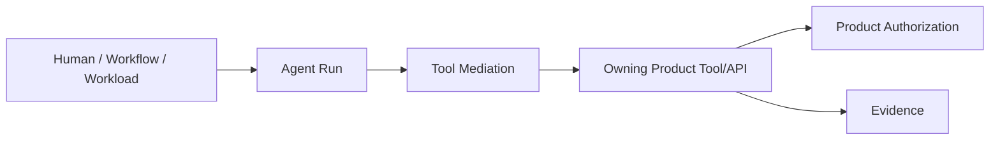

---
doc_meta:
  id: EAD-006
  title: Enterprise Security Architecture
  owner: Architecture Authority
  version: 1.2.0
  status: approved
  classification: restricted
  governed_by: [GDC-006]
  review_cycle_days: 180
  created_date: 2026-08-06
  last_reviewed: 2026-08-23
---

# Enterprise Security Architecture

## 1. Purpose

Define enterprise trust, authorization, data-protection, workload, AI/agent, retrieval, and provider-access security boundaries.

**Decision question:** _How is authority established and constrained across humans, workloads, agents, Products, Platforms, tenants, data/knowledge, tools, and external model providers?_

## 2. Scope

**In scope**

- Identity, application/workload trust, tenant context, entitlement, Product authorization
- AI Provider Access Profiles and workload/interactive distinction
- Agent delegated authority and tool execution
- Retrieval authorization and prompt-injection boundaries
- Data/classification/provider egress
- Secrets and credential custody
- Human oversight for high-impact AI actions
- Evidence requirements

**Out of scope**

- Concrete token claims and algorithms
- Provider-specific credential configuration
- Model-specific safety configuration
- Product-specific authorization rules
- Concrete sandbox/runtime technology
- System-specific threat models

## 3. Enterprise Context

Scnehaux supports humans, services, workers, connectors, AI agents, external model providers, and Product tools across multiple Tenant and external boundaries.

AI does not receive a special trust exemption. Model inference, retrieval, tool invocation, and agent iteration all remain inside the same Zero Trust architecture.

## 4. Architectural Drivers & Lessons

### 4.1 Drivers

| ID | Driver | Security Consequence |
| :-- | :-- | :-- |
| S1 | AI Products can invoke consequential tools | Delegated authority, side-effect classification, and human approval are explicit |
| S2 | Knowledge crosses sensitive Product boundaries | Retrieval authorization precedes context assembly |
| S3 | Providers support API, workload, OAuth, SSO/seat, and local modes | Access profiles are typed, scoped, attributable, and lifecycle-managed |
| S4 | Provider/model routing is dynamic | Policy constrains data egress, classification, and allowed providers |
| S5 | Agent/tool ecosystems ingest untrusted content | Prompt/tool injection and sandbox boundaries are explicit |
| S6 | Workloads/jobs are pervasive | Human credentials are never shared as workload authority |
| S7 | Background workers are pervasive and often unattended | Pure worker runtimes minimize inbound network surface and do not expose business ingress by default |

### 4.2 Lessons Incorporated

| Lesson | Response |
| :-- | :-- |
| Human SSO seat was treated as backend credential | Interactive and machine authority are distinct |
| AI agent inherited unrestricted user power | Delegation is bounded by tool, scope, time, risk, and purpose |
| Knowledge filtering occurred after model input | Retrieval is authorized before disclosure |
| Provider key lived in Product code | Credential custody stays in Trust Services |
| Pure background worker exposed a public/business HTTP listener | Worker execution and business ingress are separated; only explicitly justified internal probe/metrics/admin surfaces remain reachable |
| Tool protocol was treated as authorization | MCP/API transport does not grant Product permission |
| Model output was treated as approval | High-impact effects retain Product authorization/human control |

## 5. Architecture Model

### 5.1 Zero Trust Boundary

| Dimension | Authority |
| :-- | :-- |
| Principal identity | Identity & Access |
| Application/workload trust | Identity + Software Catalog / Application Trust |
| Tenant/Workspace context | Organization |
| Commercial grant | Subscription & Entitlement |
| Product resource authorization | Product + Security Policy support |
| Knowledge access | Source/Product policy + Knowledge Retrieval enforcement |
| AI provider access | AI Platform policy + Trust Services credential custody |
| Tool business authorization | Tool-owning Product/Platform |
| Evidence | Source system + Audit & Evidence |

### 5.2 AI Provider Access Profiles

```text
Provider Access Profile
├─ Workload API Credential
├─ Cloud Workload Identity
├─ Delegated User OAuth
├─ Enterprise SSO / Seat Interactive Access
└─ Local / Self-Hosted Runtime
```

Properties include provider, access mode, owner, purpose, data classes, Tenant/application scope, credential/session lifecycle, permitted capabilities, and evidence.

A human interactive SSO/session credential SHALL NOT be converted into pooled machine authority unless the provider exposes an explicit supported delegated machine contract and enterprise policy permits it.

### 5.3 Agent and Tool Authorization



Agent runtime may constrain available tools but does not replace Product authorization.

### 5.4 Tool Risk Classes

Tools are classified by side effect, reversibility, data sensitivity, financial/operational impact, and required assurance.

High-impact tools require explicit authorization and, where policy requires, human approval before irreversible execution.

### 5.5 Retrieval Security Boundary

```text
Caller Identity
+ Application Trust
+ Tenant/Workspace
+ Product Authorization
+ Purpose
+ Classification
        ↓
Authorized Retrieval Scope
        ↓
Retrieved Knowledge
        ↓
Model Context
```

Filtering after model disclosure is not an authorization mechanism.

### 5.6 Prompt/Content Injection Boundary

Untrusted documents, messages, web content, provider responses, and tool output are treated as data, not authority.

Agent/tool runtime shall distinguish:

- system/platform policy
- Product-owned instructions
- user intent
- retrieved/untrusted content
- tool/provider output

Untrusted content cannot expand available tool authority.

### 5.7 Provider Egress

AI/model provider routing is constrained by:

- data classification and residency
- Tenant/customer policy
- provider contractual status
- purpose
- retention/training policy
- approved model capability
- cost/risk limits

Unsupported egress fails closed for the affected operation.

### 5.8 Workload Identity

Services, workers, scheduled consumers, jobs, connectors, and agents use attributable non-human identities. Shared human credentials are prohibited for unattended execution.

### 5.9 Enterprise IAM Strategy

Identity & Access owns Principal, authenticator, authentication, federation, session, protocol trust, workload/agent identity, and authentication assurance.

It does not own Tenant/Workspace/Membership, Subscription/Entitlement, Product resource permission, Product business state, or enterprise evidence.

Normal consumers validate approved identity artifacts locally where freshness permits.

### 5.10 Security Control Architecture

Enterprise control families include:

- identity/authentication
- application/workload trust
- Tenant isolation
- distributed Product authorization
- privileged access
- cryptographic trust
- data/knowledge protection
- application/runtime security
- integration/provider security
- audit/detection
- resilience/recovery
- AI/agent/tool security

Each control names policy authority, implementing owner, evidence, failure posture, and lifecycle.

### 5.11 Data Protection

Protection applies to authoritative data, projections, artifacts, events, logs, backups, analytics, Knowledge Graph/indexes/embeddings, AI context/output, provider egress, and evidence.

Classification, minimization, purpose, encryption, residency, retention, legal hold, and support access follow the source obligation. Derived representations do not weaken source restrictions.

### 5.12 Background Worker Network Boundary

A **pure background Worker** is a runtime process whose business work is initiated through an owned queue, broker subscription, durable database claim, schedule occurrence, or equivalent asynchronous mechanism rather than a business request/response API.

The enterprise default is **no public or business inbound listener on pure Worker runtimes**.

Permitted inbound surfaces are limited to explicitly required operational interfaces such as:

- Kubernetes liveness/readiness/startup probes
- metrics scraping
- authenticated internal diagnostic or administrative control when no safer control path exists

These surfaces are not business APIs. They remain internal, network-policy restricted, least-privileged, observable, and independently removable from the business execution contract.

A deployable MAY intentionally contain both an API adapter and background Worker components. In that topology, the deployable has business ingress because of the API role; the Worker role itself does not create a second business ingress contract.

Provider webhooks/callbacks terminate at an authenticated ingress/API adapter and may enqueue owned work. They do not require exposing the background Worker directly.
## 6. Principles & Rules

### 6.1 Explicit Trust
- **Fitness function:** protected paths report zero network-location-only trust

### 6.2 Identity Has Narrow Authority
- **Fitness function:** Identity domain has no Tenant/Membership/Product permission authority

### 6.3 Product Authorization Is Enforced Near Resource
- **Fitness function:** tool/business APIs enforce resource authorization independently of AI/tool gateway

### 6.4 Workloads Have Distinct Identities
- **Fitness function:** workload inventory records owner, identity, audience, credential lifecycle

### 6.5 Interactive SSO Is Not Shared Machine Authority
- **Fitness function:** provider-access inventory has zero unattended jobs using shared human interactive sessions without supported delegation

### 6.6 Retrieval Authorization Precedes Model Context
- **Fitness function:** cross-Tenant/forbidden knowledge negative tests verify exclusion before model invocation

### 6.7 Agents Receive Bounded Delegation
- **Fitness function:** agent runs record permitted tools, scopes, budgets, identity, and delegation source

### 6.8 Untrusted Content Cannot Expand Authority
- **Fitness function:** prompt/tool-injection test suite covers untrusted retrieval/tool/provider inputs

### 6.9 Secrets Use Managed Custody
- **Fitness function:** Product/AI configuration contains references, not raw production provider credentials

### 6.10 Provider Egress Is Policy-Constrained
- **Fitness function:** restricted data/provider combinations are denied by tested policy

### 6.11 High-Risk AI Actions Require Appropriate Human/Policy Control
- **Fitness function:** high-risk action inventory maps authorization, approval, evidence, and rollback/compensation

### 6.12 AI Evidence Is Reconstructable
- **Fitness function:** significant AI actions can resolve provider/model profile, policy, retrieval/tool correlation, actor/workload, and outcome without storing prohibited secrets

### 6.13 Background Workers Minimize Inbound Surface
- **Fitness function:** pure background Worker deployments expose zero public/business inbound listeners; permitted probe/metrics/admin listeners are internal and network-policy restricted
## 7. Alternatives Considered

| Alternative | Why Rejected |
| :-- | :-- |
| AI gateway trusted inside network | Violates Zero Trust |
| One shared API key for all Products | Removes attribution, isolation, rotation, and cost ownership |
| Reuse provider web session for workers | Human session lifecycle is not workload identity |
| Filter RAG after model invocation | Data already disclosed |
| Agent gateway is final authorization | Product invariants and resource authority are lost |
| Give agents full user scope | Excessive blast radius |

## 8. Single Points of Failure & Graceful Degradation

| Dependency | Blast Radius | Required Posture |
| :-- | :-- | :-- |
| Identity | New auth/refresh | Locally verifiable active artifacts where permitted |
| Organization context | New membership/context changes | Bounded projections with revocation semantics |
| Trust/Secret Services | New credential acquisition/rotation | Cached secrets only within approved bounded lifecycle |
| AI provider | AI feature | Evaluated fallback or explicit failure |
| Knowledge authorization | RAG/search | Fail closed for protected content |
| Tool owner | Agent task | Fail task, never bypass Product authorization |

## 9. Ownership

| Responsibility | Accountable |
| :-- | :-- |
| Enterprise security principles | Security / Architecture Authority |
| Principal authentication | Identity |
| Tenant/Workspace context | Organization |
| Product authorization | Product domain |
| AI execution policy enforcement | AI Platform |
| Knowledge retrieval enforcement | Knowledge & Retrieval |
| Provider credential custody | Trust Services |
| Tool business authorization | Tool-owning Product/Platform |

## 10. Dependencies

- This C1 architecture artifact has no synchronous runtime dependency on another architecture artifact
- Its inputs are enterprise strategy, accountable domain ownership, legal or contractual obligations, and validated operational evidence appropriate to its subject
- Cross-artifact architectural lineage is recorded in the Traceability section and MUST NOT be interpreted as a runtime dependency graph

## 11. Traceability

- PAD-PLT-008 AI Platform
- PAD-PLT-015 Knowledge & Retrieval
- ADR-GLB-012 AI/Knowledge/Product separation
- STD-IAM profiles for identity/token verification
- Security tests and system threat models downstream
- ADR-GLB-014 Background Worker Network Boundary
- STD-GLB-012 Background Worker Network Exposure
