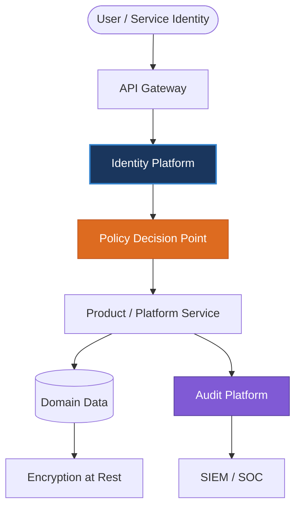
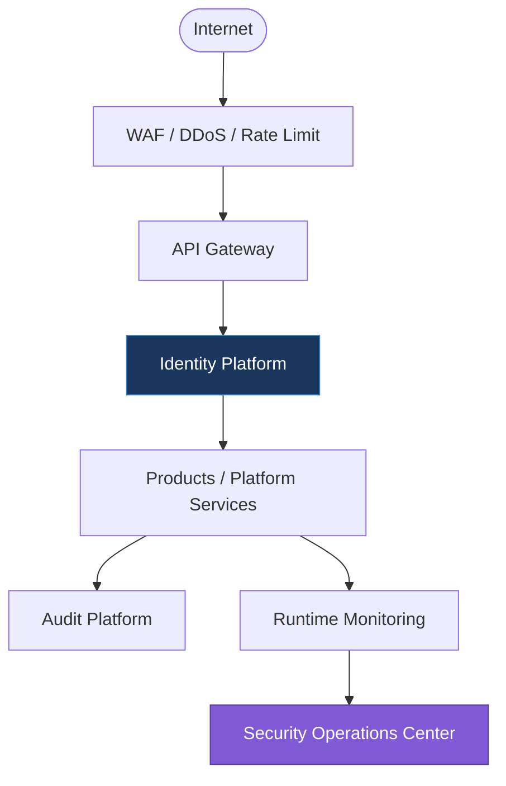
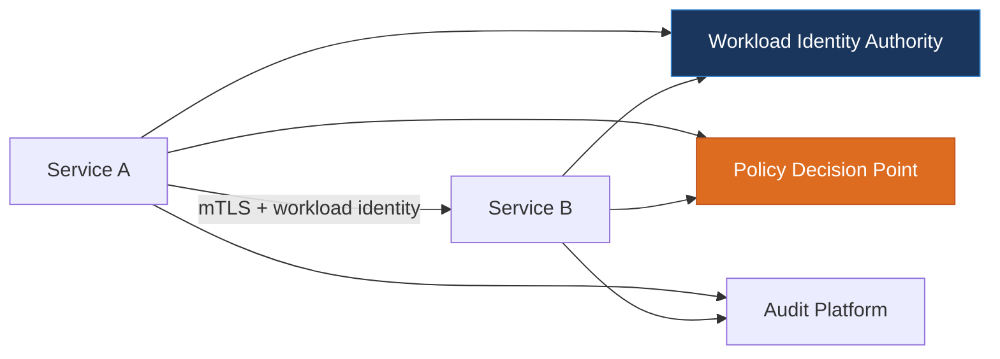
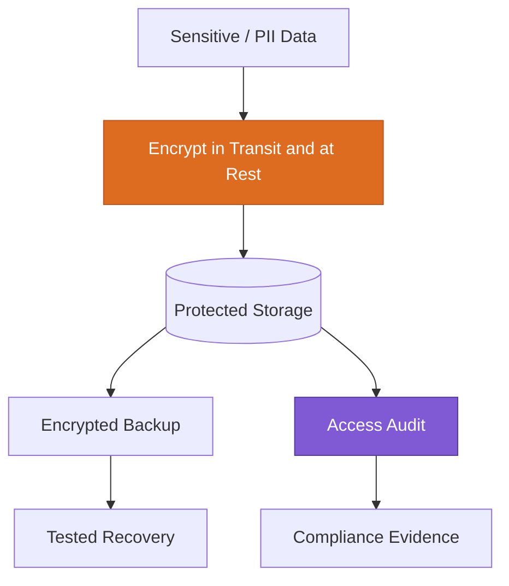

---
doc_meta:
  id: EAD-006
  title: Enterprise Security Architecture
  owner: Architecture Authority
  version: 1.0.0
  status: approved
  classification: restricted
  governed_by: [GDC-006]
  review_cycle_days: 180
  created_date: 2026-01-01
  last_reviewed: 2026-07-05
---

# Enterprise Security Architecture

## 1. Purpose

Establish the enterprise security model that every Platform Service and Business Product inherits: the Zero Trust boundary, the centralized identity strategy, the layered control architecture, and the data-protection rules. Security at Scnehaux is a shared enterprise capability delivered by the Identity and Audit Platforms and enforced uniformly, so that individual products inherit a strong posture rather than each re-implementing (and re-weakening) it.

**Decision question this document answers:** _"What is the enterprise trust model, and which security controls are mandatory and centrally provided rather than product-specific?"_

This document states the enterprise security model and mandatory controls. It does not define product-specific authentication flows, authorization policy contents, cryptographic algorithm selection, or infrastructure hardening; those are owned downstream by the Identity Platform PAD, security standards, and SADs.

---

## 2. Scope

**In scope:**

- The Zero Trust trust model and its enterprise boundaries.
- The centralized Identity Platform strategy.
- The layered (defense-in-depth) security control architecture.
- Enterprise data protection: classification, encryption, secrets, and auditability.

**Out of scope:**

- Product-specific authentication and authorization implementations (owned by Identity Platform PAD/SAD).
- Specific cryptographic algorithm and key-length selection (owned by security standards).
- Infrastructure and network hardening configuration (owned by SAD).
- Incident response runbooks (owned by Security Operations).

---

## 3. Enterprise Context

Scnehaux adopts a **Zero Trust Security Model** aligned to NIST SP 800-207. No request is trusted by virtue of its network location; every request is authenticated, authorized, encrypted, and audited, and access decisions are continuously evaluated. Identity is the primary control plane, provided centrally by the Identity Platform, so that authentication and authorization are implemented once and consumed everywhere.

The governing invariant: **no Business Product implements its own authentication or authorization; it consumes identity as a platform capability.** This makes the enterprise security posture a property of the platform rather than the weakest product, and it makes every security-relevant action auditable through a single, tamper-evident trail.

---

## 4. Architectural Drivers & Lessons

### 4.1. Drivers

The enterprise security architecture protects the business value defined in EAD-001 by assuming breach, eliminating implicit trust, and demanding cryptographic proof of identity.

| Driver | Security Consequence |
| :-- | :-- |
| Assume breach | Security boundaries exist inside the perimeter; no implicit trust on the internal network |
| Never trust, always verify | Explicit, cryptographic authentication and authorization for every request |
| Centralized governance, decentralized execution | Policy defined centrally (IAM, Gateways), enforced locally (Sidecars, SDKs) |
| Frictionless security | Security is baked into the Golden Path, invisible to product teams unless violated |

### 4.2. Lessons Incorporated

From enterprise COE (Correction-of-Error) themes, not a greenfield ideal.

| COE-class lesson | Design response in this document |
| :-- | :-- |
| A product-local authentication implementation became the weakest link and was breached | Identity First: zero local credential stores; identity consumed as a platform capability |
| Network-location trust enabled lateral movement after an initial foothold | Zero Trust with east-west mTLS and per-call authorization (below) |
| A missing audit trail made an incident uninvestigable and failed compliance | Audit Everything: 100% of security-sensitive actions produce an immutable event |
| Standing admin privilege turned one credential theft into a broad breach | Zero standing privileges; time-bound, reviewed elevation |

---

## 5. Architecture Model

### 5.1. Zero Trust Boundary

| Trust Principle       | Description                                                               |
| :-------------------- | :------------------------------------------------------------------------ |
| Never Trust           | Every request is untrusted by default, regardless of network origin.      |
| Always Verify         | Authentication and authorization are mandatory on every request.          |
| Least Privilege       | Access is limited to the minimum permissions required for the task.       |
| Continuous Evaluation | Access decisions may be re-evaluated within a session on context change.  |
| Complete Auditability | Every security-sensitive action is recorded in the immutable audit trail. |

### 5.2. Enterprise IAM Strategy

| Capability                  | Owning Platform   | Enterprise Standard / Target                    |
| :-------------------------- | :---------------- | :---------------------------------------------- |
| Identity Lifecycle          | Identity Platform | SCIM 2.0 provisioning                           |
| Authentication              | Identity Platform | OAuth 2.1 / OIDC; FIDO2 / WebAuthn              |
| Identity Authorization      | Identity Platform | OAuth 2.0 Delegation, Scope, Consent Management |
| Federation                  | Identity Platform | External IdP federation & Public OIDC Provider  |
| Multi-Factor Authentication | Identity Platform | 100% coverage for privileged access             |
| Session & Tokens            | Identity Platform | Access token TTL ≤ 15 min; refresh rotation     |
| Service Accounts & API Keys | Identity Platform | Scoped, rotated, auditable                      |
| Security Audit              | Audit Platform    | Immutable, append-only, ≥ 400-day retention     |

**Enterprise & Ecosystem IAM rules:**

- Identity is centralized in the Identity Platform.
- Business Products never implement authentication.
- Third-party applications consume Identity via explicit OAuth 2.0 user consent grants, and strictly operate outside the enterprise trust boundary.
- Authorization policy is evaluated consistently across all products.
- Products consume identity; they do not store or manage credentials.

### 5.3. Security Control Architecture

| Layer                | Responsibility                                       |
| :------------------- | :--------------------------------------------------- |
| Edge Security        | WAF, DDoS protection, rate limiting                  |
| Identity Security    | Authentication and authorization enforcement         |
| API Security         | Gateway policy, token validation, schema enforcement |
| Application Security | Secure SDLC, dependency and supply-chain integrity   |
| Runtime Security     | Hardened, isolated workloads                         |
| Monitoring           | Threat detection and anomaly analysis                |
| Audit                | Tamper-evident compliance evidence                   |

Security control principles: Defense in Depth, Secure by Default, Fail Secure, Least Privilege, Zero Standing Privileges, and Continuous Monitoring.

### 5.4. Service-to-Service (East-West) Security

Zero Trust does not stop at the edge. Inside the runtime there is no implicit trust between workloads: every service-to-service call is mutually authenticated, encrypted, and authorized independently of the north-south (edge) path.

| East-West Control | Requirement |
| :-- | :-- |
| Transport | Mutual TLS (mTLS) on every internal call; no plaintext east-west traffic |
| Workload Identity | Each workload holds a cryptographic identity (SPIFFE/SVID); no shared network-implicit trust |
| Authorization | The Policy Decision Point authorizes each call on identity + context; the calling network segment grants nothing |
| Certificate Lifecycle | Short-lived, automatically rotated workload certificates; no long-lived service credentials |
| Auditability | Service-to-service authorization decisions are audited like user actions |

**East-west rules:** the internal network is treated as hostile; a workload authenticates and is authorized on every call regardless of origin; certificates are short-lived and auto-rotated; there is no "trusted internal zone" that bypasses identity.

### 5.5. Data Protection

| Classification | Protection Level | Baseline Control                                              |
| :------------- | :--------------- | :------------------------------------------------------------ |
| Public         | Basic            | Integrity protection                                          |
| Internal       | Standard         | Encryption at rest + access control                           |
| Confidential   | High             | Encryption + fine-grained authZ + access audit                |
| Restricted     | Maximum          | Encryption + least privilege + full audit + residency binding |

**Data protection rules:**

- Data is encrypted in transit using TLS 1.3.
- Sensitive data is encrypted at rest using AES-256.
- Secrets are brokered from a managed store and never stored in application code or images.
- Every access to sensitive data is recorded in the audit trail.
- Data retention and residency follow enterprise governance (EAD-003).
- Cryptographic keys are centrally managed with defined rotation.

**Regulatory scope:** payment data (Billing + payment providers) is in **PCI DSS** scope and is never stored in Scnehaux stores — it is tokenized at the provider and only tokens transit the estate. Personal data is handled under **GDPR** (lawful basis, data-subject rights, residency binding); the enterprise targets **SOC 2 Type II** and **ISO/IEC 27001** control coverage, with the immutable audit trail (EAD-003) serving as the primary compliance evidence source.

---

## 6. Principles & Rules

Each principle is paired with a machine-verifiable or audit-verifiable **fitness function**, upholding the GDC-000 maxim that a rule without an enforcement mechanism is only a suggestion.

### 6.1. Zero Trust

Every request is authenticated and authorized regardless of origin.

- **Rationale:** Network-location trust is the root cause of lateral-movement breaches.
- **Fitness function:** 100% of production endpoints require validated identity; unauthenticated paths = `0` (except explicitly approved public endpoints).

### 6.2. Identity First

The Identity Platform is the single source of enterprise identity.

- **Rationale:** Distributed identity implementations diverge and become the weakest link.
- **Fitness function:** Zero Business Products implement local authentication; local credential stores = `0`.

### 6.3. Security by Default

Security controls are enabled by default, not opt-in.

- **Rationale:** Opt-in security guarantees inconsistent coverage.
- **Fitness function:** Golden Path services inherit encryption, authN, and audit with no additional configuration.

### 6.4. Zero Trust Privilege

Every identity holds the minimum permissions required.

- **Rationale:** Excess privilege converts any single compromise into a broad breach.
- **Fitness function:** Privileged access is time-bound and reviewed; standing admin privileges trend toward `0`.

### 6.5. Defense in Depth

Independent controls exist at every architectural layer.

- **Rationale:** No single control is infallible; layered controls contain failures.
- **Fitness function:** Every request path traverses edge, identity, and application controls; single-control paths = `0`.

### 6.6. Audit Everything

Every security-relevant action is recorded and traceable.

- **Rationale:** Un-audited actions cannot be investigated and fail compliance.
- **Fitness function:** 100% of security-sensitive actions produce an immutable audit event; retention ≥ 400 days.

---

## 7. Alternatives Considered

The Zero Trust / centralized-identity model was chosen against rejected alternatives. Each rejection is a consciously accepted trade-off.

| Alternative | Why Rejected | Debt Consciously Accepted |
| :-- | :-- | :-- |
| **Perimeter (castle-and-moat) security** | A single breached perimeter grants lateral free movement; the root cause of large breaches | Per-request verification and mTLS add latency and operational complexity |
| **Per-product IAM** | Divergent implementations become the weakest link; inconsistent policy and audit | Products depend on a central Identity Platform (an enterprise SPOF, mitigated below) |
| **Coarse RBAC only, evaluated at login** | Cannot react to context change mid-session; over-grants standing privilege | Continuous, context-aware authorization is more complex to build and reason about |
| **Long-lived service credentials / API keys for east-west** | Long-lived secrets leak and are hard to rotate; enable persistent lateral access | Short-lived workload certificates require automated issuance and rotation machinery |

---

## 8. Single Points of Failure & Graceful Degradation

Centralizing identity concentrates risk in the Identity Platform by design; its failure and degradation modes are therefore first-class.

| SPOF | Blast radius | Graceful degradation strategy |
| :-- | :-- | :-- |
| Identity Platform (authN/authZ) | Enterprise-wide | Tier-0 hardened; consumers validate short-lived cached tokens locally during an outage so existing sessions continue while new logins and privileged writes fail-closed; a controlled, fully-audited break-glass path exists for emergency access |
| Policy Decision Point (authZ) | All authorization decisions | Fails **closed** (default-deny); recently-evaluated policy is cached with a bounded TTL to ride out a brief PDP outage without granting unaudited access |
| Secrets store / KMS | Services needing fresh secrets/keys | Leased secrets are cached with a bounded TTL; running workloads continue on current leases while issuance is degraded; no secret is ever written to code or images |
| Audit pipeline | Compliance evidence, not serving | Security-sensitive events are written to a local durable queue and backfilled — audit events are delayed, never dropped; loss of the audit path fails security-critical writes closed |

The design bias is uniform: on a security-control failure the system **fails closed** for privileged and write operations and degrades to read/existing-session continuity, never to open access.

---

## 9. Ownership

| Responsibility                                   | Accountable               | Consulted                    |
| :----------------------------------------------- | :------------------------ | :--------------------------- |
| Enterprise security architecture (this artifact) | Architecture Authority    | Security Team, Identity Team |
| Identity Platform                                | Identity Team             | Security Team                |
| Security governance and standards                | Security Team             | Architecture Authority       |
| Audit trail and compliance evidence              | Audit Team                | Security Team, Legal         |
| Security operations and response                 | Security Operations (SOC) | Domain Teams                 |

---

## 10. Dependencies

**Upstream (this document depends on):**

- EAD-001 Enterprise Capability & Domain Map — supplies domains and trust boundaries.
- EAD-002 Enterprise System Landscape — supplies systems to be secured.
- EAD-004 Enterprise Integration Architecture — gateway and contract security surfaces.
- EAD-005 Enterprise Platform Architecture — secure-by-default substrate and secret brokering.

**Downstream (this document governs):**

- Identity Platform PAD and Audit Platform PAD.
- Security and Compliance standards (STD).
- Every PAD and SAD (security conformance).

---

## 11. Traceability

- **Referenced by:** every Platform PAD, every Business Product PAD, every SAD, the security standards, and compliance policies.
- **Governs:** the identity, encryption, and audit standards in the STD layer.
- **Consistency rule:** every SAD's security section MUST conform to the trust model and mandatory controls defined here; a SAD implementing local authentication is rejected.

---

## 12. Assumptions

- The Identity Platform is the enterprise trust anchor and is itself Tier-0.
- Every system can integrate centralized authentication and authorization.
- Encryption and secret-brokering capabilities are available across all runtime environments.

---

## 13. Constraints

- Local authentication inside Business Products is prohibited.
- Shared credentials are prohibited.
- Hardcoded secrets are prohibited.
- Anonymous access is prohibited unless explicitly approved and audited.
- Internal systems cannot bypass edge, identity, or audit controls.

---

## 14. Risks

| Risk | Likelihood | Impact | Mitigation |
| :-- | :-- | :-- | :-- |
| Identity Platform compromise | Low | Critical — enterprise-wide breach | Tier-0 hardening, MFA, continuous monitoring, blast-radius containment |
| Excessive standing privilege | Medium | High — broad unauthorized access | Least Privilege + time-bound access reviews |
| Weak or missing encryption | Low | High — data exposure | TLS 1.3 / AES-256 mandated by default |
| Missing audit trail | Low | High — compliance failure | Audit Everything + immutable trail |
| Inconsistent controls across products | Medium | High — expanded attack surface | Security by Default via the platform |

---

## 15. Future Direction

The security architecture evolves by strengthening controls without weakening the Zero Trust core: broader passwordless (FIDO2) adoption, continuous authorization with richer context signals, automated policy-as-code enforcement across the supply chain, and confidential-computing options for the most sensitive workloads. Cryptographic and vendor choices will change; the model — centralized identity, least privilege, defense in depth, complete auditability — remains fixed.

---

## 16. References

- Zero Trust Architecture — NIST SP 800-207
- NIST Cybersecurity Framework (CSF)
- OWASP Application Security Verification Standard (ASVS)
- OWASP Top 10
- OAuth 2.1 / OpenID Connect
- FIDO2 & WebAuthn
- SCIM 2.0
- CIS Controls
- Cloud Security Alliance (CSA) guidance
