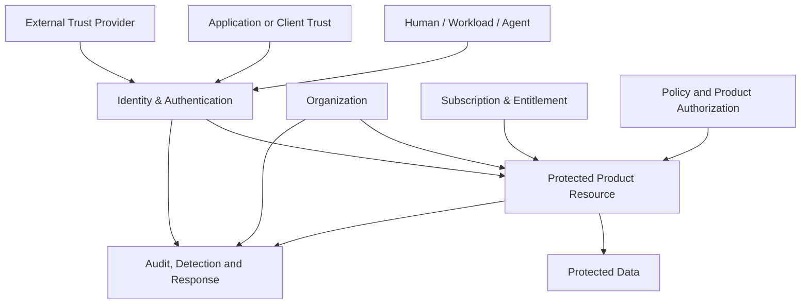

---
doc_meta:
  id: EAD-006
  title: Enterprise Security Architecture
  owner: Architecture Authority
  version: 1.0.0
  status: approved
  classification: restricted
  governed_by: [GDC-006]
  review_cycle_days: 180
  created_date: 2026-08-06
  last_reviewed: 2026-08-06
---

# Enterprise Security Architecture

## 1. Purpose

Define the enterprise trust model, identity strategy, security-control architecture, and data-protection direction for the **Scnehaux Enterprise Cloud**.

**Decision question:** _How is trust established, constrained, enforced, monitored, and recovered across users, workloads, applications, tenants, products, data, and external systems?_

This document defines enterprise security intent and macro boundaries. It does not define token claims, protocol endpoints, cryptographic algorithms, browser controls, database policies, route middleware, or system-specific incident procedures.

## 2. Scope

**In scope:**

- Zero Trust boundaries and trust relationships.
- Enterprise IAM and workload-identity strategy.
- Separation of identity, application trust, membership, entitlement, and Product authorization.
- Security-control families and accountable authorities.
- Privileged access, external trust, audit, detection, and incident-containment direction.
- Data protection, privacy, residency, and cryptographic-custody principles.

**Out of scope:**

- Detailed authentication, token, session, and federation design — Identity PAD, standards, and SADs.
- Product-specific authorization rules — Product PADs.
- Tenant-isolation implementation — Tenancy PAD, standards, and SADs.
- Network, runtime, database, frontend, and API control implementation — standards and SADs.
- Detailed threat models and security tests — PADs, SADs, TDDs, and security assessments.
- Regulatory control mappings — compliance standards and evidence catalogs.

This document binds every product, platform, workload, user, partner, and external integration in the Scnehaux Enterprise Cloud.

## 3. Enterprise Context

Scnehaux Enterprise Cloud will serve ATI workforce, client and partner users, product customers, machine workloads, integrations, and AI agents across multiple tenant and external-system boundaries.

Trust cannot be inferred from network location, possession of a tenant identifier, or successful authentication alone. Effective access is composed from independent authorities and enforced near the protected resource.

Security must support urgent internal delivery while preserving an evolution path toward managed services and selective SaaS exposure. Target controls are not represented as implemented until realizer and evidence exist.

## 4. Architectural Drivers & Lessons

### 4.1 Drivers

| ID | Driver | Security Consequence |
| :-- | :-- | :-- |
| S1 | Multi-tenant and cross-client ATI workforce | Principal identity and contextual Membership remain separate |
| S2 | Multiple applications and future third parties | Application ownership and protocol trust are explicit |
| S3 | Client and industry integrations | External trust is scoped by provider, purpose, tenant, and data class |
| S4 | Travel and financial actions are high impact | Strong assurance, separation of duties, evidence, and containment |
| S5 | AI and automation may invoke tools | Agents receive bounded delegated authority, not unrestricted user power |
| S6 | Identity implementation is urgent but incomplete | Security capability status requires implementation and test evidence |

### 4.2 Lessons Incorporated

| Lesson | Security Response |
| :-- | :-- |
| Central identity was interpreted as central business authorization | IAM authority is narrowed; Product domains retain resource decisions |
| Tenant headers were treated as trusted context | Context requires validated identity, application, and Membership |
| Signed token was treated as complete authorization | Signature is one input; audience, scope, context, policy, and resource rules still apply |
| Security controls were declared without realizers | Control status and evidence are explicit downstream |
| Shared human credentials were used for services | Workloads and agents receive distinct identities |
| Key and session behavior was assumed rather than tested | Custody, lifecycle, containment, and recovery are evidence-backed |

## 5. Architecture Model

### 5.1 Zero Trust Boundary

Every request or action is evaluated from explicit trust signals. Network placement alone grants no privilege.

#### Trust Dimensions

| Dimension | Question | Authority |
| :-- | :-- | :-- |
| Identity | Who or what is acting? | Identity & Access |
| Application Trust | Which application or workload requests access? | Identity protocol trust plus Software Catalog ownership |
| Operating Context | In which Tenant or Workspace may the actor operate? | Organization |
| Commercial Access | Which Product capabilities are active? | Subscription & Entitlement |
| Resource Authorization | May this action occur on this resource? | Product domain and/or Policy authority |
| Assurance | Is the authentication strength and recency sufficient? | Identity & Access plus Security policy |
| Evidence | Can the decision and action be reconstructed? | Source domain and Audit & Evidence |

Effective access is the intersection of these dimensions, not the output of one god-platform.

### 5.2 Enterprise IAM Strategy

The enterprise IAM strategy establishes:

- stable Principals for humans, services, workloads, and governed agents;
- explicit Identity Realms and correlation boundaries;
- governed identifiers and authenticators;
- authentication assurance and recovery;
- session and credential lifecycle;
- standards-based authentication, federation, and delegated-access protocols;
- registered application and protected-resource trust;
- locally verifiable security artifacts;
- machine and workload identity;
- identity-security event publication.

#### Identity Boundary

Identity owns Principal and authentication trust. It does not own:

- Tenant, Workspace, or Membership;
- Product, Application ownership, or Subscription;
- Entitlement or business permission;
- Product resource state;
- enterprise-wide immutable evidence.

#### Identity Populations

The strategy supports distinct realm policies for:

- ATI workforce;
- customer workforce;
- partner identities;
- external consumers;
- federated enterprise identities;
- service, workload, and agent identities.

The same human may hold one stable workforce Principal across many Tenant Memberships, while customer or partner identities may remain realm-scoped where correlation is not justified.

#### Application and Workload Trust

Applications are owned by the Software Catalog domain. Identity owns their protocol-security registration and credential trust. Workloads use non-human identities and do not reuse human credentials.

#### Local Verification

Products validate approved security artifacts locally during normal operation. Online identity or policy checks are reserved for decisions whose freshness or risk requires them.

### 5.3 Security Control Architecture

Security controls are organized into enterprise families:

| Control Family | Enterprise Direction | Primary Authority |
| :-- | :-- | :-- |
| Identity and Authentication | Strong, risk-appropriate authentication and recovery | Identity & Access |
| Application and Workload Trust | Registered clients, resources, workloads, and credential lifecycle | Identity, Software Catalog, Security & Trust |
| Tenant Isolation | Explicit context, scoped administration, data and runtime isolation | Organization, Products, Runtime |
| Authorization | Default deny; enforcement near resource; explicit separation of duties | Product domain / Policy authority |
| Privileged Access | Dedicated privilege, strong assurance, limited duration, full attribution | Security Authority plus owning domain |
| Cryptographic Trust | Managed custody, lifecycle, rotation, and recovery | Security & Trust Services |
| Data Protection | Classification, minimization, encryption, residency, retention | Data, Security, Privacy, Domain owners |
| Application Security | Secure design, supply chain, testing, and runtime protection | Application owner plus Security |
| Network and Runtime Security | Segmentation, workload trust, hardened runtime, monitored exposure | Runtime and Security owners |
| Integration Security | Provider trust, credential isolation, input validation, and scoped data exchange | Natural business owner plus Integration/Security |
| Audit and Detection | Durable events, correlation, monitoring, response, and evidence | Source domains, Security Operations, Audit |
| Resilience and Recovery | Containment, backup, restore, failover, and tested recovery | System owners plus Reliability/Security |
| AI Security | Data controls, tool authorization, evaluation, human oversight, bounded autonomy | AI, Product, Security, and Data owners |

#### Distributed Authorization

Authorization is layered:

- protocol delegation defines which client may request which scope for which resource;
- Membership defines valid Tenant/Workspace context;
- Entitlement defines commercial capability;
- Product policy defines actions, resources, relationships, and business invariants;
- risk and assurance may require stronger authentication or human approval.

A universal synchronous Policy Decision Point is not required. Shared policy capability may distribute or evaluate policy where justified, while the Product domain remains accountable for the final business decision.

#### Privileged Access and Break-Glass

Privileged access is separate from ordinary user access and includes:

- dedicated administrative authority;
- strong and recent authentication;
- explicit scope and duration;
- approval or separation of duties for high-risk actions;
- complete attribution and evidence;
- periodic review and revocation.

Break-glass access may be claimed only when a dedicated mechanism, owner, scope, evidence path, automatic expiry, and tested recovery procedure exist.

#### Security Control Status

Downstream security controls distinguish:

- designed;
- assigned;
- implemented;
- tested;
- monitored;
- retired.

An approved architecture does not make a control implemented.

### 5.4 Data Protection

#### Protection Principles

- Data is classified and minimized by purpose.
- Sensitive data is protected in transit, at rest, in backups, in events, in logs, and in analytical/AI copies.
- Cryptographic keys and secrets use managed custody appropriate to risk.
- Tenant, client, classification, purpose, residency, and retention context are preserved.
- Public verification material is separated from restricted identity and key material.
- Derived analytics, knowledge, and AI context inherit source restrictions.
- Data-subject rights, legal hold, evidence, and contractual obligations are reconciled rather than applied as blind deletion.

#### Cryptographic Trust

Enterprise cryptographic direction requires:

- explicit key and certificate authority;
- managed production custody;
- unique and stable key identity;
- controlled activation, rotation, retirement, recovery, and destruction;
- separation of duties for high-impact key operations;
- no silent production fallback to ephemeral keys;
- tested continuity across failure and recovery.

Detailed algorithms and lifetimes belong in standards and SADs.

#### Privacy and Correlation

- Identity correlation is limited to justified realm and purpose.
- External applications receive only required attributes.
- Pairwise or scoped identifiers are used when global correlation is unnecessary.
- Consent does not override prohibited processing.
- Cross-tenant search, support, analytics, and administration require explicit authorization and evidence.

#### Residency and Sovereignty

Residency and sovereignty apply to authoritative stores, projections, messages, backups, support access, analytics, AI processing, and evidence. Unsupported requirements block the affected use rather than silently violating policy.

#### Security Telemetry and Evidence

Critical security events identify actor, application/workload, Tenant context, action, result, assurance, correlation, and evidence state without exposing secrets. Source systems retain durable facts until enterprise evidence is delivered.

## 6. Principles & Rules

### 6.1 Explicit Trust, No Network Inheritance

Every actor, application, workload, context, and resource establishes trust explicitly.

- **Fitness function:** protected-system review reports zero network-location-only trust paths.

### 6.2 Identity Has Narrow Authority

IAM does not own Membership, Entitlement, Application ownership, or Product permission.

- **Fitness function:** Identity PAD and data-model audit report zero prohibited authoritative aggregates.

### 6.3 Realm and Operating Context Are Explicit

Identity correlation and Tenant context follow governed realm and Membership policies.

- **Fitness function:** every authentication and context journey identifies realm and context authority.

### 6.4 Default Deny

Access is denied unless required trust and authorization are positively established.

- **Fitness function:** route and policy tests verify unauthenticated and unauthorized denial.

### 6.5 Signature Is Not Authorization

A valid cryptographic artifact does not by itself authorize a Product action.

- **Fitness function:** protected resources validate audience/context and enforce Product policy.

### 6.6 Authorization Is Enforced Near the Resource

The owning Product remains accountable for business authorization.

- **Fitness function:** Product PADs identify authorization owner and high-risk decisions.

### 6.7 Membership, Entitlement, and Permission Are Distinct

Context, commercial access, and action authorization do not imply one another.

- **Fitness function:** contract and domain review reports zero conflated authority.

### 6.8 Production Cryptographic Material Uses Managed Custody

Keys and secrets have explicit owner, lifecycle, and recovery.

- **Fitness function:** critical SADs provide custody and rotation evidence.

### 6.9 Workloads Have Distinct Identities

Services, jobs, connectors, and agents do not use shared human credentials.

- **Fitness function:** workload inventory reports owner, identity, credential lifecycle, and audience.

### 6.10 Privilege Is Attributable and Time-Bound

Administrative and emergency authority is scoped, evidenced, and reviewed.

- **Fitness function:** privileged-access review reports owner, scope, expiry, and evidence.

### 6.11 Tenant Isolation Is Defense in Depth

Application, data, runtime, cache, messaging, export, and administration controls enforce isolation together.

- **Fitness function:** cross-tenant negative-test coverage includes every relevant data path.

### 6.12 Security Controls Require Realizers and Evidence

Architecture status is not implementation status.

- **Fitness function:** implemented/tested controls resolve to systems and current evidence.

### 6.13 External Trust Is Scoped

Federation, providers, partners, and client systems are trusted only for declared facts and purposes.

- **Fitness function:** external trust inventory identifies issuer/provider, scope, owner, and lifecycle.

### 6.14 AI Authority Is Delegated and Bounded

AI and agents operate within user/workflow authority, tool policy, data purpose, risk limits, and human oversight.

- **Fitness function:** high-risk AI actions have explicit authorization and approval control.

### 6.15 Degraded Security Is Explicit

Failure modes define which operations continue, degrade, or fail closed.

- **Fitness function:** critical security dependencies have approved degradation contracts.

## 7. Alternatives Considered

| Alternative | Why Rejected | Debt Accepted |
| :-- | :-- | :-- |
| Perimeter/network trust | Internal location does not prove identity or authorization | More explicit identity and workload controls |
| IAM owns all authorization | It creates a god-platform and ignores Product context | Distributed policy and local enforcement complexity |
| One global identity correlation policy | Workforce, customer, partner, and consumer needs differ | Explicit Identity Realms and linking governance |
| Shared human service accounts | They destroy attribution and safe rotation | Workload-identity lifecycle investment |
| Security controls considered implemented when documented | It creates false assurance | Evidence and control-status administration |
| AI agent inherits full user access | It creates excessive and opaque authority | Bounded delegation and approval flow |

## 8. Single Points of Failure & Graceful Degradation

| Security Dependency | Blast Radius | Required Posture |
| :-- | :-- | :-- |
| Identity issuance | New authentication and credential lifecycle | Existing valid artifacts remain locally verifiable; new trust fails closed |
| Tenant/Membership authority | New context and revocation changes | Bounded projections continue within security policy |
| Cryptographic custody | New signing, encryption, or credential operation | Unsafe issuance fails closed; verification remains available where safe |
| Policy capability | Shared policy decisions | Local approved policy or fail-closed behavior according to decision class |
| Audit/evidence service | Central evidence consolidation | Source systems retain durable facts and retry |
| Security telemetry | Detection quality | Preventive controls remain; telemetry restoration is prioritized |
| External identity/provider | Affected federation or integration | Failure is isolated to the provider and journey |

## 9. Ownership

| Responsibility | Accountable | Consulted |
| :-- | :-- | :-- |
| Enterprise security architecture | Security Architecture Authority | Architecture, Platform, Product, Data |
| Identity and protocol trust | Identity Platform Owner | Security and Application owners |
| Tenant and Membership security | Organization Owner | Identity, Product, Security |
| Product authorization | Product Domain Owner | Security and Policy owner |
| Application ownership | Software Catalog Owner | Application team and Security |
| Cryptographic custody | Security & Trust Owner | Identity, Runtime, Data |
| Security operations and incident response | Security Operations | System and Product owners |
| Enterprise evidence | Audit & Evidence Owner | Security, Compliance, source domains |
| Privacy and data protection | Privacy/Data Protection Authority | Data and Domain owners |

## 10. Dependencies

**Strategic inputs:** enterprise capability, system, data, interaction, and runtime architecture.

**Governed outputs:** domain security architecture, enterprise security standards, system threat models, controls, and evidence.

## 11. Traceability

- Every control family maps to one accountable authority.
- Every implemented control maps to a PAD/SAD realizer and evidence.
- Every protected system maps to identity, Tenant, data, application, and authorization boundaries.
- Major trust-model changes require an enterprise ADR and EAD review.

## 12. Assumptions

- ATI initially has primarily internal and managed-service users.
- External federation and third-party application exposure grow incrementally.
- Products can validate approved security artifacts locally.
- Managed key, secret, and runtime-security capabilities are available.
- Security evidence maturity will increase with system maturity.

## 13. Constraints

- Network location cannot be the sole trust basis.
- Identity cannot own Tenant Membership, Entitlement, or Product permission.
- Human credentials cannot be reused by workloads.
- Production keys cannot silently fall back to process-ephemeral material.
- High-risk actions require attributable identity and appropriate assurance.
- Sensitive data cannot be copied without purpose, classification, and protection.
- A documented control cannot be claimed implemented without evidence.

## 14. Risks

| Risk | Likelihood | Impact | Mitigation |
| :-- | :-- | :-- | :-- |
| IAM becomes a god-platform | High | Critical | Narrow authority and Product authorization ownership |
| Cross-tenant context is trusted from client input | High | Critical | Validated Membership and context controls |
| Workload identity remains shared or anonymous | Medium | Critical | Workload inventory and credential lifecycle |
| Key custody or rotation fails across replicas/recovery | Medium | Critical | Managed custody and tested continuity |
| Security controls remain paper-only | High | High | Realizer/evidence status |
| External federation leaks or correlates identities unnecessarily | Medium | High | Realm, purpose, and privacy controls |
| AI agent acts beyond delegated authority | Medium | Critical | Bounded tools, scope, risk, and approval |
| Degraded security fails open silently | Medium | Critical | Explicit degradation contract and testing |

## 15. Future Direction

The security architecture will evolve from minimum safe workforce and tenant trust toward stronger authentication, enterprise federation, workload identity, distributed authorization, automated evidence, advanced detection, and bounded external/AI ecosystems. Capability claims advance only with implementation and test evidence.

## 16. References

- EAD-001 — Enterprise Capability & Domain Map.
- EAD-002 — Enterprise System Landscape.
- EAD-003 — Enterprise Data Ownership & Topology.
- EAD-004 — Enterprise Integration Architecture.
- EAD-005 — Enterprise Platform Architecture.
- GDC-000 — Governance Policy.
- GDC-006 — EAD Guideline.
- NIST SP 800-207 — Zero Trust Architecture.
- NIST Digital Identity Guidelines.
- OAuth and OpenID Connect security practices.
- OWASP Application Security Verification Standard.
- Privacy, cryptographic-key-management, and workload-identity practices.
