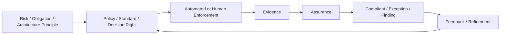

---
doc_meta:
  id: EAD-007
  title: Enterprise Governance & Assurance Architecture
  owner: Architecture Authority
  version: 1.0.1
  status: approved
  classification: internal
  governed_by: [GDC-006]
  review_cycle_days: 180
  created_date: 2026-08-23
  last_reviewed: 2026-08-23
---

# Enterprise Governance & Assurance Architecture

## 1. Purpose

Define the **Governance & Assurance Overlay** that constrains, verifies, and evolves Business and Platform architecture without becoming a Product or universal runtime dependency.

**Decision question:** _What must remain true, who may decide, what evidence proves it, and how are exceptions controlled proportionally to risk and blast radius?_

GDC governs architecture artifacts and their lifecycle. EAD-007 governs the enterprise operating model for policy, decision rights, assurance, evidence requirements, conformance, and exceptions.

## 2. Scope

**In scope**

- Governance vs assurance distinction
- Decision rights and accountability
- Architecture, security, data, reliability, AI, compliance, and cost/capacity assurance
- Standards/conformance
- Evidence requirements
- Policy-as-code and fitness functions
- Risk-based review
- Exception/waiver lifecycle
- Governance UX/cognitive load
- Control lifecycle and retirement

**Out of scope**

- Product business decisions
- Platform operational state
- System-specific runbooks
- Detailed regulatory mapping
- Every local reversible engineering choice
- Architecture artifact syntax already governed by GDC

## 3. Enterprise Context

Governance is an overlay:

```text
Business Plane ───────────────┐
                              ├─ Governance & Assurance
Platform Plane ───────────────┤
                              │
Systems / Runtime ────────────┘
```

Governance defines what must be true and who may decide. Assurance supplies evidence that the condition is actually true.

The compliant path should be the easiest path through automation, paved roads, actionable CI feedback, and bounded review.

## 4. Architectural Drivers & Lessons

### 4.1 Drivers

| ID | Driver | Governance Consequence |
| :-- | :-- | :-- |
| G1 | Multi-tenant travel/HR/finance operations carry material risk | Controls scale with impact and irreversibility |
| G2 | AI can retrieve sensitive data and invoke tools | AI governance, evaluation, human oversight, and evidence are explicit |
| G3 | Architecture-as-code already exists | Policy/fitness functions automate conformance |
| G4 | Platform dependencies can create enterprise blast radius | Platform qualification and reliability evidence are reviewed |
| G5 | Manual review does not scale | Automated assurance is preferred |
| G6 | Excess governance causes bypass | Review is risk-based and has controlled exceptions |

### 4.2 Lessons Incorporated

| Lesson | Response |
| :-- | :-- |
| Approved document was treated as implementation evidence | Designed, implemented, tested, monitored states remain separate |
| Audit platform was treated as compliance authority | Governance defines evidence obligation; Audit preserves evidence |
| Every deviation required similar ceremony | Governance is proportional to blast radius |
| Security review lived only in documents | Machine-verifiable controls and runtime evidence are preferred |
| AI governance was conflated with AI Platform ownership | Governance defines policy; AI Platform enforces within capability |
| Permanent exceptions became shadow standards | Every exception has owner, scope, expiry, evidence, and review |

## 5. Architecture Model

### 5.1 Governance and Assurance Loop



### 5.2 Governance Concern Families

- Architecture Stewardship
- Decision Traceability
- Standards & Conformance
- Security Assurance
- Data / Knowledge Governance
- Privacy & Residency Governance
- Reliability & Resilience Assurance
- AI Governance
- Compliance Evidence
- Cost / Capacity Governance
- Exception & Waiver Management
- Lifecycle Governance
- Fitness Functions / Policy-as-Code

These are concern families, not mandatory independent systems.

### 5.3 Decision Rights

| Decision | Accountable |
| :-- | :-- |
| Business investment/priority | Business/Management authority |
| Product business semantics/outcome | Product Domain Owner |
| Platform capability contract | Platform Product Owner |
| Cross-product structural architecture | Architecture Authority |
| Security policy | Security Authority |
| Data/knowledge governance | Data/Knowledge Governance Authority |
| AI risk/evaluation/autonomy policy | AI Governance + Security/Data/Product authorities by scope |
| Local reversible implementation | Owning Engineering Team within standards |
| Exception approval | Named authority appropriate to violated control/risk |

### 5.4 Governance Intensity

Governance effort increases with:

```text
blast radius
irreversibility
security/privacy impact
financial/client impact
cross-product dependency
regulatory/contractual obligation
data sensitivity
autonomy
```

Local reversible decisions should not receive the same ceremony as trust-critical one-way-door decisions.

### 5.5 Evidence Model

Evidence may include:

- architecture artifact
- CI/fitness-function result
- test result
- deployment provenance
- runtime telemetry
- audit evidence
- restore/failover exercise
- access review
- evaluation result
- approval/review record
- security assessment

The evidence must actually support the claim. An approved PAD does not prove a control is implemented.

### 5.6 AI Governance

AI governance defines:

- allowed model/provider classes
- data egress restrictions
- evaluation/release requirements
- autonomy/tool risk classes
- required human oversight
- knowledge/retrieval restrictions
- provider/licensing policy
- usage/cost controls
- evidence requirements
- fallback/degradation expectations

AI Platform enforces policy within its runtime capability. Product retains the business decision and outcome.

### 5.7 Governance Automation

High-value automated controls include:

- schema/linter validation
- dependency DAG rules
- authority/traceability checks
- policy-as-code
- security and secret scans
- tenant-isolation tests
- API/event compatibility
- supply-chain provenance
- SLO/recovery evidence
- AI evaluation release gates

### 5.8 Exception Lifecycle

Every formal exception has:

```text
scope
reason
risk
owner
approver
mitigation
evidence
expiry
review
```

An exception that becomes permanent either becomes an explicit architectural/standard decision or is retired.

## 6. Principles & Rules

### 6.1 Governance Defines, Assurance Proves
- **Fitness function:** critical controls map requirement to current evidence

### 6.2 Governance Is Proportional
- **Fitness function:** review process classifies decisions by risk/blast radius and avoids mandatory board review for local reversible decisions

### 6.3 Governance Is Not a Runtime Business Authority
- **Fitness function:** Product request paths contain zero synchronous Architecture/Governance approval calls

### 6.4 Compliant Path Is the Easy Path
- **Fitness function:** adopted controls identify automation/paved-road enforcement where technically feasible

### 6.5 Architecture Status Is Not Implementation Status
- **Fitness function:** implemented/tested claims resolve to system/runtime evidence

### 6.6 Audit Preserves Evidence; Governance Defines Obligation
- **Fitness function:** Audit PAD contains no enterprise policy/approval authority

### 6.7 AI Governance Is Cross-Cutting
- **Fitness function:** AI high-risk capability inventory maps Product, AI Platform, Security/Data, and evidence responsibilities

### 6.8 Exceptions Expire or Become Explicit Policy
- **Fitness function:** active exception inventory has owner, scope, expiry, and review state

### 6.9 Controls Have Lifecycle
- **Fitness function:** standards/controls have owner, review cycle, enforcement, and retirement path

### 6.10 Governance Measures Its Own Friction
- **Fitness function:** governance reviews track CI false positives, manual review latency, exception volume, and bypass indicators

## 7. Alternatives Considered

| Alternative | Why Rejected |
| :-- | :-- |
| Governance as third runtime plane | Governance is a cross-cutting control/evidence concern, not business/runtime authority |
| Architecture Board approves everything | Does not scale and creates shadow decisions |
| Documentation-only compliance | Cannot prove implementation/runtime behavior |
| Security/Data/AI governance each create universal gateways | Central runtime bottlenecks and split ownership |
| No exception mechanism | Drives silent non-compliance |

## 8. Single Points of Failure & Graceful Degradation

| Dependency | Blast Radius | Required Posture |
| :-- | :-- | :-- |
| CI/fitness engine | New changes/releases | Existing runtime continues; controlled recovery for pipeline |
| Evidence sink | Assurance visibility | Source systems retain/retry required evidence |
| Architecture registry | New governance/admin | Existing approved contracts remain usable |
| Human review authority | High-risk changes | Delegation/escalation path, not bypass |
| Policy distribution | New policy activation | Versioned last-known-good policy where safe |

## 9. Ownership

| Responsibility | Accountable |
| :-- | :-- |
| Architecture governance model | Architecture Authority |
| Security policy/assurance | Security Authority |
| Data/knowledge governance | Data Governance Authority |
| Reliability evidence | System/Platform Owner + Reliability governance |
| AI governance | AI Governance with Product/Security/Data authorities |
| Compliance obligations | Compliance/Legal authority |
| Evidence lifecycle | Audit & Evidence Platform |
| Control implementation | Owning Product/Platform/System team |

## 10. Dependencies

- This C1 architecture artifact has no synchronous runtime dependency on another architecture artifact
- Its inputs are enterprise strategy, accountable domain ownership, legal or contractual obligations, and validated operational evidence appropriate to its subject
- Cross-artifact architectural lineage is recorded in the Traceability section and MUST NOT be interpreted as a runtime dependency graph

## 11. Traceability

- GDC remains the meta-governance authority for architecture artifacts
- EAD-007 complements rather than replaces GDC
- PADs inherit relevant governance requirements through enterprise standards and EAD principles
- Audit & Evidence PAD is rebaselined so governance authority is not duplicated
