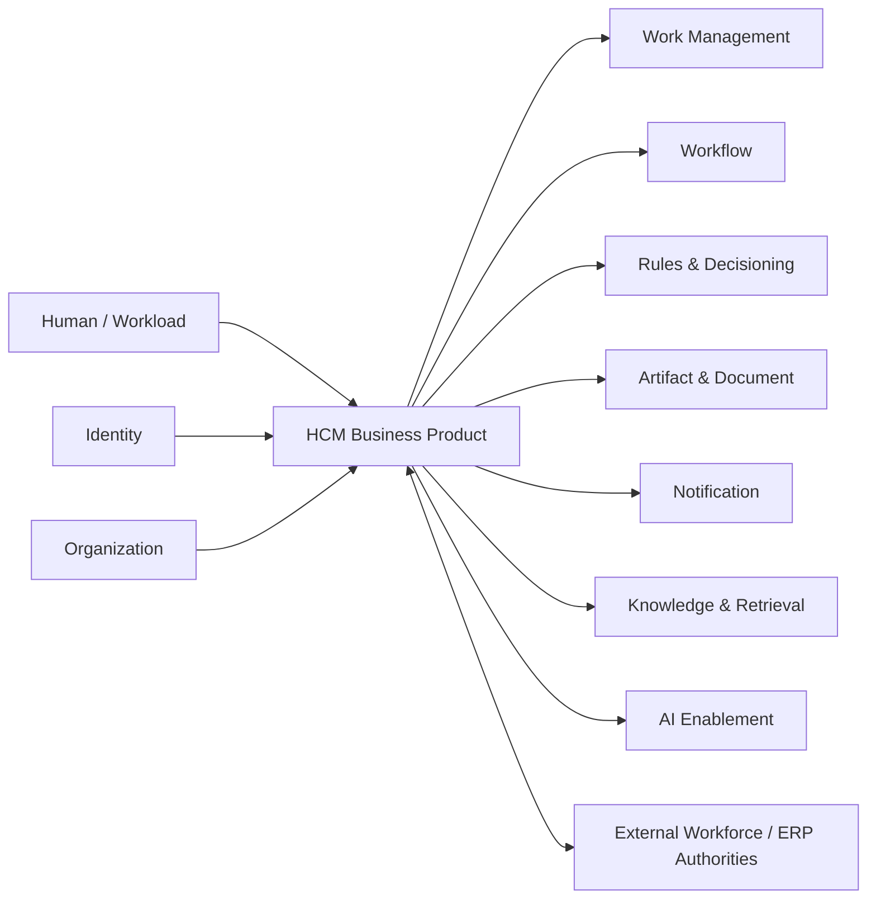

---
doc_meta:
  id: PAD-BIZ-001
  title: Enterprise Human Capital Management
  owner: HCM Team
  version: 1.2.0
  status: approved
  classification: restricted
  governed_by:
    - GDC-008
    - EAD-001
    - EAD-003
    - EAD-006
  realizes_capability:
    - EAD-001
  review_cycle_days: 180
  created_date: 2026-01-01
  last_reviewed: 2026-08-23
  fulfilled_by:
    - SAD-101
---

# Enterprise Human Capital Management

## 1. Purpose & Scope

HCM is the Business Plane authority for workforce and employment business meaning across the employee lifecycle.

It owns Employee, Employment, HR Organization, Position, workforce-policy state, and HCM business outcomes while consuming reusable Platform capabilities through governed contracts. HCM remains the authoritative acceptance boundary for consequential workforce mutations even when Workflow, Rules, AI, Knowledge, or Work Management participates in the journey.

The capability exists to keep workforce truth cohesive without turning shared Platforms into hidden HR authorities.

### 1.1 Outcome Contract

HCM must provide a stable workforce domain contract that survives replacement of its physical runtime, storage, UI, workflow engine, notification provider, AI provider, and analytics implementation.

A consumer may rely on HCM for accepted workforce facts but may not infer HCM business state from a Platform projection, task, notification, search result, or AI response.

### 1.2 Out Of Scope

- Principal identity, credentials, authentication, sessions, and federation
- Canonical Organization, Tenant, Workspace, Membership, and operating-context authority
- Generic Workflow engine
- Generic Work Management
- Generic Rules runtime
- Notification delivery
- Artifact storage lifecycle
- Enterprise Knowledge Graph or retrieval-index authority
- AI model, provider, or agent execution
- Future ERP accounting, receivable, payable, ledger, and financial posting authority
- External payroll or government system authority unless explicitly brought into HCM scope by a later approved boundary decision
- Infrastructure and deployment/runtime mechanics

## 2. Enterprise Traceability

### 2.1 Realizes

- **EAD-001** Human Capital Management Business Product capability
- Workforce business authority within the Business Plane while reusable execution capabilities remain in the Platform Plane

### 2.2 Relationships

- **Identity & Access** owns Principal, authentication, session, and protocol trust
- **Organization & Tenancy** owns canonical Organization, Tenant, Workspace, Membership, and operating context
- **Workspace Experience** composes HCM into the shared digital work environment without owning HCM state
- **Work Management** may own reusable HR work inventory, assignment, claim, and review lifecycle
- **Workflow** may coordinate long-running HR processes while HCM owns the HR outcome
- **Rules & Decisioning** may evaluate governed deterministic policy while HCM owns rule meaning and business effect
- **Artifact & Document** owns governed artifact versions used by HCM
- **Notification** owns communication-delivery mechanics
- **Knowledge & Retrieval** owns governed knowledge representation and authorized retrieval derived from HCM sources
- **AI Enablement** owns model and agent execution used by HCM copilots
- **Integration Enablement** may provide reusable connector machinery for payroll, benefits, government, ERP, or other external systems
- **Audit & Evidence** preserves consequential HCM evidence without becoming workforce truth
- **Future ERP/Finance** consumes and publishes governed contracts without shared database authority

### 2.3 Consumed By

Authorized Business Products and Platforms may consume HCM workforce facts according to purpose, Tenant, privacy, and Product authorization.

Typical consumers include Workforce planning experiences, future ERP/Finance, Workspace Experience, Knowledge & Retrieval, analytics, AI-enabled HCM features, Workflow, and Work Management.

HCM remains authoritative for its accepted workforce facts even when those facts are projected elsewhere.

### 2.4 Logical Topology



The topology is logical only. HCM does not require these capabilities to share one deployable, database, frontend, or release lifecycle.

## 3. Domain & Context Model

### 3.1 Bounded Context

- Workforce Planning
- Recruitment & Candidate
- Onboarding
- Employee & Employment
- HR Organization
- Position
- Attendance
- Leave
- Performance & Goals
- Competency & Skills
- Career & Succession
- Compensation Planning
- Benefits Administration
- Learning Administration
- Offboarding

These subdomains may evolve independently downstream, but they remain inside the HCM Product boundary while their business semantics are cohesive and workforce-owned.

### 3.2 Ubiquitous Language

| Term | Meaning |
| :-- | :-- |
| Employee | Workforce person represented through an active or historical employment relationship |
| Employment | Contractual or governed workforce relationship whose lifecycle is owned by HCM |
| HR Organization | Workforce reporting and organizational structure used for HR business meaning |
| Position | Workforce role or seat inside an HR Organization |
| Candidate | Person under recruitment evaluation before an accepted Employment relationship |
| Skill / Competency | HCM-governed workforce capability where HCM is declared authority |
| Leave | Governed workforce absence business state |
| Workforce Event | HCM-accepted lifecycle fact such as hire, transfer, termination, leave, or position change |
| Operating Workspace | Organization-owned operating context and not HR Organization |
| HCM Copilot | Product-owned AI experience consuming AI and Knowledge Platform capabilities |

### 3.3 Domain Policies

- HCM owns Employee, Employment, HR Organization, Position, and declared workforce business truth
- Organization Platform owns canonical Organization, Tenant, Workspace, and Membership
- Identity owns Principal and authentication
- HCM Product authorization is enforced inside HCM for protected workforce resources
- Workflow coordinates process state but does not own HCM business outcome
- Work Management may own reusable work lifecycle while HCM owns HR meaning
- Rules execution may be delegated but HCM owns the HR policy semantics and business effect
- AI output is proposed or assistive until accepted through an authorized HCM mutation
- HR domain prompts, skills, evaluation criteria, and decision meaning remain HCM-owned
- External payroll, benefit, ERP, government, and client facts preserve their declared source authority
- Historical workforce events remain attributable and cannot be rewritten merely to match current state
- A projection, search index, analytics model, workflow task, or AI context never becomes workforce authority by holding a copy

### 3.4 Lifecycle & State Semantics

HCM distinguishes identity, employment, organizational, and process lifecycles:

```text
Principal lifecycle        -> Identity authority
Employment lifecycle       -> HCM authority
Operating Membership       -> Organization authority
Workflow lifecycle         -> Workflow authority
Work Item lifecycle        -> Work Management authority
Artifact lifecycle         -> Artifact & Document authority
```

Consequential HCM lifecycle transitions include recruitment acceptance, onboarding activation, employment changes, position changes, leave decisions, compensation decisions, and offboarding. Each accepted transition must identify the authoritative HCM entity, actor or workload, effective time, and causal context.

A Workflow completion, Work Item approval, Rule result, or AI recommendation is an input to an HCM decision unless the HCM contract explicitly defines it as sufficient for an authorized transition.

### 3.5 Failure & Degradation Semantics

- Failure of Workflow must not corrupt already committed HCM state
- Failure of Notification delays communication but does not roll back a valid HCM decision
- Failure of Knowledge or AI degrades assistive experiences and must not block core workforce authority unless a specific Product journey explicitly declares that dependency
- Failure of Work Management may delay human work but must not create a second copy of HCM business truth
- Failure of an external payroll, benefit, government, or ERP authority results in explicit pending or reconciliation state rather than fabricated success
- Cross-domain duplicate or delayed events are handled idempotently against HCM-owned business identifiers and version semantics
- HCM must not report a consequential workforce mutation as accepted before its own authoritative state transition is durable

## 4. Integration Contracts

### 4.1 Integration Provided

- Employee and Employment lifecycle contracts
- HR Organization and Position contracts
- Recruitment and onboarding outcome contracts
- Attendance and leave contracts
- Performance and goal contracts
- Competency and skill contracts
- Career and succession contracts
- Compensation and benefit planning contracts
- Workforce lifecycle events
- HCM Product commands and queries
- Governed HCM source publication for Knowledge, analytics, or downstream Products
- Reconciliation identifiers for external workforce and ERP integrations

### 4.2 Integration Consumed

- Identity & Access
- Organization & Tenancy
- Workspace Experience
- Work Management
- Workflow
- Rules & Decisioning
- Artifact & Document
- Notification
- Knowledge & Retrieval
- AI Enablement
- Integration Enablement
- Audit & Evidence
- Event & Messaging
- External workforce, payroll, benefit, government, and future ERP contracts where applicable

### 4.3 Contract Principles

- HCM contracts expose workforce semantics rather than internal persistence models
- Consumers never require cross-domain database access
- Commands that mutate workforce state are re-authorized by HCM
- Published workforce facts carry stable identity, effective-time, and version semantics where required
- Downstream projections may be eventually consistent but must preserve HCM provenance
- External-system acceptance and HCM acceptance remain distinguishable states
- Contract evolution is backward-compatible within a major version or uses explicit migration

## 5. Trust & Data Boundaries

### 5.1 Trust Boundary

HCM is authoritative for its Business Product records, invariants, workforce decisions, and accepted workforce lifecycle state.

It does not delegate Product authorization or business correctness to Workspace Experience, Workflow, Work Management, Rules, Knowledge, AI, Integration, or external transport layers.

### 5.2 Identity Access

- Authentication comes from Identity
- Tenant, Workspace, and Membership context comes from Organization
- HCM authorization combines trusted identity/context with HCM resource, role, purpose, and business rules
- Privileged workforce operations require attributable human or workload identity
- HCM copilot and tool actions are authorized exactly like equivalent non-AI HCM actions
- Cross-Tenant or provider administration requires explicit privileged scope and evidence
- A rendered HCM navigation item or Work Item does not prove authorization to the underlying workforce resource

### 5.3 Data Classification

HCM manages sensitive and potentially regulated workforce data including:

- Personal and contact information
- Employment and contract data
- HR Organization and Position
- Attendance and leave
- Compensation and benefit information
- Performance and career data
- Skills and competencies
- Recruitment and candidate data
- HCM decision history and evidence references

Knowledge, AI, analytics, search, integration, and other projections inherit source classification, purpose, residency, retention, and access constraints.

### 5.4 Authority & Projection Rules

- HCM is canonical for declared workforce facts
- Identity and Organization identifiers are referenced, not re-owned
- Search indexes, analytics models, Knowledge Graphs, AI context, and caches are derived
- External authorities remain canonical for facts explicitly assigned to them
- Reconciliation may detect divergence but cannot silently transfer authority
- Deletion, retention, and legal-hold behavior follow the most restrictive applicable workforce and regulatory obligation

## 6. Capability NFR

### 6.1 Availability, RTO, and RPO

- Reliability class: **C1 Mission-Critical Operations** for Employee and Employment authority
- Mature core HCM availability target: **>= 99.95% monthly**
- Target RTO: **<= 1 hour**
- Target RPO: **<= 15 minutes** for authoritative workforce transactions
- Accepted workforce mutations must not be silently lost

### 6.2 Performance, Scalability, and Concurrency

- Core interactive HCM command/query control path target: **P95 <= 500 ms** excluding external authorities and intentionally long-running processes
- Concurrent mutations of the same authoritative workforce entity must use deterministic stale-write or conflict prevention
- Capacity certification targets at least **10x forecast peak interactive and lifecycle-event volume** without violating the core control-path SLO
- Bulk imports, analytics, AI, and knowledge-indexing workloads must not starve core employee/employment operations

### 6.3 Security, Privacy, Compliance, and Residency

- Least-purpose access to workforce data
- Tenant and Product isolation follows enterprise security architecture
- Highly sensitive compensation, performance, candidate, and employment data requires explicit role and purpose controls
- Sensitive data is redacted from telemetry and non-authoritative projections unless explicitly approved
- Residency and retention follow workforce, client, contractual, and legal obligations
- Consequential administrative access and workforce mutations are evidenced

### 6.4 Audit, Interoperability, Accessibility, and Cost

- Hire, transfer, termination, leave decision, compensation decision, privileged data access, and other consequential lifecycle actions are attributable
- HCM publishes versioned contracts rather than persistence access
- Product experiences follow the enterprise accessibility baseline
- AI or Knowledge unavailability must not silently corrupt authoritative workforce state
- Platform and external-integration cost is attributable by Product capability, Tenant, and major workload class where meaningful

## 7. Ownership & Governance

### 7.1 Team Ownership

HCM Team owns:

- Workforce business semantics
- HCM authoritative state
- HCM Product authorization
- Workforce lifecycle invariants
- HCM Product roadmap and experience
- HCM source-contract evolution
- Acceptance of AI, Workflow, Rule, Work Management, and external-system outputs into workforce truth

Platform teams own their respective reusable capabilities and cannot acquire HCM authority merely by executing a step.

### 7.2 Realizing Systems

- **SAD-101** HCM Business System

### 7.3 Governance Rules

- HCM SHALL NOT recreate Identity or Organization authority
- Workspace Experience SHALL NOT own workforce business state
- Workflow, Work Management, Rules, AI, and Knowledge SHALL NOT become hidden HCM authorities
- AI or Knowledge copies SHALL NOT become HCM truth without HCM acceptance
- Future ERP integrations SHALL use governed contracts and SHALL NOT share HCM persistence
- External integration success SHALL NOT be represented as HCM business success unless HCM has accepted the required state transition
- Any future split of HCM physical systems SHALL preserve this PAD authority boundary unless an approved PAD boundary change occurs

### 7.4 Product Health

HCM Product health is measured by workforce lifecycle correctness, operational availability, support burden, adoption of governed contracts, reconciliation backlog, privacy/security findings, and time to safely change workforce policy.

## 8. Assumptions & Constraints

- HCM remains a Business Product rather than a horizontal Platform
- Organization and Identity remain independent authorities
- External payroll, benefits, government, and future ERP systems may remain external systems of record for declared facts
- Shared Platform adoption is incremental and must reduce total-system complexity rather than force dependency
- Sensitive workforce data limits where AI, Knowledge, analytics, and external providers may process content

## 9. Architectural Decisions

- HCM owns workforce business truth while Identity owns Principal and Organization owns operating context
- Shared Platforms may execute reusable mechanics but do not acquire HCM business authority
- AI and Knowledge remain assistive or derived until HCM explicitly accepts a business mutation or published workforce fact
- Future physical decomposition belongs to SADs and must preserve the logical HCM contract

## 10. Evolution

HCM may physically decompose into independently deployable recruitment, workforce-core, leave, performance, compensation, or other systems as scale and ownership evidence justify it.

Such decomposition must not change the PAD contract merely because physical topology changes. A true shift of workforce authority to another Product requires an explicit PAD boundary decision and migration of canonical ownership.

## 11. References

- EAD-001 Enterprise Capability & Domain Map
- EAD-002 Enterprise System Landscape
- EAD-003 Enterprise Data Ownership & Topology
- EAD-004 Enterprise Integration Architecture
- EAD-005 Enterprise Platform Architecture
- EAD-006 Enterprise Security Architecture
- EAD-007 Enterprise Governance & Assurance Architecture
- GDC-008 Product Architecture Document Guideline
