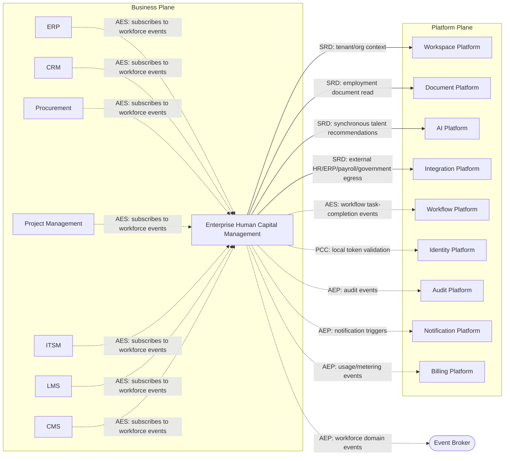

---
doc_meta:
  id: PAD-BIZ-001
  title: Enterprise Human Capital Management
  owner: HCM Team
  version: 1.0.0
  status: approved
  classification: restricted
  governed_by:
    - GDC-008
  realizes_capability:
    - EAD-001
  review_cycle_days: 180
  created_date: 2026-01-01
  last_reviewed: 2026-07-06
  fulfilled_by:
    - SAD-101
---

# Enterprise Human Capital Management

---

## 1. Purpose & Scope

HCM is the enterprise system of record for workforce lifecycle management. It governs employees from workforce planning through offboarding while remaining independent from identity management, payroll execution, workflow orchestration, and infrastructure concerns.

The domain owns business rules related to people management and serves as the authoritative source for workforce information across the enterprise.

### 1.1. Out of Scope

- Authentication and Identity Management.
- Payroll calculation and payslip generation.
- Notification delivery.
- Workflow execution engine.
- Document storage infrastructure.
- Billing and subscription.
- Enterprise audit storage.
- AI inference.
- ERP financial accounting.

---

## 2. Enterprise Traceability

HCM realizes the enterprise Human Capital Management capability defined by the Enterprise Capability & Domain Map.

### 2.1. Realizes

- EAD-001 Enterprise Capability & Domain Map

### 2.2. Relationships

- **Synchronous Dependencies (SRD):** Workspace Platform (tenant/org context), Document Platform (employment document read), AI Platform (synchronous talent recommendations), Integration Platform (external HR/ERP/payroll/government egress).
- **Publishes Events (AEP):** workforce domain events (`EmployeeHired`, `EmployeeTransferred`, `EmployeePromoted`, `EmployeeTerminated`, `LeaveApproved`, `PerformanceCompleted`) to the Event Broker; audit events to the Audit Platform; notification triggers to the Notification Platform; usage/metering events to the Billing Platform.
- **Subscribes To Events (AES):** Workflow Platform task-completion events for approvals.
- **Consumes Platform Capabilities (PCC):** Identity-issued tokens are validated **locally**.

### 2.3. Consumed By

Other Business Products consume HCM's published workforce events (Asynchronous Event Subscription) via the Event Broker — never a direct runtime dependency: ERP, CRM, Procurement, Project Management, ITSM, LMS, CMS.

---

## 3. Domain & Context Model

The HCM domain is decomposed into cohesive bounded contexts aligned with the employee lifecycle.

### 3.1. Bounded Context

- Workforce Planning
- Recruitment
- Candidate Management
- Onboarding
- Employee Management
- Organization Management
- Position Management
- Attendance Management
- Leave Management
- Performance Management
- Goal Management
- Competency Management
- Career Development
- Succession Planning
- Compensation Planning
- Benefits Administration
- Learning Administration
- Offboarding

### 3.2. Ubiquitous Language

| Term | Description |
| --- | --- |
| Candidate | A person participating in recruitment before employment. |
| Employee | An active workforce member managed by HCM. |
| Employment | The contractual relationship between an employee and the organization. |
| Position | A business role within the organization. |
| Department | Organizational unit responsible for a business function. |
| HR Organization | Departments, positions, and reporting lines of the workforce (distinct from the Workspace Platform's organization container). |
| Attendance | Employee working time records. |
| Leave | Approved absence from work. |
| Goal | Measurable objective assigned to an employee. |
| Performance Review | Formal evaluation of employee performance. |
| Competency | Measurable skill or capability. |
| Career Path | Planned employee progression. |
| Succession Plan | Replacement planning for strategic positions. |
| Compensation Plan | Business definition of salary structures and rewards. |
| Benefit | Non-payroll employee entitlement. |

### 3.3. Domain Policies

- Employee identity is delegated to the Identity Platform.
- HR organization structure (departments, positions, reporting lines) belongs to HCM; the workspace/tenant organization container is owned by the Workspace Platform.
- Employee lifecycle is immutable once historical events are recorded.
- Payroll calculations are external to HCM.
- Organizational changes are versioned.
- Every employment event is auditable.
- Business workflows are delegated to the Workflow Platform.
- Business notifications are delegated to the Notification Platform.

---

## 4. Integration Contracts

### 4.1. Integration Provided

The HCM domain provides:

- Employee Management
- Organization Management
- Position Management
- Attendance Management
- Leave Management
- Performance Management
- Goal Management
- Competency Management
- Career Development
- Succession Planning
- Compensation Planning
- Workforce Events

Example business events include:

- EmployeeHired
- EmployeeTransferred
- EmployeePromoted
- EmployeeTerminated
- LeaveApproved
- PerformanceCompleted

### 4.2. Integration Consumed

HCM consumes:

- Identity Platform for authentication and enterprise identity.
- Workspace Platform for tenant and organization context.
- Workflow Platform for business approvals.
- Notification Platform for employee communications.
- Document Platform for employment documents.
- Audit Platform for immutable audit evidence.
- Integration Platform for ERP, payroll providers, government systems, and external HR services.
- AI Platform for recommendations, talent intelligence, document understanding, and workforce insights.

Concrete APIs, events, protocols, and messaging technologies are implementation details defined within the realizing SAD.

---

## 5. Trust & Data Boundaries

### 5.1. Trust Boundary

The HCM domain owns workforce business data but does not own domain identity, infrastructure, or platform capabilities.

### 5.2. Identity Access

Authentication and authorization are delegated to the Identity Platform.

HCM governs business authorization related to:

- Employee administration
- HR administration
- Manager responsibilities
- Organization administration
- Workforce governance

### 5.3. Data Classification

The HCM domain manages highly sensitive enterprise information including:

- Personally Identifiable Information (PII)
- Employment Records
- Organizational Structures
- Compensation Planning
- Performance Reviews
- Leave Records
- Attendance Records
- Benefits Information
- Career History

The HCM domain does not own:

- Credentials
- Authentication Sessions
- Access Tokens
- Audit Repository
- Documents Storage
- Notification Infrastructure
- AI Models

---

## 6. Capability NFR

### 6.1. Reliability & Availability

- Enterprise-grade availability for workforce operations.
- Strong consistency for employee lifecycle data.
- No loss of approved HR transactions.

### 6.2. Performance & Scalability

- Horizontally scalable workforce management.
- Responsive employee search.
- Efficient organization hierarchy traversal.
- Support enterprise-scale organizations.

### 6.3. Security & Compliance

- Protection of employee PII.
- Tenant-isolated workforce data.
- Regulatory compliance.
- Fine-grained business authorization.
- Complete auditability of HR operations.

### 6.4. Auditability

Every significant workforce event shall generate auditable business evidence, including:

- Recruitment
- Hiring
- Onboarding
- Transfers
- Promotions
- Organization Changes
- Leave Approval
- Performance Review
- Compensation Changes
- Benefits Changes
- Offboarding

---

## 7. Ownership & Governance

### 7.1. Team Ownership

The HCM Team owns workforce business capabilities, employee lifecycle management, and HR business rules.

The Architecture Authority governs enterprise architectural boundaries and integration contracts.

### 7.2. Realizing Systems

- SAD-101 Enterprise Human Capital Management

### 7.3. Governance Rules

- HCM is the system of record for workforce information.
- Identity shall remain owned by the Identity Platform.
- Payroll execution shall remain outside the HCM domain.
- Business workflows shall use the Workflow Platform.
- Notifications shall use the Notification Platform.
- Documents shall use the Document Platform.
- AI capabilities shall be consumed exclusively through the AI Platform.
- Breaking integration contracts requires Architecture Authority approval.

<!-- lint_disable: cross_reference_missing, inline_reference_missing, pad_fulfilled_by_exists -->
