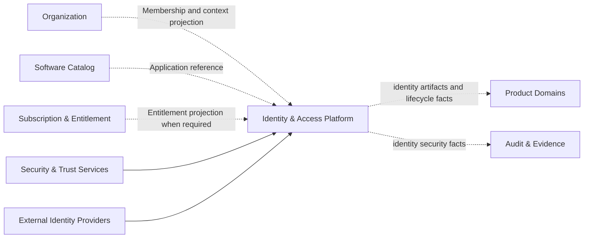
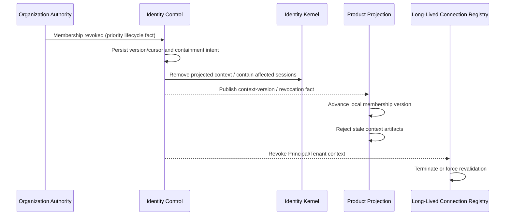
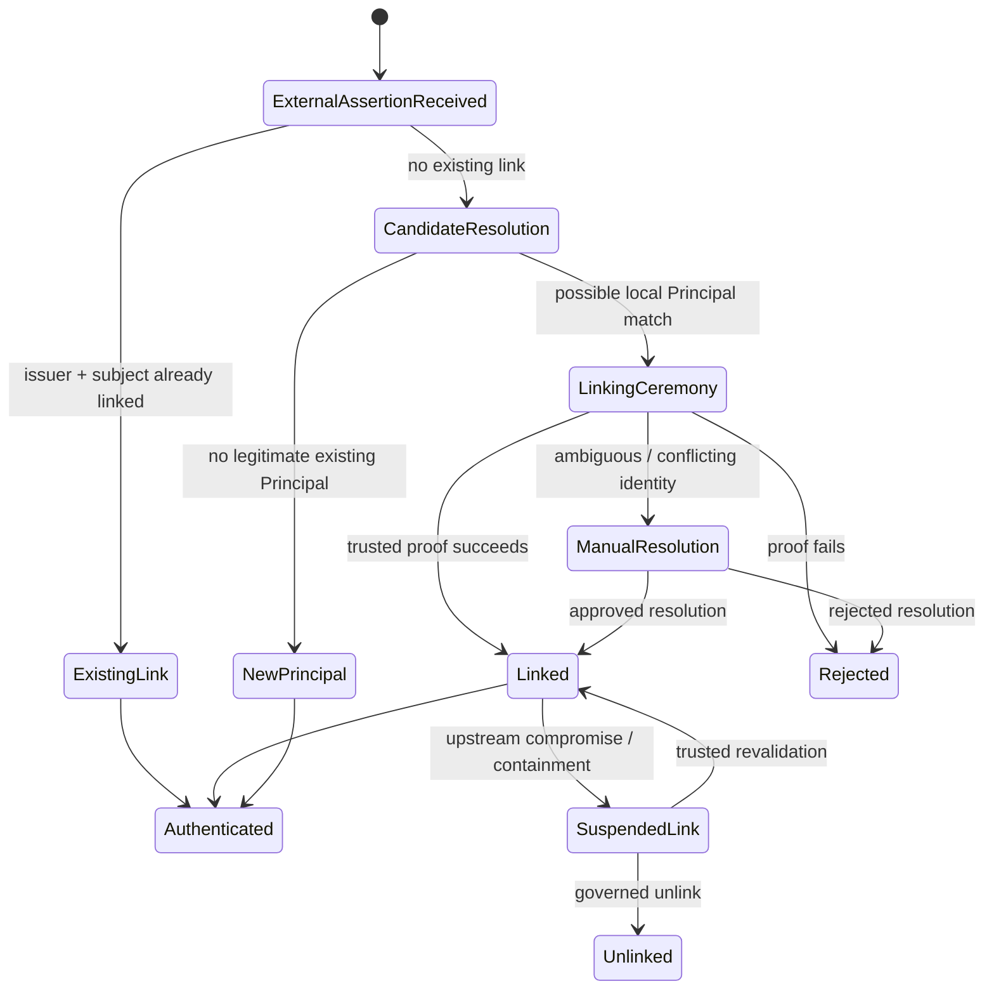

---
doc_meta:
  id: PAD-PLT-001
  title: Identity & Access Platform
  owner: Identity Platform Team
  version: 1.1.0
  status: approved
  classification: restricted
  governed_by:
    - GDC-008
  realizes_capability:
    - EAD-001
    - EAD-002
    - EAD-003
    - EAD-004
    - EAD-005
    - EAD-006
  review_cycle_days: 180
  created_date: 2026-08-06
  last_reviewed: 2026-09-09
  fulfilled_by:
    - SAD-001
    - SAD-002
---

# Identity & Access Platform

## 1. Purpose & Scope

The **Identity & Access Platform** is the enterprise authority for digital identity, authentication, session trust, standards-based delegated access, federation, and machine identity within the **Scnehaux Enterprise Cloud**.

It establishes **who or what is acting**, **how that actor authenticated**, **which application or workload is trusted to request security artifacts**, and **whether an identity session, credential, or protocol grant remains valid**.

The platform is a logical domain capability. It does not prescribe the vendor, language, runtime, database, deployment topology, or user-interface framework used by realizing systems.

### 1.1 Capability

The platform owns:

- Principal and Identity Realm lifecycle.
- Login identifiers and identity linkage.
- Authenticators and credential lifecycle.
- Authentication ceremonies and assurance.
- Session, refresh grant, and containment lifecycle.
- OAuth 2.0 and OpenID Connect protocol trust.
- SAML and external identity federation where required.
- Client and protected-resource security registration.
- Delegated scopes, consent, and protocol grants.
- Machine, service, workload, and bounded agent identity.
- Bounded delegation and delegated execution identity semantics.
- Consumer verification, context-freshness, and revocation profiles.
- Identity security administration.
- Identity security facts and lifecycle events.
- Identity interoperability obligations.

### 1.2 Out Of Scope

The platform does not own:

- Organization, Tenant, Workspace, or Membership lifecycle.
- Subscriber Account, Subscription, Entitlement, plan, package, or quota.
- Product, Application, repository, or Application Owner metadata.
- HCM employee, employment, department, position, payroll, or workforce assignment.
- Product-specific roles, permissions, resource relationships, approvals, or business authorization.
- Product configuration and feature management.
- Enterprise-wide policy authorship outside identity and protocol trust.
- The enterprise immutable audit and evidence ledger.
- Product-specific profiles, workflows, or business records.

The platform may consume bounded projections or references from those authorities when required for identity or token decisions. A projection never transfers authority.

### 1.3 Domain Promise

The platform promises that:

1. Every issued identity artifact maps to a stable Principal or workload identity.
2. Authentication assurance is explicit and attributable.
3. Tokens and protocol grants are audience-bound, purpose-bound, time-bound, and revocable according to a declared security contract.
4. Tenant or Workspace context is issued only from trusted Membership state.
5. Product authorization remains the responsibility of the owning Product domain.
6. Consumers can validate approved security artifacts without a synchronous IAM call on every request.
7. Identity security events remain durable and traceable until accepted by the enterprise evidence process.
8. Capability claims are supported by interoperability and control evidence.
9. Mutable operating context has an explicit freshness and revocation contract rather than being inferred solely from cryptographic token validity.
10. Federation and delegation cannot silently expand authority or create a second identity authority.

## 2. Enterprise Traceability

### 2.1 Realizes

The platform realizes:

- **EAD-001:** Identity & Access as a Core Control Platform with narrow authority.
- **EAD-002:** the logical enterprise Identity system and its relationships to Products, Organization, Software Catalog, Security & Trust, and external identity providers.
- **EAD-003:** authoritative Principal, identifier, authenticator, session, federation, and protocol-trust data.
- **EAD-004:** standards-based federation, identity lifecycle events, provisioning coordination, and bounded projections.
- **EAD-005:** a trust-critical platform with local verification, explicit recovery, and independently governed realization systems.
- **EAD-006:** distributed trust in which identity, Membership, Entitlement, Application ownership, and Product authorization remain distinct authorities.

### 2.2 Relationships



Relationship rules:

- Organization is authoritative for Tenant, Workspace, and Membership.
- Software Catalog is authoritative for Application identity and ownership.
- Subscription & Entitlement is authoritative for commercial access.
- Security & Trust Services is authoritative for enterprise key, secret, and certificate governance.
- Product domains remain authoritative for business-resource authorization.
- Audit & Evidence remains authoritative for enterprise evidence retention and chain of custody.
- External identity providers are trusted only for explicitly configured assertions and attributes.

### 2.3 Consumed By

The platform is consumed by:

- enterprise applications;
- BPO service-management products;
- travel-operations products;
- administrative and client experiences;
- API gateways and protected resources;
- background jobs, connectors, and workloads;
- Agent Runtime and bounded delegated automation;
- partner and future third-party applications;
- security operations and assurance processes.

Consumers use authentication journeys, delegated authorization flows, signed or reference security artifacts, identity lifecycle events, supported administrative contracts, and declared consumer verification profiles.

## 3. Domain & Context Model

### 3.1 Bounded Context

The logical bounded contexts are:

| Bounded Context               | Owns                                                                         | Does Not Own                                 |
| :---------------------------- | :--------------------------------------------------------------------------- | :------------------------------------------- |
| Principal & Identity Realm    | Stable Principal, Principal type, Realm, identity status, correlation policy | Membership, employee, Product profile        |
| Identifier & Identity Linkage | Login identifiers, verification, external identity link, account linking     | Tenant or Product access                     |
| Authenticator & Recovery      | Authenticator enrollment, verifier state, compromise, recovery               | Product authorization                        |
| Authentication & Assurance    | Authentication result, method, recency, assurance, step-up                   | Membership and Entitlement                   |
| Session & Containment         | Session, refresh grant, session inventory, revocation, compromise response   | Business workflow state                      |
| Protocol Trust                | OAuth/OIDC grants, tokens, consent, client/resource security registration    | Application ownership and Product permission |
| Federation                    | External issuer trust, assertion validation, local identity linking          | External source identity administration      |
| Workload Identity             | Service/workload Principal, credential lifecycle, delegated agent identity   | Runtime deployment ownership                 |
| Identity Administration       | Identity, credential, session, federation, and protocol-trust administration | Tenant and Product administration            |
| Identity Security Events      | Local durable identity facts and publication obligation                      | Enterprise evidence ledger                   |

These contexts may be realized by one or more physical systems without changing the PAD.

### 3.2 Ubiquitous Language

| Term                       | Meaning                                                                                                                |
| :------------------------- | :--------------------------------------------------------------------------------------------------------------------- |
| Principal                  | Stable human, service, workload, or governed-agent security subject.                                                   |
| Identity Realm             | Authentication and identity-correlation boundary.                                                                      |
| Identifier                 | Value used to locate or authenticate a Principal; not the Principal itself.                                            |
| External Identity          | Identity asserted by an external issuer and identified by issuer plus external subject.                                |
| Identity Link              | Governed association between an external identity and a local Principal.                                               |
| Authenticator              | Bound proof mechanism used to authenticate a Principal.                                                                |
| Authentication Assurance   | Strength, method, recency, and context of authentication.                                                              |
| Session                    | Bounded authenticated interaction state.                                                                               |
| Refresh Grant              | Rotating authorization state used to continue a session.                                                               |
| Client                     | Protocol registration allowing an Application to request authorization.                                                |
| Protected Resource         | API or resource accepting access artifacts for a declared audience.                                                    |
| Scope                      | Delegated protocol permission meaningful to a protected resource.                                                      |
| Consent                    | Principal-approved delegated grant where consent applies.                                                              |
| Federation                 | Trust relationship accepting an external authentication assertion.                                                     |
| Workload Identity          | Non-human Principal representing a service, job, connector, or governed execution.                                    |
| Delegated Execution        | Bounded execution acting from attributable source authority under narrower audience, purpose, scope, Tenant, and TTL. |
| Consumer Verification Profile | Contract describing local validation, context freshness, revocation ceiling, and online-check requirements.       |
| Tenant Context             | Trusted operating context derived from authoritative Membership state.                                                 |
| Membership                 | Principal-to-Tenant/Workspace relationship owned outside IAM.                                                          |
| Entitlement                | Commercial capability grant owned outside IAM.                                                                         |
| Business Authorization     | Product decision about an action on a business resource.                                                               |
| Containment                | Action limiting or terminating current and future security authority.                                                  |

### 3.3 Domain Invariants

1. A Principal identifier is stable and independent of email, username, Tenant, and Application.
2. External identity uniqueness is based on issuer plus external subject.
3. Identity correlation occurs only inside an explicit Realm policy.
4. Membership is not part of the Principal aggregate.
5. Authentication success does not imply Membership, Entitlement, or Product permission.
6. Application ownership is not inferred from possession of a client credential.
7. Access artifacts are issued only to active, trusted clients or workloads.
8. Access artifacts are audience-bound and time-bound.
9. Revocation classes are explicit: session, Principal, authenticator, client/grant, workload, and contextual Membership.
10. Tenant context is not trusted solely from client input.
11. Products enforce business authorization locally or through their approved policy authority.
12. Human credentials are never reused by workloads.
13. Identity security events are durably recorded before they are considered published.
14. Public and internal claim profiles remain purpose-specific and privacy-minimized.
15. Unimplemented capabilities cannot be represented as operationally available.
16. Context-bearing access artifacts declare a freshness and revocation contract; a locally valid signature is not by itself proof that mutable Membership context is still current.
17. External identity linking requires an explicitly trusted linking ceremony and issuer-plus-subject identity; matching email, display name, phone number, or other mutable profile attributes are never sufficient automatic linking proof.
18. Delegated workload or Agent authority can only preserve or reduce source authority; delegation cannot create new Tenant, audience, Product, or resource authority.
19. Long-lived connections authenticated from revocable context are registered to the authorizing Principal/workload and Tenant/Workspace context, or use an equivalent bounded revalidation mechanism with a declared maximum enforcement delay.
20. A Consumer Verification Profile declares token lifetime, maximum context staleness, revocation behavior, and when online/high-risk verification is required.

### 3.4 Context Freshness & Revocation Contract

Cryptographic artifact validity and mutable operating-context validity are separate predicates.



The contract is:

- `signature_valid` and `context_current` are evaluated independently where mutable context affects access.
- Consumer Verification Profiles identify maximum acceptable context staleness and the applicable revocation ceiling.
- Consumers may use projected Membership/context version or equivalent bounded freshness evidence rather than synchronously calling IAM on every request.
- High-impact operations may require stronger freshness or bounded online verification even when a token remains cryptographically valid.
- Revocation acknowledgement means the mutation is durably accepted; it does not mean every enforcement mechanism has completed.
- Long-lived WebSocket, SSE, streaming, or comparable connections must not escape the declared revocation ceiling merely because no new request arrives.
- A capability without implemented enforcement evidence must not claim the corresponding bounded revocation SLO.

### 3.5 Federation & Account-Linking Lifecycle

An external identity is authoritative only for assertions explicitly trusted from its configured issuer. It cannot silently seize an existing local Principal merely by presenting a matching mutable attribute.



Rules:

- Email, phone, display name, employee label, or comparable mutable attribute may help discover a candidate Principal but never constitutes sufficient automatic linking proof.
- Link, unlink, relink, conflict resolution, and upstream-compromise containment are attributable identity-security events.
- An upstream IdP compromise may suspend one federation link without silently deleting or rewriting the local Principal.
- Attribute trust is issuer- and attribute-specific; accepting authentication from an IdP does not imply accepting every profile attribute as enterprise truth.
- A changed upstream email/display value does not automatically migrate the stable Principal or canonical Organization/Product authority.

### 3.6 Workload & Agent Delegation Model

Human Principal, service/workload Principal, runtime execution, and Agent Run identity remain distinguishable even when one acts on behalf of another.

```text
Principal / Workload
        ↓ delegates bounded authority
Delegated Execution Context
        ↓ constrained by
Tenant + Workspace + audience + purpose + scopes + TTL + tool/resource boundary
        ↓ used by
Worker / Agent Run / Connector
```

Delegation rules:

- Every delegated execution identifies its direct actor and, when applicable, its delegation source/chain.
- Effective delegated authority is the intersection of source authority, target capability policy, Tenant/context, audience, purpose, scopes, resource/tool constraints, and time bound.
- A child/delegated execution cannot create new authority absent from that intersection.
- Human session credentials are not copied into worker or Agent Runtime storage as a shortcut for delegation.
- Protected Products and tools independently authorize the delegated call just as they would an equivalent non-Agent call.
- Agent Runtime owns execution mechanics, not Product permission or Identity authority.

## 4. Integration Contracts

### 4.1 Integration Provided

The platform provides logical contracts for:

- Principal provisioning and lifecycle.
- Identifier verification and linkage.
- Authentication and step-up assurance.
- Authenticator enrollment, compromise, and recovery.
- Session creation, continuation, inventory, and containment.
- Standards-based delegated authorization and identity federation.
- Client and protected-resource security registration.
- Workload identity and bounded delegation.
- Delegated execution identity and delegation-chain evidence.
- Verification metadata and Consumer Verification Profiles.
- Context-version, revocation, and containment lifecycle facts.
- Identity lifecycle and security events.
- Identity administration and investigation.

The exact API paths, event schemas, protocols, transport, and physical components belong in SADs, standards, and developer contracts.

### 4.2 Integration Consumed

The platform consumes:

- Tenant, Workspace, and Membership projections from Organization.
- Application and owner references from Software Catalog.
- Entitlement state when a declared token or onboarding policy requires it.
- key, secret, and certificate capabilities from Security & Trust Services.
- delivery capabilities from Notification for verification and recovery messages.
- external authentication assertions from configured identity providers.
- lifecycle and security signals from HCM, Workforce, Product, and Security domains where an identity response is required.

### 4.3 Conceptual Interaction Rules

- Normal Product requests validate approved identity artifacts locally.
- Local validation follows a declared Consumer Verification Profile rather than equating signature validity with all mutable context validity.
- Authentication and token issuance are synchronous Identity journeys.
- Tenant, Membership, Application, and Entitlement state is consumed through bounded projections or explicit administrative coordination.
- External federation failure is isolated to the affected provider and journey.
- Federation linking never occurs solely because two identities report the same mutable profile attribute.
- Notification and enterprise evidence publication are asynchronous unless a specific high-risk contract states otherwise.
- Identity does not synchronously call Product domains during authentication.
- Delegated workloads and Agents carry bounded attributable authority; Products remain the enforcement boundary for Product resources.

## 5. Trust & Data Boundaries

### 5.1 Trust Boundary

The platform is the trust boundary between:

- unauthenticated actors and authenticated Principals;
- unregistered and registered Applications;
- external identity authorities and Scnehaux-issued trust;
- ordinary and privileged identity administration;
- human and workload credentials;
- direct actors and delegated execution identities;
- client-requested context and authoritative Membership context;
- locally issued security facts and enterprise evidence.

Network location alone never establishes trust.

### 5.2 Identity Access

Effective Product access is the intersection of:

```text
Valid Principal or Workload
∩ Valid Application Trust
∩ Current-enough Membership Context
∩ Active Entitlement where required
∩ Required Authentication Assurance
∩ Delegation Boundary where delegated
∩ Product Permission and Business Invariants
```

IAM establishes only the identity, application-protocol, session, assurance, and bounded delegation portions of that decision. Organization and Product authorities remain independent.

Privileged identity administration requires stronger assurance, narrow scope, attributable actor, explicit evidence, and time-bounded authority.

### 5.3 Data Classification

| Data Class                         | Examples                                                          | Classification Direction                |
| :--------------------------------- | :---------------------------------------------------------------- | :-------------------------------------- |
| Authentication secret              | password during verification, private credential, recovery secret | Restricted; never retained in plaintext |
| Credential verifier                | password verifier, recovery verifier, refresh verifier            | Restricted                              |
| Principal PII                      | verified email, phone, identifiers                                | Restricted                              |
| Identity linkage                   | external issuer/subject and linkage state                         | Restricted                              |
| Authenticator and session metadata | method, device, session, revocation state                         | Restricted                              |
| Delegation metadata                | source actor, target audience, scopes, purpose, TTL                | Restricted                              |
| Protocol registration              | redirect URI, audience, grant policy                              | Internal; secrets Restricted            |
| Consent and grant                  | client, resource, scope, purpose                                  | Restricted                              |
| Public verification material       | issuer metadata, public keys                                      | Public by design                        |
| Security and investigation facts   | failures, anomalies, privileged actions                           | Restricted                              |

The platform minimizes attributes and claim release by purpose, audience, and identity population.

## 6. Capability NFR

### 6.1 SLA and SLO

- Identity issuance, verification metadata, session continuation, and containment are trust-critical journeys.
- Target reliability, current SLO, and commercial SLA are declared separately by realizing systems.
- No commercial SLA is implied by this PAD alone.
- Existing valid artifacts remain locally verifiable during a bounded identity issuance outage.
- Contextual revocation SLOs are claimed only when the complete propagation and enforcement path is implemented and measured.

### 6.2 Availability, RTO, and RPO

- Mature trust-critical journeys target the C0 direction established by EAD-005.
- Authoritative identity and grant state targets RTO no worse than 15 minutes and RPO no worse than 1 minute unless a stricter system contract applies.
- Accepted security containment mutations must not be silently lost.
- Restore, key continuity, session behavior, context revocation, and long-lived-connection containment are proven through exercises.

### 6.3 Scalability, Peak Load, and Concurrency

- Authentication, federation, administration, provisioning, containment, and event-publication workloads are isolated and measured separately.
- Expensive authentication operations use abuse controls and bounded concurrency.
- One Tenant, client, external provider, delegation source, or attack source cannot consume unbounded shared capacity.
- Local verification avoids a synchronous platform call on every Product request.

### 6.4 Compliance, Data Privacy, and Data Residency

- The platform supports identity assurance, least privilege, segregation of duties, privileged-access evidence, retention, and incident containment.
- Personal data and claims are minimized by purpose.
- Identity Realm and subject-correlation policy prevents unjustified cross-customer correlation.
- Identity linking and delegation preserve attributable provenance.
- Residency requirements apply to authority data, projections, backups, events, evidence, and support access.

### 6.5 Audit

Every critical identity journey produces evidence sufficient to establish actor, client/workload, assurance, context, delegation where applicable, action, outcome, and correlation without exposing secrets.

### 6.6 Usability and Accessibility

Hosted identity experiences target WCAG 2.2 AA, support safe recovery, avoid unnecessary account enumeration, and clearly expose session, authenticator, consent, federation-link, and security state.

### 6.7 Interoperability

The platform targets standards-based interoperability for OAuth 2.0, OpenID Connect, SAML where required, passkeys/WebAuthn, MFA, federation, provisioning, token verification, and revocation.

A protocol is declared supported only after realizing systems provide conformance and interoperability evidence.

### 6.8 Cost Target

Cost is measured per successful authentication, active Principal, active session, federation journey, workload/delegated identity, and administrative/provisioning operation. Cost optimization cannot weaken credential protection, key continuity, containment, audit, or isolation.

## 7. Ownership & Governance

### 7.1 Team Ownership

The **Identity Platform Team** owns:

- domain model and capability contract;
- identity and protocol profiles;
- consumer integration, freshness, and verification requirements;
- federation/linking and bounded-delegation semantics;
- realizing-system architecture and lifecycle;
- security, reliability, conformance, and operational evidence;
- migration and deprecation of legacy identity systems;
- support and incident response for identity journeys.

The team does not own Tenant Membership, Entitlement, Application ownership, Product authorization, or enterprise evidence retention.

### 7.2 Realizing Systems

The capability is realized by:

- **SAD-001 — Scnehaux Identity Runtime**: authentication, protocol, session, federation, workload identity, control integration, and identity event runtime.
- **SAD-002 — Scnehaux Identity Experience**: hosted login, account security, developer/client onboarding, and identity administration experiences.

A future split or consolidation of systems does not change this PAD unless the logical capability boundary changes.

### 7.3 Governance Rules

1. Every realizing system remains subordinate to this PAD.
2. Technology selection is recorded in ADRs and SADs, not this PAD.
3. Every external protocol claim requires conformance evidence.
4. Every identity data store and projection has a declared authority.
5. Every client and protected resource references a Software Catalog Application.
6. Every privileged route is default-deny and present in a machine-readable control inventory.
7. Every extension has an owner, compatibility tests, upgrade gate, and removal strategy.
8. Product permissions and Tenant Membership cannot become authoritative identity-platform data.
9. External identities SHALL NOT be auto-linked to an existing Principal solely from email, phone, display name, or comparable mutable profile equality.
10. Delegated execution SHALL NOT expand source authority and SHALL remain attributable to the direct actor and delegation source where applicable.
11. A consumer SHALL NOT claim a bounded context-revocation guarantee without implementing the declared Consumer Verification Profile and enforcement path.
12. Existing custom identity components are retired when their replacement has migration, rollback, and operational evidence.

## 8. Assumptions & Constraints

### Assumptions

- The Scnehaux Enterprise Cloud initially serves ATI internal and managed-service users before broad external SaaS exposure.
- Organization provides authoritative Membership contracts.
- Software Catalog provides Application and owner references.
- Consumers can validate approved security artifacts locally and can consume bounded revocation/context-version signals when required.
- A mature standards-compliant identity kernel may realize part of this capability.

### Constraints

- IAM cannot own authoritative Tenant, Workspace, Membership, Entitlement, Product permission, or Application ownership.
- No Product request may require a synchronous IAM validation call solely to verify a signed access artifact.
- Human and workload credentials remain distinct.
- Delegated execution authority is bounded and cannot manufacture authority absent from the source and target policy intersection.
- Production key continuity and recovery cannot depend on process-ephemeral material.
- A complete technology rewrite must not require a PAD boundary change.

## 9. Architectural Decisions

Required and governing decisions include:

- identity-kernel build/adopt selection;
- Principal and Identity Realm model;
- realm and issuer strategy;
- token, claim, Consumer Verification, and context-freshness profiles;
- session and containment semantics;
- Application registration contract;
- Membership projection and revocation contract;
- federation and identity-linking policy;
- workload and Agent delegation policy;
- key custody and continuity;
- extension and upgrade policy;
- legacy migration and cutover.

## 10. Evolution

The capability evolves through:

1. immediate containment of unsafe legacy identity surfaces;
2. establishment of the authoritative Principal and Realm model;
3. adoption and hardening of the strategic identity runtime;
4. migration of Applications and identity data;
5. Membership, Catalog, evidence, and notification integration;
6. bounded context-freshness/revocation propagation with measurable enforcement;
7. stronger authentication, federation, workload identity, delegated Agent execution, and external ecosystem support;
8. retirement of legacy identity protocol engines.

## 11. References

- EAD-001 through EAD-006.
- GDC-008 — PAD Guideline.
- NIST digital identity and zero-trust guidance.
- OAuth 2.0 and OpenID Connect specifications and security best practices.
- WebAuthn and federation standards.
