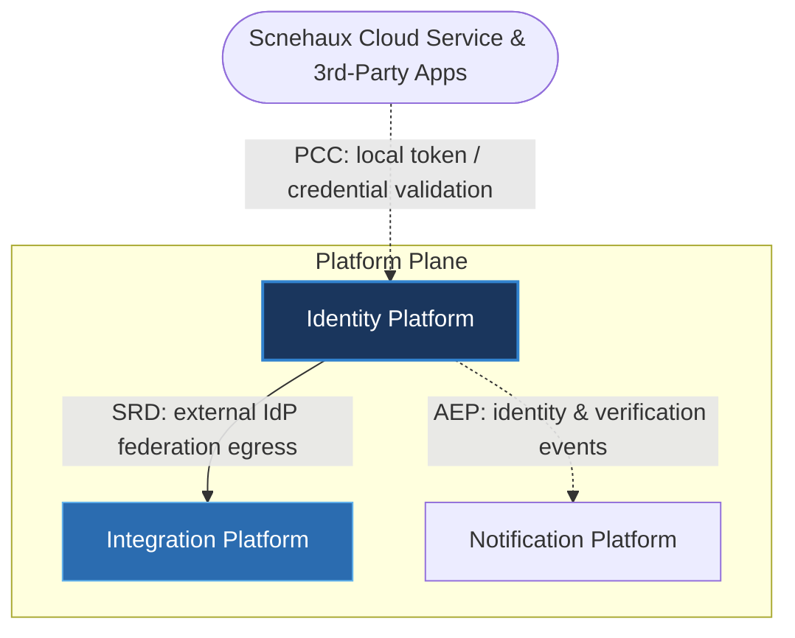

---
doc_meta:
  id: PAD-PLT-001
  title: Identity Platform
  owner: Identity Team
  version: 1.0.0
  status: approved
  classification: restricted
  governed_by:
    - GDC-008
  realizes_capability:
    - EAD-001
    - EAD-005
    - EAD-006
  review_cycle_days: 180
  created_date: 2026-01-01
  last_reviewed: 2026-07-06
  fulfilled_by:
    - SAD-001
    - SAD-002
---

# Identity Platform

---

## 1. Purpose & Scope

The platform establishes a centralized Identity and Access Management (IAM) capability serving both the internal Scnehaux Cloud Service and the external third-party ecosystem. Acting as the Unified Identity Provider and OAuth 2.0 Authorization Server, it provides centralized authentication, identity authorization (access delegation & user consent), federation, session governance, tenant isolation enforcement, identity lifecycle management, and platform administration (internal IAM operations and local RBAC).

As the Ecosystem Root of Trust, the entire Scnehaux Cloud Service and every registered third-party application relies on identities issued and governed by this platform.

### 1.1. Out of Scope

- Business Roles, Permissions, RBAC, and ABAC (owned exclusively by downstream domains).
- Business Authorization (e.g., "Can Employee approve Leave?").
- Business User Profiles and HR Records.
- Business Workflow Orchestration.
- Business Presentation UI (Hosted Authentication UI is IN scope).
- Business audit records unrelated to identity.

---

## 2. Enterprise Traceability

The Identity Platform is the Ecosystem Root of Trust: it issues identities and tokens, and every other domain validates them locally.

### 2.1. Realizes

- EAD-001 Enterprise Capability & Domain Map — the Identity capability (unified authentication, identity authorization, federation, platform administration).
- EAD-005 Enterprise Platform Architecture — the substrate it operates on.
- EAD-006 Enterprise Security Architecture — the enterprise trust model it enforces.

### 2.2. Relationships

- **Synchronous Dependencies (SRD):** Integration Platform — external Identity Provider federation is mediated through the Integration ACL.
- **Publishes Events (AEP):** identity and verification lifecycle events (e.g. `PrincipalProvisioned`, `SessionRevoked`, `VerificationRequested`) to the Event Broker.
- **Subscribes To Events (AES):** none on the critical path; tenant and organizational structure, when required for token scoping, is received from Workspace-owned events.
- **Consumes Platform Capabilities (PCC):** none — as the Root of Trust, the Identity Platform does not consume identity from any other domain.

### 2.3. Consumed By

The entire Scnehaux Cloud Service and registered third-party ecosystem consume Identity as a platform capability: Identity-issued tokens and workload credentials are validated **locally** (cached, per the EAD-006 §8 degradation contract), so consumption is not a runtime dependency on Identity. Token issuance, consent, and login are the only synchronous calls into Identity. The Notification Platform subscribes to Identity's published events to deliver verification and identity communications.

---

## 3. Domain & Context Model

The Identity Platform is decomposed into multiple independent **Bounded Contexts**, each responsible for a distinct identity capability.

### 3.1. Bounded Context

- Identity Management
- Authentication
- Authorization (Delegation, Scope & Consent)
- Third-Party Client Management
- Federation
- Token & Session Service
- Cryptographic Trust
- Tenant Isolation Enforcement
- Service & Workload Identity
- Identity Event Emission

### 3.2. Ubiquitous Language

| Term | Description |
| --- | --- |
| Identity | Verified digital representation of a human or workload. |
| Principal | Entity requesting access. |
| Credential | Proof used to establish identity. |
| Authentication | Verification of identity (e.g., verifying a credential). |
| Identity Authorization | Decision to grant access to identity resources or issue tokens (e.g., "Can Client A request scope B?"). |
| Business Authorization | Decision to grant access to business resources (e.g., "Can HR approve leave?"). STRICTLY OUT OF SCOPE. |
| Session | Authenticated interaction lifecycle. |
| Identity Claim | Verified identity attribute exchanged between trusted systems. |
| Federation | Trust relationship between identity authorities. |
| Tenant | The customer isolation boundary, owned by the Workspace Platform; Identity enforces isolation but does not own the tenant. |
| Identity Authority | Trusted issuer of enterprise identities. |
| Trust Relationship | Established confidence between participating identity domains. |

### 3.3. Domain Policies

- The Identity Platform is the sole enterprise identity authority.
- Business domains shall never authenticate users independently.
- Identity lifecycle remains independent from business lifecycle (e.g., resignation does not equal identity deletion).
- Business authorization remains exclusively owned by downstream domains. The Identity Platform only establishes authenticated identity and trusted security claims.
- Authorization decisions for business resources shall never be centralized within the Identity Platform.
- Cryptographic Trust models are defined here logically; physical implementations (e.g., JWKS, RS256, Vault) are strictly delegated to the SAD.
- Tenant isolation is mandatory across all identity operations.

---

## 4. Integration Contracts

### 4.1. Integration Provided

The Identity Platform provides the following platform capabilities:

- Identity Management
- Authentication
- Authorization (Delegation, Scope & Consent)
- Third-Party Client Management
- Federation
- Token & Session Service
- Cryptographic Trust
- Tenant Isolation Enforcement
- Service & Workload Identity
- Identity Events

### 4.2. Integration Consumed

The Identity Platform consumes:

- Integration Platform (Synchronous Runtime Dependency) for external Identity Provider federation, mediated through the ACL.

It does not consume the Notification Platform. Instead it **publishes** identity and verification events to the Event Broker, which the Notification Platform subscribes to for delivery (Asynchronous Event Publication).

Implementation protocols, transport mechanisms, and technology choices are defined by the realizing SAD.

---

## 5. Trust & Data Boundaries

### 5.1. Trust Boundary

The Identity Platform represents the Ecosystem Root of Trust.

Every enterprise platform, application, service, API, and workload must establish trust through identities governed by this platform.

**Third-Party Trust Boundary**: External third-party applications operate strictly outside the enterprise trust boundary. They may consume Identity only by registering as an OAuth Client and obtaining explicit, cryptographic consent from the user. Trust is established through enterprise identity rather than network location.

### 5.2. Identity Access

The platform governs enterprise authentication, identity authorization (delegation), federation, cryptographic trust, tenant isolation enforcement, service and workload identity, and identity lifecycle.

Business domains remain exclusively responsible for business-specific authorization policies (RBAC/ABAC).

### 5.3. Data Classification

The platform manages highly sensitive identity information.

Classification includes:

- Personally Identifiable Information (PII)
- Credentials
- Identity Attributes
- Authentication Metadata
- Session Metadata
- Security Policies
- Restricted Enterprise Security Data

Business domain data is explicitly outside the platform boundary.

---

## 6. Capability NFR

### 6.1. Reliability & Availability

- Enterprise-grade identity availability.
- No single identity authority failure.
- Consistent identity services across all enterprise products.

### 6.2. Performance & Scalability

- Low-latency authentication and identity authorization.
- Horizontally scalable identity services.
- Enterprise-scale multi-tenant support.

### 6.3. Security & Compliance

- Zero Trust architecture.
- Least Privilege principles.
- Defense in Depth.
- Enterprise security governance.
- Regulatory compliance support.

### 6.4. Auditability

Every identity lifecycle event shall be fully traceable, including:

- Identity creation
- Authentication
- Identity Authorization & Delegation
- Session lifecycle
- Token & Credential lifecycle
- Federation lifecycle
- Tenant administration
- Organization administration
- Security policy changes

---

## 7. Ownership & Governance

### 7.1. Team Ownership

The Identity Platform Team owns the platform architecture and platform identity capabilities.

The Security Architecture Team governs enterprise trust policies, while the Architecture Authority approves all breaking changes affecting identity contracts.

### 7.2. Realizing Systems

- SAD-001 Enterprise Identity Platform
- SAD-002 Identity Administration Portal

### 7.3. Governance Rules

- The Identity Platform is the single source of truth for enterprise identity.
- Identity contracts are centrally governed and versioned.
- Every enterprise product must delegate authentication to this platform.
- Breaking identity contracts require Architecture Authority approval.
- Trust boundaries evolve only through governed architectural decisions.
