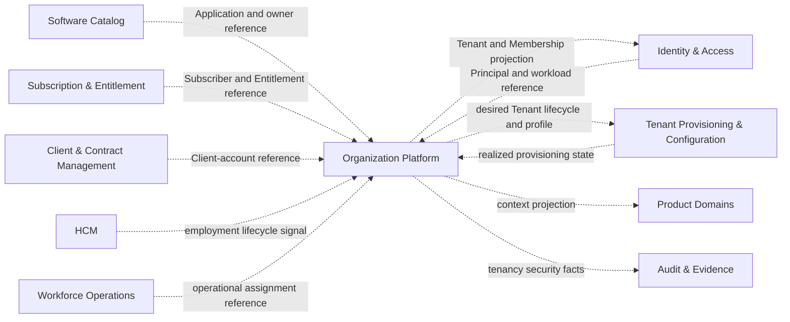

---
doc_meta:
  id: PAD-PLT-002
  title: Organization & Tenancy Platform
  owner: Core Platform Team
  version: 2.0.0
  status: approved
  classification: restricted
  governed_by:
    - GDC-008
  realizes_capability:
    - EAD-001
    - EAD-002
    - EAD-003
    - EAD-004
    - EAD-005
    - EAD-006
  review_cycle_days: 180
  created_date: 2026-08-06
  last_reviewed: 2026-08-06
  fulfilled_by:
    - SAD-004
    - SAD-012
---

# Organization Platform

## 1. Purpose & Scope

The **Organization Platform** is the enterprise authority for ecosystem organizations, technical tenants, workspaces, memberships, and trusted operating context within the **Scnehaux Enterprise Cloud**.

It establishes **which organizations participate**, **which tenant and workspace boundaries exist**, **which Principals or workloads may operate in those contexts**, and **how lifecycle changes are distributed to Identity, Products, Runtime, Data, and Assurance capabilities**.

The platform is a logical domain capability. It does not prescribe the language, identity vendor, database, deployment topology, event broker, or user-interface framework used by realizing systems.

### 1.1 Capability

The platform owns:

- provider, customer, partner, and publisher Organization identity and organization-relevant lifecycle;
- Tenant identity, lifecycle, operating status, and isolation-profile reference;
- Workspace identity and lifecycle within one Tenant;
- Membership between a Principal or workload and a Tenant or Workspace;
- organization-administrative roles and delegated administration;
- trusted operating-context eligibility and switching rules;
- membership invitation intent and onboarding coordination;
- tenant suspension, restoration, transfer, offboarding, and retirement coordination;
- authoritative Tenant, Workspace, and Membership lifecycle facts;
- projection, bootstrap, revocation, and reconciliation obligations for consumers;
- tenant-residency and deployment-profile references;
- tenancy security and governance events.

### 1.2 Out Of Scope

The platform does not own:

- Principal, Identity Realm, identifier, authenticator, authentication, session, token, federation, or OAuth client trust;
- Subscriber Account, Product Offering, Subscription, Entitlement, plan, package, quota, price, invoice, or payment;
- BPO Client Account, Contract, MSA, SOW, rate card, service commitment, or workstream;
- employee, employment, department, position, reporting line, payroll, attendance, leave, skill, shift, or capacity;
- Product, Application, repository, Application Owner, or software lifecycle;
- Product-specific roles, permissions, resource relationships, approvals, or business authorization;
- physical infrastructure provisioning, regional resource creation, database allocation, or runtime deployment;
- Product configuration values or feature-flag evaluation;
- enterprise immutable evidence retention;
- notification delivery;
- Product business data.

The platform may retain bounded references or projections from those authorities when required to establish a tenancy relationship or coordinate lifecycle. A reference does not transfer authority.

### 1.3 Domain Promise

The platform promises that:

1. Organization, Subscriber Account, Client Account, Tenant, Workspace, and Membership remain distinct concepts.
2. Every Tenant and Workspace has one authoritative lifecycle and immutable identifier.
3. One stable Principal may hold many independent Memberships across Tenants and Workspaces.
4. Suspending or revoking one Membership does not destroy the Principal or unrelated Memberships.
5. Membership establishes operating-context eligibility, not Product Entitlement or business permission.
6. Consumer systems can enforce Tenant and Membership context without a synchronous control-plane call on every request.
7. Tenant and Membership revocation has a declared propagation and reconciliation contract.
8. Cross-tenant provider administration is explicit, bounded, elevated, and evidenced.
9. Tenant lifecycle is distinct from physical provisioning state.
10. Capability claims are supported by isolation, lifecycle, projection, and recovery evidence.

## 2. Enterprise Traceability

### 2.1 Realizes

The platform realizes:

- **EAD-001:** Organization as a Core Control Platform with authority for Organization, Tenant, Workspace, Membership, and operating context.
- **EAD-002:** the logical Tenancy system and bounded local context projections used by Identity and Products.
- **EAD-003:** authoritative Organization/Tenant/Workspace/Membership data and governed non-authoritative references.
- **EAD-004:** lifecycle events, projection bootstrap, revocation propagation, reconciliation, and long-running onboarding/offboarding coordination.
- **EAD-005:** control-plane/application-plane separation, governed tenant-deployment profiles, and local context enforcement.
- **EAD-006:** contextual Membership distinct from identity, entitlement, and Product permission; cross-tenant administration; tenant-isolation defense in depth.

### 2.2 Relationships



Relationship rules:

- Identity & Access is authoritative for Principal and workload identity.
- Software Catalog is authoritative for Application identity and ownership.
- Subscription & Entitlement is authoritative for commercial access.
- Client & Contract Management is authoritative for BPO customer relationships and contracts.
- HCM and Workforce Operations remain authoritative for their respective organizational and assignment structures.
- Tenant Provisioning & Configuration realizes infrastructure and configuration state but does not own Tenant identity.
- Product domains remain authoritative for Product permissions and business resources.
- Audit & Evidence remains authoritative for enterprise evidence retention and chain of custody.

### 2.3 Consumed By

The platform is consumed by:

- Identity & Access;
- enterprise applications;
- BPO service-management and travel-operations products;
- administrative, operator, supervisor, quality, and client experiences;
- Subscription & Entitlement;
- Tenant Provisioning & Configuration;
- Data, Search, Knowledge, AI, Audit, and Reporting capabilities;
- API gateways, protected resources, background jobs, and integration connectors;
- Security Operations and compliance processes.

Consumers use authoritative administration contracts, bounded Tenant/Membership projections, lifecycle events, context snapshots, revocation facts, isolation-profile references, and reconciliation capabilities.

## 3. Domain & Context Model

### 3.1 Bounded Context

| Bounded Context             | Owns                                                                                                   | Does Not Own                                                |
| :-------------------------- | :----------------------------------------------------------------------------------------------------- | :---------------------------------------------------------- |
| Organization Registry       | Organization identity, type, status, and organization-relevant relationships                           | Subscriber commercial state, Client Contract, HCM hierarchy |
| Tenant Lifecycle            | Tenant identity, status, sponsorship references, lifecycle, isolation/residency profile reference      | physical infrastructure or Product data                     |
| Workspace Lifecycle         | Workspace identity, type, status, and parent Tenant                                                    | BPO workstream, HCM department, Product, Application        |
| Membership                  | Principal/workload relationship to Tenant or Workspace, status, validity, provenance, security version | Principal credentials, Product roles or permissions         |
| Invitation & Onboarding     | Membership invitation intent, sponsor, expiry, prerequisite coordination                               | identity proof or authenticator enrollment                  |
| Operating Context           | eligible Tenant/Workspace contexts, context version, switching and containment rules                   | Product authorization                                       |
| Tenancy Administration      | Tenant/Workspace administrative roles and provider cross-tenant scope                                  | Product administration or business approvals                |
| Projection & Reconciliation | lifecycle publication, bootstrap, replay, consumer freshness, divergence detection                     | consumer-owned cache or persistence                         |
| Tenant Offboarding          | access freeze and cross-domain retirement coordination                                                 | Product-domain deletion, export, or legal-hold authority    |

These contexts may be realized by one or more physical systems without changing the PAD.

### 3.2 Ubiquitous Language

| Term                        | Meaning                                                                                                    |
| :-------------------------- | :--------------------------------------------------------------------------------------------------------- |
| Organization                | Legal or business party participating as provider, customer, partner, publisher, or another governed type. |
| Provider Organization       | Organization operating the Scnehaux Enterprise Cloud; initially ATI Business Group.                        |
| Customer Organization       | Organization consuming ATI products or managed services.                                                   |
| Publisher Organization      | Organization accountable for Product or Application ownership through the appropriate catalog.             |
| Subscriber Account          | Commercial purchaser of a Product Offering; authoritative outside this platform.                           |
| Client Account              | BPO service-delivery relationship governed by Contract and Workstream authorities.                         |
| Tenant                      | Technical isolation, configuration, data, and operating boundary.                                          |
| Workspace                   | Collaboration or operating context inside exactly one Tenant.                                              |
| Principal                   | Stable human, service, workload, or governed-agent security subject owned by Identity.                     |
| Membership                  | Time-bounded contextual relationship between a Principal/workload and a Tenant or Workspace.               |
| Membership Type             | Classification of the contextual relationship, not a Product permission.                                   |
| Operating Context           | Trusted Tenant and optional Workspace context in which a Principal or workload acts.                       |
| Context Switch              | Selection of another valid Membership context without replacing the Principal.                             |
| Tenant Administrator        | Role authorized only for governed tenancy administration.                                                  |
| Cross-Tenant Administration | Explicit provider authority spanning a bounded set of Tenants or operations.                               |
| Invitation Intent           | Request to establish future Membership; not an identity proof or credential.                               |
| Isolation Profile           | Governed tenant-isolation requirement referenced by runtime and data systems.                              |
| Residency Profile           | Governed geographic or sovereignty requirement associated with a Tenant.                                   |
| Desired Provisioning State  | Tenant lifecycle intent sent to the provisioning authority.                                                |
| Realized Provisioning State | Infrastructure/configuration state reported by the provisioning authority.                                 |
| Projection                  | Non-authoritative local representation of Tenant, Workspace, or Membership facts.                          |
| Membership Security Version | Monotonic contextual-access version used by distributed consumers.                                         |
| Offboarding                 | Coordinated access freeze, export/retention obligation, resource retirement, and final Tenant closure.     |

### 3.3 Domain Invariants

1. Organization, Subscriber Account, Client Account, Tenant, Workspace, Membership, Product, and Application are separate entities.
2. Every Tenant has one immutable identifier and one authoritative lifecycle.
3. Every Workspace belongs to exactly one Tenant.
4. Every Membership belongs to exactly one Tenant and may reference at most one Workspace.
5. Every Membership references a stable Principal or workload identifier owned by Identity.
6. No reusable identity credential or authentication secret is stored in this domain.
7. One Principal may hold Memberships across many Tenants and Workspaces.
8. Suspending one Membership does not suspend the Principal globally.
9. Suspending a Tenant blocks all operating contexts in that Tenant according to a declared propagation contract.
10. Organization association does not imply Membership, Subscription, Entitlement, or Product permission.
11. Membership does not imply Subscription, Entitlement, Product role, or business authorization.
12. Tenancy-administrative roles grant only Organization administrative capabilities.
13. Workspace is not an alias for HCM department, BPO workstream, Product, or Application.
14. Client-supplied Tenant or Workspace values are requested context, not proof of authority.
15. Consumer projections are versioned, freshness-bounded, and reconciled.
16. High-risk stale context fails closed or invokes an explicitly approved fresh-decision contract.
17. Tenant desired state and realized provisioning state are represented separately.
18. Offboarding freezes access before irreversible deletion or resource release.
19. Product domains do not duplicate authoritative Tenant, Workspace, or Membership lifecycle.
20. Identity may retain only bounded non-authoritative Tenant and Membership projections.
21. Every lifecycle mutation is attributable, idempotent, and durable before publication.
22. Cross-tenant administration requires explicit scope, elevated assurance, and evidence.

## 4. Integration Contracts

### 4.1 Integration Provided

The platform provides logical capabilities for:

- Organization registration, classification, relationship, suspension, succession, and retirement;
- Tenant creation, activation, suspension, restoration, transfer, offboarding, and retirement;
- Workspace creation, activation, suspension, restoration, and retirement;
- Membership invitation, activation, suspension, revocation, expiry, restoration, and administrative delegation;
- eligible operating-context discovery and context switching;
- authoritative Tenant, Workspace, and Membership lookup for administrative or exceptional high-risk decisions;
- projection bootstrap, lifecycle events, high-priority revocation, replay, and reconciliation;
- desired isolation, residency, deployment, and provisioning-profile references;
- Tenant offboarding coordination and domain-completion tracking;
- tenancy security and governance facts.

### 4.2 Integration Consumed

The platform consumes logical contracts for:

- Principal/workload reference and lifecycle from Identity & Access;
- Application and owner references from Software Catalog;
- Subscriber Account, Subscription, and Entitlement references where applicable;
- Client Account and Contract lifecycle references where applicable;
- HCM employment and Workforce assignment lifecycle signals;
- Product and Product Offering references;
- realized provisioning and configuration status;
- security-policy and incident signals;
- enterprise evidence acknowledgement and notification-delivery status where required.

### 4.3 Contract Principles

- Normal token issuance and Product request handling use bounded local projections rather than synchronous Tenancy calls.
- Administrative mutations target the authoritative Organization capability.
- Principal creation or authentication remains an Identity journey; Membership activation remains a Tenancy journey.
- Subscription activation and Membership activation are coordinated but independently authoritative.
- Tenant lifecycle intent and physical provisioning outcome are correlated but independently authoritative.
- Projection delivery supports bootstrap, incremental change, revocation priority, replay, and reconciliation.
- Consumers declare freshness, stale behavior, and maximum revocation-enforcement delay.
- Lifecycle events contain identifiers, versions, context, actor, classification, correlation, and evidence metadata without credentials or unrelated business data.
- Long-running onboarding and offboarding are resumable and expose partial progress and unresolved obligations.

## 5. Trust & Data Boundaries

### 5.1 Trust Boundary

The platform establishes boundaries between:

- provider, customer, partner, and publisher Organizations;
- one Tenant and another Tenant;
- one Workspace and another Workspace;
- a Principal identity and its contextual Memberships;
- ordinary Tenant administration and provider cross-tenant administration;
- authoritative context and client-requested context;
- current Tenant/Membership state and stale consumer projections;
- desired Tenant lifecycle and realized infrastructure state;
- active operation and suspended/offboarding contexts.

Tenant context is a security boundary, not merely request metadata.

### 5.2 Identity Access

Identity & Access authenticates the Principal or workload and establishes assurance. Organization decides whether that subject has an active Tenant or Workspace Membership and whether it may perform organization-administrative actions.

A trusted operating context requires:

```text
Valid Principal or Workload
+ Active Tenant
+ Active and Time-Valid Membership
+ Active Workspace Membership when applicable
+ Trusted Context Selection
```

Product Entitlement and Product authorization are evaluated by their own authorities.

Cross-tenant administration additionally requires bounded provider scope, elevated authentication, reason, approval where required, short privileged context, and evidence.

### 5.3 Data Classification

| Data Class                    | Examples                                                     | Classification                  |
| :---------------------------- | :----------------------------------------------------------- | :------------------------------ |
| Organization Data             | organization identity, type, relationship, status            | Internal or Restricted by field |
| Tenant Data                   | Tenant identifier, lifecycle, isolation/residency references | Restricted                      |
| Workspace Data                | Workspace identifier, type, status, parent Tenant            | Restricted                      |
| Membership Data               | Principal reference, context, status, validity, provenance   | Restricted                      |
| Administrative Data           | owner/admin assignment, approval, provider scope             | Restricted                      |
| Invitation Data               | target reference, sponsor, expiry, status                    | Restricted                      |
| Projection Metadata           | lifecycle/security version, cursor, freshness                | Internal or Restricted          |
| Security Events               | suspension, revocation, cross-tenant action                  | Restricted                      |
| Public Presentation Reference | explicitly published Tenant/organization branding            | Public only when approved       |

The platform does not retain authentication secrets, unrestricted identity profiles, Product business records, payroll records, Contract documents, or payment data.

### 5.4 Isolation and Privacy

Tenant isolation applies to authoritative persistence, cache, events, snapshots, exports, search, background jobs, observability, backup/restore, administration, replay, and reconciliation.

Privacy rules include:

- store the minimum Principal reference required for Membership;
- avoid duplicating full identity profiles;
- restrict cross-tenant search and export;
- preserve purpose, classification, residency, and retention context;
- prevent unapproved cross-customer identity correlation;
- coordinate legal hold, retention, export, and deletion during offboarding;
- separate public presentation data from restricted control-plane metadata.

## 6. Capability NFR

### 6.1 SLA, SLO, Availability

- No external commercial SLA is declared while the platform remains draft.
- Target availability for authoritative Tenant/Membership administration is **99.95% monthly** once production evidence exists.
- Target availability for consumer context enforcement is **99.99% monthly through local projection availability**, not through central synchronous lookup.
- No acknowledged Tenant suspension or Membership revocation may be lost.
- Current SLO remains `not-yet-established` until a realizing system exposes measured indicators.

### 6.2 RTO and RPO

- Target RTO for authoritative Tenant, Workspace, and Membership state: **15 minutes**.
- Target RPO for acknowledged authoritative changes: **1 minute or lower**, with stricter treatment for suspension and revocation.
- Projection state must be reconstructable from authoritative state and governed change history.
- Offboarding state must be durable and resumable.

### 6.3 Scalability, Peak Load, and Concurrency

The capability must scale across:

- Organization and Tenant count;
- Workspaces per Tenant;
- Memberships per Tenant and per Principal;
- bulk onboarding and offboarding;
- administrative and projection consumers;
- regional and isolation profiles.

Quantified capacity is established from measured demand. The design must prevent one Tenant, bulk import, or reconciliation consumer from exhausting shared capacity.

Lifecycle mutations require idempotency and concurrency protection. Duplicate invitation acceptance, Membership grant, suspension, restoration, or Tenant lifecycle commands must not create contradictory authoritative state.

### 6.4 Compliance, Data Privacy, and Data Residency

The capability supports evidence for:

- Tenant segregation;
- contextual access review;
- joiner/mover/leaver Membership changes;
- privileged and cross-tenant administration;
- customer offboarding;
- data residency and sovereignty;
- retention and legal hold;
- incident containment.

Residency and isolation-profile references accompany Tenant lifecycle and are enforced by the responsible Runtime, Data, Product, and Audit systems.

### 6.5 Audit

Every authoritative lifecycle and privileged action must identify:

- actor and Application/workload;
- Tenant/Workspace scope;
- affected Organization, Tenant, Workspace, or Membership;
- before/after lifecycle or security version;
- reason and approval reference where applicable;
- authentication assurance for privileged action;
- result, correlation, and evidence-delivery state.

### 6.6 Usability and Accessibility

Administrative experiences target WCAG 2.2 AA and must:

- clearly distinguish Organization, Tenant, Workspace, Membership, and Product access;
- always expose current administrative scope;
- prevent accidental cross-tenant action;
- show pending, active, suspended, revoked, expired, and offboarding states explicitly;
- provide safe preview and per-item outcome for bulk changes;
- expose stale projection or reconciliation state to authorized operators.

### 6.7 Interoperability

The capability provides stable opaque identifiers, versioned logical contracts, lifecycle events, snapshot/bootstrap, replay, reconciliation, and idempotent administrative commands.

It may interoperate with identity-provisioning standards when appropriate, but such interoperability does not transfer Membership authority to the identity system.

### 6.8 Cost Target

Cost is attributable per active Tenant, Workspace, Membership, mutation, projection consumer, reconciliation operation, residency profile, and retained governance fact.

No fixed unit-cost target is approved until real demand is measured. Cost optimization must not weaken isolation, revocation, evidence, residency, or recovery.

## 7. Ownership & Governance

### 7.1 Team Ownership

The **Core Platform Team** is the interim accountable owner until a dedicated Organization Platform Team is chartered.

The owning team is accountable for:

- Organization, Tenant, Workspace, Membership, and operating-context semantics;
- authoritative lifecycle and invariants;
- tenancy administration and cross-tenant controls;
- projection, freshness, revocation, and reconciliation contracts;
- tenant isolation/residency profile semantics;
- offboarding coordination;
- consumer integration and service management;
- capability SLOs, controls, and evidence.

It is not accountable for identity authentication, Subscription/Entitlement, Client Contract, HCM, Workforce Operations, Product permission, physical provisioning, Product configuration, or enterprise evidence retention.

### 7.2 Realizing Systems

- **SAD-004 — Scnehaux Organization Control**
- **SAD-012 — Scnehaux Organization Experience**

The former Enterprise Workspace Platform is superseded by this boundary after approval and migration.

### 7.3 Governance Rules

1. No other domain may create a second authoritative Tenant, Workspace, or Membership lifecycle.
2. IAM and Product systems may retain only governed projections.
3. Every consumer projection declares freshness, stale behavior, revocation priority, and reconciliation.
4. Every Tenant has an accountable administrative path.
5. Cross-tenant administration appears in an explicit privilege model and control evidence.
6. Tenant lifecycle and physical provisioning status remain separate.
7. Membership never grants Product permission implicitly.
8. Product-specific terms do not enter the Workspace or Membership model without Architecture Authority review.
9. Breaking Tenant/Membership semantics require a major PAD version and migration decision.
10. Capability and control status advance only with evidence.

## 8. Assumptions & Constraints

### 8.1 Assumptions

- Identity provides stable Principal and workload references.
- Products can consume bounded local context projections.
- Subscription & Entitlement, Client & Contract Management, and Tenant Provisioning may mature later without changing the domain boundary.
- Initial realization may be a modular control-plane system rather than multiple independent services.
- One ATI workforce Principal may operate in many Tenant contexts.
- Customer or partner identities may remain Realm-scoped while receiving Membership.

### 8.2 Constraints

- Organization cannot own credentials, authentication, sessions, tokens, or OAuth clients.
- Identity cannot remain authoritative for Tenant or Membership.
- Subscriber Account and Client Account cannot be inferred from Tenant identifier alone.
- Workspace cannot become a generic container for every business hierarchy.
- Membership cannot carry unrestricted Product roles or permissions.
- client input cannot establish trusted Tenant context by itself.
- normal Product requests cannot synchronously call this platform for every authorization decision.
- Tenant-specific code forks are prohibited.
- draft architecture cannot be represented as implemented production control evidence.

## 9. Architectural Decisions

Required or governing decisions include:

- Organization, Tenant, Workspace, and Membership ontology;
- separation of Principal authority from Membership authority;
- IAM projection and operating-context contract;
- pre-authentication Realm/Tenant discovery boundary;
- Tenant lifecycle versus provisioning-state boundary;
- organization-administrative and cross-tenant authorization;
- isolation and residency profiles;
- invitation and onboarding coordination;
- Tenant offboarding and data obligations;
- legacy Workspace/IAM Tenant migration.

## 10. Evolution

The capability evolves from a minimum authoritative Tenant/Membership boundary, through reliable projection and IAM integration, toward governed provisioning, commercial onboarding, customer self-administration, advanced isolation profiles, and automated offboarding.

Evolution must preserve:

- stable identifiers;
- distinct authorities;
- local consumer enforcement;
- explicit revocation and reconciliation;
- no Realm-per-Tenant default;
- no migration of Product authorization into Tenancy.

## 11. References

- EAD-001 — Enterprise Capability & Domain Map.
- EAD-002 — Enterprise System Landscape.
- EAD-003 — Enterprise Data Ownership & Topology.
- EAD-004 — Enterprise Integration Architecture.
- EAD-005 — Enterprise Platform Architecture.
- EAD-006 — Enterprise Security Architecture.
- PAD-PLT-001 — Identity & Access Platform.
- GDC-008 — Product Architecture Document Guideline.
- NIST SP 800-207 — Zero Trust Architecture.
- Domain-Driven Design — Eric Evans.
- Team Topologies — Matthew Skelton and Manuel Pais.
