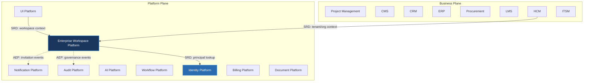

---
doc_meta:
  id: PAD-PLT-002
  title: Enterprise Workspace Platform
  owner: Workspace Team
  version: 1.0.0
  status: approved
  classification: restricted
  governed_by:
    - GDC-008
  realizes_capability:
    - EAD-001
    - EAD-005
  review_cycle_days: 180
  last_reviewed: 2026-07-06
  fulfilled_by:
    - SAD-004
---

# Enterprise Workspace Platform

---

## 1. Purpose & Scope

The Workspace Platform provides the enterprise organizational foundation for the entire Scnehaux Cloud Service. It manages tenants, organizations, workspaces, memberships, and workspace context, enabling every platform service and business product to operate within a consistent enterprise structure.

The platform establishes the enterprise collaboration boundary while remaining independent from business applications, identity management, and presentation technologies.

### 1.1. Out of Scope

- Authentication and credential verification.
- Authorization and permission evaluation.
- Business user profiles and employee records.
- Business workflow execution.
- Business application logic.
- File storage and document management.
- Notification delivery.
- UI rendering and presentation components.

---

## 2. Enterprise Traceability

The Workspace Platform realizes the enterprise organizational capability defined by the Enterprise Platform Architecture.

### 2.1. Realizes

- EAD-001 Enterprise Capability & Domain Map — the Workspace capability (tenant, organization, workspace, membership).
- EAD-005 Enterprise Platform Architecture — the substrate it operates on.

### 2.2. Relationships

- **Synchronous Dependencies (SRD):** Identity Platform — principal lookup during membership and invitation operations.
- **Publishes Events (AEP):** workspace lifecycle events; invitation events, to which the Notification Platform subscribes for delivery; governance events, to which the Audit Platform subscribes for immutable records.
- **Subscribes To Events (AES):** subscribes to Identity-owned events for principal changes so membership records stay consistent.
- **Consumes Platform Capabilities (PCC):** validates Identity-issued tokens locally, per the enterprise degradation contract.

### 2.3. Consumed By

Every Platform Service and Business Product consumes Workspace as a platform capability: tenant and organization context is resolved from Workspace and validated **locally** (cached), so consumption is not a runtime dependency on Workspace on the critical path.

---

## 3. Domain & Context Model

The Workspace Platform is decomposed into multiple independent bounded contexts responsible for enterprise organizational management.

### 3.1. Bounded Context

- Workspace Lifecycle
- Organization Management
- Membership Management
- Workspace Context
- Workspace Configuration
- Workspace Collaboration
- Workspace Governance

### 3.2. Ubiquitous Language

| Term              | Description                                                        |
| ----------------- | ------------------------------------------------------------------ |
| Tenant            | Highest logical boundary representing an independent customer.     |
| Workspace         | Enterprise working environment owned by a tenant.                  |
| Organization      | Organizational structure operating inside a workspace.             |
| Member            | Identity participating within a workspace.                         |
| Membership        | Relationship between a member and a workspace or organization.     |
| Workspace Context | Active organizational context used by applications.                |
| Workspace Owner   | Primary administrator responsible for a workspace.                 |
| Organization Unit | Department, division, or business unit within an organization.     |
| Invitation        | Controlled onboarding process into a workspace.                    |
| Workspace Policy  | Governance rules applied to workspace lifecycle and collaboration. |

### 3.3. Domain Policies

- Every Tenant owns one or more Workspaces.
- Every Workspace belongs to exactly one Tenant.
- Every Organization exists within exactly one Workspace.
- Membership exists only within a Workspace.
- Workspace context must be propagated consistently across all applications.
- Business domains shall never manage workspace lifecycle.
- Workspace identifiers are immutable after creation.
- Organization hierarchy is governed exclusively by this platform.
- Workspace lifecycle follows governed provisioning and archival policies.

---

## 4. Integration Contracts

### 4.1. Integration Provided

The Workspace Platform provides:

- Tenant Management
- Workspace Lifecycle Management
- Organization Management
- Membership Management
- Invitation Management
- Workspace Provisioning
- Workspace Context Management
- Workspace Switching
- Workspace Configuration
- Organization Directory
- Workspace Events
- Collaboration Context

### 4.2. Integration Consumed

The Workspace Platform consumes:

- Identity Platform for principal information during membership and invitation operations.

It does not consume the Notification or Audit Platforms. Instead it **publishes** events to the Event Broker: invitation events, which the Notification Platform subscribes to for delivery, and governance events, which the Audit Platform subscribes to for immutable records (Asynchronous Event Publication).

Implementation protocols, APIs, and communication mechanisms are defined by the realizing SAD.

---

## 5. Trust & Data Boundaries

### 5.1. Trust Boundary

The Workspace Platform establishes the enterprise organizational boundary.

It governs where users belong, how organizations are structured, and how workspace context is propagated throughout the enterprise.

Identity trust remains delegated to the Identity Platform.

Business ownership remains delegated to Business Products.

### 5.2. Identity Access

Authentication and enterprise identity are delegated entirely to the Identity Platform.

The Workspace Platform governs:

- Workspace ownership
- Membership lifecycle
- Organization hierarchy
- Workspace context
- Collaboration boundaries

Business domains remain responsible for business-specific authorization.

### 5.3. Data Classification

The platform manages enterprise organizational metadata, including:

- Tenant Metadata
- Workspace Metadata
- Organization Structure
- Membership Information
- Workspace Configuration
- Collaboration Metadata
- Organizational Policies

The platform does **not** store:

- Credentials
- Business Transactions
- HR Records
- Financial Records
- Product-specific business data

---

## 6. Capability NFR

### 6.1. Reliability & Availability

- Enterprise-grade availability for organizational services.
- Consistent workspace context across all products.
- No single organizational failure affecting tenant isolation.

### 6.2. Performance & Scalability

- Horizontally scalable workspace services.
- Support enterprise-scale tenants, organizations, and memberships.
- Low-latency workspace context resolution.

### 6.3. Security & Compliance

- Strict tenant isolation.
- Organization boundary enforcement.
- Enterprise governance compliance.
- Privacy-preserving organizational metadata management.

### 6.4. Auditability

Every organizational lifecycle event shall be traceable, including:

- Tenant creation
- Workspace creation
- Workspace archival
- Organization changes
- Membership changes
- Invitation lifecycle
- Workspace provisioning
- Workspace policy changes
- Administrative operations

---

## 7. Ownership & Governance

### 7.1. Team Ownership

The Workspace Platform Team owns the enterprise organizational model, workspace lifecycle, and collaboration boundaries.

The Architecture Authority governs all enterprise organizational contracts and structural evolution.

### 7.2. Realizing Systems

- SAD-004 Enterprise Workspace Platform

### 7.3. Governance Rules

- The Workspace Platform is the single source of truth for enterprise organizational structure.
- Business products shall never duplicate tenant, workspace, or organization management.
- Workspace contracts are centrally governed and versioned.
- Organizational boundaries evolve only through governed architectural decisions.
- Breaking workspace contracts require Architecture Authority approval.
- Workspace context shall remain consistent across every platform service and business product.

<!-- lint_disable: cross_reference_missing, inline_reference_missing -->
