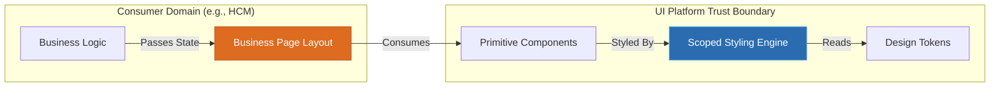

---
doc_meta:
  id: PAD-PLT-003
  title: Enterprise UI Platform
  owner: UI Platform Team
  version: 1.0.0
  status: approved
  classification: restricted
  governed_by:
    - GDC-000
    - GDC-008
  realizes_capability:
    - EAD-001
    - EAD-005
  review_cycle_days: 180
  last_reviewed: 2026-07-06
  fulfilled_by:
    - SAD-003
---

# Enterprise UI Platform

---

## 1. Purpose & Scope

The UI Platform establishes the enterprise-wide visual foundation for every product and platform. It acts as the singular source of truth for visual language, accessibility, interaction semantics, and design consistency. By isolating presentation primitives from business logic, the platform eliminates duplicated UI efforts, prevents visual fragmentation, and ensures every Scnehaux Cloud Service delivers a cohesive, premium user experience.

### 1.1. Out of Scope

- Business logic and domain behavior.
- Product-specific pages, layouts, or workflows.
- Backend APIs, databases, and application services.
- Authentication and authorization logic.
- Runtime theming engines outside the governed design contract.
- Business data validation.

---

## 2. Enterprise Traceability

The UI Platform realizes the enterprise presentation capability defined within the Enterprise Capability Map and Enterprise Platform Architecture.

```mermaid
graph TD
    subgraph Platform["Platform Plane"]
        UI[Enterprise UI Platform]
        IAM[Identity Platform]
        WS[Workspace Platform]
        WF[Workflow Platform]
        NT[Notification Platform]
        INT[Integration Platform]
        DOC[Document Platform]
        BILL[Billing Platform]
        AUDIT[Audit Platform]
        AI[AI Platform]
    end

    subgraph Business["Business Plane"]
        HCM[HCM]
        ERP[ERP]
        CRM[CRM]
        CMS[CMS]
        ITSM[ITSM]
        LMS[LMS]
        PM[Project Management]
        PROC[Procurement]
    end

    IAM -. PCC: build-time package .-> UI
    WS -. PCC: build-time package .-> UI
    WF -. PCC: build-time package .-> UI
    NT -. PCC: build-time package .-> UI
    INT -. PCC: build-time package .-> UI
    DOC -. PCC: build-time package .-> UI
    BILL -. PCC: build-time package .-> UI
    AUDIT -. PCC: build-time package .-> UI
    AI -. PCC: build-time package .-> UI
    HCM -. PCC: build-time package .-> UI
    ERP -. PCC: build-time package .-> UI
    CRM -. PCC: build-time package .-> UI
    CMS -. PCC: build-time package .-> UI
    ITSM -. PCC: build-time package .-> UI
    LMS -. PCC: build-time package .-> UI
    PM -. PCC: build-time package .-> UI
    PROC -. PCC: build-time package .-> UI
```

### 2.1. Realizes

- EAD-001 Enterprise Capability & Domain Map
- EAD-005 Enterprise Platform Architecture

### 2.2. Relationships

- **Synchronous Dependencies (SRD):** none — the UI Platform has no runtime dependency on any domain (Depends On: None).
- **Publishes Events (AEP):** none.
- **Subscribes To Events (AES):** none.
- **Consumes Platform Capabilities (PCC):** only the build and delivery toolchain (NPM registry, CDN) used to publish and distribute versioned packages.

### 2.3. Consumed By

Every Platform Service and Business Product consumes the UI Platform as **build-time packages** (Platform Capability Consumption), never as a runtime dependency: primitives and tokens are compiled into each consumer at build time.

#### Platform Services

- Identity Platform
- Workspace Platform
- Workflow Platform
- Notification Platform
- Integration Platform
- Document Platform
- Billing Platform
- Audit Platform
- AI Platform

#### Business Products

- HCM
- ERP
- CRM
- CMS
- ITSM
- LMS
- Project Management
- Procurement

---

## 3. Domain & Context Model

The platform is decomposed into several independent **Bounded Contexts** that separate the raw design values from semantic meaning and functional components.

### 3.1. Bounded Context

- **Design Token System**: The core architectural model that distributes visual decisions via a governed 3-tier hierarchy (Core, Semantic, Component).
- **Primitive Components**: Headless, accessible, reusable UI building blocks that encapsulate DOM structure and interaction states without dictating business semantics.
- **Styling Engine**: The runtime mechanism that compiles and injects scoped CSS securely, preventing visual contamination.
- **Accessibility Foundation**: The semantic DOM mapping, ARIA orchestration, and keyboard navigation contracts ensuring strict WCAG 2.2 AA compliance.
- **Layout Foundation**: The responsive grid, flexbox primitives, and spacing scales that govern spatial harmony.
- **Iconography**: The governed set of SVG vectors, scaled and optimized for semantic clarity.
- **Motion System**: The physics-based animation curves and timing functions that provide spatial context.

### 3.2. Ubiquitous Language

| Term | Description |
| --- | --- |
| Design Token | Enterprise visual design contract representing a single source of truth for a stylistic value. |
| Core Token | Raw, semantic-free values (e.g., `color-blue-500`, `spacing-4`). |
| Semantic Token | Context-aware values that carry design intent (e.g., `color-background-error`, `spacing-layout-gap`). |
| Component Token | Component-specific overrides mapping to semantic tokens (e.g., `button-primary-background-hover`). |
| Primitive Component | Headless reusable UI building block decoupled from business state. |
| Visual Contamination | Unauthorized style leakage across DOM boundaries or domains. |
| Theme | A governed collection of semantic tokens tailored for specific contexts (e.g., Light, Dark, High-Contrast). |

### 3.3. Domain Policies

- **Semantic Delegation**: Product teams must never bypass semantic tokens by hardcoding core tokens or raw hex values.
- **Zero Visual Contamination**: Styles must be encapsulated; global CSS selectors that bleed outside component boundaries are strictly prohibited.
- **Accessibility First**: Every primitive component must ship with WCAG 2.2 AA compliance built-in; accessibility is non-negotiable and cannot be opted out of.
- **Composition over Inheritance**: Complex business components are built by composing primitive components, never by extending their internal DOM structures.
- **Immutable Contracts**: Design tokens and component APIs are versioned contracts. Breaking changes require major version increments.

---

## 4. Integration Contracts

### 4.1. Integration Provided

The platform provides a strict, versioned API surface for enterprise presentation:

- **Enterprise Design System**: Distributed via versioned packages.
- **Design Token Contract**: CSS variables and JS-consumable token dictionaries.
- **Primitive Components**: React/Web Component implementations of all atomic UI elements.
- **Accessibility Foundation**: Hooks and utilities for focus management and ARIA states.
- **Theme Contract**: Switchable contexts for Dark/Light mode and High-Contrast.
- **Icon Library**: Optimized SVG sprites and React wrappers.

### 4.2. Integration Consumed

The UI Platform consumes no business capabilities, data services, or backend APIs. It relies solely on the build and delivery toolchain (e.g., NPM registry, CDN).

Implementation specifics regarding frameworks (e.g., React, Tailwind) and build tools (e.g., Vite, Rollup) are defined by the realizing SAD.

---

## 5. Trust & Data Boundaries

### 5.1. Trust Boundary

The UI Platform represents the enterprise visual trust boundary. It enforces "Zero Visual Contamination" — guaranteeing that a component rendered by the HCM domain cannot accidentally style or break a component rendered by the Identity domain on the same page.

### 5.2. Identity Access

Only the core UI Platform Team and governed open-source contributors (via PR review) may modify the platform repository. Authentication, authorization, and user management remain outside this domain.

### 5.3. Data Classification

The platform manages no business records, customer data, or transactional state.

Classification:

- Public Assets (CSS, JS bundles, Fonts, Icons)
- Internal Design Assets (Figma files, source code)

No PII, financial data, credentials, or regulated business information may exist within this platform.

---

## 6. Capability NFR

### 6.1. Performance & Scalability (Quantified)

- **Bundle Budget**: Core primitive CSS payload must not exceed `12KB` (gzipped).
- **Runtime Performance**: Component renders and re-renders must execute within `16ms` (maintaining a 60fps frame rate).
- **Theme Switching**: Client-side theme switching (e.g., Light to Dark) must resolve within `50ms` with zero layout shift.
- **Tree-Shaking**: All component libraries must support aggressive tree-shaking; consumers only pay the payload cost for the primitives they explicitly import.

### 6.2. Reliability & Availability

- **CDN Distribution**: Static assets distributed via Tier-0 CDN with 99.999% availability (external CDN vendor SLA; the platform's own assets are build-time artifacts, not a runtime tier).
- **Backward Compatibility**: Semantic token APIs and primitive component props must remain stable across minor versions.

### 6.3. Security & Compliance

- **No Runtime Injection**: The styling engine must statically extract CSS where possible or use CSP-compliant runtime injection that prevents XSS.
- **Accessibility**: 100% automated coverage for WCAG 2.2 AA compliance on all primitive components.

### 6.4. Auditability

- Complete version history for all design tokens via Semantic Versioning.
- Traceable visual regression test artifacts for every PR.

---

## 7. Ownership & Governance

### 7.1. Team Ownership

The UI Platform Team (part of Platform Engineering) owns the platform architecture, token definitions, and primitive component implementations.

The Architecture Authority approves all major version increments (breaking changes) affecting enterprise consumers.

### 7.2. Realizing Systems

- SAD-003 Scnehaux UI Platform

### 7.3. Governance Rules

- **Single Source of Truth**: The UI Platform is the exclusive source of enterprise presentation assets.
- **Read-Only Consumption**: Products consume the platform packages but never modify them locally (no local forks).
- **Strict Versioning**: Breaking visual or API changes require major version increments and a published migration path.
- **Mandatory Adoption**: All Scnehaux Cloud Service consumer-facing interfaces must be built exclusively using this platform's primitives and tokens.
