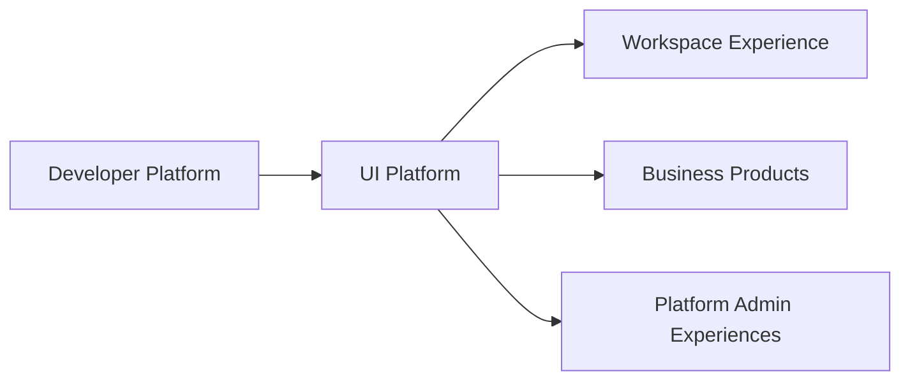

---
doc_meta:
  id: PAD-PLT-003
  title: Enterprise UI Platform
  owner: UI Platform Team
  version: 1.2.0
  status: approved
  classification: restricted
  governed_by:
    - GDC-008
    - EAD-001
    - EAD-005
  realizes_capability:
    - EAD-001
    - EAD-005
  review_cycle_days: 180
  created_date: 2026-01-01
  last_reviewed: 2026-08-23
  fulfilled_by:
    - SAD-003
---

# Enterprise UI Platform

## 1. Purpose & Scope

The UI Platform provides the reusable visual-system, accessibility, and interaction primitives used by Scnehaux Product and Platform experiences.

It owns design-system semantics and consumer-facing UI contracts. Workspace Experience owns cross-Product shell and composition. Products own Product journeys, business state, and Product-specific interaction meaning.

The Platform is build-time by default so Product availability is not coupled to a central UI runtime.

### 1.1 Outcome Contract

A Product must be able to consume a stable, accessible UI contract without inheriting Product-specific behavior, runtime authorization, or deployment topology from the UI Platform.

A complete rewrite of the component implementation, styling engine, build tooling, or package distribution mechanism must not require redefining the logical UI Platform boundary.

### 1.2 Out Of Scope

- Application Shell, Product navigation, and cross-Product composition owned by Workspace Experience
- Product-specific pages, journeys, forms, and business interaction semantics
- Organization, Tenant, Workspace, Membership, or operating-context authority
- Product business state and Product authorization
- Backend APIs, Product databases, and server-side business services
- Work Management, Notification, Search, Knowledge, or AI capability
- Runtime Product orchestration
- Product deployment topology
- Product-specific branding rules that are not promoted into the shared design-system contract

## 2. Enterprise Traceability

### 2.1 Realizes

- **EAD-001** UI Platform and Design System capability
- **EAD-005** reusable Experience & Interaction Platform capability

### 2.2 Relationships

- **Workspace Experience** consumes UI contracts to build shared shell and cross-Product composition
- **Products/Platforms** consume versioned UI packages and design contracts
- **Developer Platform** provides package, build, release, provenance, and documentation paved roads
- **Accessibility governance** constrains all shared primitives and release gates
- **Product teams** compose domain-specific components and journeys outside the Platform boundary
- Runtime calls to Identity, Organization, or Product APIs are not required by the design-system capability itself

### 2.3 Consumed By

All Scnehaux Product and Platform web experiences may consume the UI Platform, including Workspace Experience, HCM, Travel Operations, future ERP, Identity and Organization administration, Platform administration, and vertical AI Products.

Adoption remains contract-based rather than requiring all Products to share one frontend deployment.

### 2.4 Logical Topology



The UI Platform distributes stable design and interaction contracts. It does not sit in the runtime request path of every consuming Product.

## 3. Domain & Context Model

### 3.1 Bounded Context

- Design Token System
- Primitive Components
- Accessibility Foundation
- Layout Primitives
- Form and Interaction Primitives
- Focus and Keyboard Interaction
- Iconography
- Motion System
- Theme Contract
- Component State Contract
- Documentation and Examples
- Visual Regression Contract
- Compatibility and Deprecation

### 3.2 Ubiquitous Language

| Term | Meaning |
| :-- | :-- |
| Core Token | Raw design value without Product semantics |
| Semantic Token | Design intent shared across experiences |
| Component Token | Component-scoped mapping to semantic values |
| Primitive | Accessible reusable UI building block without Product business meaning |
| Pattern | Reusable composition guidance that still avoids Product business semantics |
| Theme | Governed semantic-token mapping |
| Product Component | Product-owned composition built from shared primitives |
| Compatibility Contract | Public consumer behavior guaranteed across a declared release range |
| Deprecation | Governed retirement path for a public UI contract |
| Workspace Shell | Workspace Experience-owned application shell and not UI Platform authority |

### 3.3 Domain Policies

- Accessibility is a property of shared primitives rather than an optional Product add-on
- Product business semantics are composed outside the UI Platform
- Public packages, tokens, primitives, and behavior contracts are versioned
- Consumers may not rely on undocumented internal DOM, styling, state, or package structure
- UI Platform remains build-time by default
- Workspace Experience composes UI primitives but remains a distinct Platform Product
- Shared primitives avoid Product-specific authorization, API calls, business rules, and data fetching
- Theme extension may vary presentation but may not silently redefine interaction semantics
- Breaking public behavior requires an explicit major-version migration
- Experimental primitives are not represented as stable Platform contracts until promoted

### 3.4 Lifecycle & State Semantics

The logical lifecycle for shared UI contracts is:

```text
Candidate
  -> Reviewed
  -> Stable
  -> Deprecated
  -> Retired
```

A Stable primitive or token contract is immutable in meaning within its compatible major version. Implementation may change as long as documented behavior, accessibility, and compatibility remain valid.

Deprecation must include a replacement or explicit removal rationale, migration guidance, and a bounded support window.

### 3.5 Failure & Degradation Semantics

- Failure of UI documentation or package distribution must not break already-built Product releases
- A failed or withdrawn Platform release must not mutate previously published immutable artifacts
- A Product may remain on a supported prior release while migration occurs
- Experimental or broken primitives must not be promoted into the stable channel
- Accessibility regression blocks promotion of affected stable primitives
- Product runtime outages are not UI Platform outages
- Workspace Experience failure does not change UI Platform package authority

## 4. Integration Contracts

### 4.1 Integration Provided

- Design token contracts
- Accessible primitive components
- Layout, form, focus, and interaction primitives
- Theme contract
- Icon and motion foundations
- Component state and accessibility behavior contracts
- Documentation and executable examples
- Visual regression fixtures
- Compatibility metadata
- Deprecation and migration guidance
- Release provenance

### 4.2 Integration Consumed

- Developer Platform package, build, provenance, and release capabilities
- Engineering identity and supply-chain trust
- Accessibility standards and governance

No Product business API is a UI Platform dependency.

### 4.3 Contract Principles

- Consumer contracts are framework and implementation agnostic at the PAD level
- Stable contracts are explicitly documented and testable
- Build-time consumption is the default topology
- A Product may wrap or compose primitives but may not publish Product-specific semantics back as global primitives without review
- Versioning distinguishes compatible evolution from breaking change
- Internal implementation details are not part of the consumer contract

## 5. Trust & Data Boundaries

### 5.1 Trust Boundary

UI Platform distributes code, design assets, behavior contracts, and documentation. It owns no user, Tenant, Product-resource, or business authority.

### 5.2 Identity Access

- Repository and release publication requires engineering identity and supply-chain controls
- Runtime Product authentication and authorization remain outside the Platform
- UI visibility is never authorization
- Documentation examples use non-sensitive or governed sample data
- Release provenance identifies the producing pipeline and approved source version

### 5.3 Data Classification

UI Platform contains code, design assets, examples, documentation, and release metadata.

It does not own Product PII, workforce data, financial records, travel records, Product credentials, or production business payloads.

### 5.4 Authority & Projection Rules

- Product business meaning stays with the Product even when represented visually through shared primitives
- Workspace navigation and composition stay with Workspace Experience
- Accessibility semantics of a shared primitive remain UI Platform authority
- Consumer-local wrappers are Product-owned unless promoted into the Platform through governance
- Telemetry about primitive quality or adoption is operational evidence and not Product business state

## 6. Capability NFR

### 6.1 Accessibility and Compatibility

- **100%** of Stable shared primitives must pass the Platform accessibility release gate against WCAG 2.2 AA requirements applicable to the primitive
- Compatible minor releases must preserve documented public behavior
- Breaking public contracts require a major-version migration
- Deprecated Stable contracts require migration guidance before retirement

### 6.2 Reliability and Supply Chain

- Published release artifacts are immutable and content-addressable or equivalently integrity-verifiable
- Package and documentation distribution target mature availability: **>= 99.9% monthly**
- Previously built Product releases must remain runnable during temporary Platform distribution outage
- Release provenance and integrity verification are mandatory for Stable artifacts

### 6.3 Performance and Consumer Cost

- Every Stable package or primitive family has an explicit consumer performance budget owned by downstream engineering standards
- Release gates prevent undocumented material regression against the declared budget
- Product teams can measure incremental package impact before adoption
- Shared abstractions must not require a central runtime call solely to render a primitive

### 6.4 Usability, Adoption, Audit, and Interoperability

- Stable primitives have discoverable documentation and examples
- Publication, promotion, deprecation, and retirement are traceable
- Adoption, migration effort, accessibility defects, regression rate, and support burden are Platform Product metrics
- Consumers are not required to know the internal styling or rendering implementation
- Platform support and release cadence must not require synchronized Product releases

## 7. Ownership & Governance

### 7.1 Team Ownership

UI Platform Team owns:

- Design-system semantics
- Shared design tokens
- Stable primitive behavior
- Accessibility foundations
- Documentation and examples
- Compatibility, deprecation, and release lifecycle
- Consumer support and adoption health

Workspace Experience Team owns application shell and composition. Product teams own Product experience semantics and Product components.

### 7.2 Realizing Systems

- **SAD-003** Scnehaux UI Platform

### 7.3 Governance Rules

- UI Platform SHALL NOT absorb Workspace Experience or Product journey authority
- Shared primitives SHALL NOT contain Product-specific business rules or authorization
- Accessibility requirements SHALL NOT be optional for Stable shared primitives
- Product runtime availability SHALL NOT depend on a central UI Platform service merely to render existing packaged primitives
- Breaking public UI contracts SHALL use an explicit major-version migration
- Shared components SHALL be accepted based on repeatable consumer value rather than visual similarity alone

### 7.4 Platform Product Health

Platform health includes adoption, active supported versions, accessibility conformance, compatibility incidents, migration effort, support load, documentation coverage, release lead time, and consumer performance impact.

## 8. Assumptions & Constraints

- Product teams remain free to own domain-specific components and journeys
- Workspace Experience remains a separate logical Platform
- Physical frontend frameworks, styling engines, package tooling, and build systems may change without redefining this PAD
- Shared UI investment is justified by cross-Product reuse, consistency, accessibility, and reduced consumer effort

## 9. Architectural Decisions

- UI Platform remains a build-time reusable capability by default
- Workspace Experience remains separate because shell and cross-Product composition have different authority and lifecycle
- Product-specific business interaction stays with the Product
- Physical implementation choices belong to SAD, ADR, STD, and TDD artifacts

## 10. Evolution

The UI Platform may evolve its implementation, package model, theming engine, component internals, or release tooling while preserving stable consumer contracts.

New cross-Product patterns are promoted only after repeated consumer evidence proves they belong in the shared Platform rather than one Product.

## 11. References

- EAD-001 Enterprise Capability & Domain Map
- EAD-002 Enterprise System Landscape
- EAD-005 Enterprise Platform Architecture
- EAD-006 Enterprise Security Architecture
- GDC-008 Product Architecture Document Guideline
