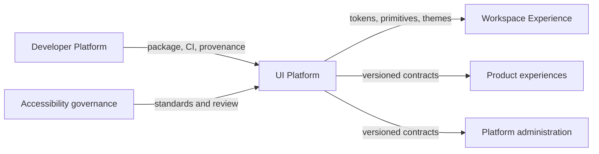
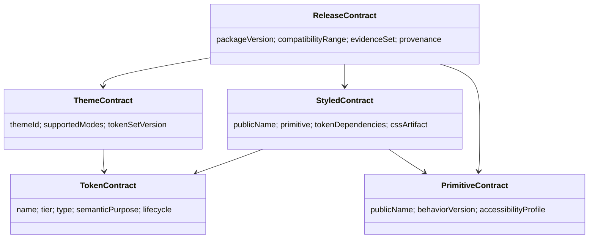

---
doc_meta:
  id: PAD-PLT-003
  title: Enterprise UI Platform
  owner: UI Platform Team
  version: 1.4.0
  status: approved
  classification: restricted
  governed_by: [GDC-008, EAD-001, EAD-005]
  realizes_capability: [EAD-001, EAD-005]
  review_cycle_days: 180
  created_date: 2026-01-01
  last_reviewed: 2026-08-23
  fulfilled_by: [SAD-003]
---

# Enterprise UI Platform

## 1. Purpose & Scope

The UI Platform supplies reusable visual semantics, accessible interaction
primitives, themes, and compatibility contracts to Scnehaux web experiences.
It reduces duplicated accessibility and design-system work without becoming a
runtime dependency or taking ownership of Product behavior.

### 1.1 Outcome contract

A Product team can adopt a versioned UI contract, verify compatibility and
consumer cost before release, and roll back without coordinating an enterprise
deployment. Replacing the framework, styling engine, or package tool does not
redefine this capability while its logical contracts remain intact.

The capability succeeds when shared primitives preserve documented semantics,
tokens express stable intent, released artifacts are immutable and traceable,
supported prior versions remain usable during migration, and UI Platform
unavailability cannot break an already-built Product release.

### 1.2 Capability boundary

UI Platform owns the token language, theme contract, Product-agnostic primitive
behavior, shared accessibility foundations, presentation contracts, release
evidence, compatibility, deprecation, and consumer guidance.

Workspace Experience owns application-shell composition. Product teams own
journeys, domain state, authorization, data fetching, and Product-specific
components. Developer Platform supplies package and provenance infrastructure.

### 1.3 Out Of Scope

- Product pages, workflows, forms, or business interaction semantics.
- Application-shell routing, global navigation, or cross-Product composition.
- Runtime authentication, authorization, entitlement, or visibility decisions.
- Product APIs, databases, business events, and operational state.
- A central rendering service or mandatory synchronized Product releases.
- Product-specific branding not promoted into the shared theme contract.
- Claiming page-level WCAG conformance on behalf of consumers.

## 2. Enterprise Traceability

### 2.1 Realizes

- **EAD-001** — shared UI Platform and Design System capability.
- **EAD-005** — reusable Experience and Interaction Platform capability.

### 2.2 Relationships


```mermaid
graph LR
  DP[Developer Platform] -->|package, CI, provenance| UIP[UI Platform]
  AG[Accessibility governance] -->|standards and review| UIP
  UIP -->|tokens, primitives, themes| WS[Workspace Experience]
  UIP -->|versioned contracts| PROD[Product experiences]
  UIP -->|versioned contracts| ADMIN[Platform administration]
```

| Related capability                    | Relationship                                                   | Boundary                                                   |
| :------------------------------------ | :------------------------------------------------------------- | :--------------------------------------------------------- |
| Developer Platform                    | Supplies build, registry, provenance, and release capabilities | Does not own UI semantics                                  |
| Workspace Experience                  | Consumes contracts for shell composition                       | Shell state and navigation remain Workspace authority      |
| Product Platforms                     | Consume and may wrap stable contracts                          | Product meaning and authorization remain Product authority |
| Accessibility governance              | Constrains primitive behavior and evidence                     | UI Platform remediates shared primitives                   |
| Engineering identity and supply chain | Authorizes source and release operations                       | No runtime end-user identity is consumed                   |

### 2.3 Consumed By

All Scnehaux Product and Platform web experiences may consume this capability,
including Workspace Experience, HCM, Travel Operations, Identity and
Organization administration, Platform administration, future ERP capabilities,
and vertical AI Products. Adoption is contract-based; consumers need not share
one frontend deployment or release cadence.

## 3. Domain & Context Model

### 3.1 Bounded Context

| Context                 | Owns                                                                               | Does not own                                  |
| :---------------------- | :--------------------------------------------------------------------------------- | :-------------------------------------------- |
| Token System            | Core values, semantic intent, component aliases, theme mappings                    | Product data or business terminology          |
| Primitive System        | DOM semantics, state, focus, keyboard, accessible-name, and composition contracts  | Product workflow decisions                    |
| Styling System          | Styled wrappers, visual states, static CSS, cascade and selector isolation         | Consumer application layout policy            |
| Theme and Motion System | Theme scoping, preference integration, portal inheritance, reduced-motion behavior | Brand approval outside the governed theme set |
| Release Contract        | Versioning, compatibility, conformance, provenance, migration, and retirement      | Registry infrastructure implementation        |

### 3.2 Ubiquitous Language

| Term                  | Meaning                                                                                         |
| :-------------------- | :---------------------------------------------------------------------------------------------- |
| Core Token            | Raw design value without Product meaning                                                        |
| Semantic Token        | Shared design intent independent of a component                                                 |
| Component Alias       | Component-scoped mapping to a semantic token, created only when reuse cannot express the intent |
| Primitive             | Accessible reusable behavior without Product business meaning                                   |
| Styled Component      | Visual composition of a primitive using governed tokens                                         |
| Theme                 | Versioned mapping of semantic intent to presentation values                                     |
| Stable Contract       | Public behavior guaranteed inside a declared compatible release range                           |
| Experimental Contract | Discoverable capability with no stable compatibility promise                                    |
| Consumer Fixture      | Independent application that installs packed artifacts and proves a scenario                    |
| Release Evidence      | Immutable record connecting source, artifact, scenario, and result                              |
| Component ACR         | Component accessibility report; not a page-level WCAG claim                                     |

### 3.3 Conceptual model


```mermaid
classDiagram
  class TokenContract { name; tier; type; semanticPurpose; lifecycle }
  class ThemeContract { themeId; supportedModes; tokenSetVersion }
  class PrimitiveContract { publicName; behaviorVersion; accessibilityProfile }
  class StyledContract { publicName; primitive; tokenDependencies; cssArtifact }
  class ReleaseContract { packageVersion; compatibilityRange; evidenceSet; provenance }
  ThemeContract --> TokenContract
  StyledContract --> PrimitiveContract
  StyledContract --> TokenContract
  ReleaseContract --> ThemeContract
  ReleaseContract --> PrimitiveContract
  ReleaseContract --> StyledContract
```

### 3.4 Domain policies and invariants

1. A shared primitive contains no Product authorization or business workflow.
2. UI visibility is never authorization.
3. A Stable contract is immutable in meaning within its compatible major
   version; implementation may change only while conformance remains true.
4. Tokens flow from core value to semantic intent to optional component alias;
   stable components do not bypass the semantic layer.
5. Accessibility behavior is part of the public contract.
6. Published artifacts are immutable; correction creates a new version.
7. Undocumented DOM, selectors, state, or paths are not compatibility promises.
8. Experimental capabilities are not represented as Stable.
9. Consumers own complete-page conformance and Product-specific semantics.
10. No central runtime call is required solely to render a released primitive.

### 3.5 Contract lifecycle

```text
Candidate -> Reviewed -> Stable -> Deprecated -> Retired
```

- **Candidate:** implementation and evidence may change without compatibility.
- **Reviewed:** required evidence is complete but release authority has not
  promoted it.
- **Stable:** versioned behavior and support commitments apply.
- **Deprecated:** remains supported for a stated window with a replacement or
  removal rationale.
- **Retired:** removed only at a compatible major boundary after that window.

## 4. Integration Contracts

### 4.1 Integration Provided

| Logical contract   | Guarantee                                                                | Evolution rule                                       |
| :----------------- | :----------------------------------------------------------------------- | :--------------------------------------------------- |
| Design tokens      | Typed semantic names and complete supported-theme mappings               | Breaking rename/removal requires major migration     |
| Primitive behavior | DOM semantics, keyboard, focus, state, and accessibility behavior        | Behavior change follows compatibility classification |
| Styled UI          | Token-bound visual states and deterministic static assets                | Internal selector shape is private unless documented |
| Theme contract     | Scoped roots, portal inheritance, and supported modes                    | Semantic change is breaking                          |
| Release contract   | Integrity-verifiable artifacts, provenance, support matrix, and evidence | Immutable after publication                          |
| Migration contract | Window, replacement, instructions, and rollback path                     | Required before Stable removal                       |

Public package identifiers, token names, behavior, accessibility outcomes, and
asset entries are versioned. Internal source layout, tool choice, and
undocumented markup are not.

### 4.2 Integration Consumed

- package storage and immutable artifact distribution from Developer Platform;
- engineering identity, protected-source, and release-signing controls;
- browser, React, framework, and assistive-technology evidence;
- enterprise accessibility, frontend security, and supply-chain standards; and
- consumer feedback and migration evidence.

No Product business API, database, or end-user identity service is a dependency.

### 4.3 Failure and degradation contract

- Distribution failure does not affect already-built consumer releases.
- A failed candidate is withheld; an existing release is never mutated.
- A consumer may pin a supported prior version while remediation proceeds.
- A failed primitive or theme remains Candidate and outside Stable exports.
- Accessibility, integrity, or compatibility failure blocks promotion.

## 5. Trust & Data Boundaries

### 5.1 Trust Boundary

Source control, producer pipeline, package storage, consuming build, and browser
are separate trust zones. Crossing a zone requires an integrity-verifiable
artifact and traceable producer identity. Consumer input remains untrusted.

### 5.2 Identity Access

- Source changes and releases require authenticated engineering identity and
  protected-branch/release controls.
- Provenance binds source revision, producing workflow, and artifact.
- UI Platform has no runtime end-user authentication or authorization role.
- Primitives do not interpret Product roles, permissions, or entitlements.
- Examples use synthetic, public, or explicitly governed data.

### 5.3 Data Classification

Owned data is source code, design values, documentation, synthetic examples,
compatibility results, adoption metrics, and release metadata. Product PII,
credentials, workforce records, financial data, and production payloads are not
accepted. Adoption telemetry excludes user content and Product payloads.

## 6. Capability NFR

Targets apply to Stable contracts; Candidate work may not be promoted while it
falls below them.

| Quality                  | Capability target                                                                                               | Evidence                                   |
| :----------------------- | :-------------------------------------------------------------------------------------------------------------- | :----------------------------------------- |
| Availability / SLA       | Package and documentation distribution >= 99.9% monthly                                                         | Distribution report                        |
| RTO                      | Restore publication capability within 4 hours                                                                   | Recovery exercise                          |
| RPO                      | Zero loss or mutation of published immutable artifacts                                                          | Integrity inventory and restore proof      |
| Accessibility            | Every Stable primitive passes applicable WCAG 2.2 behavior and APG checks; complex widgets have a Component ACR | Automated, manual AT, and ACR evidence     |
| Compatibility            | Supported minor releases preserve documented public contracts                                                   | Packed consumer matrix                     |
| Scalability / Peak Load  | Rendering requires no shared UI runtime                                                                         | Consumer architecture and distribution SLO |
| Concurrency              | Supported themes/providers and separately deployed consumers coexist without singleton-state collision          | Isolation fixtures                         |
| Interoperability         | Each release declares tested React, SSR/RSC, browser, bundler, and AT ranges                                    | Support matrix                             |
| Audit                    | Promotion, publication, deprecation, and retirement resolve to source, authority, evidence, and digest          | Release evidence                           |
| Data Privacy / Residency | No Product PII or business payload is required or collected                                                     | Data inventory and telemetry tests         |
| Usability                | Stable contracts have API documentation, examples, migration notes, and known limitations                       | Documentation gate                         |
| Cost Target              | No per-render central service cost; build/distribution cost is measured per release                             | Build report                               |

Performance budgets are scenario-specific and name the import path, baseline,
representation, runner, tool version, and threshold. No universal byte,
percentage, or multiplier rule applies.

## 7. Ownership & Governance

### 7.1 Team Ownership

| Responsibility                              | Accountable               | Consulted                                   |
| :------------------------------------------ | :------------------------ | :------------------------------------------ |
| Token and theme semantics                   | UI Platform Team          | Design and accessibility owners             |
| Primitive behavior and compatibility        | UI Platform Team          | Consumers and accessibility reviewers       |
| Package release and support                 | UI Platform Team          | Developer Platform                          |
| Registry, CI, and provenance infrastructure | Developer Platform        | UI Platform Team                            |
| Product wrappers and journeys               | Product team              | UI Platform Team when promotion is proposed |
| Application shell and composition           | Workspace Experience Team | UI Platform Team                            |

### 7.2 Realizing Systems

- **SAD-003 — Scnehaux UI Platform Software Architecture** realizes this
  capability through versioned `@scnx/core-ui` and `@scnx/system` artifacts.

### 7.3 Promotion and change authority

- PAD boundary changes require Architecture Authority review.
- Implementation decisions remain in SAD/ADR/STD/TDD artifacts.
- Stable public-contract breaks require a major version, migration plan, and
  consumer rehearsal.
- CI evidence never substitutes for human lifecycle or release authority.
- Product-local abstractions are promoted only after repeated cross-Product
  evidence demonstrates shared value.

## 8. Assumptions & Constraints

- Consumers can install immutable packages and load static assets.
- Product teams can pin supported versions and schedule migrations.
- Browser and framework ranges are declared per release.
- Page-level accessibility still requires consumer evaluation.
- Physical package topology may evolve while logical contracts remain stable.

## 9. Architectural Decisions

- UI Platform remains build-time by default and outside Product request paths.
- Workspace Experience and Product journey authority remain separate.
- Three token tiers are logical contracts and do not require three packages.
- Shared behavior, accessibility, and compatibility are governed contracts;
  rendering implementation is replaceable.
- Stable promotion requires consumer evidence, not source compilation alone.

## 10. Evolution

Frameworks, styling engines, package topology, and release tooling may evolve
behind the compatibility boundary. A token-only artifact is justified only by
an independent consumer or cadence. New shared patterns require repeated
consumer evidence; federation requires separate system-level authorization.

## 11. References

- EAD-001 — Enterprise Capability and Domain Map.
- EAD-005 — Enterprise Platform Architecture.
- EAD-006 — Enterprise Security Architecture.
- GDC-008 — Product Architecture Document Guideline.
- SAD-003 — Scnehaux UI Platform Software Architecture.
