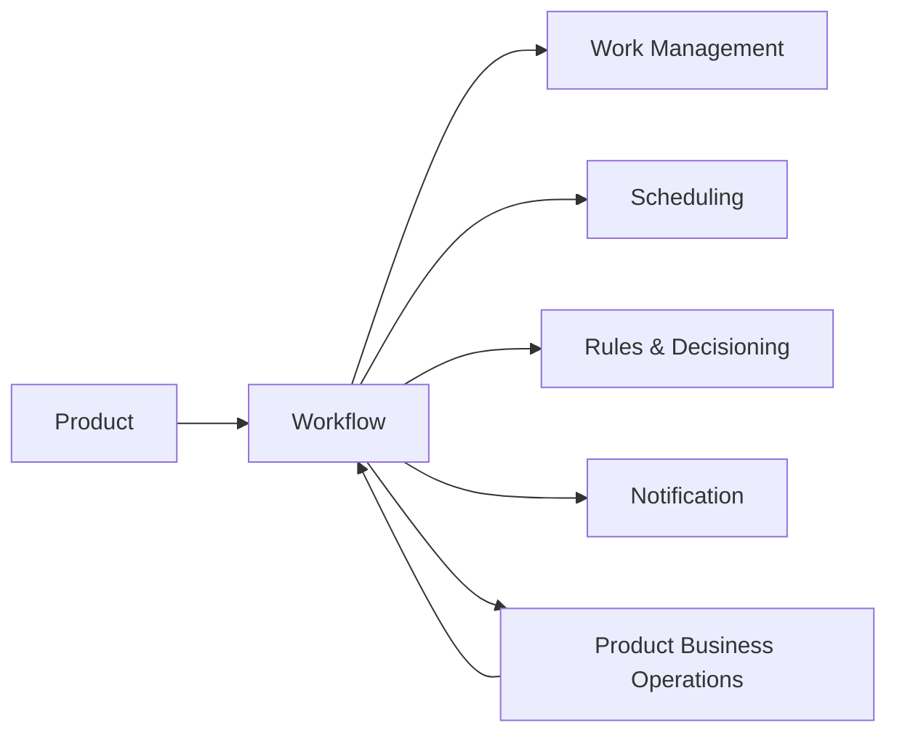

---
doc_meta:
  id: PAD-PLT-004
  title: Enterprise Workflow Platform
  owner: Workflow Team
  version: 2.2.1
  status: chartered
  classification: restricted
  governed_by:
    - GDC-008
    - EAD-001
    - EAD-005
  realizes_capability:
    - EAD-001
    - EAD-005
  review_cycle_days: 180
  created_date: 2026-01-01
  last_reviewed: 2026-08-23
  fulfilled_by:
    - SAD-006
---

# Enterprise Workflow Platform

> **Commitment: chartered.** This logical boundary is retained as a valid enterprise candidate, but no shared implementation is authorized until the approval gate in GDC-008 is satisfied.

## 1. Purpose & Scope

The Workflow Platform provides durable orchestration for long-running multi-step human and system processes whose process position must survive participant, process, or infrastructure failure.

It owns Workflow Definition and Version, Workflow Instance state, transitions, process task coordination, process-semantic deadline and timeout state, compensation coordination, escalation state, and process history.

Products own business operations, business facts, domain authorization, and final business outcomes.

### 1.1 Outcome Contract

Workflow provides durable process coordination without becoming a generic Product rule engine, Scheduler, Work Management system, Job runtime, or Product business authority.

A Product can replace the physical workflow engine without changing the logical process contract described by this PAD.

### 1.2 Out Of Scope

- Product business state, business rules, and final Product outcomes
- Generic Work Item, Case, Queue, Assignment, Claim, and review lifecycle owned by Work Management
- Generic durable future scheduling owned by Scheduling
- Technical Job, Worker, or technical Queue execution
- Notification delivery
- Product data persistence
- Identity, Organization, or Membership authority
- Rules-authoring and deterministic Rules Platform authority
- Arbitrary external-provider connectivity
- Product-specific UI journeys

## 2. Enterprise Traceability

### 2.1 Realizes

- **EAD-001** Workflow & Orchestration capability
- **EAD-005** durable reusable process-coordination Platform capability

### 2.2 Relationships

- **Products** own business commands, resource authorization, and business outcomes
- **Work Management** owns reusable human-visible work inventory, assignment, and claim
- **Scheduling** provides durable wake-ups while Workflow retains deadline, timeout, escalation, and process meaning
- **Rules & Decisioning** may evaluate deterministic branches while Workflow owns process position
- **Notification** delivers process communication
- **Identity / Organization** provide participant identity and operating context
- **Event & Messaging** enables asynchronous Product participation where selected
- **Audit & Evidence** preserves privileged and consequential process evidence
- **Artifact & Document** may provide immutable artifact references used by a Workflow

### 2.3 Consumed By

Travel Operations, HCM, future ERP, adjacent BPO Products, and Platforms may consume Workflow when a process requires durable multi-step coordination.

A one-shot future trigger uses Scheduling. A bounded technical execution uses Job semantics. A simple assignable human work record uses Work Management without requiring Workflow.

### 2.4 Logical Topology



Workflow coordinates but does not become the authoritative Product system behind the steps it invokes.

## 3. Domain & Context Model

### 3.1 Bounded Context

- Workflow Definition
- Workflow Definition Version
- Workflow Execution
- Workflow Instance State
- Task Coordination
- Human Task Coordination
- System Task Coordination
- Transition
- Deadline and Timeout Semantics
- Escalation
- Compensation
- Correlation
- Workflow History
- Workflow Operations and Recovery

### 3.2 Ubiquitous Language

| Term | Meaning |
| :-- | :-- |
| Workflow Definition | Versioned process model describing allowed coordination states and transitions |
| Workflow Version | Immutable published realization of a Workflow Definition |
| Workflow Instance | Durable execution of one published Workflow Version |
| Task | Process step whose effect may be performed by a human, Product, Platform, or bounded technical handler |
| Human Task | Workflow step requiring human action and potentially represented as a Work Management Work Item |
| Work Item | Work Management-owned actionable work record and not Workflow authority |
| Transition | Workflow-owned movement between process states |
| Deadline | Process-semantic temporal constraint |
| Wake-Up | Scheduling-owned due occurrence with no process meaning by itself |
| Compensation | Workflow-coordinated reaction to prior completed effects when the process requires recovery |
| Correlation | Stable relationship between Workflow state and external Product or Platform interactions |

### 3.3 Domain Policies

- Product owns business state and final outcome
- Workflow owns process position, transition, and coordination state only
- Published Workflow Versions are immutable
- Running Workflow state survives runtime restart and participant failure according to the declared reliability profile
- Human Tasks may create or reference Work Management Work Items rather than duplicating generic queue, assignment, and claim semantics
- Scheduling owns generic durable temporal realization
- Rules Platform may evaluate branches but does not own Workflow transitions
- Product business retries and compensation are explicit and not confused with transport redelivery
- A simple technical Job does not become a Workflow unless durable process position or multi-step coordination exists
- A Workflow cannot bypass Product authorization when invoking a protected Product action
- Process state does not replace authoritative Product state

### 3.4 Lifecycle & State Semantics

A published Workflow Version is immutable. New behavior creates a new version.

A Workflow Instance has a logical lifecycle such as:

```text
Created
  -> Running
  -> Waiting
  -> Running
  -> Completed

Alternative terminal paths:
Cancelled
Failed
Compensated
```

Specific Products may define richer process semantics, but Workflow must always distinguish active, waiting, terminal-success, terminal-cancel, and terminal-failure states.

Human Task lifecycle may be represented through Work Management while the Workflow Instance holds only the process-semantic reference and completion expectation.

### 3.5 Failure & Degradation Semantics

- Product operation outage leaves the Workflow Instance in an explicit waiting or recoverable failure state
- Scheduling outage may delay a deadline wake-up but does not erase Workflow deadline semantics
- Work Management outage may delay human-task publication or completion sync but must not create duplicate process authority
- Notification outage delays communication but must not advance or roll back the Workflow unless the Product explicitly models delivery as a required process condition
- Duplicate task completion or asynchronous events must be idempotent against stable correlation
- Unknown external side-effect outcome must be reconciled before blind replay when duplicate effect would be harmful
- Workflow control-plane degradation must not corrupt already committed Workflow Instance state
- Cancellation cannot claim to undo Product effects that have already committed

## 4. Integration Contracts

### 4.1 Integration Provided

- Workflow Definition and Version lifecycle
- Workflow Instance lifecycle
- Start, signal, suspend, resume, cancel, and query semantics
- Task coordination
- Human Task reference coordination
- Deadline, timeout, and escalation semantics
- Compensation coordination
- Correlation and process history
- Workflow lifecycle events
- Recovery and operational reconciliation

### 4.2 Integration Consumed

- Product business-operation contracts
- Work Management
- Scheduling
- Rules & Decisioning
- Notification
- Identity & Organization
- Event & Messaging
- Audit & Evidence
- Artifact & Document where immutable artifacts participate

### 4.3 Contract Principles

- Workflow contracts use stable Product and Platform identifiers rather than cross-database joins
- Product commands invoked by Workflow are independently authorized by the Product
- Asynchronous signals carry stable Workflow Instance and correlation identity
- Duplicate signals and task completions are tolerated
- Workflow version is explicit for a running instance
- Process history is append-oriented and does not rewrite Product history
- Workflow may reference Work Item or Schedule identifiers without owning their lifecycles

## 5. Trust & Data Boundaries

### 5.1 Trust Boundary

Workflow is authoritative for Workflow Definition, Version, Instance, transition, process-task coordination, compensation, and process deadline semantics.

It is not authoritative for Product records, generic Work Item lifecycle, Schedule occurrences, Notification delivery, or Rules definitions.

### 5.2 Identity Access

- Human and workload commands require enterprise identity and operating context
- Workflow administrative operations require explicit privileged scope
- Product business operations re-authorize inside the Product
- Human Task completion requires the authority required by the owning Product and Work Management contracts
- Cross-Tenant process administration is separately authorized and evidenced
- Workflow may carry delegated correlation but cannot mint Product business authority

### 5.3 Data Classification

Workflow stores:

- Workflow definitions and versions
- Workflow Instance state
- Task and transition metadata
- Work Item and Schedule references
- Compensation and deadline state
- Correlation identifiers
- Bounded input/output snapshots when explicitly required
- Process history and evidence references

Product aggregates and unbounded Product payloads remain outside Workflow persistence.

### 5.4 Authority & Projection Rules

- Product state is referenced, not re-owned
- Work Item state is Work Management authority
- Schedule and Occurrence state is Scheduling authority
- Workflow history is authoritative only for process coordination
- Product-facing projections may combine multiple authorities but must preserve provenance
- A Workflow task status must not be interpreted as Product business completion unless the Product contract explicitly confirms it

## 6. Capability NFR

### 6.1 Availability, RTO, and RPO

- Reliability class: **C1 Mission-Critical Operations**
- Mature Workflow control availability target: **>= 99.95% monthly**
- Target RTO: **<= 1 hour**
- Target RPO: **<= 15 minutes**
- Committed Workflow state and published definitions must not be silently lost

### 6.2 Performance, Scalability, and Concurrency

- Workflow control commands target **P95 <= 300 ms** excluding Product operation execution and intentionally waiting tasks
- Capacity certification demonstrates at least **10x forecast peak Workflow transition rate** without violating the control-path SLO
- Tenant, Product, and workflow-class quotas or bulkheads prevent one workload from exhausting shared coordination capacity
- Expensive history/query operations must not starve active transition processing
- Concurrent signals against one Workflow Instance use deterministic conflict or stale-write protection

### 6.3 Durability and Recovery

- Running Workflow Instance state survives process restart
- Duplicate event delivery cannot create duplicate logical transitions
- Recovery after outage resumes from durable state
- Long-running processes may survive independent Product deployments and release changes through versioned contracts
- Process history remains attributable across retries and compensation

### 6.4 Audit, Privacy, Interoperability, and Cost

- Definition publication, instance start, transition, Human Task completion, deadline, escalation, compensation, cancellation, override, and terminal outcome are traceable
- Sensitive Product data is minimized in Workflow state
- Product contracts remain versioned and persistence-independent
- Cost is attributable by active Workflow Instance, transition volume, Tenant, Product, and major workflow class where meaningful

## 7. Ownership & Governance

### 7.1 Team Ownership

Workflow Team owns:

- Workflow Definition and Version semantics
- Durable Workflow Instance state
- Transition and process-task coordination
- Deadline, escalation, and compensation semantics
- Workflow reliability and recovery
- Workflow contract evolution and support

Work Management owns generic work lifecycle. Scheduling owns generic temporal triggers. Rules owns deterministic Rule lifecycle. Products own business effects and outcomes.

### 7.2 Realizing Systems

- **SAD-006** Enterprise Workflow Platform

### 7.3 Governance Rules

- Workflow SHALL NOT become a generic Scheduler
- Workflow SHALL NOT become a central Product business-rule engine
- Workflow SHALL NOT duplicate generic Work Management solely for UI convenience
- Product business logic SHALL NOT be hidden inside Platform workflow handlers
- Workflow SHALL NOT bypass Product authorization
- Long-running process state SHALL be explicit rather than encoded as chains of background Jobs
- Simple one-step work SHALL NOT require Workflow merely for consistency

### 7.4 Platform Product Health

Platform health includes active Workflow Instances, transition reliability, recovery incidents, consumer adoption, integration effort, support load, long-running instance age, duplicate-signal handling, and cost per workflow class.

## 8. Assumptions & Constraints

- Products expose stable business-operation contracts when Workflow coordination is required
- Work Management and Scheduling remain independent capabilities
- Physical Workflow engine, persistence, messaging, and deployment choices belong downstream
- Consumers may use local orchestration when durable shared Workflow semantics are not justified

## 9. Architectural Decisions

- Workflow owns durable process coordination but not Product outcome
- Human work lifecycle is delegated to Work Management when shared work semantics are required
- Generic durable time is delegated to Scheduling
- Bounded technical execution remains Job semantics rather than implicit Workflow
- Physical realization belongs to SAD and downstream decisions

## 10. Evolution

Workflow may physically split definition management, execution, history, or operational experiences as scale and failure-containment evidence justify it.

Logical Workflow Version, Instance, Transition, Task coordination, Deadline, and Compensation contracts remain stable across such physical changes.

## 11. References

- EAD-001 Enterprise Capability & Domain Map
- EAD-002 Enterprise System Landscape
- EAD-004 Enterprise Integration Architecture
- EAD-005 Enterprise Platform Architecture
- EAD-006 Enterprise Security Architecture
- GDC-008 Product Architecture Document Guideline
- ADR-GLB-013 Work, Workflow, Job, and Schedule Boundaries
- STD-GLB-010 Enterprise Durable Scheduled Work Standard
- STD-GLB-011 Enterprise Background Job Execution Standard
