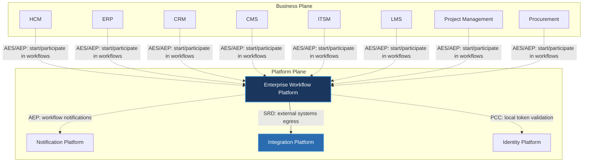

---
doc_meta:
  id: PAD-PLT-004
  title: Enterprise Workflow Platform
  owner: Workflow Team
  version: 1.0.0
  status: approved
  classification: restricted
  governed_by:
    - GDC-008
  realizes_capability:
    - EAD-001
    - EAD-005
  review_cycle_days: 180
  created_date: 2026-01-01
  last_reviewed: 2026-07-06
  fulfilled_by:
    - SAD-006
---

# Enterprise Workflow Platform

---

## 1. Purpose & Scope

The Workflow Platform provides a centralized workflow orchestration capability that enables business domains to model, execute, monitor, and govern long-running business processes without embedding orchestration logic inside individual applications.

The platform separates business orchestration from business implementation, ensuring every domain remains independently deployable while participating in enterprise-wide business processes.

### 1.1. Out of Scope

- Business-specific workflows.
- Approval rules owned by business domains.
- Domain business logic.
- User interface implementation.
- Notification delivery.
- Data persistence for business entities.
- Authentication and authorization.

---

## 2. Enterprise Traceability

The Workflow Platform realizes the enterprise orchestration capability defined within the Enterprise Platform Architecture.

### 2.1. Realizes

- EAD-001 Enterprise Capability & Domain Map — the workflow orchestration capability (modelling, execution, and governance of long-running business processes).
- EAD-005 Enterprise Platform Architecture — the substrate it operates on.

### 2.2. Relationships

- **Synchronous Dependencies (SRD):** Integration Platform — communication with external systems is mediated through the Integration ACL (external systems egress).
- **Publishes Events (AEP):** workflow notification events and workflow lifecycle events (e.g. task assignment, escalation, process completion) to the Event Broker.
- **Subscribes To Events (AES):** business events published by business domains that trigger or advance workflows.
- **Consumes Platform Capabilities (PCC):** Identity Platform — participant and task-ownership tokens issued by Identity are validated **locally**, so consumption is not a runtime dependency on Identity.

### 2.3. Consumed By

Business Products consume the Workflow Platform for asynchronous orchestration: they start and participate in workflows by publishing and subscribing to business events (AES/AEP), rather than depending on Workflow at runtime. The Notification Platform subscribes to Workflow's published events to deliver workflow communications.

---

## 3. Domain & Context Model

The Workflow Platform is decomposed into several independent bounded contexts.

### 3.1. Bounded Context

- Workflow Definition
- Workflow Execution
- Task Orchestration
- State Management
- Process Scheduling
- Human Task Coordination
- Workflow Monitoring
- Workflow Governance

### 3.2. Ubiquitous Language

| Term              | Description                                                                  |
| ----------------- | ---------------------------------------------------------------------------- |
| Workflow          | A running orchestration instance — a live execution of a process definition. |
| Process           | The business-flow definition that a workflow instance executes.              |
| Task              | Atomic unit of work.                                                         |
| Human Task        | Task requiring manual user interaction.                                      |
| Automated Task    | Task executed by systems.                                                    |
| Workflow Instance | Runtime execution of a workflow definition.                                  |
| State             | Current execution position.                                                  |
| Transition        | Movement between workflow states.                                            |
| Trigger           | Event initiating workflow execution.                                         |
| Decision          | Conditional branching within a workflow.                                     |
| Compensation      | Recovery process after workflow failure.                                     |
| Timeout           | Maximum execution duration for a task.                                       |
| Escalation        | Automatic handling of overdue tasks.                                         |
| SLA               | Expected completion objective of a workflow.                                 |

### 3.3. Domain Policies

- Business domains own business rules.
- Workflow Platform owns orchestration only.
- Every workflow must be versioned.
- Workflow definitions are immutable after publication.
- Workflow execution must be resumable.
- Long-running workflows must support compensation.
- Every workflow instance must be auditable.
- Workflow orchestration must remain stateless from business data ownership.

---

## 4. Integration Contracts

### 4.1. Integration Provided

The Workflow Platform provides:

- Workflow Definition Management
- Workflow Execution
- Human Task Management
- Automated Task Orchestration
- State Management
- Workflow Scheduling
- Workflow Monitoring
- Workflow Versioning
- Workflow Audit
- Process Lifecycle Management
- SLA Monitoring
- Escalation Management

### 4.2. Integration Consumed

The Workflow Platform consumes:

- Identity Platform for task ownership and participant identity.
- Notification Platform for workflow notifications.
- Integration Platform for communication with external systems.

Business services remain responsible for executing business operations.

---

## 5. Trust & Data Boundaries

### 5.1. Trust Boundary

The Workflow Platform orchestrates enterprise processes but never owns business data.

Business domains retain ownership of every business entity participating in a workflow.

### 5.2. Identity Access

Workflow execution operates under enterprise identity.

Authorization for business actions remains the responsibility of each participating business domain.

Human task assignments inherit enterprise identity provided by the Identity Platform.

### 5.3. Data Classification

The platform stores only orchestration metadata.

Classification includes:

- Workflow Definitions
- Workflow State
- Task Assignments
- Process Metadata
- Execution History
- Audit Metadata

Business records remain outside the workflow boundary.

---

## 6. Capability NFR

### 6.1. Reliability & Availability

- Long-running workflows must survive infrastructure failures.
- Workflow execution must support resumability.
- Workflow state must remain consistent throughout execution.

### 6.2. Performance & Scalability

- Horizontally scalable orchestration engine.
- Support enterprise-scale concurrent workflow execution.
- Efficient scheduling of long-running processes.

### 6.3. Security & Compliance

- Enterprise identity integration.
- Complete workflow auditability.
- Tenant isolation.
- Workflow integrity protection.

### 6.4. Auditability

Every workflow lifecycle event shall be traceable, including:

- Workflow publication
- Workflow version changes
- Workflow execution
- Task assignment
- Task completion
- Escalation
- Timeout
- Compensation
- Cancellation
- Process completion

---

## 7. Ownership & Governance

### 7.1. Team Ownership

The Workflow Platform Team owns workflow orchestration capabilities.

Business domains remain responsible for workflow business rules and task implementation.

The Architecture Authority governs enterprise orchestration standards.

### 7.2. Realizing Systems

- SAD-006 Enterprise Workflow Platform

### 7.3. Governance Rules

- Workflow definitions are enterprise assets.
- Business logic shall never reside inside workflow orchestration.
- Workflow contracts must remain backward compatible.
- Business domains own business rules; the platform owns orchestration.
- Every workflow must be version-controlled.
- Breaking workflow contracts require Architecture Authority approval.
