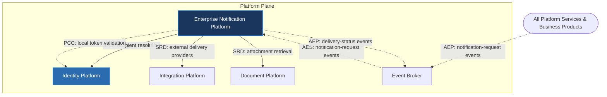

---
doc_meta:
  id: PAD-PLT-005
  title: Enterprise Notification Platform
  owner: Notification Team
  version: 1.0.0
  status: approved
  classification: restricted
  governed_by:
    - GDC-008
  realizes_capability:
    - EAD-001
    - EAD-005
  review_cycle_days: 180
  created_date: 2026-01-01
  last_reviewed: 2026-07-06
  fulfilled_by:
    - SAD-005
---

# Enterprise Notification Platform

---

## 1. Purpose & Scope

The Notification Platform provides a centralized communication capability for the entire enterprise. It is responsible for receiving notification requests, selecting appropriate delivery channels, managing templates, scheduling deliveries, handling retries, and tracking delivery status.

Business domains remain responsible for determining **when** a notification should occur, while the Notification Platform governs **how** notifications are delivered.

### 1.1. Out of Scope

- Business event generation.
- Business workflow orchestration.
- Authentication and authorization.
- User interface rendering.
- Business data ownership.
- Customer relationship management.
- Marketing campaign management.
- Business approval processes.

---

## 2. Enterprise Traceability

The Notification Platform realizes the enterprise communication and delivery capability: business domains publish notification-request events and the platform governs how they are delivered.

### 2.1. Realizes

- EAD-001 Enterprise Capability & Domain Map — the notification / communication-delivery capability.
- EAD-005 Enterprise Platform Architecture — the substrate it operates on.

### 2.2. Relationships

- **Synchronous Dependencies (SRD):** Identity Platform (recipient resolution), Integration Platform (external delivery providers), Document Platform (attachment retrieval).
- **Publishes Events (AEP):** delivery-status events (e.g. `NotificationDelivered`, `DeliveryFailed`) to the Event Broker.
- **Subscribes To Events (AES):** notification-request events published by all domains via the Event Broker.
- **Consumes Platform Capabilities (PCC):** Identity-issued tokens are validated **locally** (cached, per the EAD-006 §8 degradation contract), so token validation is not a runtime dependency on Identity.

### 2.3. Consumed By

Every Platform Service and Business Product requests delivery by **publishing** notification-request events to the Event Broker, which the Notification Platform subscribes to (Asynchronous Event Subscription on Notification's side). Requesters do not call the Notification Platform synchronously, so consumption is not a runtime dependency on Notification.

---

## 3. Domain & Context Model

The Notification Platform is decomposed into several independent bounded contexts responsible for enterprise communication.

### 3.1. Bounded Context

- Notification Request
- Delivery Management
- Channel Management
- Template Management
- Preference Management
- Scheduling
- Retry Management
- Delivery Tracking
- Notification Governance

### 3.2. Ubiquitous Language

| Term                   | Description                                                                    |
| ---------------------- | ------------------------------------------------------------------------------ |
| Notification           | Enterprise communication request.                                              |
| Delivery               | Transmission of a notification through a specific channel.                     |
| Channel                | Communication medium such as Email, SMS, Push, Webhook, or Messaging Platform. |
| Recipient              | Target identity receiving a notification.                                      |
| Template               | Reusable notification content definition.                                      |
| Preference             | Recipient communication preferences.                                           |
| Delivery Status        | Current state of a notification delivery.                                      |
| Retry Policy           | Strategy governing failed deliveries.                                          |
| Notification Policy    | Enterprise rules controlling communication behavior.                           |
| Scheduled Notification | Notification delivered at a future time.                                       |

### 3.3. Domain Policies

- Business domains own notification intent.
- The Notification Platform owns delivery.
- Every notification must support delivery tracking.
- Notification templates are centrally governed.
- Delivery channels are implementation-independent.
- Retry policies are platform managed.
- Notification history is immutable.
- User communication preferences must always be respected.

---

## 4. Integration Contracts

### 4.1. Integration Provided

The Notification Platform provides:

- Notification Delivery
- Email Delivery
- SMS Delivery
- Push Notification Delivery
- Webhook Delivery
- Template Management
- Recipient Preference Management
- Delivery Scheduling
- Retry Management
- Delivery Tracking
- Notification Events

### 4.2. Integration Consumed

The Notification Platform consumes:

- Identity Platform for recipient identity resolution.
- Integration Platform for external communication providers.
- Document Platform for document attachment retrieval.

Delivery protocols and external provider integrations are defined by the realizing SAD.

---

## 5. Trust & Data Boundaries

### 5.1. Trust Boundary

The Notification Platform governs enterprise communication delivery but never owns business data.

Business domains remain authoritative for notification content and business events.

### 5.2. Identity Access

Identity verification is delegated to the Identity Platform.

The Notification Platform governs:

- Recipient resolution
- Communication preferences
- Delivery authorization
- Notification policies

### 5.3. Data Classification

The platform manages communication metadata including:

- Notification Metadata
- Delivery Metadata
- Recipient Preferences
- Delivery History
- Templates
- Scheduling Information
- Retry Metadata

The platform does not own:

- Business Transactions
- HR Records
- Financial Records
- Customer Business Data
- Product-specific business entities

---

## 6. Capability NFR

### 6.1. Reliability & Availability

- Enterprise-grade notification delivery.
- Delivery failures remain isolated.
- Guaranteed retry according to platform policies.

### 6.2. Performance & Scalability

- Horizontally scalable delivery services.
- High-volume concurrent notification processing.
- Efficient multi-channel communication.

### 6.3. Security & Compliance

- Secure communication channels.
- Privacy-aware recipient handling.
- Enterprise communication governance.
- Regulatory communication compliance.

### 6.4. Auditability

Every notification lifecycle event shall be traceable, including:

- Notification request
- Template resolution
- Channel selection
- Delivery scheduling
- Delivery execution
- Delivery completion
- Delivery failure
- Retry execution
- Notification cancellation

---

## 7. Ownership & Governance

### 7.1. Team Ownership

The Notification Platform Team owns platform communication capabilities and delivery governance.

The Architecture Authority governs enterprise communication standards and platform evolution.

### 7.2. Realizing Systems

- SAD-005 Enterprise Notification Platform

### 7.3. Governance Rules

- Business domains shall never implement notification delivery directly.
- All enterprise communication shall pass through the Notification Platform.
- Notification templates are centrally governed.
- Communication channels remain implementation-independent.
- Breaking notification contracts require Architecture Authority approval.
