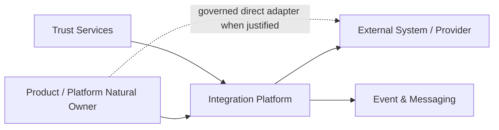

---
doc_meta:
  id: PAD-PLT-006
  title: Enterprise Integration Platform
  owner: Integration Team
  version: 2.1.1
  status: chartered
  classification: restricted
  governed_by:
    - GDC-008
  realizes_capability:
    - EAD-001
    - EAD-004
    - EAD-005
  review_cycle_days: 180
  created_date: 2026-01-01
  last_reviewed: 2026-08-23
  fulfilled_by:
    - SAD-007
---

# Enterprise Integration Platform

> **Commitment: chartered.** This logical boundary is retained as a valid enterprise candidate, but no shared implementation is authorized until the approval gate in GDC-008 is satisfied.

## 1. Purpose & Scope

The Enterprise Integration Platform provides reusable connectivity machinery for internal, client, partner, industry, and external-system relationships when shared protocol handling, connector lifecycle, transformation, routing, reconciliation, policy, observability, or contract governance creates measurable cross-Product value.

It is an enablement capability and not a universal network gateway.

The Product or Platform that naturally owns an external business relationship remains accountable for integration meaning, external authority, business commands, business validation, and failure decisions. That owner may consume shared Integration machinery or implement a governed local adapter when shared mediation adds no net value.

### 1.1 Outcome Contract

Integration must reduce duplicated connectivity complexity without creating a central dependency for relationships whose meaning and lifecycle belong naturally inside one Product.

Provider, protocol, or transport replacement must not leak into Product core models when a governed Integration contract is used.

### 1.2 Out Of Scope

- Product business process orchestration
- Product business validation, decision, and rule authority
- Authentication or identity authority
- Notification delivery semantics and communication-provider routing owned by Notification
- Workflow execution
- Event & Messaging broker authority
- Product or external system-of-record authority
- Mandatory mediation of every external network relationship
- User interface composition
- Analytics or reporting authority
- Secrets and credential custody
- Product-specific adapter logic that has no reusable integration value

## 2. Enterprise Traceability

### 2.1 Realizes

- **EAD-001** Integration Enablement capability
- **EAD-004** contract-first integration and explicit external-authority model
- **EAD-005** reusable runtime and connectivity Platform posture

### 2.2 Relationships

- **Products/Platforms** consume reusable connector, protocol, transformation, and reconciliation capabilities while retaining domain relationship authority
- **Event & Messaging** provides asynchronous transport substrate where selected
- **Identity / Application Trust** provides authenticated service and workload trust
- **Trust Services** owns raw external credentials and secret material
- **Audit & Evidence** receives privileged connector, contract, replay, and policy evidence
- **Observability** provides shared telemetry capability
- **External Systems** remain declared authorities for facts they own
- **Notification** naturally owns communication-provider delivery adapters unless a separate reusable connector capability is justified

### 2.3 Consumed By

Products and Platforms consume Integration when a connector, protocol, transformation, reconciliation, or policy capability:

- Has multiple consumers
- Has an independent lifecycle
- Requires shared isolation, compliance, or provider governance
- Reduces duplicated provider/protocol complexity
- Produces lower total-system complexity than local ownership

A governed direct adapter remains valid when the relationship is domain-specific and shared Integration would add coupling without reusable value.

### 2.4 Logical Topology



The direct path and shared Integration path are both valid governed topologies. Architecture selection depends on ownership, reuse, risk, lifecycle, and economics.

## 3. Domain & Context Model

### 3.1 Bounded Context

- Connector Registry
- Connector Lifecycle
- External Connectivity
- Protocol Adaptation
- Representation Transformation
- Technical Routing
- Integration Contract Registry
- Integration Policy
- Delivery and Attempt Correlation
- External Outcome Normalization
- Reconciliation and Replay
- Integration Health and Operations

### 3.2 Ubiquitous Language

| Term | Meaning |
| :-- | :-- |
| Integration Contract | Versioned agreement between an owning domain and another system or provider |
| Natural Owner | Product or Platform accountable for business meaning and the external relationship |
| Connector | Reusable technical adapter to a protocol, provider, or system |
| Provider | External or internal system exposing an integration capability |
| Consumer | Domain consuming a governed Integration contract |
| Transformation | Mapping between representations without changing business authority |
| Routing | Technical determination of a governed message or command destination |
| Anti-Corruption Boundary | Boundary preventing provider or vendor models from leaking into domain models |
| Direct Adapter | Governed adapter implemented by the Natural Owner when shared Integration is not justified |
| Delivery Attempt | One technical interaction attempt with a provider or system |
| Reconciliation | Process of resolving uncertain, delayed, or divergent integration outcome against declared authorities |

### 3.3 Domain Policies

- Every cross-domain or external integration is contract-first
- External authority remains explicit
- Natural Owner retains business meaning and irreversible Product decision authority
- Shared Integration is selected by reuse, risk, lifecycle, and economics rather than mandatory topology
- Vendor and provider models terminate at an anti-corruption boundary
- Transformation cannot silently become business-rule authority
- Synchronous coupling is minimized where asynchronous or reconciliation semantics fit the business contract
- One provider or connector failure is isolated from unrelated integrations
- Event & Messaging authority remains separate from Integration domain authority
- Unknown external outcomes are reconciled before blind replay when duplicate effects are harmful
- A connector can be reused without transferring ownership of the external business relationship

### 3.4 Lifecycle & State Semantics

A shared Connector follows a logical lifecycle:

```text
Candidate
  -> Validated
  -> Active
  -> Degraded
  -> Suspended
  -> Retired
```

Contract versions and provider capabilities are independently versioned from Connector lifecycle.

An integration interaction distinguishes:

```text
Accepted by Integration
Sent / Attempted
Provider Accepted
Provider Rejected
Unknown Outcome
Reconciled
```

Provider acceptance is not automatically Product business completion.

### 3.5 Failure & Degradation Semantics

- Provider outage is isolated to the affected provider, connector, and declared consumers
- Integration outage must not fabricate external acceptance
- Unknown outcome enters explicit reconciliation rather than blind duplicate replay
- Transformation failure is terminal for that attempt until corrected or explicitly retried
- Credential failure is not blindly retried
- Event & Messaging outage may delay asynchronous delivery but must not erase accepted Integration state where durable acceptance is declared
- Natural Owner decides Product business fallback, compensation, or manual handling
- Direct adapters remain subject to the same authority, observability, security, and outcome-semantics rules
- Reconciliation never overwrites Product or external authority without an explicit owning-domain acceptance path

## 4. Integration Contracts

### 4.1 Integration Provided

- Connector registration and lifecycle
- External connectivity adapter
- Protocol adaptation
- Representation transformation
- Governed routing
- Integration Contract registry
- Integration policy enforcement
- Delivery and attempt correlation
- External outcome normalization
- Connector health and capability discovery
- Reconciliation and replay
- Provider rate-limit and quota signals where applicable
- Integration lifecycle events

### 4.2 Integration Consumed

- Event & Messaging for asynchronous integration
- Identity and Application Trust for service and workload trust
- Trust Services for connector credentials
- Audit & Evidence for privileged actions
- Observability for integration health
- Product or Platform contracts from the Natural Owner
- External provider or system contracts

### 4.3 Contract Principles

- Business-facing contracts expose domain semantics rather than provider SDK models
- External acceptance and Product completion remain distinguishable
- Idempotency and correlation identities are stable across technical retries
- Contract versions include compatibility and deprecation semantics
- Integration state references Product and external identifiers without becoming either authority
- Direct database access across Product boundaries is prohibited
- Shared connector replacement must not require Product core-model changes

## 5. Trust & Data Boundaries

### 5.1 Trust Boundary

Integration is authoritative for shared Connector lifecycle, technical routing and transformation configuration, integration attempts, reconciliation state, and connector health within its capability.

It is not authoritative for the business data exchanged, the external source-of-record fact, or Product business outcome.

### 5.2 Identity Access

- Connector and administration commands require authenticated human or workload identity and appropriate scope
- External credentials are supplied through Trust Services
- Service-to-service trust is locally validated according to enterprise policy
- Cross-Tenant or provider administration requires separate privileged authority and evidence
- A caller cannot override Natural Owner, Tenant, or application ownership through payload fields
- Direct adapters remain bound to the same trust and security standards

### 5.3 Data Classification

Integration may transiently process classified business payloads required for translation and routing.

Persisted Integration state is limited to:

- Connector and contract configuration
- Provider references
- Bounded correlation data
- Delivery attempt and normalized outcome metadata
- Reconciliation state
- Operational evidence and health metadata

Authoritative business persistence remains with the Natural Owner or declared external authority.

### 5.4 Authority & Projection Rules

- Provider copies and Integration caches are never business authority
- Reconciliation compares declared authorities and records divergence
- Transformation changes representation but not ownership
- Integration telemetry may summarize payload class and outcome but must minimize sensitive content
- Retained payload snapshots require explicit contractual justification, classification, and retention policy

## 6. Capability NFR

### 6.1 Availability, RTO, and RPO

- Shared connectors supporting C1 journeys target **>= 99.95% monthly** Integration capability availability
- Connector profiles supporting lower-criticality journeys may declare C2 or C3 targets
- C1 control-state target RTO: **<= 1 hour**
- C1 control-state target RPO: **<= 15 minutes**
- External-provider availability remains a separate dependency and is not misrepresented as Integration availability

### 6.2 Performance, Scalability, and Isolation

- Connector profiles declare provider-specific latency, timeout, throughput, and rate-limit budgets
- Shared Integration overhead must be measured separately from external-provider latency
- Capacity certification targets at least **10x forecast peak interaction rate** for each C1 shared connector class
- Per-provider, Tenant, application, and connector bulkheads prevent one integration from exhausting unrelated capacity
- Reconciliation and replay workloads must not starve active delivery paths

### 6.3 Security, Privacy, and Compliance

- Zero Trust authentication and authorization at Integration boundaries
- Raw credentials remain in Trust Services
- Payload logs and telemetry are redacted according to classification
- Provider-specific data egress and residency constraints are explicit
- Contract publication, Connector creation/change, credential-reference change, replay, reconciliation, and privileged routing changes are traceable

### 6.4 Interoperability and Cost

- Product contracts remain independent of provider SDK and transport-specific models
- Shared connector replacement preserves Product-domain contracts
- Cost is attributable by Connector, provider, Tenant, application, and major interaction class
- Platform adoption is measured against duplicated integration effort and support burden it removes

## 7. Ownership & Governance

### 7.1 Team Ownership

Integration Team owns:

- Shared Connector and Integration Contract lifecycle
- Protocol adaptation and transformation machinery
- Technical routing
- Reconciliation and replay capability
- Shared integration reliability and operations
- Provider capability normalization within the Integration boundary

Natural Product and Platform owners retain business integration meaning, external authority interpretation, business fallback, and Product outcome decisions.

### 7.2 Realizing Systems

- **SAD-007** Enterprise Integration Platform

### 7.3 Governance Rules

- Shared Integration SHALL NOT become a universal gateway
- A Direct Adapter is permitted within the Natural Owner boundary under enterprise contract, security, and observability standards
- External and vendor models SHALL NOT leak into Product core models
- Integration SHALL NOT own Product business state
- Event & Messaging broker authority SHALL NOT be duplicated inside Integration
- Notification naturally owns communication-provider delivery adapters unless shared Integration value is explicitly demonstrated
- Unknown external outcome SHALL NOT be represented as success without reconciliation or authoritative confirmation

### 7.4 Platform Product Health

Platform health includes shared Connector adoption, duplicated connector retirement, integration incident rate, provider isolation effectiveness, reconciliation backlog, change lead time, consumer support load, and cost by provider/consumer.

## 8. Assumptions & Constraints

- Client, industry, partner, and external systems of record remain present
- Different Products may require different integration topologies based on ownership, protocol reuse, risk, and scale
- Shared connectivity is justified only when it reduces total-system complexity
- Provider contracts may differ in idempotency, acknowledgement, callback, and reconciliation capabilities

## 9. Architectural Decisions

- Shared Integration is optional reusable machinery rather than a universal hop
- Natural Owner retains business meaning and external relationship authority
- Event & Messaging remains a separate Engineering & Runtime capability
- Provider-specific physical implementation belongs in SAD and downstream decisions

## 10. Evolution

Connectors with repeated consumers and an independent operational lifecycle can move from Product-local adapters into Integration without changing Product business authority.

One-off domain-specific relationships may remain local indefinitely when centralization would increase coupling.

Physical connector decomposition, regionalization, or provider isolation may evolve downstream without changing this PAD contract.

## 11. References

- EAD-001 Enterprise Capability & Domain Map
- EAD-002 Enterprise System Landscape
- EAD-003 Enterprise Data Ownership & Topology
- EAD-004 Enterprise Integration Architecture
- EAD-005 Enterprise Platform Architecture
- EAD-006 Enterprise Security Architecture
- GDC-008 Product Architecture Document Guideline
- STD-GLB-006 Integration Standard
