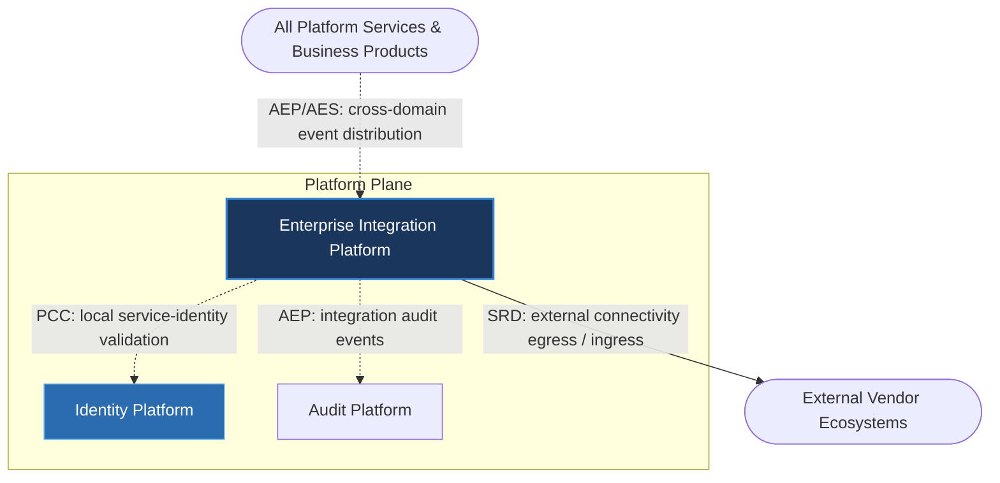

---
doc_meta:
  id: PAD-PLT-006
  title: Enterprise Integration Platform
  owner: Integration Team
  version: 1.0.0
  status: approved
  classification: restricted
  governed_by:
    - GDC-008
  realizes_capability:
    - EAD-001
    - EAD-004
    - EAD-005
  review_cycle_days: 180
  created_date: 2026-01-01
  last_reviewed: 2026-07-06
  fulfilled_by:
    - SAD-007
---

# Enterprise Integration Platform

---

## 1. Purpose & Scope

The Integration Platform provides standardized connectivity between platform services, business products, and external ecosystems. It governs communication contracts, protocol interoperability, message routing, and integration policies while ensuring that business domains remain isolated from transport-specific implementations.

The platform enables interoperability without introducing distributed monoliths or point-to-point integrations.

### 1.1. Out of Scope

- Business process orchestration.
- Business validation and domain logic.
- Authentication and identity management.
- Notification delivery.
- Business data ownership.
- Workflow execution.
- User interface integration.
- Analytics and reporting.

---

## 2. Enterprise Traceability

The Integration Platform mediates all external connectivity and hosts the Event Broker: its only synchronous runtime dependency is egress to external vendor ecosystems, while its ties to other internal platforms are local trust validation (PCC) and event publication (AEP).

### 2.1. Realizes

- EAD-001 Enterprise Capability & Domain Map — the integration and connectivity capability.
- EAD-004 Enterprise Integration Architecture — the enterprise integration model it implements.
- EAD-005 Enterprise Platform Architecture — the substrate it operates on.

### 2.2. Relationships

- **Synchronous Dependencies (SRD):** none internal — the only synchronous runtime egress is to external vendor ecosystems, mediated through this platform.
- **Publishes Events (AEP):** integration audit events to the Audit Platform via the Event Broker.
- **Subscribes To / Distributes Events (AES):** as the broker operator, it distributes cross-domain events between publishing and subscribing domains.
- **Consumes Platform Capabilities (PCC):** validates service and workload identity locally, using SPIFFE/JWT credentials issued by the Identity Platform.

### 2.3. Consumed By

Every Platform Service and Business Product consumes Integration for external egress and ingress (SRD, mediated exclusively by this platform) and for cross-domain event distribution (AEP/AES via the Event Broker it hosts). Consumption of the broker and gateway is not a runtime dependency on any other internal platform.

---

## 3. Domain & Context Model

The Integration Platform is decomposed into several independent bounded contexts responsible for enterprise connectivity.

### 3.1. Bounded Context

- API Management
- Service Connectivity
- External Connectivity
- Event Distribution
- Contract Registry
- Message Routing
- Protocol Translation
- Data Transformation
- Integration Governance
- Connectivity Monitoring

### 3.2. Ubiquitous Language

| Term                 | Description                                         |
| -------------------- | --------------------------------------------------- |
| Integration Contract | Logical agreement between communicating domains.    |
| Provider             | Domain exposing a capability.                       |
| Consumer             | Domain consuming a capability.                      |
| API                  | Synchronous integration capability.                 |
| Event                | Asynchronous business notification.                 |
| Message              | Unit of communication exchanged between systems.    |
| Endpoint             | Logical communication interface.                    |
| Contract Registry    | Enterprise catalog of integration contracts.        |
| Transformation       | Translation between different data representations. |
| Routing              | Determination of message destination.               |

### 3.3. Domain Policies

- Every integration must be contract-first.
- Platform services communicate only through governed contracts.
- Business domains remain transport-agnostic.
- Point-to-point integration is prohibited.
- Integration contracts are versioned.
- Synchronous communication should be minimized.
- Integration failures must remain isolated.
- External connectivity is mediated exclusively by this platform.

---

## 4. Integration Contracts

### 4.1. Integration Provided

The Integration Platform provides:

- API Management
- Integration Gateway
- Event Distribution
- Contract Registry
- Message Routing
- Protocol Translation
- Data Transformation
- External Connectivity
- Integration Monitoring
- Integration Policy Enforcement

### 4.2. Integration Consumed

The Integration Platform has no synchronous runtime dependency on another internal platform. Its relationships to internal platforms are:

- Identity Platform (Platform Capability Consumption) — service and workload identity is validated **locally** using Identity-issued SPIFFE/JWT credentials, not by a synchronous call into Identity.
- Audit Platform (Asynchronous Event Publication) — integration audit events are **published** to the Event Broker, which the Audit Platform subscribes to; Integration does not depend on Audit at runtime.

The only synchronous runtime egress is to external vendor ecosystems, mediated exclusively through this platform.

Implementation protocols, communication technologies, brokers, gateways, and runtime infrastructure are defined by the realizing SAD.

---

## 5. Trust & Data Boundaries

### 5.1. Trust Boundary

The Integration Platform governs communication boundaries but never owns business data.

Business domains remain authoritative for every business entity exchanged through integration.

### 5.2. Identity Access

Identity verification is delegated to the Identity Platform.

The Integration Platform governs:

- Service trust
- Integration policy enforcement
- Communication authorization
- Contract validation

### 5.3. Data Classification

The platform processes communication metadata including:

- API Metadata
- Event Metadata
- Message Metadata
- Routing Metadata
- Integration Contracts
- Connectivity Policies
- Monitoring Metadata

The platform does not own:

- Business Records
- Financial Data
- HR Records
- Customer Data
- Product-specific transactional data

---

## 6. Capability NFR

### 6.1. Reliability & Availability

- Enterprise-grade communication availability.
- No single integration failure shall propagate across domains.
- Graceful degradation for downstream failures.

### 6.2. Performance & Scalability

- Horizontally scalable integration services.
- High-throughput synchronous and asynchronous communication.
- Efficient routing and transformation.

### 6.3. Security & Compliance

- Zero Trust communication.
- Mutual trust between participating services.
- Secure contract governance.
- Enterprise communication compliance.

### 6.4. Auditability

Every integration lifecycle event shall be traceable, including:

- Contract publication
- Contract modification
- API registration
- Event publication
- Message routing
- Transformation execution
- Policy enforcement
- External connectivity
- Communication failures

---

## 7. Ownership & Governance

### 7.1. Team Ownership

The Integration Platform Team owns enterprise connectivity, communication contracts, and integration governance.

The Architecture Authority governs enterprise integration standards and communication evolution.

### 7.2. Realizing Systems

- SAD-007 Enterprise Integration Platform

### 7.3. Governance Rules

- Every integration shall be contract-first.
- Business domains shall never implement direct point-to-point integration.
- Communication contracts are centrally governed and versioned.
- Integration technology shall remain replaceable without affecting business domains.
- Breaking integration contracts require Architecture Authority approval.
