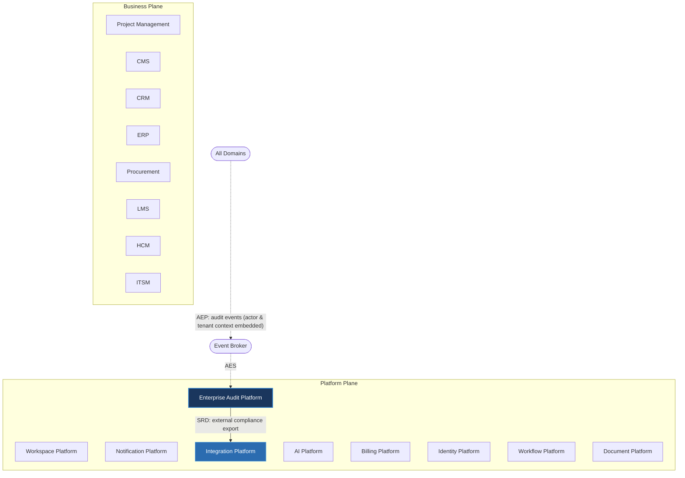

---
doc_meta:
  id: PAD-PLT-007
  title: Enterprise Audit Platform
  owner: Audit Team
  version: 1.0.0
  status: approved
  classification: restricted
  governed_by:
    - GDC-008
  realizes_capability:
    - EAD-001
    - EAD-005
  review_cycle_days: 180
  created_date: 2026-01-01
  last_reviewed: 2026-07-06
  fulfilled_by:
    - SAD-010
---

# Enterprise Audit Platform

---

## 1. Purpose & Scope

The Audit Platform provides centralized, immutable audit capabilities across the enterprise. It records business-significant events as tamper-evident evidence for governance, compliance, security investigations, and regulatory reporting.

Business domains remain responsible for generating business events, while the Audit Platform governs audit persistence, integrity, retention, and evidence retrieval.

### 1.1. Out of Scope

- Application logging.
- Infrastructure logging.
- Monitoring and observability.
- Metrics collection.
- Distributed tracing.
- Business analytics.
- Authentication and authorization.
- Business workflow orchestration.

---

## 2. Enterprise Traceability

The Audit Platform is an enterprise write-sink: all domains publish audit events that it subscribes to, with actor identity and tenant context embedded in the event payload, so it does not synchronously depend on Identity or Workspace.

### 2.1. Realizes

- EAD-001 Enterprise Capability & Domain Map — the audit and evidence capability (immutable evidence, compliance, integrity verification).
- EAD-005 Enterprise Platform Architecture — the substrate it operates on.

### 2.2. Relationships

- **Synchronous Dependencies (SRD):** Integration Platform — external compliance export is mediated through the Integration ACL.
- **Publishes Events (AEP):** none significant — the Audit Platform is a sink, not a publisher.
- **Subscribes To Events (AES):** subscribes to audit-event streams published by all domains; actor identity and tenant context are embedded in the event payload.
- **Consumes Platform Capabilities (PCC):** validates the retrieval-requester identity locally.

### 2.3. Consumed By

Every Platform Service and Business Product publishes audit evidence (AEP) that the Audit Platform ingests: Notification, Billing, Document, Workflow, and AI Platforms, together with HCM, ERP, CRM, Procurement, Project Management, ITSM, CMS, and LMS, all emit audit events that Audit subscribes to as a write-sink.

---

## 3. Domain & Context Model

The Audit Platform is decomposed into several independent bounded contexts.

### 3.1. Bounded Context

- Audit Event Collection
- Evidence Storage
- Evidence Retrieval
- Retention Management
- Compliance Reporting
- Integrity Verification
- Audit Governance

### 3.2. Ubiquitous Language

| Term                   | Description                                            |
| ---------------------- | ------------------------------------------------------ |
| Audit Event            | Immutable business evidence generated by a system.     |
| Evidence               | Permanent proof of an action or business event.        |
| Audit Trail            | Chronological chain of business evidence.              |
| Retention Policy       | Rules governing audit preservation.                    |
| Integrity Verification | Validation that audit evidence has not been altered.   |
| Compliance Report      | Regulatory report generated from audit evidence.       |
| Evidence Query         | Authorized retrieval of audit records.                 |
| Tamper Evidence        | Cryptographic indication of unauthorized modification. |

### 3.3. Domain Policies

- Audit records are immutable.
- Audit evidence cannot be modified or deleted.
- Business domains publish audit events.
- The Audit Platform governs evidence persistence.
- Audit retention follows enterprise governance.
- Audit retrieval is strictly authorized.
- Every evidence record is cryptographically verifiable.
- Audit storage remains technology independent.

---

## 4. Integration Contracts

### 4.1. Integration Provided

The Audit Platform provides:

- Audit Event Recording
- Immutable Evidence Storage
- Evidence Retrieval
- Audit Trail Management
- Integrity Verification
- Retention Management
- Compliance Reporting
- Audit Search
- Audit Events

### 4.2. Integration Consumed

The Audit Platform consumes:

- Identity context, received inside subscribed audit events (AES payload) — actor identity travels within the event, not through a synchronous call.
- Workspace tenant context, received inside subscribed audit events (AES payload) — tenant context travels within the event, not through a synchronous call.
- Integration Platform (Synchronous Runtime Dependency) for external compliance export.

Implementation protocols, storage engines, indexing technologies, and cryptographic mechanisms are defined by the realizing SAD.

---

## 5. Trust & Data Boundaries

### 5.1. Trust Boundary

The Audit Platform governs enterprise evidence but never owns business entities.

Business domains remain authoritative for business state, while the Audit Platform preserves historical evidence.

### 5.2. Identity Access

Authentication is delegated to the Identity Platform.

The Audit Platform governs:

- Evidence integrity
- Audit authorization
- Retention enforcement
- Compliance access
- Audit governance

Only authorized personnel may retrieve audit evidence.

### 5.3. Data Classification

The platform manages:

- Audit Events
- Evidence Metadata
- Audit Trails
- Compliance Records
- Retention Metadata
- Integrity Metadata
- Verification Metadata

The platform does not own:

- Business Transactions
- Operational State
- Application Logs
- Monitoring Metrics
- Distributed Traces
- Business Entities

---

## 6. Capability NFR

### 6.1. Reliability & Availability

- Enterprise-grade evidence durability.
- No audit event loss.
- Immutable audit persistence.

### 6.2. Performance & Scalability

- Horizontally scalable audit ingestion.
- Efficient evidence retrieval.
- High-volume audit recording.

### 6.3. Security & Compliance

- Tamper-evident storage.
- Cryptographic integrity verification.
- Regulatory compliance support.
- Tenant-isolated audit evidence.

### 6.4. Auditability

Every audit operation shall itself produce audit evidence, including:

- Evidence creation
- Evidence retrieval
- Compliance reporting
- Integrity verification
- Retention execution
- Authorized export
- Administrative actions

---

## 7. Ownership & Governance

### 7.1. Team Ownership

The Audit Platform Team owns platform audit capabilities, evidence lifecycle, and compliance governance.

The Architecture Authority governs enterprise audit policies and evidence standards.

### 7.2. Realizing Systems

- SAD-010 Enterprise Audit Platform

### 7.3. Governance Rules

- Business domains shall never implement independent audit repositories.
- Application logs shall never be used as compliance evidence.
- Audit records are immutable after creation.
- Audit evidence shall be cryptographically verifiable.
- Retention is enforced per enterprise governance (EAD-003).
- Audit contracts are centrally governed and versioned.
- Breaking audit contracts require Architecture Authority approval.
