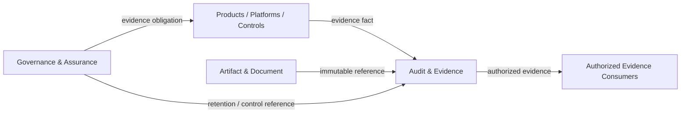

---
doc_meta:
  id: PAD-PLT-007
  title: Enterprise Audit & Evidence Platform
  owner: Audit & Evidence Platform Team
  version: 2.1.0
  status: approved
  classification: restricted
  governed_by:
    - GDC-008
    - EAD-001
    - EAD-003
    - EAD-007
  realizes_capability:
    - EAD-001
    - EAD-003
  review_cycle_days: 180
  created_date: 2026-01-01
  last_reviewed: 2026-08-23
  fulfilled_by:
    - SAD-010
---

# Enterprise Audit & Evidence Platform

## 1. Purpose & Scope

The Audit & Evidence Platform preserves durable, attributable, integrity-verifiable enterprise evidence produced by Business Products, Platforms, security controls, and governance processes.

Governance & Assurance defines what must be evidenced, why the evidence is required, which control or obligation it supports, and the applicable retention or review policy.

Audit & Evidence owns evidence acceptance, durable evidence lifecycle, integrity verification, chain of custody, retention enforcement, authorized retrieval, controlled export, and evidence reconciliation.

### 1.1 Outcome Contract

An accepted Evidence Record must remain attributable to its source and original event context without being rewritten to match later Product state.

The Platform proves that evidence was accepted, preserved, accessed, exported, retained, or disposed according to declared policy. It does not prove the business truth of the source domain beyond the evidence provided.

### 1.2 Out Of Scope

- Defining enterprise policy, compliance obligations, or control requirements
- Approving Product or Platform decisions
- Product business state
- Product analytics and business reporting
- General application and infrastructure observability logs unless intentionally promoted as governed evidence
- Authentication and authorization authority
- Artifact and Document business meaning
- Product record storage
- Runtime governance gateway or synchronous approval hop
- Legal interpretation of evidence
- Security incident-response ownership

## 2. Enterprise Traceability

### 2.1 Realizes

- **EAD-001** Audit & Evidence Foundation capability
- **EAD-003** governed evidence-data authority
- Supports **EAD-007** Governance & Assurance by preserving the evidence required to prove or challenge conformance

### 2.2 Relationships

- **Source Products/Platforms** produce evidence facts and remain responsible for source correctness until accepted
- **Governance & Assurance** defines evidence obligations, control claims, retention, and assurance expectations
- **Identity / Organization / Application Trust** provide attributable actor, workload, Tenant, application, and operating-context references
- **Artifact & Document** supplies immutable artifact references when evidence depends on files or documents
- **Event & Messaging** may carry asynchronous evidence events
- **Trust Services** may provide signing, key, timestamp, or integrity-support capabilities
- **Security and Compliance** consume evidence but do not obtain unrestricted Product access through Audit
- **Observability** remains a separate operational telemetry capability unless selected telemetry is promoted into Evidence

### 2.3 Consumed By

- Security investigation and response functions
- Compliance and internal or external audit functions
- Product and Platform operations
- Incident and recovery reviews
- Architecture assurance
- AI governance and high-impact decision review
- Authorized business, risk, legal, and regulatory stakeholders

Evidence access is purpose-bound and does not implicitly grant access to live source systems.

### 2.4 Logical Topology



Audit is an evidence authority, not a central runtime gateway through which Product transactions must pass.

## 3. Domain & Context Model

### 3.1 Bounded Context

- Evidence Intake
- Evidence Validation
- Evidence Acceptance
- Evidence Record
- Evidence Claim Reference
- Evidence Integrity
- Chain of Custody
- Evidence Retention
- Legal Hold
- Evidence Retrieval
- Evidence Search
- Evidence Export
- Evidence Access Audit
- Evidence Reconciliation
- Evidence Disposition

### 3.2 Ubiquitous Language

| Term                       | Meaning                                                                                        |
| :------------------------- | :--------------------------------------------------------------------------------------------- |
| Evidence Event             | Source-produced fact submitted for governed evidence preservation                              |
| Evidence Record            | Accepted durable representation preserved by the Platform                                      |
| Evidence Claim             | Governance or source-declared statement that the evidence supports                             |
| Evidence Source            | Product, Platform, control, person, workload, or external authority that produced the evidence |
| Acceptance                 | Point at which the Platform acknowledges durable Evidence Record responsibility                |
| Chain of Custody           | Attributable history of evidence handling, access, export, hold, and disposition               |
| Integrity Verification     | Detection or proof that accepted evidence was not silently altered                             |
| Evidence Reference         | Stable reference to another Artifact or source record                                          |
| Retention Policy Reference | Governance-owned rule reference enforced by Audit                                              |
| Legal Hold                 | Governed instruction preventing normal disposition                                             |
| Reconciliation             | Verification that expected evidence was accepted and retained as required                      |

### 3.3 Domain Policies

- Evidence Records are append-oriented and immutable according to evidence class
- Governance defines evidence obligation while Audit enforces declared lifecycle policy
- Source domain remains authoritative for current business state
- Accepted evidence is not edited to match later source state
- Evidence access, export, retention override, legal hold, integrity action, and administrative mutation are themselves evidenced
- Retention and legal hold are driven by governed references rather than ad-hoc operator choice
- Critical source-to-evidence acceptance and reconciliation behavior is explicit
- Evidence does not intentionally contain passwords, bearer tokens, private keys, or equivalent secret material
- Evidence minimization is required even when the source system contains richer data
- An Evidence Record distinguishes source assertion from Audit acceptance and integrity state

### 3.4 Lifecycle & State Semantics

A submitted Evidence Event follows a logical lifecycle:

```text
Submitted
  -> Validated
  -> Accepted
  -> Retained
  -> Disposed

Exceptional paths:
Rejected
Quarantined
Legal Hold
Integrity Alert
```

`Accepted` is the responsibility-transfer point for durable preservation under the declared evidence class.

Disposition is a governed lifecycle event and must preserve the minimum evidence required to prove that disposal occurred lawfully when policy requires it.

### 3.5 Failure & Degradation Semantics

- Critical sources must not treat evidence as accepted before receiving a durable acceptance contract
- Search or export degradation must not block core evidence ingestion
- Integrity-verification failure creates an explicit alert or quarantine state and must never be silently repaired
- Retention-policy resolution failure must fail safe against premature deletion
- Legal-hold ambiguity prevents normal disposition until resolved
- Event or network duplication must not create contradictory duplicate Evidence identities
- Source outage does not permit Audit to fabricate missing evidence
- Evidence ingestion backlog and rejected evidence must be observable and reconcilable by source
- Cross-region or archival degradation may delay retrieval but must not reduce declared evidence durability without an explicit incident

## 4. Integration Contracts

### 4.1 Integration Provided

- Evidence submission and validation
- Durable Evidence acceptance
- Evidence status and reconciliation
- Integrity verification
- Chain-of-custody query
- Retention and legal-hold enforcement
- Authorized evidence query and search
- Controlled evidence export
- Evidence access audit
- Evidence lifecycle events
- Evidence disposition and disposition proof where required

### 4.2 Integration Consumed

- Source Product and Platform evidence contracts
- Governance-owned evidence obligation and retention references
- Identity, Organization, and Application Trust context
- Trust Services where integrity or signing support is required
- Artifact & Document references
- Event & Messaging where asynchronous evidence submission is selected
- Observability for operational health

### 4.3 Contract Principles

- Evidence contracts distinguish submission from durable acceptance
- Every accepted Evidence Record has stable identity, source identity, event time where known, acceptance time, classification, and provenance
- Evidence schemas are versioned
- Evidence References preserve the referenced source or Artifact version
- Consumers receive only evidence authorized for their purpose and scope
- Export does not transfer authority over source Product state
- Reconciliation contracts allow critical sources and assurance processes to detect missing or rejected evidence

## 5. Trust & Data Boundaries

### 5.1 Trust Boundary

Audit & Evidence is authoritative for accepted Evidence Record lifecycle, integrity state, chain of custody, retention state, legal-hold state, access history, and export history.

It is not authoritative for current Product business state, Governance policy meaning, or the underlying Artifact content referenced by evidence.

### 5.2 Identity Access

- Evidence submission authenticates source application or workload and relevant operating context
- Human evidence submission or annotation is attributable to a Principal
- Retrieval and export require explicit scope, purpose, and strong assurance appropriate to sensitivity
- Cross-Tenant or provider access is separately authorized and evidenced
- Evidence access never grants access to the live source resource
- Privileged retention, legal-hold, export, and integrity operations require separate authority from ordinary evidence readers

### 5.3 Data Classification

Evidence may contain sensitive, restricted, regulated, and legally significant metadata or bounded snapshots.

Applicable controls include:

- Data minimization
- Classification inheritance
- Purpose-bound access
- Tenant isolation
- Residency
- Retention
- Legal hold
- Redaction or tokenization
- Controlled export
- Support-access evidence

Secrets are never intentionally recorded as evidence payload.

### 5.4 Authority & Projection Rules

- Audit is canonical for evidence lifecycle, not current source truth
- Search indexes and reporting projections are derived from Evidence Records
- Referenced Artifact versions remain Artifact authority
- Governance controls remain Governance authority
- Evidence export is a copy and does not become the canonical Evidence Record
- Integrity metadata and chain of custody remain inseparable from the accepted Evidence identity

## 6. Capability NFR

### 6.1 Availability, RTO, and RPO

- Reliability profile is **C0 or C1** according to evidence class
- Critical evidence-ingestion target: **>= 99.99% monthly** where required by security, isolation, or regulatory journeys
- Default governed evidence service target: **>= 99.95% monthly**
- Core evidence service target RTO: **<= 1 hour**
- Critical security profile may require RTO **<= 15 minutes**
- Default target RPO: **<= 15 minutes**
- Stronger critical profile may require RPO **<= 1 minute**
- Accepted critical evidence must not be silently lost

### 6.2 Integrity, Scalability, and Isolation

- **100%** of governed evidence classes must declare an integrity-verification mechanism
- Ingestion and durable acceptance are isolated from expensive search and export workloads
- Capacity certification targets at least **10x forecast peak critical-ingestion rate** for the declared profile
- Tenant, source, evidence-class, and consumer quotas protect shared capacity
- Integrity verification and retention scans must not starve ingestion

### 6.3 Security, Privacy, and Compliance

- Evidence retrieval is purpose-bound and least-privilege
- Cross-Tenant and privileged access is explicitly evidenced
- Secrets are blocked or redacted by policy
- Sensitive evidence is protected across active, archived, backup, and export lifecycle
- Retention and legal hold fail safe against premature disposition
- Residency follows the evidence class and source obligations

### 6.4 Audit, Interoperability, and Cost

- Every administrative, retrieval, export, integrity, retention, legal-hold, and disposition action is attributable
- Source evidence schemas are versioned and provider-neutral
- Reconciliation backlog and evidence rejection are measurable
- Storage, retention, integrity, query, and export cost is attributable by evidence class, source, Tenant, and consumer where meaningful

## 7. Ownership & Governance

### 7.1 Team Ownership

Audit & Evidence Platform Team owns:

- Evidence acceptance and durable lifecycle
- Integrity verification
- Chain of custody
- Retention and legal-hold enforcement
- Evidence retrieval and export
- Evidence reconciliation
- Evidence Platform reliability and support

Governance, Compliance, Security, Legal, and Product authorities define the obligations and source meaning that evidence supports.

### 7.2 Realizing Systems

- **SAD-010** Audit & Evidence Platform

### 7.3 Governance Rules

- Audit Platform SHALL NOT become enterprise policy authority
- Current Product truth SHALL NOT be reconstructed by mutating historical evidence
- Critical evidence rejection or loss SHALL surface explicitly to the source and assurance process
- Evidence search or export SHALL NOT be placed in the critical ingestion path
- Legal-hold ambiguity SHALL NOT result in normal disposition
- Evidence consumers SHALL NOT infer live Product authorization from Evidence access
- Observability data SHALL become governed Evidence only through an explicit evidence contract

### 7.4 Platform Product Health

Platform health includes critical-ingestion success, rejection rate, reconciliation backlog, integrity failures, retrieval latency, export volume, retention and legal-hold correctness, support burden, and unit cost by evidence class.

## 8. Assumptions & Constraints

- Governance & Assurance remains the policy authority
- Source systems may have different evidence criticality and retention obligations
- Evidence may reference rather than copy large immutable Artifacts
- Physical storage, archival, signing, and indexing technologies remain downstream concerns

## 9. Architectural Decisions

- Audit owns evidence lifecycle while Governance owns obligation
- Source Product remains current-state authority
- Accepted evidence is immutable in meaning
- Search, export, and reporting remain separable from critical ingestion
- Physical integrity and storage mechanisms belong to SAD and downstream decisions

## 10. Evolution

The Platform may evolve separate ingestion, search, archive, export, integrity, or regional physical systems without changing the logical Evidence contract.

New evidence classes are introduced through governed schema, classification, integrity, retention, and access profiles rather than one undifferentiated audit log.

## 11. References

- EAD-001 Enterprise Capability & Domain Map
- EAD-003 Enterprise Data Ownership & Topology
- EAD-006 Enterprise Security Architecture
- EAD-007 Enterprise Governance & Assurance Architecture
- GDC-008 Product Architecture Document Guideline
