---
doc_meta:
  id: PAD-PLT-008
  title: Enterprise AI Platform
  owner: AI Team
  version: 1.0.0
  status: approved
  classification: restricted
  governed_by:
    - GDC-008
  realizes_capability:
    - EAD-001
    - EAD-005
  review_cycle_days: 180
  created_date: 2026-01-01
  last_reviewed: 2026-07-06
  fulfilled_by:
    - SAD-011
---

# Enterprise AI Platform

---

## 1. Purpose & Scope

The AI Platform provides reusable intelligence capabilities including inference, retrieval, semantic search, embeddings, document understanding, and agent orchestration.

Business products remain responsible for business decisions, business rules, and domain ownership. The AI Platform provides recommendations, predictions, classifications, and generated outputs without becoming the source of business truth.

### 1.1. Out of Scope

- Business decision making.
- Business rule execution.
- Domain ownership.
- Business workflow orchestration.
- Business authorization.
- Business data ownership.
- Model training for domain-specific datasets.
- Business analytics and reporting.

---

## 2. Enterprise Traceability

```mermaid
graph TD
    subgraph Platform["Platform Plane"]
        AI[Enterprise AI Platform]
        WKSP[Workspace Platform]
        NOT[Notification Platform]
        INT[Integration Platform]
        AUD[Audit Platform]
        WKFL[Workflow Platform]
        IDP[Identity Platform]
        DOC[Document Platform]
    end

    subgraph Business["Business Plane"]
        PM[Project Management]
        CMS[CMS]
        CRM[CRM]
        ERP[ERP]
        PRC[Procurement]
        LMS[LMS]
        HCM[HCM]
        ITSM[ITSM]
    end

    AI -->|SRD: tenant context| WKSP
    AI -->|SRD: external AI providers egress| INT
    AI -->|SRD: knowledge retrieval| DOC
    AI -. AEP: AI interaction audit events .-> AUD
    AI -. PCC: local Identity token validation .-> IDP

    WKFL -. AES: async batch-inference requests .-> AI
    NOT -. AES: AI result events .-> AI
    HCM -->|SRD: synchronous inference| AI
    ERP -->|SRD: synchronous inference| AI
    CRM -->|SRD: synchronous inference| AI
    PRC -->|SRD: synchronous inference| AI
    PM -->|SRD: synchronous inference| AI
    ITSM -->|SRD: synchronous inference| AI
    CMS -->|SRD: synchronous inference| AI
    LMS -->|SRD: synchronous inference| AI

    style AI fill:#1a365d,stroke:#3182ce,stroke-width:2px,color:#fff
```

The AI Platform realizes platform intelligence capabilities defined within the Enterprise Platform Architecture. Its outputs are recommendations, never business truth; consuming products validate every AI response.

### 2.1. Realizes

- EAD-001 Enterprise Capability & Domain Map — the AI / enterprise intelligence capability (inference, retrieval, embeddings, agent orchestration).
- EAD-005 Enterprise Platform Architecture — the substrate it operates on.

### 2.2. Relationships

- **Synchronous Dependencies (SRD):** Workspace Platform (tenant context), Integration Platform (external AI providers egress), Document Platform (knowledge retrieval for RAG).
- **Publishes Events (AEP):** AI interaction audit events and AI result events to the Event Broker.
- **Subscribes To Events (AES):** subscribes to async batch-inference request events.
- **Consumes Platform Capabilities (PCC):** validates Identity-issued tokens **locally**, so consumption is not a runtime dependency on Identity.

### 2.3. Consumed By

Business Products and the Workflow Platform consume AI as a platform capability — calling it synchronously for inference or asynchronously for batch. AI outputs are recommendations, never business truth: consuming domains remain responsible for validating every response before acting on it. AI does not depend on Workflow or Notification; those domains invoke or subscribe to AI, not the reverse.

---

## 3. Domain & Context Model

The AI Platform is decomposed into multiple independent bounded contexts.

### 3.1. Bounded Context

- Model Serving
- Prompt Management
- Embedding Services
- Retrieval Services
- Knowledge Retrieval (RAG)
- Agent Orchestration
- AI Gateway
- Model Governance
- Safety & Guardrails
- AI Observability

### 3.2. Ubiquitous Language

| Term           | Description                                                |
| -------------- | ---------------------------------------------------------- |
| Inference      | AI-generated prediction or response.                       |
| Prompt         | Structured instruction sent to a model.                    |
| Model          | Strictly governed AI model served through the platform.    |
| Embedding      | Numerical semantic representation of content.              |
| Vector Search  | Semantic similarity retrieval.                             |
| Knowledge Base | Enterprise knowledge available to AI systems.              |
| RAG            | Retrieval-Augmented Generation using enterprise knowledge. |
| Agent          | Autonomous AI component executing delegated tasks.         |
| Model Provider | External or internal LLM provider.                         |
| Guardrail      | Policy constraining AI behavior.                           |
| AI Gateway     | Enterprise abstraction over AI providers.                  |

### 3.3. Domain Policies

- AI never owns business truth.
- AI outputs are recommendations, not decisions.
- Business products validate every AI response.
- AI providers remain replaceable.
- Prompt definitions are centrally governed.
- AI interactions are fully auditable.
- AI capabilities remain model agnostic.
- Sensitive enterprise data follows enterprise security policies.

---

## 4. Integration Contracts

### 4.1. Integration Provided

The AI Platform provides:

- Text Generation
- Document Summarization
- Classification
- Semantic Search
- Embedding Generation
- Retrieval-Augmented Generation (RAG)
- AI Agent Execution
- Prompt Management
- AI Gateway
- Model Routing
- AI Events

### 4.2. Integration Consumed

The AI Platform consumes:

- Identity Platform for authentication and authorization.
- Document Platform for enterprise knowledge retrieval.
- Integration Platform for external AI providers.
- Audit Platform for immutable AI interaction records.

Concrete model providers (OpenAI, Anthropic, Gemini, local LLMs, etc.) are implementation details defined within the realizing SAD.

---

## 5. Trust & Data Boundaries

### 5.1. Trust Boundary

The AI Platform processes enterprise information but never becomes the authoritative owner of business data.

Business domains remain responsible for validating AI outputs before execution.

### 5.2. Identity Access

Authentication is delegated to the Identity Platform.

The AI Platform governs:

- AI access policies
- Prompt governance
- Model authorization
- Knowledge access
- Agent execution policies

### 5.3. Data Classification

The platform manages:

- Prompts
- Embeddings
- Vector Indexes
- AI Metadata
- AI Sessions
- Knowledge References
- Model Metadata
- Inference Metadata

The platform does not own:

- Business Transactions
- Employee Records
- Financial Records
- Customer Records
- Enterprise Master Data

---

## 6. Capability NFR

### 6.1. Reliability & Availability

- High availability AI gateway.
- Graceful degradation when AI providers are unavailable.
- Provider failover supported.

### 6.2. Performance & Scalability

- Low-latency inference routing.
- Horizontally scalable inference services.
- Efficient vector retrieval and semantic search.

### 6.3. Security & Compliance

- Prompt isolation between tenants.
- Sensitive data protection.
- Enterprise AI governance.
- AI provider abstraction.
- Responsible AI enforcement.

### 6.4. Auditability

Every AI interaction shall be traceable, including:

- Prompt execution
- Model selection
- Retrieval execution
- Context injection
- Inference generation
- Agent execution
- Provider invocation
- AI policy evaluation

---

## 7. Ownership & Governance

### 7.1. Team Ownership

The AI Platform Team owns platform intelligence capabilities, AI governance, and model lifecycle management.

The Architecture Authority governs enterprise AI standards, provider policies, and responsible AI principles.

### 7.2. Realizing Systems

- SAD-011 Enterprise AI Platform

### 7.3. Governance Rules

- Business domains shall never directly depend on AI providers.
- Every AI interaction shall pass through the AI Platform.
- AI providers shall remain replaceable without affecting business products.
- AI-generated output shall never become business truth without domain validation.
- Prompts and AI policies shall be centrally governed.
- Every AI interaction shall be auditable.
- Breaking AI contracts require Architecture Authority approval.
