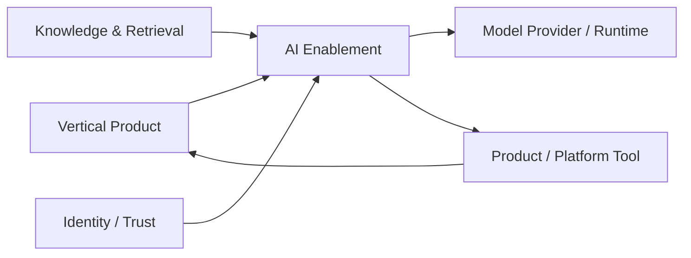

---
doc_meta:
  id: PAD-PLT-008
  title: Enterprise AI Enablement Platform
  owner: AI Platform Team
  version: 2.1.0
  status: approved
  classification: restricted
  governed_by:
    - GDC-008
    - EAD-001
    - EAD-005
    - EAD-006
  realizes_capability:
    - EAD-001
    - EAD-005
    - EAD-006
  review_cycle_days: 180
  created_date: 2026-01-01
  last_reviewed: 2026-08-23
  fulfilled_by:
    - SAD-011
---

# Enterprise AI Enablement Platform

## 1. Purpose & Scope

The AI Enablement Platform provides provider-independent, governed model, inference, agent, tool-mediation, evaluation, release, usage, and AI-telemetry capabilities for Scnehaux Products and Platforms.

Foundation models are treated as replaceable commodity substrate. Enterprise differentiation remains in proprietary knowledge, domain context, workflows, tools, authorization, evaluation, feedback, human expertise, and Product experience.

The Platform provides a governed execution substrate without becoming the owner of Product business decisions or enterprise knowledge truth.

### 1.1 Outcome Contract

Products consume stable AI capability profiles rather than provider-specific SDK semantics.

Provider, model, access mode, inference runtime, or agent implementation may change behind the contract only when compatibility, policy, safety, quality, latency, and cost evidence satisfies the declared capability profile.

### 1.2 Out Of Scope

- Enterprise Knowledge Asset, ontology, Knowledge Graph, and retrieval-source authority
- Product business workflow and Product state
- Product business rules and final business decisions
- Product resource authorization
- Product-owned domain prompt, skill, evaluation meaning, and domain acceptance semantics
- Artifact and Document storage lifecycle
- Analytics and reporting authority
- Assuming all models or providers are semantically interchangeable
- Unsupported reuse, scraping, or hijacking of human browser sessions as machine credentials
- A general Product API gateway
- A generic enterprise Workflow engine
- Human decision accountability

## 2. Enterprise Traceability

### 2.1 Realizes

- **EAD-001** AI Enablement capability
- **EAD-005** shared AI and intelligent-runtime Platform strategy
- **EAD-006** provider, tool, data-egress, identity, and AI security controls

### 2.2 Relationships

- **Knowledge & Retrieval** supplies authorized grounded context, provenance, and citations
- **Products** own vertical AI workflow, Product UX, domain prompts and skills, Product tools, business decisions, and business outcomes
- **Identity / Organization / Application Trust** provide human, workload, agent, Tenant, and application context
- **Trust Services** owns raw provider credentials, keys, and secret material
- **Integration Enablement** may provide reusable provider protocol or connectivity machinery but is not a mandatory hop
- **Product/Platform Tools** enforce their own authorization and invariants
- **Audit & Evidence** preserves privileged, high-risk, and high-impact AI evidence
- **Artifact & Document** stores governed AI-produced artifacts after Product acceptance
- **Usage Metering & Billing** may consume governed AI usage facts where commercial charging applies
- **Observability** receives operational AI telemetry under privacy and classification controls

### 2.3 Consumed By

- Travel vertical AI Products
- HCM copilots and intelligence features
- Future ERP copilots
- Knowledge experiences
- Workflow tasks
- Work Management assistance
- Rules-authoring assistance
- Other Product-owned AI features

Consumption does not transfer Product or Knowledge authority into AI Platform.

### 2.4 Logical Topology



AI Enablement mediates execution. Product remains the final owner and authorizer of protected business effects.

## 3. Domain & Context Model

### 3.1 Bounded Context

- Model & Provider Gateway
- Provider Access Profile
- Model Catalog
- Capability Profile
- Routing & Policy
- Inference Runtime
- Agent Runtime
- Agent Budget and Stop Policy
- Tool Registry & Mediation
- Tool Risk Classification
- MCP and Protocol Adaptation
- Prompt / Skill / AI Asset Runtime
- Evaluation Suite
- Candidate Evaluation
- Promotion and Release
- Canary and Fallback
- Safety and Guardrail Enforcement
- Usage / Quota / Cost
- AI Telemetry
- Provider Health

### 3.2 Ubiquitous Language

| Term | Meaning |
| :-- | :-- |
| Model Provider | External, cloud, enterprise, or local source of model execution |
| Model Endpoint | Registered model execution endpoint or runtime profile |
| Capability Profile | Stable consumer requirement such as reasoning, multimodal, tool use, structured output, or embedding |
| Provider Access Profile | Governed human, workload, delegated, cloud, or local access mode |
| Inference Run | Bounded model invocation lifecycle |
| Agent Run | Bounded iterative model and tool execution lifecycle |
| Agent Budget | Declared bound on time, tokens, cost, iterations, or tool activity |
| Tool | Registered operation exposed by an owning Product or Platform |
| Tool Risk Class | Declared risk and side-effect category that constrains invocation |
| AI Asset | Versioned prompt, skill, template, or runtime support artifact |
| Evaluation Suite | Versioned quality, safety, latency, and cost test contract |
| Candidate | Model, provider, access, or AI-asset combination under evaluation |
| Promotion | Controlled approval of a Candidate for a Capability Profile |
| Fallback | Evaluated alternate route and not arbitrary provider substitution |
| Grounded Profile | AI capability requiring authorized retrieval and evidence from Knowledge & Retrieval |

### 3.3 Domain Policies

- Provider and model portability is governed and evaluated rather than assumed
- Products call stable Capability Profiles instead of provider-specific SDK semantics
- Product-owned domain prompt and skill meaning remains Product-owned even when executed through AI Platform
- Knowledge & Retrieval is consumed through authorized contracts
- Agent Runtime is not Workflow
- Tool mediation constrains execution but Tool owner performs final authorization
- Interactive SSO or seat access and unattended workload access are distinct Provider Access Profiles
- Raw production provider credentials remain in Trust Services
- Every provider route is constrained by classification, residency, purpose, capability, safety, cost, and access policy
- High-impact actions require controls appropriate to their risk class
- Model output is never authoritative Product truth merely because it came through the Platform
- Unsupported provider session scraping or shared human credential reuse is prohibited
- AI Platform cannot relax Product authorization through prompt instruction or agent planning

### 3.4 Lifecycle & State Semantics

A Capability Profile route follows a governed lifecycle:

```text
Candidate
  -> Evaluated
  -> Approved
  -> Canary
  -> Active
  -> Deprecated
  -> Retired
```

A promoted fallback must have current evaluation evidence against the same declared Profile dimensions.

An Agent Run distinguishes:

```text
Created
Running
Waiting on Tool
Completed
Stopped by Budget
Cancelled
Failed
```

Tool completion and Product business completion are distinct states.

### 3.5 Failure & Degradation Semantics

- Provider outage may trigger only an evaluated fallback allowed by the Capability Profile
- If no acceptable fallback exists, the Platform returns explicit degraded or unavailable state rather than silently changing semantics
- Grounded Profiles must not silently drop grounding when Knowledge & Retrieval is unavailable unless the Product contract explicitly permits ungrounded degradation
- Tool timeout or unknown side-effect outcome requires Tool-owner reconciliation before unsafe replay
- AI Platform failure must not bypass Product authorization or mutate Product truth
- Safety-policy failure blocks or constrains the affected run according to profile
- Usage or cost limit exhaustion stops or rejects new work according to declared quota policy
- Agent cancellation does not undo committed Product effects
- AI telemetry failure must not leak sensitive prompt or output content through fallback logging

## 4. Integration Contracts

### 4.1 Integration Provided

- Model and Capability Profile catalog
- Provider Access Profile management
- Synchronous and streaming inference
- Structured-output execution
- Batch inference
- Agent Run lifecycle
- Agent Budget and stop-policy enforcement
- Tool registration, discovery, risk metadata, and mediation
- MCP and native tool-protocol adaptation
- AI Asset runtime and version selection
- Evaluation execution and results
- Candidate promotion, canary, rollback, and fallback policy
- Usage, quota, and cost metering
- AI telemetry and correlation
- Provider-health and capability signals

### 4.2 Integration Consumed

- Identity, Application Trust, and Organization
- Trust Services
- Knowledge & Retrieval
- Product and Platform Tool contracts
- Optional Integration Enablement
- Artifact & Document
- Event & Messaging
- Audit & Evidence
- Observability
- Usage Metering & Billing where commercial usage is required

### 4.3 Contract Principles

- Consumer contracts are provider-neutral
- Capability Profile declares required model behavior and policy constraints
- Tool contracts declare owner, input/output schema, required scope, risk class, side-effect class, and idempotency expectations
- Product authorization remains at the protected Tool or Product resource
- Retrieval contracts preserve provenance and authorization context
- Run identifiers and correlation survive fallback and retry
- Provider-specific payloads terminate at Platform adapters
- AI usage facts are attributable to Product, Tenant, principal or workload, profile, provider, and model where available

## 5. Trust & Data Boundaries

### 5.1 Trust Boundary

AI Platform is authoritative for registered provider and model profiles, Capability Profiles, execution runs, routing and promotion policy, Agent Run state, tool-mediation state, evaluation results, AI usage, quota, and Platform telemetry.

It is not authoritative for Product business facts, Knowledge truth, Product authorization, or final Product decisions.

### 5.2 Identity Access

- Human interactive provider access is attributable to a Principal and supported provider contract
- Workload inference uses attributable non-human identity and approved Provider Access Profile
- Shared human sessions for unattended execution are prohibited unless a provider-supported delegation model explicitly creates machine authority
- Agent and Tool calls carry bounded delegation and correlation
- Product Tool owner re-authorizes protected operations
- Cross-Tenant administration requires explicit provider scope and evidence
- Provider credentials are never returned to Product clients after registration

### 5.3 Data Classification

AI Platform may process:

- Prompts
- Retrieved context
- Model output
- Tool input and output
- Agent state
- Evaluation data
- Usage and cost metadata
- Safety and policy outcomes
- Correlation and telemetry

Processing inherits source classification, purpose, Tenant, residency, retention, and provider-egress constraints.

Raw provider secrets are excluded from Product-visible state.

### 5.4 Authority & Projection Rules

- Model output is generated content and not Product truth until accepted by the Product
- Retrieved context remains Knowledge or source authority
- Tool effects remain Tool-owner or Product authority
- Evaluation results are AI Platform authority for release governance but do not replace Product-domain evaluation criteria
- AI telemetry is derived operational data
- Cached provider or model metadata does not override provider capability evidence or Platform policy

## 6. Capability NFR

### 6.1 Availability, RTO, and RPO

- C1 Capability Profiles target Platform availability **>= 99.95% monthly**
- C2 Capability Profiles target **>= 99.9% monthly**
- C3 assistive Profiles may declare lower availability according to Product contract
- C1 Platform control-state target RTO: **<= 1 hour**
- C1 Platform control-state target RPO: **<= 15 minutes**
- Ephemeral inference state may be retried or recreated only where duplicate effects are safe

### 6.2 Performance, Evaluation, and Scalability

- Every promoted Capability Profile declares measurable quality, safety, latency, and cost gates
- Platform routing and policy overhead is measured separately from provider model latency
- Interactive profiles declare end-to-end latency budgets appropriate to Product experience
- Capacity and quotas are bounded by Tenant, Product, workload, provider, and Capability Profile
- Provider bulkheads prevent one provider failure from exhausting unrelated routes
- Evaluation workload must not starve production inference

### 6.3 Security, Safety, and Privacy

- Zero raw provider credentials exposed to Product clients
- Tool and retrieval authorization negative tests are release gates for protected profiles
- Sensitive prompt or output capture is opt-in, minimized, and redacted according to policy
- High-risk Tool actions require declared side-effect and approval policy
- Provider egress is blocked when classification or residency policy does not permit it
- Agent budgets prevent unbounded autonomous loops and spend

### 6.4 Observability, Interoperability, and Cost

- Telemetry includes Product, Tenant, principal or workload, Capability Profile, provider, model, latency, errors, fallback, retrieval correlation, Tool calls, usage, and cost where available
- Consumer contracts do not expose provider SDK models as canonical Product contracts
- Cost is attributable by Product, Tenant, workload, Capability Profile, provider, model, and run
- Promotion, rollback, provider-profile change, high-risk Tool use, and privileged Agent operations are traceable

## 7. Ownership & Governance

### 7.1 Team Ownership

AI Platform Team owns:

- Provider and model execution abstraction
- Capability Profile and routing policy
- Provider Access Profiles
- Inference and Agent Runtime
- Tool mediation
- Evaluation and release
- Safety enforcement within Platform scope
- Usage, quota, cost, and AI telemetry
- Provider health and fallback machinery

Knowledge Team owns Knowledge & Retrieval. Product teams own domain AI experience, workflow, prompts, tools, domain evaluation meaning, business decisions, and outcomes.

### 7.2 Realizing Systems

- **SAD-011** AI Platform

### 7.3 Governance Rules

- AI Platform SHALL NOT own enterprise Knowledge Graph truth
- Model or provider switch SHALL require capability compatibility and evaluation evidence
- Interactive SSO SHALL NOT silently become unattended machine authority
- Product authorization SHALL remain at the protected resource
- MCP SHALL be treated as interoperability transport and not the enterprise authorization model
- High-risk Tool invocation SHALL carry explicit risk and side-effect metadata
- Grounded Profiles SHALL NOT silently become ungrounded when required context is unavailable
- Agent cancellation SHALL NOT be represented as rollback of already committed Product effects

### 7.4 Platform Product Health

Platform health includes supported Capability Profiles, evaluation freshness, fallback coverage, provider incident isolation, quality regressions, safety findings, inference success, Agent stop reasons, cost per Product/profile, consumer adoption, and support burden.

## 8. Assumptions & Constraints

- Multiple model providers and runtime types may coexist
- Provider capability and commercial terms can change independently
- Human seat access and workload API access are not interchangeable
- Products retain their own business authorization and domain evaluation
- Knowledge & Retrieval remains independent of model-provider lifecycle

## 9. Architectural Decisions

- Foundation models are replaceable substrate
- AI Enablement and Knowledge & Retrieval remain separate authorities
- Model portability is governed by evaluation rather than assumed equivalence
- Agent Runtime is distinct from Workflow
- Tool-owner authorization is final
- Physical model gateways, provider adapters, execution runtimes, and telemetry stores belong downstream

## 10. Evolution

The Platform may add providers, local runtimes, specialized model classes, richer agent execution, or new Tool transports while preserving Capability Profile and Product authority contracts.

A new provider becomes production-capable only through registered access, capability evidence, evaluation, policy, and release governance.

## 11. References

- EAD-001 Enterprise Capability & Domain Map
- EAD-003 Enterprise Data Ownership & Topology
- EAD-004 Enterprise Integration Architecture
- EAD-005 Enterprise Platform Architecture
- EAD-006 Enterprise Security Architecture
- EAD-007 Enterprise Governance & Assurance Architecture
- GDC-008 Product Architecture Document Guideline
- ADR-GLB-012 Separate AI, Knowledge, and Product Authority
