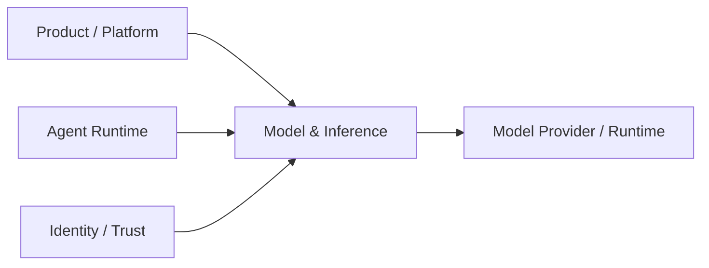

---
doc_meta:
  id: PAD-PLT-008
  title: Model & Inference Platform
  owner: AI Platform Team
  version: 3.0.0
  status: approved
  classification: restricted
  governed_by: [GDC-008, EAD-001, EAD-003, EAD-005, EAD-006]
  realizes_capability: [EAD-001, EAD-005, EAD-006]
  review_cycle_days: 180
  created_date: 2026-01-01
  last_reviewed: 2026-08-23
  fulfilled_by: [SAD-011]
---

# Model & Inference Platform

## 1. Purpose & Scope

The Model & Inference Platform provides provider-independent, governed **bounded model execution** for Scnehaux Products, Platforms, and Agent Runtime.

Consumers request stable **Capability Profiles** rather than provider-specific SDK semantics. Foundation models and model-serving runtimes remain replaceable substrate.

### 1.1 Outcome Contract

A consumer can request a declared model capability and receive bounded synchronous, streaming, structured-output, batch, or embedding execution without coupling its Product contract to one provider/model.

### 1.2 Out Of Scope

- Agent Definition / Agent Run lifecycle
- durable agent loop, pause/resume, delegation, handoff, or parent/child execution
- Context Assembly, Run/Session Memory, Tool Binding, MCP, or Tool side-effect lifecycle
- Product business Workflow/state/authorization/outcome
- Product domain prompt/skill meaning
- Knowledge Asset/Graph/retrieval authority
- Artifact lifecycle
- arbitrary code/browser/computer sandbox authority
- assumed provider/model semantic equivalence

## 2. Enterprise Traceability

### 2.1 Realizes

- EAD-001 Model & Inference capability within AI Enablement
- EAD-005 shared bounded model-execution Platform strategy
- EAD-006 provider access, egress, identity, data, and AI security controls

### 2.2 Relationships

- Agent Runtime consumes Capability Profiles for Agent turns
- Products may consume bounded inference directly without Agent Runtime
- Identity / Organization / Application Trust provide caller/workload/Tenant context
- Trust Services owns raw provider credentials
- Audit & Evidence preserves privileged provider/profile/release evidence
- Observability receives inference telemetry
- Usage Metering & Billing may consume usage facts
- Knowledge & Retrieval remains independent; the caller or Agent Runtime assembles authorized context when grounding is required

### 2.3 Consumed By

- Agent Runtime
- Vertical AI Products requiring direct bounded inference
- HCM/future ERP assistive features
- embedding/model-transform pipelines
- evaluation/batch workloads

### 2.4 Logical Topology



## 3. Domain & Context Model

### 3.1 Bounded Context

- Model Provider Registry
- Model Endpoint
- Provider Access Profile
- Model Catalog
- Capability Profile
- Routing Policy
- Inference Runtime
- Inference Run
- Structured Output Profile
- Embedding Profile
- Evaluation Suite
- Candidate Evaluation
- Promotion / Release / Canary / Rollback
- Evaluated Fallback
- Model-Level Guardrail Profile
- Usage / Quota / Cost
- Provider Health
- Inference Telemetry

### 3.2 Ubiquitous Language

| Term                    | Meaning                                                                               |
| :---------------------- | :------------------------------------------------------------------------------------ |
| Capability Profile      | Stable consumer requirement for model behavior, policy, latency, safety, or residency |
| Provider Access Profile | Governed human/workload/delegated/cloud/local provider-access mode                    |
| Inference Run           | One bounded model-execution lifecycle                                                 |
| Route                   | Evaluated provider/model/endpoint selection satisfying a Capability Profile           |
| Fallback                | Evaluated alternate route, never arbitrary provider substitution                      |
| Provider Health         | Measured provider/endpoint condition used by routing policy                           |

### 3.3 Domain Policies

- consumers use Capability Profiles rather than provider SDK contracts
- provider/model portability is evaluated rather than assumed
- direct Product inference is valid when no Agent Runtime semantics are required
- Model & Inference SHALL NOT own durable Agent Run state, Agent Memory, Tool Binding, or agent control loops
- Product/domain prompt and skill meaning remains Product-owned
- raw provider credentials remain in Trust Services
- interactive SSO/seat access and unattended workload access are distinct Provider Access Profiles
- model output is not Product truth until Product/domain acceptance
- unsupported browser-session scraping/shared human credential reuse is prohibited

### 3.4 Lifecycle & State Semantics

```text
Candidate -> Evaluated -> Approved -> Canary -> Active -> Deprecated -> Retired
```

```text
Inference Run: Created -> Running -> Completed | Failed | Cancelled
```

### 3.5 Failure & Degradation Semantics

- provider outage may trigger only an evaluated fallback
- no fallback may silently weaken residency/classification/safety/access constraints
- no acceptable route returns explicit unavailable/degraded state
- bounded retry must not become Product side-effect retry
- usage/cost limits reject/stop execution according to declared policy
- Agent Run recovery is outside this Platform

## 4. Integration Contracts

### 4.1 Integration Provided

- Capability/Profile catalog
- Provider Access Profile management
- sync/stream/batch/embedding/structured inference
- routing/fallback
- evaluation/promotion/rollback
- usage/quota/cost
- provider-health and inference telemetry

### 4.2 Integration Consumed

Identity, Application Trust, Organization, Trust Services, Audit & Evidence, Observability, optional Event & Messaging, optional Usage Metering & Billing.

### 4.3 Contract Principles

- provider-neutral consumer contract
- immutable/resolvable Capability Profile requirements
- source classification/purpose/Tenant restrictions are preserved
- provider-specific payloads terminate at adapters
- usage is attributable to Product/Tenant/principal-or-workload/profile/provider/model/run
- Agent correlation may be carried without transferring Agent authority

## 5. Trust & Data Boundaries

### 5.1 Trust Boundary

Authoritative for provider/model profiles, Capability Profiles, routes, Inference Runs, model evaluation/release evidence, usage/quota/cost, provider health, and inference telemetry.

Not authoritative for Product facts, Knowledge truth, Agent Run state, Product authorization, or final decisions.

### 5.2 Identity Access

- workload inference uses attributable non-human identity
- interactive provider access remains attributable to a Principal
- human session authority is not unattended machine authority
- provider credentials are never returned after registration

### 5.3 Data Classification

May process prompts/inputs, outputs, embeddings, evaluation data, usage/cost metadata, routing/health state, correlation, and telemetry under inherited source restrictions.

### 5.4 Authority & Projection Rules

- model output remains proposed/derived until Product acceptance
- caller-supplied context keeps original authority
- evaluation evidence governs model-route release only

## 6. Capability NFR

### 6.1 Availability, RTO, RPO

- C1 profiles target >=99.95% monthly
- C2 profiles target >=99.9%
- C1 control-state RTO <=1 hour
- C1 control-state RPO <=15 minutes

### 6.2 Performance, Evaluation, Scalability

- promoted Profiles declare quality/safety/latency/cost gates
- routing overhead is measured separately from provider latency
- quota/capacity bounded by Tenant/Product/workload/provider/Profile
- provider bulkheads isolate failures
- evaluation workload does not starve production

### 6.3 Security, Safety, Privacy

- zero raw provider credentials exposed to Product clients
- provider-egress negative tests for restricted Profiles
- sensitive prompt/output capture minimized/redacted
- unsupported interactive-session reuse for unattended workloads prohibited

### 6.4 Observability, Interoperability, Cost

Trace Product/Tenant/identity/Profile/provider/model/latency/errors/fallback/usage/cost. Provider SDK types are not canonical Product contracts.

## 7. Ownership & Governance

### 7.1 Team Ownership

AI Platform Team owns Model & Inference. Agent Runtime owns durable agent execution. Knowledge Team owns Knowledge & Retrieval. Product teams own domain AI meaning, business decisions, and outcomes.

### 7.2 Realizing Systems

- SAD-011 Model & Inference Platform

### 7.3 Governance Rules

- SHALL NOT own durable Agent Run or Agent Memory authority
- SHALL NOT own Knowledge truth
- model/provider switch requires current evaluation evidence
- Product authorization remains at protected resources
- direct bounded inference SHALL NOT be forced through Agent Runtime

### 7.4 Platform Product Health

Capability coverage, evaluation freshness, fallback coverage, provider isolation, inference success/latency, quality regressions, cost, adoption, support burden.

## 8. Assumptions & Constraints

Multiple provider/runtime types may coexist. Agent Runtime consumes this Platform through Capability Profiles. Knowledge lifecycle remains independent.

## 9. Architectural Decisions

- Model & Inference and Agent Runtime are separate Platform authorities
- direct bounded Product inference is supported
- model portability is evaluated
- physical provider/runtime technology belongs downstream
- ADR-GLB-015 defines the split

## 10. Evolution

Providers, local runtimes, specialized model classes, routing, and inference modes may evolve behind Capability Profile contracts.

## 11. References

- EAD-001
- EAD-003
- EAD-005
- EAD-006
- ADR-GLB-012
- ADR-GLB-015
