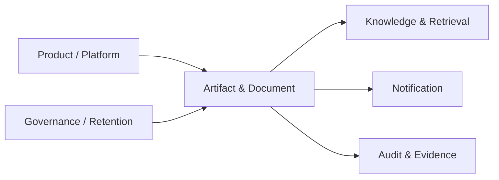

---
doc_meta:
  id: PAD-PLT-009
  title: Enterprise Artifact & Document Platform
  owner: Artifact Platform Team
  version: 2.1.0
  status: approved
  classification: restricted
  governed_by:
    - GDC-008
    - EAD-001
    - EAD-003
    - EAD-005
  realizes_capability:
    - EAD-001
    - EAD-003
    - EAD-005
  review_cycle_days: 180
  created_date: 2026-01-01
  last_reviewed: 2026-08-23
  fulfilled_by:
    - SAD-008
---

# Enterprise Artifact & Document Platform

## 1. Purpose & Scope

The Artifact & Document Platform provides reusable lifecycle management for governed files, documents, media, spreadsheets, generated outputs, and other versioned digital artifacts.

It owns Artifact identity, content versioning, integrity, provenance, derivative relationships, access mechanics, content-safety state, archive state, and enforcement of declared artifact lifecycle policy.

Product domains own business meaning, business acceptance, Product-specific document semantics, and the business obligation that causes an Artifact to exist.

### 1.1 Outcome Contract

Consumers reference stable Artifact and Artifact Version identities rather than storage internals.

A storage engine, conversion engine, OCR implementation, preview technology, scanning service, or physical storage topology may change without changing the Product-facing Artifact contract.

### 1.2 Out Of Scope

- Product business record or Product business meaning
- Product approval and Workflow semantics
- Knowledge truth, ontology, or retrieval-index authority
- Enterprise Evidence authority
- Product authorization semantics
- Generic storage-vendor selection
- Notification delivery
- AI inference
- Product-specific document-template business semantics unless registered as Product-owned artifacts
- Product business retention policy authority
- External signing or trust authority unless separately chartered
- Product collaboration/editor semantics unless separately chartered

## 2. Enterprise Traceability

### 2.1 Realizes

- **EAD-001** Artifact & Document enabling capability
- **EAD-003** artifact, version, provenance, and lifecycle authority
- **EAD-005** shared content-service Platform posture

### 2.2 Relationships

- **Products** own Artifact business meaning and accepted references
- **Knowledge & Retrieval** ingests governed immutable Artifact Versions as sources
- **AI Enablement** may read or generate content while Product acceptance and Artifact registration remain explicit
- **Notification** consumes immutable attachment references
- **Workflow / Work Management** reference Artifact Versions without owning content lifecycle
- **Audit & Evidence** may reference Artifacts while preserving separate Evidence authority
- **Trust and Security** govern content protection, keys, classification, and scanning policy
- **Governance** supplies retention, legal-hold, and disposal obligations
- **Integration Enablement** may connect external content-processing services when justified

### 2.3 Consumed By

Travel, HCM, future ERP, Notification, Knowledge & Retrieval, AI, Workflow, Work Management, Audit & Evidence, and other Products handling governed digital content may consume Artifact & Document contracts.

### 2.4 Logical Topology



Artifact references cross domain boundaries. Storage implementation does not.

## 3. Domain & Context Model

### 3.1 Bounded Context

- Artifact Registry
- Artifact Versioning
- Content Lifecycle
- Metadata
- Checksum and Integrity
- Provenance
- Upload and Retrieval
- Content Safety State
- Rendering and Preview
- Conversion
- Extraction and OCR
- Derivative Linking
- Archive
- Retention Enforcement
- Legal Hold Reference
- Artifact Access Capability
- Artifact Lifecycle Events

### 3.2 Ubiquitous Language

| Term                  | Meaning                                                                                        |
| :-------------------- | :--------------------------------------------------------------------------------------------- |
| Artifact              | Governed digital content unit independent of Product business meaning                          |
| Artifact Version      | Immutable revision of Artifact content and version-bound metadata                              |
| Content               | Binary, textual, media, spreadsheet, or comparable payload                                     |
| Checksum              | Integrity identity used to detect content change                                               |
| Provenance            | Traceable source, producer, and transformation lineage                                         |
| Derivative            | Generated representation linked to a source Artifact Version                                   |
| Content Safety State  | Explicit state such as pending, accepted, quarantined, or rejected according to content policy |
| Artifact Reference    | Stable opaque reference consumed by another domain                                             |
| Retention Instruction | Governed lifecycle instruction originating from Product or Governance authority                |
| Legal Hold Reference  | External governed hold instruction preventing normal disposition                               |
| Archive               | Preserved lifecycle state under declared retention and access controls                         |

### 3.3 Domain Policies

- Accepted Artifact Versions are immutable
- Product business meaning remains Product-owned
- Checksum and provenance accompany governed versions
- Derived conversion, rendering, extraction, and OCR outputs preserve source lineage
- Retention semantics originate from Product or Governance authority and are enforced by Artifact Platform
- Content safety and scan state is explicit
- Unaccepted, incomplete, or quarantined content is not represented as an available governed Artifact Version
- Binary content and Product business metadata are minimized and separated
- Consumers reference Artifact Versions rather than storage locations
- A derivative never replaces source authority unless a Product explicitly accepts it as a new Artifact
- Artifact deletion or disposition cannot silently violate legal hold

### 3.4 Lifecycle & State Semantics

A governed Artifact Version follows a logical lifecycle:

```text
Initiated
  -> Content Received
  -> Validation / Safety Pending
  -> Available
  -> Archived
  -> Disposed

Exceptional paths:
Rejected
Quarantined
Legal Hold
```

A new content revision creates a new Artifact Version rather than mutating an Available version.

Derivative lifecycle remains linked to the exact source Artifact Version.

### 3.5 Failure & Degradation Semantics

- Partial or failed upload is not exposed as an Available Artifact Version
- Content-safety failure produces explicit quarantine or rejection
- Preview, conversion, extraction, or OCR failure does not invalidate an otherwise valid source Artifact
- Retention or legal-hold uncertainty fails safe against premature disposition
- Artifact metadata-control degradation may delay new publication but cannot silently rewrite existing versions
- Large-content delivery failure is retriable without creating a new logical Artifact Version
- Knowledge indexing failure does not change Artifact availability or authority
- Notification attachment failure does not mutate Artifact truth
- Storage or integrity mismatch creates an explicit integrity incident rather than silent repair

## 4. Integration Contracts

### 4.1 Integration Provided

- Artifact registration
- Content upload and retrieval
- Immutable Artifact Version creation
- Metadata, checksum, and provenance
- Content-safety status
- Rendering and preview
- Conversion
- OCR and extraction
- Derivative linking
- Archive
- Retention and legal-hold enforcement
- Version query
- Artifact lifecycle events
- Bounded or expiring access-reference capability
- Integrity verification

### 4.2 Integration Consumed

- Identity and Organization context
- Product authorization context
- Trust Services
- Governance retention and legal-hold references
- Optional Integration Enablement for external processing services
- Audit & Evidence
- Event & Messaging
- Observability

### 4.3 Contract Principles

- Artifact references are opaque and storage-independent
- Consumers choose a specific Artifact Version when immutability matters
- Business metadata is not duplicated into Artifact unless required for content lifecycle
- Content processing produces linked derivatives rather than mutating source content
- Signed or bounded retrieval capabilities are purpose-limited and expire
- Contract evolution preserves stable Artifact identity and provenance
- Direct access to storage internals is not a Product integration contract

## 5. Trust & Data Boundaries

### 5.1 Trust Boundary

Artifact Platform is authoritative for Artifact content lifecycle, Artifact Versions, checksums, provenance, derivatives, content-safety state, archive state, and Platform retention enforcement.

It is not authoritative for Product business meaning, Knowledge truth, Product authorization, or Enterprise Evidence lifecycle.

### 5.2 Identity Access

- Upload, read, version, archive, and disposition operations require caller, Product, and Tenant scope
- Product authorization determines business access when Product semantics are involved
- Bounded download capability is scoped, purpose-limited, and expiring where used
- Privileged retention, legal-hold, quarantine, support, and disposition operations are evidenced
- Cross-Tenant administration requires explicit provider authority
- Storage identifiers or signed links do not become business authorization tokens beyond their declared scope

### 5.3 Data Classification

Artifact Platform may store public through restricted or regulated content.

Controls apply to:

- Content
- Derivatives
- Metadata
- Backups
- Archives
- Support access
- Processing services
- Retrieval links
- Logs and telemetry

Sensitive content is minimized in metadata and telemetry.

### 5.4 Authority & Projection Rules

- Product owns business record and business acceptance
- Artifact Platform owns the governed content version
- Knowledge indexes are derived from Artifact Versions
- Evidence may reference an Artifact Version but remains Audit authority
- AI-generated content becomes an Artifact only through explicit registration or Product acceptance
- Previews, OCR text, thumbnails, or converted forms are derivatives unless explicitly promoted

## 6. Capability NFR

### 6.1 Availability, Durability, RTO, and RPO

- Mature Artifact metadata and reference control path target: **>= 99.95% monthly**
- C1 Artifact service target RTO: **<= 1 hour**
- Metadata target RPO: **<= 15 minutes**
- Accepted Artifact Versions must not be silently lost
- Content durability profile is explicitly declared and may exceed metadata RPO requirements

### 6.2 Integrity, Performance, and Scalability

- **100%** of accepted Artifact Versions have integrity-verifiable content identity
- Large-content transfer is isolated from control-plane saturation
- Capacity certification targets at least **10x forecast peak Artifact control-operation rate**
- Tenant, Product, artifact-class, and processing quotas bound shared resource use
- Preview, conversion, OCR, extraction, and scan workload must not starve core Artifact retrieval and metadata operations

### 6.3 Security, Privacy, Compliance, and Residency

- Content-safety state is explicit before Product-defined publish or use
- Sensitive content is encrypted and protected according to classification
- Residency and retention apply to content, derivatives, backups, and archives
- Support access is least-privilege and evidenced
- Legal hold prevents normal disposition
- Malware or unsafe-content findings cannot be bypassed by ordinary consumers

### 6.4 Audit, Interoperability, and Cost

- Registration, version publication, quarantine, archive, retention override, legal hold, disposition, privileged access, and integrity incidents are traceable
- Consumer references do not expose storage vendor topology
- Storage, egress, processing, conversion, extraction, and retention cost is attributable by Product, Tenant, and artifact class
- Platform adoption is measured against duplicated content-lifecycle effort removed from Products

## 7. Ownership & Governance

### 7.1 Team Ownership

Artifact Platform Team owns:

- Artifact and Artifact Version contracts
- Content lifecycle and integrity
- Provenance and derivative relationships
- Content-processing services
- Content-safety state
- Archive and retention enforcement
- Artifact Platform reliability and support

Products own business meaning and acceptance. Governance defines retention and legal obligations. Knowledge owns knowledge representation. Audit owns evidence lifecycle.

### 7.2 Realizing Systems

- **SAD-008** Artifact & Document Platform

### 7.3 Governance Rules

- Artifact storage SHALL NOT become Product record authority
- Knowledge ingestion SHALL preserve immutable source and version provenance
- Audit Evidence and Artifact content SHALL remain distinct authorities
- An Available Artifact Version SHALL NOT be mutated in place
- Derivatives SHALL preserve source lineage
- Legal-hold ambiguity SHALL NOT result in disposition
- Product consumers SHALL NOT integrate through storage-vendor internals

### 7.4 Platform Product Health

Platform health includes Artifact adoption, version and retrieval success, integrity incidents, scan and processing backlog, quarantine rate, storage and egress cost, retention correctness, support burden, and consumer migration effort.

## 8. Assumptions & Constraints

- Products continue to own document or file business meaning
- Different artifact classes may require different durability, residency, and retention profiles
- External content-processing services may be used behind governed contracts
- Physical storage, processing, and delivery technology remain downstream concerns

## 9. Architectural Decisions

- Artifact Version is the stable immutable content reference
- Product business record and Artifact content authority remain separate
- Derivative processing preserves lineage
- Knowledge and Evidence consume Artifact references without absorbing Artifact lifecycle
- Physical content technology belongs to SAD and downstream decisions

## 10. Evolution

The Platform may evolve separate content, metadata, processing, archival, regional, or high-sensitivity physical realizations without changing the Artifact contract.

New processing capabilities are introduced as derived services around immutable Artifact Versions rather than by expanding Product business semantics into the Platform.

## 11. References

- EAD-001 Enterprise Capability & Domain Map
- EAD-003 Enterprise Data Ownership & Topology
- EAD-005 Enterprise Platform Architecture
- EAD-006 Enterprise Security Architecture
- EAD-007 Enterprise Governance & Assurance Architecture
- GDC-008 Product Architecture Document Guideline
