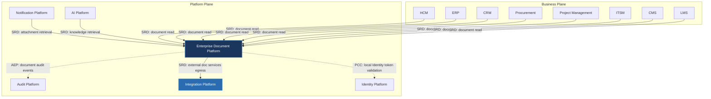

---
doc_meta:
  id: PAD-PLT-009
  title: Enterprise Document Platform
  owner: Document Team
  version: 1.0.0
  status: approved
  classification: restricted
  governed_by:
    - GDC-008
  realizes_capability:
    - EAD-001
    - EAD-005
  review_cycle_days: 180
  last_reviewed: 2026-07-06
  fulfilled_by:
    - SAD-008
---

# Enterprise Document Platform

---

## 1. Purpose & Scope

The Document Platform provides centralized document and file lifecycle management capabilities for the entire enterprise. It governs file and blob storage, lifecycle management, rendering, versioning, metadata management, and file services (OCR, conversion, thumbnails) while remaining independent of business ownership. Published business content is owned by CMS and is outside this platform's boundary.

Business domains own document meaning and business context, whereas the Document Platform owns the file and blob lifecycle and file services.

### 1.1. Out of Scope

- Business document ownership.
- Business approval workflows.
- Authentication and authorization.
- Business record management.
- Business retention policies.
- Notification delivery.
- Business search.
- Business process orchestration.

---

## 2. Enterprise Traceability

The Document Platform owns the enterprise file and blob lifecycle: consumers call it synchronously to read documents, while it validates Identity-issued tokens locally and publishes its own lifecycle and audit events.

### 2.1. Realizes

- EAD-001 Enterprise Capability & Domain Map — the document and file lifecycle capability (storage, versioning, rendering).
- EAD-005 Enterprise Platform Architecture — the substrate it operates on.

### 2.2. Relationships

- **Synchronous Dependencies (SRD):** Integration Platform — external document services are reached through the Integration ACL egress.
- **Publishes Events (AEP):** document lifecycle events and document audit events (e.g. `DocumentUploaded`, `VersionCreated`, `DocumentArchived`) to the Event Broker; document audit events are consumed by the Audit Platform.
- **Subscribes To Events (AES):** none on the critical path.
- **Consumes Platform Capabilities (PCC):** validates Identity-issued tokens **locally** for ownership and access identity; it does not call Identity at runtime.

### 2.3. Consumed By

Business Products and Platform Services consume the Document Platform synchronously (SRD reads): every Business Product (HCM, ERP, CRM, Procurement, Project Management, ITSM, CMS, LMS) reads documents; the Notification Platform reads documents for attachment retrieval; and the AI Platform reads documents for knowledge retrieval.

---

## 3. Domain & Context Model

The Document Platform is decomposed into multiple independent bounded contexts.

### 3.1. Bounded Context

- Document Lifecycle
- Document Storage
- Document Versioning
- Content Rendering
- Metadata Management
- Document Conversion
- Digital Signature
- Content Protection
- Archive Management
- Document Governance

### 3.2. Ubiquitous Language

| Term              | Description                                                 |
| ----------------- | ----------------------------------------------------------- |
| Document          | Managed digital content owned by a business domain.         |
| Document Version  | Immutable revision of a document.                           |
| Content           | Binary or textual representation of a document.             |
| Metadata          | Descriptive information associated with a document.         |
| Archive           | Long-term preserved document.                               |
| Retention         | Lifecycle policy controlling document preservation.         |
| Rendering         | Generation of viewable representations.                     |
| Conversion        | Transformation between document formats.                    |
| Watermark         | Visual ownership indicator applied to a document.           |
| Digital Signature | Cryptographic proof of document integrity and authenticity. |

### 3.3. Domain Policies

- Business domains own document meaning.
- The Document Platform owns document lifecycle.
- Every document is versioned.
- Documents are immutable once published.
- Binary content and metadata are managed independently.
- Document retention follows enterprise governance.
- Every document operation is auditable.
- Content services remain independent from storage technology.

---

## 4. Integration Contracts

### 4.1. Integration Provided

The Document Platform provides:

- Document Storage
- Document Upload
- Document Download
- Document Versioning
- Metadata Management
- Content Rendering
- Thumbnail Generation
- Document Conversion
- OCR Processing
- Watermarking
- Digital Signature
- Virus Scanning
- Archive Management
- Retention Management
- Document Events

### 4.2. Integration Consumed

The Document Platform consumes:

- Integration Platform (Synchronous Runtime Dependency) for external document services, mediated through the ACL.

It validates Identity-issued tokens **locally** for ownership and access identity (a platform capability consumed via local validation, not a runtime call). It **publishes** document lifecycle and audit events to the Event Broker, which the Audit Platform consumes for immutable audit records.

Implementation technologies and storage infrastructure are defined by the realizing SAD.

---

## 5. Trust & Data Boundaries

### 5.1. Trust Boundary

The Document Platform governs enterprise document lifecycle but never owns business meaning.

Business domains remain authoritative for every document's business context and lifecycle decisions.

### 5.2. Identity Access

Authentication and enterprise identity are delegated to the Identity Platform.

The Document Platform governs:

- Document ownership metadata
- Content integrity
- Version integrity
- Retention enforcement
- Archive governance

Business domains govern business-level access policies.

### 5.3. Data Classification

The platform manages:

- Binary Content
- Document Metadata
- Version Metadata
- Archive Metadata
- Rendering Metadata
- Conversion Metadata
- Signature Metadata
- Retention Metadata

The platform does not own:

- Business Transactions
- Employee Records
- Financial Records
- Customer Records
- Product-specific business entities

---

## 6. Capability NFR

### 6.1. Reliability & Availability

- Enterprise-grade document availability.
- Durable document preservation.
- No document loss during lifecycle operations.

### 6.2. Performance & Scalability

- Horizontally scalable document services.
- Efficient handling of large binary objects.
- High-throughput upload and retrieval.

### 6.3. Security & Compliance

- Document integrity protection.
- Secure content storage.
- Enterprise retention compliance.
- Regulatory document governance.

### 6.4. Auditability

Every document lifecycle event shall be traceable, including:

- Upload
- Download
- Version creation
- Metadata modification
- Conversion
- Rendering
- Signature
- Watermarking
- Archive
- Retention
- Deletion

---

## 7. Ownership & Governance

### 7.1. Team Ownership

The Document Platform Team owns platform document and file lifecycle management capabilities and file services (OCR, rendering, conversion).

The Document storage services must comply with enterprise residency requirements.

The Architecture Authority governs enterprise document standards and lifecycle policies.

### 7.2. Realizing Systems

- SAD-008 Enterprise Document Platform

### 7.3. Governance Rules

- Business domains shall never implement independent document storage.
- Every enterprise document shall be managed through the Document Platform.
- Document versions are immutable.
- Binary storage technology shall remain replaceable without affecting business domains.
- Breaking document contracts require Architecture Authority approval.
