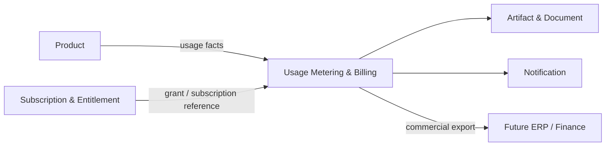

---
doc_meta:
  id: PAD-PLT-010
  title: Enterprise Usage Metering & Billing Platform
  owner: Commercial Platform Team
  version: 2.1.1
  status: chartered
  classification: restricted
  governed_by:
    - GDC-008
    - EAD-001
    - EAD-003
    - EAD-005
  realizes_capability:
    - EAD-001
    - EAD-003
    - EAD-005
  review_cycle_days: 180
  created_date: 2026-01-01
  last_reviewed: 2026-08-23
  fulfilled_by:
    - SAD-009
---

# Enterprise Usage Metering & Billing Platform

> **Commitment: chartered.** This logical boundary is retained as a valid enterprise candidate, but no shared implementation is authorized until the approval gate in GDC-008 is satisfied.

## 1. Purpose & Scope

The Usage Metering & Billing Platform provides reusable cross-Product commercial metering, usage acceptance, rating, charge, billing-cycle, commercial bill or invoice, adjustment, reconciliation, and export mechanics for Scnehaux commercial offerings.

Subscription & Entitlement remains a distinct authority for whether a Product capability is commercially granted. Product owners remain authoritative for Product usage meaning and pricing intent. Future ERP and Finance systems remain authoritative for accounting ledger, receivables, payment settlement, tax, and financial posting unless a later approved boundary changes that authority.

### 1.1 Outcome Contract

Billing turns accepted Product usage facts and governed commercial rate configuration into reproducible commercial charges and billing statements without becoming Product authorization, Entitlement, or accounting authority.

A bill being generated does not imply that an accounting entry was posted, a payment was settled, or a Product entitlement changed.

### 1.2 Out Of Scope

- Subscription and Entitlement authority
- Product Offering ownership
- Product pricing strategy and commercial-policy ownership
- Product business authorization
- ERP general ledger and accounts-receivable authority
- Payment-provider settlement authority
- Tax determination authority unless explicitly chartered later
- Product business usage semantics
- Tenant and Organization authority
- Arbitrary financial Workflow
- Payment credentials
- Product operational database access
- Revenue-recognition or accounting-policy authority
- Product-specific discount or pricing meaning unless represented through a governed rating contract

## 2. Enterprise Traceability

### 2.1 Realizes

- **EAD-001** Usage Metering & Billing shared commercial capability
- **EAD-003** commercial usage, rating, charge, and billing-state ownership
- **EAD-005** reusable commercial Platform Product direction

### 2.2 Relationships

- **Subscription & Entitlement** owns commercial grants, access, limits, and subscription state
- **Products** emit accepted usage facts and own Product usage meaning
- **Product / Commercial Owners** define pricing intent and approved commercial configuration
- **Organization** supplies canonical Tenant and customer operating context
- **Product / Capability Registry** supplies stable Product or Offering references where chartered
- **Future ERP / Finance** owns accounting, receivable, ledger, and financial posting
- **Integration Enablement** may provide payment, tax, finance, or external-billing connectors
- **Notification** delivers bills, statements, and commercial communication
- **Artifact & Document** stores generated bill or invoice Artifacts
- **Audit & Evidence** preserves consequential commercial evidence
- **Event & Messaging** may carry usage and billing lifecycle contracts

### 2.3 Consumed By

Products requiring usage-based or recurring commercial billing, commercial operations, future ERP and Finance integrations, customer or provider administration experiences, and authorized reporting consumers may consume Billing.

Internal-only Products do not consume Billing merely because the capability exists.

### 2.4 Logical Topology



Billing is the commercial metering and statement authority between Product usage and downstream accounting. It does not merge those authorities.

## 3. Domain & Context Model

### 3.1 Bounded Context

- Meter Definition
- Meter Version
- Usage Intake
- Usage Validation
- Usage Record
- Usage Deduplication
- Rating Configuration
- Rating Version
- Rating
- Charge
- Billing Account Reference
- Billing Cycle
- Bill
- Commercial Invoice
- Credit and Adjustment
- Billing Close
- Billing Reconciliation
- Billing Export

### 3.2 Ubiquitous Language

| Term | Meaning |
| :-- | :-- |
| Usage Fact | Product-owned business fact proposed for metering |
| Usage Record | Billing-accepted measurable usage fact with stable source and correlation |
| Meter | Versioned definition of what is counted and how the usage contract is interpreted |
| Rating Configuration | Governed commercial parameters used to convert accepted usage into chargeable value |
| Rating | Deterministic application of one declared rating version to accepted usage |
| Charge | Commercial amount produced by rating or adjustment |
| Billing Cycle | Governed period used to collect Charges into a Bill |
| Bill | Commercial statement of Charges for a declared account or customer reference |
| Commercial Invoice | Billing document and not automatically an ERP accounting posting |
| Credit / Adjustment | Attributable correction applied without silently rewriting historical Charge evidence |
| Entitlement | Commercial grant owned outside Billing |
| Financial Posting | ERP or Finance fact owned outside Billing |
| Reconciliation | Comparison of expected usage, Charges, exports, or downstream acknowledgements |

### 3.3 Domain Policies

- Product owns meaning and correctness of published Usage Facts
- Billing owns accepted Usage Record, Meter, Rating, Charge, Bill, and Adjustment lifecycle
- Subscription & Entitlement owns grants and access
- Product and commercial owners own pricing intent while Billing executes approved configuration
- Billing completion does not imply ERP posting, payment settlement, or tax completion
- Duplicate usage is protected through stable source and idempotency identity
- Meter and Rating versions have explicit effective-time semantics
- Historical Usage Records and Charges are not silently rewritten
- Adjustments are attributable and preserve the original commercial history
- Rating is reproducible for a declared version and canonical inputs
- Billing does not read Product databases to reconstruct missing usage
- External settlement or finance acknowledgement remains distinguishable from Billing export

### 3.4 Lifecycle & State Semantics

A Usage Fact follows:

```text
Submitted
  -> Validated
  -> Accepted as Usage Record
  -> Rated
  -> Charged
  -> Included in Bill
```

A Bill follows:

```text
Open
  -> Closing
  -> Closed
  -> Exported / Delivered

Exceptional paths:
Reopened under privileged policy
Adjusted
Cancelled before finalization where policy permits
```

Historical Charges are preserved when adjustments occur.

### 3.5 Failure & Degradation Semantics

- Duplicate or replayed Usage Facts do not create duplicate accepted Usage Records under the declared source identity
- Rating outage may leave accepted usage in explicit pending-rating state rather than lose or fabricate Charge
- Artifact generation failure does not change Billing truth and can be retried against the same Bill identity
- Notification failure delays delivery but does not change Bill state
- ERP or payment-system outage delays export or reconciliation but does not turn Billing into accounting authority
- Unknown downstream finance acknowledgement enters explicit reconciliation state
- Pricing configuration error is corrected through versioning or adjustment rather than silent history rewrite
- Billing must not report a Bill as financially posted or paid based only on local state

## 4. Integration Contracts

### 4.1 Integration Provided

- Meter and Meter Version lifecycle
- Usage acceptance and deduplication
- Usage query and reconciliation
- Rating Configuration and Version lifecycle
- Rating
- Charge lifecycle
- Billing Cycle lifecycle
- Bill and Commercial Invoice generation
- Credit and Adjustment mechanics
- Billing close and controlled reopen
- Billing query and export
- Billing lifecycle events
- Commercial reconciliation status

### 4.2 Integration Consumed

- Product Usage Facts
- Subscription & Entitlement references
- Organization context
- Product or Offering references
- Product and commercial pricing configuration
- Artifact & Document
- Notification
- Integration Enablement
- Audit & Evidence
- Event & Messaging
- Future ERP and Finance contracts

### 4.3 Contract Principles

- Usage identity and source correlation are stable across retry
- Billing acceptance is distinct from Product usage creation
- Rating version and effective time are explicit
- Bill identity remains stable across artifact regeneration and delivery retry
- Accounting export is versioned and reconcilable
- Consumers never integrate through Billing persistence
- Historical commercial state is append-oriented where correction is required

## 5. Trust & Data Boundaries

### 5.1 Trust Boundary

Billing is authoritative for accepted Usage Records within its Meter contract, Rating results, Charges, Billing Cycles, Bills, Commercial Invoices, Credits, Adjustments, and Billing export state.

It is not authoritative for Product usage business facts before acceptance, Entitlement, Product Offering meaning, ERP ledger, payment, or tax state.

### 5.2 Identity Access

- Administration, Meter, Rating, adjustment, close, reopen, export, and reconciliation operations require attributable identity and commercial authority
- Products publish Usage Facts under registered application or workload identity
- Tenant and customer references derive from trusted Organization or commercial context
- Cross-Tenant billing operations require explicit provider scope and evidence
- Billing does not trust caller-supplied ownership fields over authenticated context

### 5.3 Data Classification

Billing stores:

- Commercial usage
- Meter and Rating metadata
- Charges
- Billing Cycles
- Bills and Commercial Invoice state
- Credits and Adjustments
- Customer and Tenant references
- Correlation and reconciliation metadata
- Export state

Payment credentials, unrelated Product payloads, and ERP ledger internals are excluded.

### 5.4 Authority & Projection Rules

- Product usage remains Product authority until accepted as Billing Usage Record
- Billing Charge is commercial authority inside the Billing contract
- ERP posting remains ERP or Finance authority
- Artifact representation of a Bill is a governed Artifact derived from Billing state
- Notification delivery state is Notification authority
- Reporting and analytics projections are derived from Billing records

## 6. Capability NFR

### 6.1 Availability, RTO, and RPO

- Reliability class: **C1 Mission-Critical Commercial Operations** for accepted usage and billing state
- Mature target availability: **>= 99.95% monthly**
- Target RTO: **<= 1 hour**
- Target RPO: **<= 15 minutes**
- Accepted Usage Records and finalized Charges must not be silently lost

### 6.2 Correctness, Performance, and Scalability

- Duplicate accepted usage under one declared idempotency identity must create **zero duplicate Charges**
- Rating for the same declared version and canonical inputs must be reproducible
- Usage ingestion and rating are isolated from heavy Bill rendering, export, and reporting workload
- Capacity certification targets at least **10x forecast peak Usage Record rate**
- Tenant, Product, Meter, and commercial-account quotas protect shared capacity

### 6.3 Reconciliation, Security, and Privacy

- Critical Product usage streams have explicit source reconciliation
- Critical ERP or Finance exports have explicit acknowledgement or reconciliation
- Rate changes, close, reopen, adjustment, export, and privileged administration are evidenced
- Commercial data is Tenant-isolated and purpose-bound
- Payment credentials remain outside Billing
- Sensitive customer and commercial data is minimized in telemetry

### 6.4 Interoperability and Cost

- Product usage and ERP export contracts are versioned and vendor-neutral
- Cost is attributable by Usage Record, Meter, Bill, Tenant, Product, and major processing class
- Billing Platform cost and operational burden are compared against duplicated Product-local commercial logic before expanding shared scope

## 7. Ownership & Governance

### 7.1 Team Ownership

Commercial Platform Team owns:

- Meter lifecycle
- Usage acceptance
- Rating execution
- Charge and Billing Cycle lifecycle
- Bill and Commercial Invoice state
- Credit and Adjustment mechanics
- Billing reconciliation and export
- Billing reliability and support

Subscription & Entitlement owns grants. Product and commercial owners own Product pricing intent. ERP and Finance own accounting.

### 7.2 Realizing Systems

- **SAD-009** Usage Metering & Billing Platform

### 7.3 Governance Rules

- Billing SHALL NOT own Product Entitlement
- Billing SHALL NOT become ERP ledger authority
- Payment or settlement success SHALL NOT be inferred from Bill generation
- Rating changes SHALL be versioned and effective-dated
- Historical Charges SHALL NOT be silently rewritten
- Duplicate Usage Facts SHALL NOT create duplicate commercial Charges
- Internal-only Products SHALL NOT be forced to adopt Billing without a commercial need
- Product pricing meaning SHALL remain with the Product or commercial authority

### 7.4 Platform Product Health

Platform health includes accepted Usage volume, deduplication outcomes, rating backlog, Billing-cycle success, reconciliation backlog, adjustment frequency, consumer adoption, support burden, commercial incident rate, and unit cost.

## 8. Assumptions & Constraints

- Commercial offerings may use recurring, usage-based, or mixed billing models
- Subscription & Entitlement remains separate
- ERP and Finance may be introduced later without changing Billing authority
- Payment and tax authorities may remain external
- Physical pricing, rating, storage, and integration technology belongs downstream

## 9. Architectural Decisions

- Usage Metering & Billing is separate from Subscription & Entitlement
- Billing is separate from ERP accounting and payment settlement
- Product owns Usage meaning and pricing intent
- Corrections use attributable adjustment rather than history rewrite
- Physical realization belongs to SAD and downstream decisions

## 10. Evolution

Billing may evolve separate usage, rating, statement, export, or regional physical systems as scale and commercial complexity grow.

New tax, settlement, invoicing, or accounting capabilities require explicit boundary review rather than being absorbed into Billing by convenience.

## 11. References

- EAD-001 Enterprise Capability & Domain Map
- EAD-003 Enterprise Data Ownership & Topology
- EAD-005 Enterprise Platform Architecture
- EAD-006 Enterprise Security Architecture
- EAD-007 Enterprise Governance & Assurance Architecture
- GDC-008 Product Architecture Document Guideline
