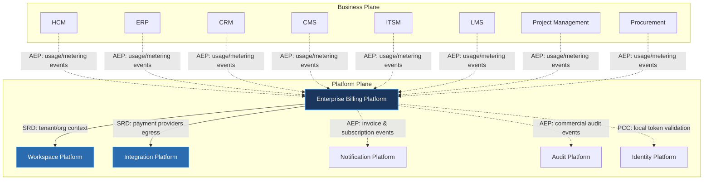

---
doc_meta:
  id: PAD-PLT-010
  title: Enterprise Billing Platform
  owner: Billing Team
  version: 1.0.0
  status: approved
  classification: restricted
  governed_by:
    - GDC-008
  realizes_capability:
    - EAD-001
    - EAD-005
  review_cycle_days: 180
  last_reviewed: 2026-07-06
  fulfilled_by:
    - SAD-009
---

# Enterprise Billing Platform

---

## 1. Purpose & Scope

The Billing Platform provides centralized commercial capabilities for subscription management, pricing, metering, billing, invoicing, licensing, and tenant monetization across the entire Scnehaux Cloud Service.

Business products consume commercial services without implementing their own billing logic, ensuring consistent pricing, subscription governance, and revenue management throughout the enterprise.

### 1.1. Out of Scope

- Payment gateway implementation.
- Financial accounting.
- ERP financial ledger.
- Tax reporting.
- Customer relationship management.
- Business product pricing strategies.
- Authentication and authorization.
- Business workflow orchestration.

---

## 2. Enterprise Traceability

The Billing Platform realizes the enterprise commercial capability: it governs subscriptions, pricing, metering, and invoicing, and subscribes to usage/metering events published by the business products it monetizes.

### 2.1. Realizes

- EAD-001 Enterprise Capability & Domain Map — the commercial/billing capability (subscription, pricing, metering, invoicing, licensing, monetization).
- EAD-005 Enterprise Platform Architecture — the substrate it operates on.

### 2.2. Relationships

- **Synchronous Dependencies (SRD):** Workspace Platform — tenant and organizational context; Integration Platform — payment providers and external financial systems egress, mediated through the ACL.
- **Publishes Events (AEP):** invoice and subscription events, commercial audit events, and billing lifecycle events (e.g. `InvoiceGenerated`, `SubscriptionActivated`, `SubscriptionCancelled`) to the Event Broker.
- **Subscribes To Events (AES):** usage and metering events published by the business products, from which billing is calculated.
- **Consumes Platform Capabilities (PCC):** validates Identity-issued tokens **locally** (cached), so consumption is not a runtime dependency on the Identity Platform.

### 2.3. Consumed By

Business Products consume Billing through event-driven metering: they publish usage events (AEP) that the Billing Platform subscribes to (AES) to calculate commercial charges. Consumption is not a synchronous runtime dependency on Billing.

---

## 3. Domain & Context Model

The Billing Platform is decomposed into multiple independent bounded contexts.

### 3.1. Bounded Context

- Subscription Management
- Plan Management
- Pricing Management
- Usage Metering
- Billing Cycle
- Invoice Management
- License Management
- Entitlement Management
- Credit Management
- Discount Management
- Billing Governance

### 3.2. Ubiquitous Language

| Term | Description |
| --- | --- |
| Subscription | Commercial agreement between a tenant and Scnehaux services. |
| Plan | Commercial package defining available capabilities. |
| Pricing | Commercial pricing model applied to subscriptions. |
| Usage | Measured consumption of billable capabilities. |
| Metering | Collection of billable usage information. |
| Billing Cycle | Recurring commercial charging period. |
| Invoice | Commercial billing statement generated for a tenant. |
| License | Commercial authorization to consume subscribed capabilities. |
| Entitlement | A commercial capability grant conferred by an active subscription; distinct from a Permission, which is an Identity authorization grant. |
| Credit | Monetary balance reducing future billing obligations. |
| Discount | Commercial pricing adjustment. |
| Trial | Temporary commercial access before subscription activation. |

### 3.3. Domain Policies

- Every tenant must own at least one subscription.
- Usage is measured independently from billing.
- Billing calculations are centrally governed.
- Pricing models are versioned.
- Subscription lifecycle is independent of payment processing.
- Business products shall never calculate invoices.
- Commercial contracts are immutable once invoiced.
- Every commercial event must be auditable.

---

## 4. Integration Contracts

### 4.1. Integration Provided

The Billing Platform provides:

- Subscription Management
- Plan Management
- Pricing Management
- Usage Metering
- Billing Calculation
- Invoice Generation
- License Management
- Entitlement Resolution
- Credit Management
- Discount Management
- Trial Management
- Billing Events

### 4.2. Integration Consumed

The Billing Platform consumes:

- Identity Platform for tenant identity.
- Workspace Platform for tenant and organization context.
- Notification Platform for invoice and subscription communications.
- Integration Platform for payment providers and external financial systems.
- Audit Platform for immutable commercial audit records.

Implementation protocols, payment providers, taxation engines, and invoicing infrastructure are defined by the realizing SAD.

---

## 5. Trust & Data Boundaries

### 5.1. Trust Boundary

The Billing Platform governs commercial agreements but never owns business data.

Business domains remain authoritative for business entities and operational transactions.

### 5.2. Identity Access

Authentication and enterprise identity are delegated to the Identity Platform.

The Billing Platform governs:

- Subscription ownership
- Commercial entitlements
- License allocation
- Billing policies
- Commercial lifecycle

Business domains remain responsible for product-specific authorization.

### 5.3. Data Classification

The platform manages:

- Subscription Metadata
- Commercial Plans
- Pricing Metadata
- Usage Records
- Billing Records
- Invoice Metadata
- License Metadata
- Entitlement Metadata
- Commercial Policies

The platform does not own:

- Accounting Ledger
- Payroll Data
- ERP Financial Records
- Business Transactions
- Customer Operational Data

---

## 6. Capability NFR

### 6.1. Reliability & Availability

- Enterprise-grade billing availability.
- No commercial event loss.
- Consistent subscription state across all products.

### 6.2. Performance & Scalability

- Horizontally scalable commercial services.
- High-volume usage metering.
- Efficient recurring billing execution.

### 6.3. Security & Compliance

- Secure handling of commercial information.
- Tenant-isolated billing.
- Commercial governance compliance.
- Enterprise revenue integrity.

### 6.4. Auditability

Every commercial lifecycle event shall be traceable, including:

- Subscription creation
- Plan changes
- Usage collection
- Billing calculation
- Invoice generation
- Credit application
- Discount application
- License allocation
- Trial activation
- Subscription renewal
- Subscription cancellation

---

## 7. Ownership & Governance

### 7.1. Team Ownership

The Billing Platform Team owns platform commercial capabilities, subscription lifecycle, and billing governance.

The Architecture Authority governs enterprise monetization standards and commercial contracts.

### 7.2. Realizing Systems

- SAD-009 Enterprise Billing Platform

### 7.3. Governance Rules

- Business products shall never implement independent billing logic.
- Billing contracts are centrally governed and versioned.
- Usage collection shall remain independent from billing calculation.
- Billing policies are versioned and auditable.
- Payment technologies shall remain replaceable without affecting business products.
- Breaking commercial contracts require Architecture Authority approval.
