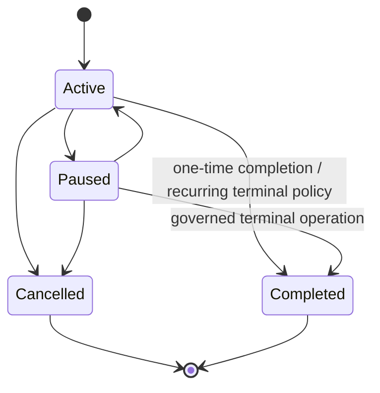
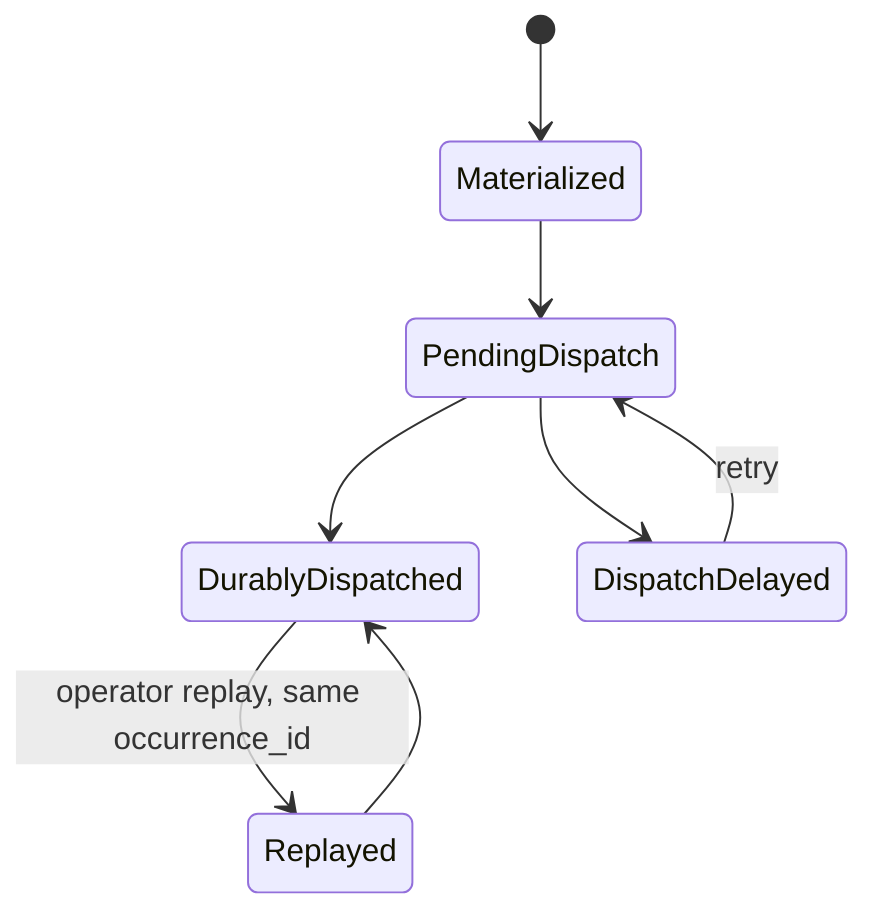
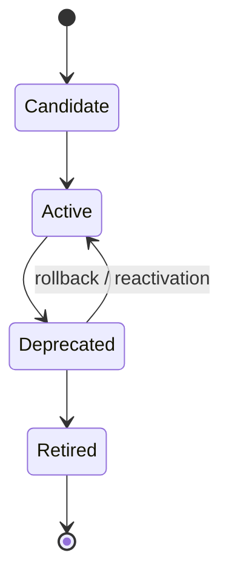
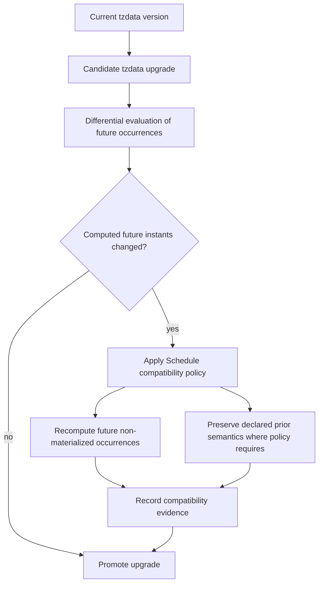

---
doc_meta:
  id: PAD-PLT-011
  title: Enterprise Scheduling Platform
  owner: Scheduling Platform Team
  version: 1.5.0
  status: approved
  classification: restricted
  governed_by:
    - GDC-008
    - ADR-GLB-017
  realizes_capability:
    - EAD-001
    - EAD-005
  review_cycle_days: 180
  created_date: 2026-08-22
  last_reviewed: 2026-09-09
  fulfilled_by:
    - SAD-013
    - SAD-014
---

# Enterprise Scheduling Platform

## 1. Purpose & Scope

The Enterprise Scheduling Platform provides a shared durable temporal capability for Scnehaux Products and Platforms. It accepts a consumer-owned schedule intent, preserves the runtime schedule lifecycle, determines when an occurrence becomes due, materializes a stable occurrence, and dispatches that occurrence to a registered consumer contract.

The platform owns **when a durable trigger becomes due and whether that trigger was durably dispatched**. It does not own the business rule that caused the schedule to exist or the business result after the trigger is consumed.

The capability is chartered as a shared Platform because more than ten applications are expected to consume it and concrete duplicate implementations already exist in the Mailcast client solution and ATI PH.

### 1.1 Out Of Scope

- Product business rules, business state, business eligibility, or irreversible Product outcomes
- Arbitrary Product code, scripts, functions, containers, or generic worker execution
- Workflow process state, process transitions, compensation, or human-task coordination
- Notification rendering, provider routing, SMTP/messaging configuration, provider credentials, or communication delivery
- Business calendars and domain-relative rules such as public-holiday policy or "three days before flight departure"
- Request deadlines, short retry backoff, connector keepalive, tight polling loops, debounce, or throttle timers
- Secrets, credentials, unbounded Product payloads, files, or copied Product databases
- Infrastructure-only scheduling whose lifecycle is fully owned by the deployment substrate and has no application scheduling contract

## 2. Enterprise Traceability

### 2.1 Realizes

- **EAD-001** — durable temporal scheduling and trigger dispatch as an Engineering & Runtime capability
- **EAD-005** — shared scheduled-work runtime support with multi-tenant, reliability, observability, and capacity governance

### 2.2 Relationships

- **Organization:** canonical Tenant identity and bounded operating-context facts scope Schedule ownership; normal due processing does not call Organization synchronously
- **Identity & Application/Service Trust:** authenticated human/workload identity and registered application/service ownership authorize Schedule mutation; trust artifacts are locally verifiable in the normal path
- **Event & Messaging:** due Occurrences and lifecycle facts are dispatched asynchronously through the enterprise messaging contract
- **Audit & Evidence:** privileged administration, replay, cross-Tenant operations, and policy changes emit evidence facts
- **Workflow:** Workflow may register durable wake-ups while retaining timeout/escalation/process semantics
- **Notification:** Notification may register future delivery after communication intent is frozen, and Scheduling may target a registered bounded Deferred Notification Command when no Notification must exist before due time; Notification always retains communication/provider authority
- **Products/Platforms:** consumers register durable temporal intent and execute their own business/capability work after dispatch

### 2.3 Consumed By

The platform is a reusable enterprise capability for more than ten expected applications. Initial named consumers include:

- Mailcast-derived client workloads for future travel reminders and reconciliation wake-ups
- ATI PH for public-holiday reminder and scheduled operational triggers
- Notification Platform for frozen future delivery
- Workflow Platform for durable process wake-ups
- HCM, finance operations, travel operations, reconciliation, expiry, reporting, and other scheduled workloads as they adopt the contract

A consumer integrates through versioned schedule lifecycle commands and asynchronous due-occurrence contracts. Consumer worker code remains in the consumer system.

## 3. Domain & Context Model

### 3.1 Bounded Context

- Schedule Registry
- Schedule Lifecycle
- Temporal Policy
- Occurrence Materialization
- Trigger Dispatch
- Misfire Management
- Target Registration & Compatibility
- Scheduling Service Class
- Tenant/Application Quota
- Schedule Operations & Reconciliation

### 3.2 Ubiquitous Language

| Term                     | Meaning                                                                                                                    |
| :----------------------- | :------------------------------------------------------------------------------------------------------------------------- |
| Schedule                 | Durable runtime temporal registration owned by the Scheduling Platform                                                     |
| Schedule Intent          | Consumer-owned reason and requested temporal policy from which a Schedule is created                                       |
| Occurrence               | One stable logical due instance of a Schedule                                                                              |
| Scheduled For            | Canonical UTC instant at which an Occurrence is due                                                                        |
| Trigger                  | Contract emitted because an Occurrence is due                                                                              |
| Target                   | Registered Product or Platform contract authorized to consume a Trigger                                                    |
| Target Contract          | Versioned registered consumer acceptance contract; never an arbitrary caller-provided URL                                  |
| Target Contract Version  | Immutable compatibility version selected by a Schedule or resolved under an explicit compatible-version policy             |
| Scheduling Service Class | Bounded criticality/fairness class used for admission and saturation behavior; not an arbitrary caller-controlled priority |
| Dispatch                 | Durable hand-off of an Occurrence to the governed messaging boundary; not business execution                               |
| Misfire                  | A due occurrence that could not be dispatched inside its expected normal window                                            |
| Misfire Policy           | Explicit recovery behavior for elapsed occurrences                                                                         |
| Replay                   | Operator-controlled re-dispatch of the same logical Occurrence identity                                                    |
| Business Completion      | Consumer-owned result after Trigger processing; outside Scheduler authority                                                |

### 3.3 Domain Policies

- A consumer owns **why** and **what**; Scheduling owns **when** and durable trigger state
- Every Schedule has one owning application and, when Tenant-scoped, one canonical Tenant
- Schedule registration is idempotent under a stable consumer command identity; a retry after timeout or ambiguous response MUST resolve to the same logical Schedule when the semantic request is unchanged, and conflicting reuse of the same identity MUST be rejected
- Consumers and operators can reconcile a Schedule registration through owned identifiers/correlation without direct database access
- Every due Occurrence has a stable identity reused across dispatch retries and replay
- Dispatch is at-least-once; consumers are idempotent on occurrence identity
- Scheduler considers an Occurrence dispatched when the governed messaging boundary durably accepts it
- Cancellation cannot retract an Occurrence already durably dispatched
- Schedule mutation is linearized against Occurrence materialization: if pause/update/cancel commits before materialization, the old Schedule version cannot create that future Occurrence; if materialization commits first, that Occurrence remains a valid immutable occurrence of the version that produced it and may still be dispatched at least once
- Update affects only future non-materialized Occurrences; a materialized Occurrence retains the Schedule version and temporal-policy version that produced it
- Wall-clock recurrence requires explicit time-zone semantics
- Recurrence semantic interpretation and DST policy are versioned Schedule properties; the time-zone database version used to materialize/preview an Occurrence is retained as computation evidence without requiring indefinite pinning to obsolete civil-time rules
- DST and misfire behavior are explicit contract properties
- Unlimited catch-up is prohibited
- Product-relative timing rules remain Product logic and are materialized into Schedule registrations by the owning Product
- Scheduler never treats Product worker success/failure as authoritative Scheduler lifecycle state
- A Schedule binds to a registered Target Contract, never to an arbitrary caller-provided URL, shell command, function, or container
- Recurring Schedules have deterministic behavior when a Target Contract Version is deprecated or retired
- Automatic Target Contract migration is permitted only by an explicit compatible-version contract; otherwise rebind is an owning-consumer action
- Scheduling Service Classes are bounded and authorized by registered application/Target policy; arbitrary caller priority escalation is prohibited
- Under saturation, due-dispatch correctness is protected before administrative/list/preview workloads; class-level fairness may reserve capacity but SHALL NOT permit indefinite starvation of lower classes
- A registered Deferred Notification target is allowed only with bounded trigger data that does not make Scheduling authoritative for communication content, recipient datasets, provider configuration, or credentials
- When business eligibility/recipient/content requires current Product truth at due time, the target remains the owning Product/Platform Worker rather than Notification

### 3.4 Schedule Lifecycle

Lifecycle rules:

- cancellation is terminal for future materialization;
- pause prevents future materialization while preserving the Schedule unless a defined misfire policy applies after resume;
- update creates a new Schedule version for future non-materialized Occurrences rather than rewriting prior Occurrence history;
- one-time Schedules become `Completed` according to their materialized/terminal policy, not consumer business completion.

### 3.5 Occurrence Lifecycle

Consumer business completion is deliberately absent from the Scheduling Occurrence lifecycle. Replay reuses the same `occurrence_id`; a second logical Occurrence is not created merely because transport or consumer handling is retried.

### 3.6 Target Contract Lifecycle

Target lifecycle rules:

- New Schedules cannot bind to a `Retired` Target Contract Version.
- Existing bindings to `Deprecated` versions follow the declared support window and compatibility policy.
- Existing active Schedules bound to a Target Contract Version being retired must be migrated, cancelled, or explicitly grandfathered before retirement completes.
- Retirement cannot silently redirect an existing Schedule to a semantically different handler.
- A Target Contract Version identifies the acceptance contract, not the deployment instance behind it; physical replicas may change without rebinding the Schedule.

### 3.7 Time-Zone Data Evolution

The platform follows governed civil-time data while preserving deterministic historical evidence and protecting future behavior from silent semantic shifts.

Materialized Occurrences are immutable and never rewritten by a tzdata upgrade. A Schedule whose future wall-clock interpretation changes is handled according to its declared recurrence/DST compatibility policy and produces traceable compatibility evidence.

## 4. Integration Contracts

### 4.1 Integration Provided

The Scheduling Platform provides logical capabilities for:

- One-Time Schedule Registration
- Recurring Schedule Registration
- Idempotent Schedule Registration Recovery and Reconciliation
- Schedule Query and Ownership Discovery
- Schedule Update
- Pause / Resume / Cancel
- Upcoming Occurrence Preview
- Due-Occurrence Trigger Publication
- Misfire Policy Management
- Bounded Catch-Up
- Replay of an existing Occurrence
- Target Contract registration, version discovery, deprecation, and retirement reconciliation
- Scheduling Service Class admission
- Tenant/Application Quota Enforcement
- Operations, Reconciliation, and Audit Evidence

The logical contract is technology-independent. Physical REST/event shapes and broker/database choices belong to the realizing SAD and downstream contracts.

### 4.2 Integration Consumed

The Scheduling Platform consumes:

- Identity and Application/Service Trust for authenticated actor/workload and application ownership
- Organization for Tenant/operating-context authority through bounded locally usable context
- Event & Messaging for durable asynchronous dispatch
- registered Target ownership/compatibility metadata from the relevant enterprise application/service trust or catalog capability
- Audit & Evidence for security-sensitive and privileged operation evidence
- Observability for platform SLI/SLO measurement

The platform does not consume Product operational databases or Product business models.

## 5. Trust & Data Boundaries

### 5.1 Trust Boundary

Scheduling is authoritative for Schedule runtime lifecycle, Occurrence state, Target Contract binding used by a Schedule, service-class admission state, and dispatch state only.

A Product may persist its own business scheduling policy and a `schedule_id` reference. This is not dual authority: the Product owns semantic policy and current business eligibility; Scheduling owns the reusable temporal realization.

### 5.2 Identity Access

- Every Schedule mutation requires authenticated human or workload identity and authorization within application/Tenant scope
- Cross-Tenant administration uses a separately authorized, evidenced provider path
- Normal due processing relies on locally available trusted control context and does not create per-occurrence synchronous calls to Identity or Organization
- A caller may manage only its own application/Tenant schedules unless explicit privileged authority exists
- A registered Target is bound to application/service ownership and cannot be replaced by an arbitrary caller-supplied endpoint
- Scheduling Service Class is derived from authorized application/Target profile and cannot be elevated by an arbitrary request field

### 5.3 Data Classification

Scheduling manages:

- Schedule metadata and lifecycle
- temporal definition, time zone, DST, recurrence compatibility, and misfire policy
- application/Tenant ownership references
- registered Target Contract ID/version and compatibility policy
- bounded Scheduling Service Class
- bounded trigger metadata
- occurrence and dispatch metadata
- quota and reconciliation metadata
- evidence/correlation references

Scheduling does not own:

- Product business entities
- Product job result payloads
- customer/employee/booking records
- Notification content or recipient contact data
- provider credentials or authentication secrets
- unbounded documents/files

## 6. Capability NFR

### 6.1 Availability, RTO, and RPO

- Reliability class: **C1 Mission-Critical Operations**
- Target service availability: **>= 99.95% monthly** for Schedule control and due-dispatch capability at mature production state
- Target RTO: **<= 1 hour**
- Within the production HA failure domain (process, node, and declared availability-zone failures), committed Schedule, Occurrence, idempotency, Target binding, and outbox state has **RPO = 0**
- Cross-region disaster recovery is a separate deployment profile with an initial target **RPO <= 15 minutes** unless a Tenant/regulatory profile requires stronger replication
- Schedule create is acknowledged only after the authoritative HA store durably commits the Schedule/idempotency state
- An accepted Schedule must not be silently lost
- Runtime outage delays work; recovery resumes from durable Schedule/Occurrence state using the persisted misfire policy

### 6.2 Scheduling SLO

For the default enterprise schedule class:

- **99.9%** of due Occurrences are durably dispatched within **30 seconds** of `scheduled_for`, excluding a declared upstream broker outage or consumer-owned execution time
- Duplicate dispatch is permitted by the at-least-once contract, but duplicate **logical Occurrence creation** for the same Schedule version and due instant is not permitted
- Capacity certification before production must demonstrate at least **10x the forecast peak due-occurrence rate** without breaching the dispatch-lateness SLO

Higher-precision or higher-criticality classes require an explicit PAD/SAD profile rather than silently tightening the default contract.

### 6.3 Scalability, Fairness, and Concurrency

- Compute scales horizontally without one scheduler process per Tenant
- Pooled multi-tenant operation is the default capability; bridge/silo/regional profiles remain available under EAD-005
- Per-Tenant, per-application, per-Target, and per-service-class quotas protect dispatcher capacity
- Administrative/list/preview traffic sheds before due-dispatch work under saturation
- A single Tenant or application cannot consume unbounded claim or dispatch concurrency
- Bounded service classes may use reserved capacity/weighted fairness downstream, but starvation and uncontrolled priority escalation are prohibited
- Reconciliation, preview, and target-migration scans cannot starve the authoritative due-materialization/dispatch path

### 6.4 Security, Compliance, Data Privacy, and Residency

- Tenant isolation follows the enterprise database/security standards
- Trigger payloads contain no credentials
- deferred Notification triggers contain only bounded identifiers/immutable trigger input under Scheduling data classification; arbitrary communication bodies and unbounded recipient/contact datasets remain outside Scheduling
- Sensitive Product data is minimized and re-read by the consumer when freshness is required
- Privileged cross-Tenant actions, replay, target change, target retirement override, service-class override, and quota override are fully evidenced
- Regional placement can be selected when residency or contractual commitments require it

### 6.5 Audit and Interoperability

The following lifecycle facts are traceable: create, update, pause, resume, cancel, occurrence materialization, misfire, dispatch, replay, target binding/change/deprecation/retirement reconciliation, service-class change, tzdata compatibility decision, quota override, and privileged cross-Tenant action.

Schedule/event contracts are versioned and interoperable across independently deployed consumers. Audit/reconciliation evidence includes the Schedule version, Target Contract Version, recurrence-semantics version, DST policy version, and time-zone-data version used to compute each materialized Occurrence.

### 6.6 Cost Target

Platform capacity and cost are measured per active Schedule and per dispatched Occurrence. Scaling policies have explicit upper bounds so one Tenant or application cannot create unbounded shared-platform cost.

## 7. Ownership & Governance

### 7.1 Team Ownership

The Scheduling Platform Team owns:

- Schedule and Occurrence contracts
- temporal correctness and compatibility
- Target Contract binding/lifecycle semantics inside Scheduling
- Scheduling Service Class admission semantics
- dispatch reliability
- Tenant/application scheduling isolation and quota
- scheduling SLO and capacity
- operational tooling, reconciliation, and support

Consumer teams own:

- business schedule meaning
- business calendars and eligibility
- target worker/handler implementation
- target contract implementation and migration acceptance
- business-state revalidation
- business retry/compensation and final outcome

Workflow Team owns workflow timer/deadline semantics. Notification Team owns notification delivery timing semantics after communication intent is accepted.

### 7.2 Realizing Systems

- **SAD-013** Scnehaux Scheduling Runtime
- **SAD-014** Scnehaux Scheduling Experience

### 7.3 Governance Rules

- Scheduling SHALL NOT execute arbitrary Product business code
- Scheduling SHALL NOT become a universal Worker Platform
- Scheduling SHALL NOT own Product business completion
- Scheduling SHALL NOT interpret Product-specific calendar/business rules
- Scheduling SHALL NOT resolve Notification provider/channel credentials or Application Notification Profiles
- Deferred Notification targets SHALL use a registered contract and bounded non-secret trigger input
- Consumers SHALL implement occurrence-level idempotency
- Consumers SHALL use a stable registration idempotency identity for retryable create operations and SHALL NOT manufacture a second Schedule solely because the original create response was lost
- Durable recurrence SHALL declare time-zone, recurrence-semantics version, DST policy, and misfire semantics
- Materialized Occurrences SHALL retain the Schedule/policy/tzdata version evidence that produced them and SHALL NOT be rewritten by later Schedule mutation or tzdata upgrade
- Schedules SHALL bind to registered Target Contracts; arbitrary caller-provided URLs, shell commands, function bodies, or container images SHALL NOT become Targets
- Target retirement SHALL NOT silently redirect an existing Schedule to a semantically different handler
- automatic Target Contract migration SHALL require an explicit compatibility policy; otherwise the owning consumer SHALL rebind or cancel
- Scheduling Service Class SHALL be bounded and authorized from registered application/Target policy rather than trusted from caller priority input
- saturation policy SHALL protect due-dispatch correctness and SHALL NOT permit indefinite starvation of lower service classes
- New shared durable scheduling authority outside this PAD requires architecture review
- Local transient timing remains local when it does not require the durable application schedule contract

## 8. Assumptions & Constraints

- More than ten independent application consumers remain expected
- Mailcast and ATI PH provide immediate migration evidence
- The enterprise Identity, Organization, Application/Service Trust, Event & Messaging, Audit, and Observability capabilities are available according to adoption sequencing
- Target ownership/compatibility can be resolved from a governed registered contract rather than arbitrary runtime routing data
- The platform contract remains free of paid-product dependency

## 9. Architectural Decisions

- **ADR-GLB-011** establishes the enterprise Scheduler/Worker/Workflow/Notification authority boundary
- **ADR-SCH-002** selects PostgreSQL temporal authority and profile-based durable dispatch while keeping the PAD technology-independent
- **STD-GLB-010** defines the enterprise durable scheduled-work contract for all consumers
- Target Contract versioning, bounded service classes, and tzdata compatibility are logical Scheduling semantics independent of the selected dispatch technology

## 10. Evolution

The logical Scheduling contract remains stable while physical timing machinery may evolve from the initial relational implementation to time-partitioned, regional, or specialized timing infrastructure if measured cardinality, precision, residency, or fault-containment requirements exceed the initial profile.

Durable dispatch may move between Direct, Queue, and Stream delivery profiles without changing Schedule/Occurrence authority or logical trigger identity. Concrete broker/API selection remains below the PAD.

Target implementations may be independently redeployed or compatibly versioned. Incompatible Target migration remains explicit and never changes historical Occurrence identity.

Consumer APIs/events and authority boundaries remain the migration seam.

## 11. References

- EAD-001 Enterprise Capability & Domain Map
- EAD-002 Enterprise System Landscape
- EAD-003 Enterprise Data Ownership & Topology
- EAD-004 Enterprise Integration Architecture
- EAD-005 Enterprise Platform Architecture
- EAD-006 Enterprise Security Architecture
- ADR-GLB-017 Enterprise Durable Scheduling Boundary with Profiled Dispatch
- STD-GLB-010 Enterprise Durable Scheduled Work Standard
