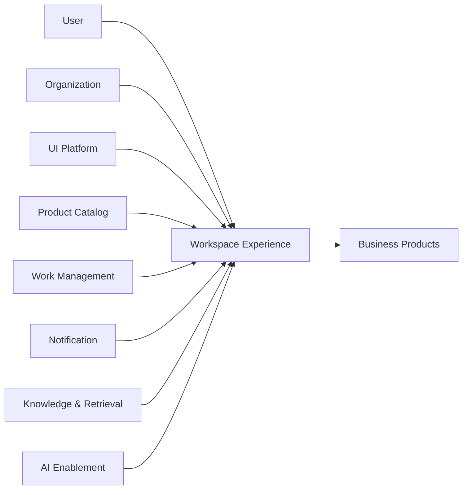

---
doc_meta:
  id: PAD-PLT-012
  title: Workspace Experience Platform
  owner: Workspace Experience Platform Team
  version: 1.1.0
  status: approved
  classification: internal
  governed_by:
    - GDC-008
    - EAD-001
    - EAD-005
  realizes_capability:
    - EAD-001
    - EAD-005
  review_cycle_days: 180
  created_date: 2026-08-23
  last_reviewed: 2026-08-23
  fulfilled_by:
    - SAD-016
---

# Workspace Experience Platform

## 1. Purpose & Scope

The Workspace Experience Platform provides the reusable digital work environment through which users discover, enter, compose, and move across Scnehaux Products while preserving Product-owned journeys and Organization-owned operating context.

It owns shared shell, navigation, composition, active-context presentation, context-switch experience, cross-Product deep links, and reusable composition surfaces.

It does not own business state or become an authorization authority merely because it displays context or navigation.

### 1.1 Outcome Contract

Users receive a coherent cross-Product work environment without forcing Products into one physical frontend, one release train, or one business model.

Products remain independently authoritative and may expose governed direct entry points for continuity or specialized journeys.

### 1.2 Out Of Scope

- Canonical Organization, Tenant, Workspace, Membership, or operating-context authority
- Product business pages, state, workflow, decisions, and authorization
- UI design tokens and primitives owned by UI Platform
- Work Item, Queue, Assignment, and Claim authority owned by Work Management
- Notification delivery
- Search, knowledge, and retrieval authority
- AI model or agent execution
- Identity authentication and session authority
- Product Registry or commercial Entitlement authority
- Product deployment topology
- Cross-Product business transaction orchestration

## 2. Enterprise Traceability

### 2.1 Realizes

- **EAD-001** Experience & Interaction capability for Application Shell and Workspace Experience
- **EAD-005** reusable experience Platform Product direction

### 2.2 Relationships

- **UI Platform** provides build-time design tokens and primitives
- **Organization** provides canonical Tenant, Workspace, Membership, and operating-context facts
- **Identity / Application Trust** provide authenticated user and application context
- **Software / Product Catalog** provides registered Product and application metadata where available
- **Work Management** provides My Work, Queue, and Assignment surfaces through its contracts
- **Notification** provides shared notification state or inbox surfaces where consumed
- **Knowledge & Retrieval** provides shared search and knowledge results where consumed
- **AI Enablement** supports Product or Workspace copilot composition where consumed
- **Business Products** retain Product navigation semantics, protected routes, business state, and Product UX
- **Audit & Evidence** receives privileged shell, registration, and cross-Tenant administration evidence

### 2.3 Consumed By

HCM, Travel Operations, future ERP, adjacent BPO Products, Platform administration experiences, and vertical AI Products may compose into Workspace Experience.

Direct Product entry remains valid when shared composition is unavailable or not justified.

### 2.4 Logical Topology



Workspace Experience composes contracts and navigation. Protected Product requests still terminate at the owning Product.

## 3. Domain & Context Model

### 3.1 Bounded Context

- Application Shell
- Product Navigation & Discovery
- Product Registration Consumption
- Experience Composition
- Active Context Presentation
- Context Switching Experience
- My Work Composition
- Shared Search Entry
- Notification Composition
- Copilot Composition
- Cross-Product Deep Linking
- Experience Preference
- Degraded Experience
- Composition Compatibility

### 3.2 Ubiquitous Language

| Term | Meaning |
| :-- | :-- |
| Workspace Experience | Human-facing digital environment that composes Product experiences |
| Operating Workspace | Organization-owned canonical operating context |
| Application Shell | Shared chrome, navigation, layout, and composition boundary |
| Product Surface | Product-owned UI mounted, embedded, linked, or otherwise composed into the experience |
| Active Context | Locally represented current Organization, Tenant, and Workspace context |
| Context Switch | User-initiated request to change active Organization-owned operating context |
| My Work | Composed view of Work Management contracts and not authoritative work state |
| Composition Slot | Governed location for Product, search, notification, or copilot experience |
| Deep Link | Stable navigation reference into a Product-owned route and context |
| Experience Preference | User-facing presentation preference without Product business authority |
| Degraded Surface | Explicit representation that one composed capability is unavailable while unrelated surfaces remain usable |

### 3.3 Domain Policies

- Workspace Experience does not own Organization, Tenant, Workspace, or Membership facts
- Product-specific business journeys remain Product-owned
- UI primitives and tokens are consumed from UI Platform
- Context changes use Organization contracts
- Product authorization is re-evaluated by the Product at the protected resource
- My Work is a projection of Work Management contracts
- Navigation visibility is not proof of authorization
- Failure of one Product or shared surface is isolated from unrelated surfaces where the consumer contract allows it
- Shared shell does not require every Product to deploy through one frontend topology
- Experience preferences cannot override security, Product authorization, or Organization context
- Product route and deep-link contracts are versioned
- Workspace may cache presentation metadata but not authority

### 3.4 Lifecycle & State Semantics

Workspace Experience distinguishes:

```text
Authenticated Session        -> Identity authority
Available Contexts           -> Organization authority
Active Context Presentation  -> Workspace Experience state
Product Authorization        -> Product authority
Work Items                    -> Work Management authority
Notification State           -> Notification authority
Knowledge Results            -> Knowledge & Retrieval authority
```

A Context Switch is not complete until Organization-authoritative context has been validated or issued. Workspace then updates local presentation state and re-composes Product surfaces.

Product registration and composition metadata follow a lifecycle such as Candidate, Active, Deprecated, and Retired.

### 3.5 Failure & Degradation Semantics

- Organization unavailability blocks authoritative context mutation and must not be bypassed with caller-supplied context
- A previously validated context may be displayed according to declared freshness policy but does not authorize new cross-context mutations by itself
- Product-surface failure is represented as degraded Product experience rather than shell-wide failure where possible
- Work Management, Notification, Knowledge, or AI outage degrades only the corresponding composition surface
- Product Catalog outage may use previously validated composition metadata when allowed but cannot grant new Product access
- Identity or session invalidation follows Identity authority
- Workspace Experience must not convert missing Product authorization into a UI-only allow decision
- Deep-link resolution failure must fail closed against context spoofing while preserving a recoverable navigation path

## 4. Integration Contracts

### 4.1 Integration Provided

- Application Shell contract
- Product navigation and discovery contract
- Product composition contract
- Active-context presentation contract
- Context-switch orchestration
- Cross-Product deep-link contract
- My Work composition contract
- Notification composition hook
- Search and Knowledge composition hook
- Copilot composition hook
- Experience preference contract
- Degraded-surface contract
- Experience telemetry contract

### 4.2 Integration Consumed

- UI Platform packages
- Identity and Application Trust
- Organization context
- Software / Product Catalog metadata
- Work Management
- Notification
- Knowledge & Retrieval
- Optional AI Enablement
- Product-owned experience entry contracts
- Audit & Evidence for privileged operations

### 4.3 Contract Principles

- Composition does not transfer Product authority
- Product routes and surfaces are versioned
- Active context carries stable trusted references rather than arbitrary caller-owned identifiers
- Products can reject stale or invalid context independently
- Shared composition hooks expose bounded experience contracts and not Product persistence
- Product deployment and release cadence remain independent
- Direct Product entry remains a supported continuity seam where governed

## 5. Trust & Data Boundaries

### 5.1 Trust Boundary

Workspace Experience is authoritative for presentation and composition state only.

It does not become Identity, Organization, Work Management, Notification, Knowledge, AI, or Product authority by rendering or caching their data.

### 5.2 Identity Access

- User authentication comes from Identity
- Operating context comes from Organization
- Product resource authorization is enforced by the Product
- Navigation visibility is not authorization
- Cross-Tenant administration requires explicit provider-scope authority
- Context Switch uses Organization-authoritative contracts
- Deep-link targets cannot override authenticated Tenant or Workspace context
- Privileged Product registration and shell configuration changes are evidenced

### 5.3 Data Classification

Workspace Experience manages minimal experience data such as:

- Layout and display preferences
- Recent navigation references
- Active-context presentation reference
- Product and composition metadata
- Degraded-surface status
- Experience telemetry
- Bounded cached summaries where allowed

It does not own Product records, Membership, Employee, financial, travel, or other Product business data.

### 5.4 Authority & Projection Rules

- Organization facts are referenced and may be locally represented but not re-owned
- My Work is a Work Management projection
- Notification state is Notification authority
- Search and Knowledge result authority remains with Knowledge and source domains
- AI output is generated content and not Workspace truth
- Product authorization and Product business state remain Product-owned

## 6. Capability NFR

### 6.1 Availability, RTO, and RPO

- Mature shared shell and control-service target: **>= 99.95% monthly**
- Target RTO: **<= 1 hour**
- Target RPO: **<= 15 minutes** for server-owned experience configuration
- Client-only ephemeral state may be recreated
- Direct Product entry remains a continuity option where Product operations require it

### 6.2 Performance, Scalability, and Isolation

- Shared shell server-side control latency target: **P95 <= 200 ms** excluding Product content
- Product composition must not require synchronized deployment of all Products
- One Product-surface failure must not render unrelated Product surfaces unavailable where technically feasible
- Tenant and application metadata load is bounded by quotas and caching policy
- Capacity certification targets at least **10x forecast peak active-user shell-control traffic**

### 6.3 Usability, Accessibility, and Security

- Shared shell and composition contracts meet **WCAG 2.2 AA**
- Product entry, active context, My Work, and degraded states are explicit to the user
- Context spoofing and navigation-only authorization are prohibited
- Sensitive Product content is minimized in shell telemetry and caches
- Cross-Tenant administration and privileged composition changes are evidenced

### 6.4 Interoperability, Audit, and Cost

- Product composition does not require Product business-model leakage
- Product route and composition contracts are versioned
- Privileged Product registration, context administration, and shared shell configuration are traceable
- Platform cost is attributable by active user, Product composition, Tenant, and major shared surface where meaningful
- Adoption, support burden, and Product integration effort are measured

## 7. Ownership & Governance

### 7.1 Team Ownership

Workspace Experience Platform Team owns:

- Shared Application Shell
- Navigation and Product composition
- Context presentation and switch experience
- Deep-link compatibility
- Shared composition hooks
- Experience preferences
- Degraded-surface semantics
- Workspace experience reliability and support

Organization owns canonical operating context. UI Platform owns design-system primitives. Product teams own Product journeys and business state.

### 7.2 Realizing Systems

- **SAD-016** Workspace Experience Platform

### 7.3 Governance Rules

- Workspace Experience SHALL NOT become Organization authority
- Product authorization SHALL NOT be inferred from rendered navigation
- Product deployment SHALL NOT be forced into one physical frontend solely for shell consistency
- Shared experience SHALL provide measured consumer and adoption value
- Context mutation SHALL fail closed when authoritative Organization validation is unavailable
- Product-surface failure SHALL be isolated where contractually feasible
- Composition metadata SHALL NOT become commercial Entitlement authority

### 7.4 Platform Product Health

Platform health includes Product adoption, shell availability, context-switch success, degraded-surface isolation, deep-link compatibility, support burden, accessibility conformance, active-user performance, and integration lead time.

## 8. Assumptions & Constraints

- Organization remains the source of Tenant, Workspace, and Membership truth
- Products remain independently deployable
- UI Platform remains separate
- Not every Product must be embedded into the shell
- Shared shell centralization must not create an avoidable single point of failure for direct Product access

## 9. Architectural Decisions

- Workspace Experience is a separate Platform from UI Platform because shell and composition semantics have different authority and lifecycle
- Organization owns Workspace facts while Workspace Experience owns presentation
- Products retain protected-resource authorization
- Physical frontend composition and runtime topology belong to SAD and downstream decisions

## 10. Evolution

Workspace Experience may evolve richer cross-Product composition, search, My Work, notification, copilot, or channel support while preserving Product authority boundaries.

Physical delivery may evolve from one shell realization into multiple channel or regional experiences without changing the logical Platform contract.

## 11. References

- EAD-001 Enterprise Capability & Domain Map
- EAD-002 Enterprise System Landscape
- EAD-005 Enterprise Platform Architecture
- EAD-006 Enterprise Security Architecture
- GDC-008 Product Architecture Document Guideline
